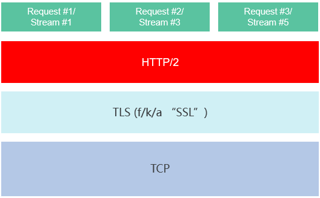

# 修复Kubernetes HTTP/2漏洞公告

Kubernetes社区近期公布了CVE-2019-9512与CVE-2019-9514安全漏洞，CCE已发布最新kubernetes 1.13.10版本对漏洞进行修复，对于已经创建的kubernetes 1.13版本，9月底将提供补丁进行修复。针对低于kubernetes 1.13集群版本后续将提供升级能力。

## 漏洞详情

近期Kubernetes社区发布了与Go相关的安全漏洞CVE-2019-9512和CVE-2019-9514。具体的安全问题出现在Go语言的net/http库中，它会影响Kubernetes的所有版本和所有组件。这些漏洞可能导致所有处理HTTP或HTTPS Listener的进程受到DoS攻击。

由于此问题影响范围很广，Go官方及时针对此问题发布了Go 1.12.9和Go 1.11.13版本。

Kubernetes也在v1.13.10 - go1.11.13版本中完成了Go版本的更新。

**表 1**  漏洞信息

<table><thead align="left"><tr id="row065718811595"><th class="cellrowborder" valign="top" width="50%" id="mcps1.2.3.1.1">
漏洞类型

</th>
<th class="cellrowborder" valign="top" width="50%" id="mcps1.2.3.1.2">
CVE-ID

</th>
</tr>
</thead>
<tbody><tr id="row1120510564498"><td class="cellrowborder" valign="top" width="50%" headers="mcps1.2.3.1.1 ">
拒绝服务攻击

</td>
<td class="cellrowborder" valign="top" width="50%" headers="mcps1.2.3.1.2 ">
<a href="https://cve.mitre.org/cgi-bin/cvename.cgi?name=CVE-2019-9512" target="_blank" rel="noopener noreferrer">CVE-2019-9512</a>

</td>
</tr>
<tr id="row1056225316496"><td class="cellrowborder" valign="top" width="50%" headers="mcps1.2.3.1.1 ">
资源管理错误

</td>
<td class="cellrowborder" valign="top" width="50%" headers="mcps1.2.3.1.2 ">
<a href="https://cve.mitre.org/cgi-bin/cvename.cgi?name=CVE-2019-9514" target="_blank" rel="noopener noreferrer">CVE-2019-9514</a>

</td>
</tr>
</tbody>
</table>

## 影响范围

默认集群在VPC和安全组内保护下不受影响。

如果用户通过互联网访问方式开放集群API，集群控制面可能会受影响。

## 解决方案

-   CCE已发布最新kubernetes 1.13.10版本对漏洞进行修复。
-   对于已经创建的kubernetes 1.13版本，9月底将提供补丁进行修复。
-   针对低于kubernetes 1.13集群版本后续将提供升级能力。

## 参考链接

Netflix报告链接：

[https://github.com/Netflix/security-bulletins/blob/master/advisories/third-party/2019-002.md](https://github.com/Netflix/security-bulletins/blob/master/advisories/third-party/2019-002.md)

Go版本发布链接：

[https://golang.org/doc/devel/release.html\#go1.12](https://golang.org/doc/devel/release.html#go1.12)

Kubernetes社区PR链接：

[https://github.com/kubernetes/kubernetes/pull/81520](https://github.com/kubernetes/kubernetes/pull/81520)

[https://github.com/kubernetes/kubernetes/pull/81522](https://github.com/kubernetes/kubernetes/pull/81522)

Kubernetes集群升级文档链接：

[https://kubernetes.io/docs/tasks/administer-cluster/cluster-management/\#upgrading-a-cluster](https://kubernetes.io/docs/tasks/administer-cluster/cluster-management/#upgrading-a-cluster)

## 附：为何影响？

这些攻击大多在HTTP/2传输层进行。如下图所示，该层位于TLS传输之上，但在请求概念之下。事实上，许多攻击都涉及0或1个请求。

从早期的超文本传输协议开始，中间件服务就以请求为导向:日志以请求为分割\(而不是连接\)；速率限制发生在请求级别；并且流量控制也由请求触发。

相比之下，没有多少工具可以根据客户端在HTTP/2连接层的行为来执行记录、速率限制和修正。因此，中间件服务可能会发现更难发现和阻止恶意的HTTP/2连接，并且可能需要添加额外的工具来处理这些情况。

这些攻击媒介允许远程攻击者消耗过多的系统资源。有些攻击足够高效，单个终端系统可能会对多台服务器造成严重破坏（服务器停机/核心进程崩溃/卡死）。其他攻击效率较低的情况则产生了一些更棘手的问题，他们只会使服务器的运行变得缓慢，可能会是间歇性的，这样的攻击会更难以检测和阻止。

