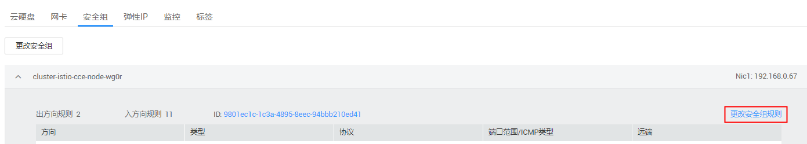

# 如何打开ICMP协议安全组规则？

当负载均衡协议为UDP时，健康检查也采用的UDP协议，您需要打开其后端服务器的ICMP协议安全组规则。

## 操作步骤

1.  登录弹性云服务器控制台，找到CCE集群中的节点对应的弹性云服务器，单击云服务器名称，进入详情页面。
2.  在“安全组“页签下，单击“更改安全组规则“。

    **图 1**  更改安全组规则  
    

3.  单击添加规则，为云服务器添加入方向规则，详细配置请参见[图2](#fig513214371699)，单击“确定“。

    > **说明：**   
    >-   您只需为工作负载所在集群下的任意一个节点更改安全组规则，请添加规则即可，不要修改原有的安全组规则。  
    >-   安全组需放通网段100.125.0.0/16流量。  

    **图 2**  添加安全组规则  
    

