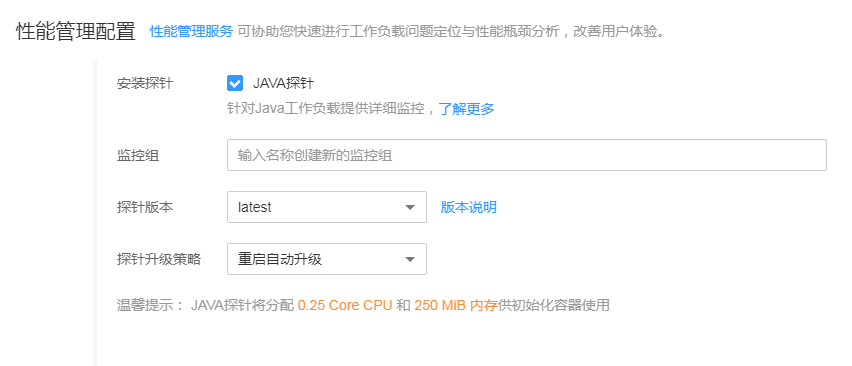
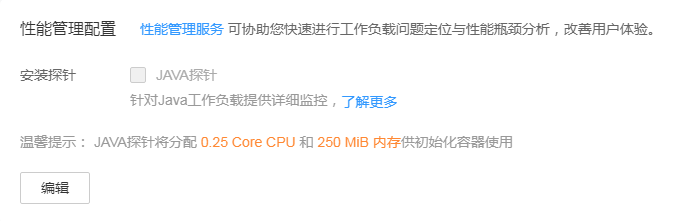

# 性能管理配置（性能瓶颈分析）

当前支持给Java类工作负载提供调用链、拓扑等监控能力，若您为Java类工作负载，并且需要监控状态，请勾选“Java探针”选项，并输入监控组名称。

> **说明：**   
>若您还未开通应用性能管理服务，请单击“点击开通“，参照界面提示购买应用实例数，单击“立即购买“，查看订单无误后，参照界面提示单击“提交订单“。  

## 设置Java类工作负载监控

工作负载创建时和创建后，均可以对Java类工作负载监控进行设置，如下为具体操作步骤。

**创建工作负载时进行设置**

1.  登录CCE管理控制台，在左侧导航栏中选择“工作负载 \> 无状态（Deployment）“或“工作负载 \> 有状态（StatefulSet）“，单击“创建无状态工作负载”或“创建有状态工作负载”。
2.  在创建工作负载时，在“高级设置“中找到“性能管理配置“，在“安装探针“处勾选“Java探针“，将会启用应用性能管理服务并在节点上安装探针。

    > **说明：**   
    >安装探针会产生少量资源消耗，主要作用是可对java工作负载提供应用调用链、拓扑、SQL分析、堆栈追踪等监控能力。  

3.  输入监控组名称，如testapp。若已有监控组，可下拉选择。
4.  选择“探针版本“。探针版本默认为latest，具体可查看下拉框后的“版本说明“。

    **图 1**  设置性能管理配置  
    

5.  选择“探针升级策略“，默认为“重启自动升级“。

    > **说明：**   
    >“探针升级策略“为获取探针镜像的策略，可选值有“重启自动升级“和“手动升级“。  
    >-   重启自动升级：每次都尝试重新下载镜像。  
    >-   手动升级：如果本地有该镜像，则使用本地镜像，本地不存在时下载镜像。  

**创建工作负载后设置或修改**

1.  登录CCE管理控制台，在左侧导航栏中选择“工作负载 \> 无状态（Deployment）“或“工作负载 \> 有状态（StatefulSet）“。
2.  在工作负载列表中，单击要设置的工作负载名称，在工作负载详情页中单击“工作负载运维“页签。
3.  在“性能管理配置“中，单击下方的“编辑“，勾选“Java探针”，将会启用应用性能管理服务并在节点上安装探针。

    **图 2**  单击编辑后进行设置  
    

    > **说明：**   
    >安装探针会产生少量资源消耗，主要作用是可对java工作负载提供应用调用链、拓扑、SQL分析、堆栈追踪等监控能力。  

4.  输入或修改“监控组“名称，如testapp。若已有监控组，可下拉选择。
5.  选择“探针版本“。探针版本默认为latest，具体可查看下拉框后的“版本说明“。
6.  选择“探针升级策略“，默认为“重启自动升级“。

    **图 3**  设置或修改性能管理配置  
    

7.  单击“重启实例“，完成设置。

    > **须知：**   
    >1.9.7以下版本的集群，在“有状态工作负载“中不能修改该设置。  

