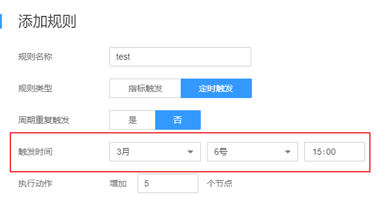
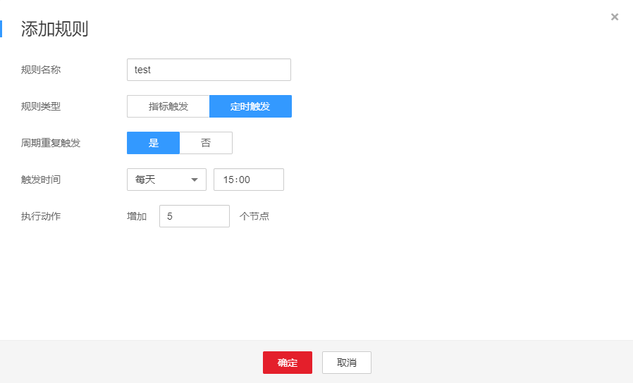
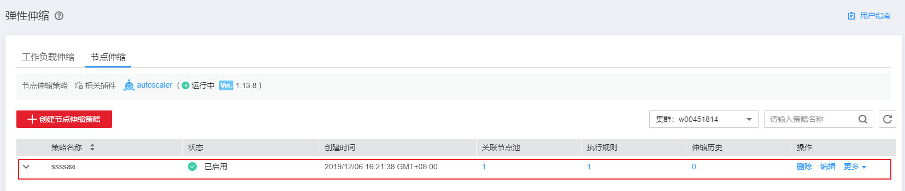

# 节点伸缩

本章节介绍CCE中集群节点进行扩缩容的步骤。

## 前提条件

使用节点伸缩功能前，需要安装[autoscaler](autoscaler.md)插件，插件版本要求1.13.8及以上。

## 操作步骤

1.  在[CCE控制台](https://console.huaweicloud.com/cce2.0/?utm_source=helpcenter)中，单击左侧导航栏的“弹性伸缩“，在“节点伸缩“页签中，查看界面提示，确认已安装[autoscaler](autoscaler.md)插件且处于正常状态。
2.  安装autoscaler插件后，单击“创建节点伸缩策略“。
3.  在打开的“创建节点伸缩策略“页面中，参照[表1](#table8638121213265)设置策略参数。

    **表 1**  节点伸缩策略参数配置

    
    <table><thead align="left"><tr id="row10638181262612"><th class="cellrowborder" valign="top" width="20.02%" id="mcps1.2.3.1.1">
参数

    </th>
    <th class="cellrowborder" valign="top" width="79.97999999999999%" id="mcps1.2.3.1.2">
参数说明

    </th>
    </tr>
    </thead>
    <tbody><tr id="row1922964644615"><td class="cellrowborder" valign="top" width="20.02%" headers="mcps1.2.3.1.1 ">
策略名称

    </td>
    <td class="cellrowborder" valign="top" width="79.97999999999999%" headers="mcps1.2.3.1.2 ">
新建策略的名称，请自定义。

    </td>
    </tr>
    <tr id="row42961494311"><td class="cellrowborder" valign="top" width="20.02%" headers="mcps1.2.3.1.1 ">
节点池

    </td>
    <td class="cellrowborder" valign="top" width="79.97999999999999%" headers="mcps1.2.3.1.2 ">
请添加节点池。您可以关联多个节点池，以使用相同的伸缩策略。

    </td>
    </tr>
    <tr id="row572593234714"><td class="cellrowborder" valign="top" width="20.02%" headers="mcps1.2.3.1.1 ">
策略规则

    </td>
    <td class="cellrowborder" valign="top" width="79.97999999999999%" headers="mcps1.2.3.1.2 ">
单击“添加规则”，在弹出的添加规则窗口中设置如下参数：

    
<strong id="b146932024105818">规则名称：</strong>请输入规则名称，可自定义。

    
<strong id="b116662273582">规则类型：</strong>可选择“指标触发”或“定时触发”，两种类型区别如下：

    <ul id="ul56611653205511"><li><strong id="b56106448161">指标触发：</strong><ul id="ul1350972245920"><li>触发条件：请选择“CPU利用率”或“内存利用率”，输入百分比的值。该百分比应大于autoscaler插件中配置的缩容百分比。</li><li>执行动作：与上述“触发条件”相对应，达到触发条件值后所要执行的动作。如<a href="#fig515211863120">图1</a>中所示，当内存利用率超过40%时将增加5个实例。
<b>图1 </b>指标触发-执行动作 

    </li></ul>
    </li><li><strong id="b22786482163">定时触发：</strong><ul id="ul102271758646"><li>周期重复触发：可选择“是”或者“否”，与下方的“触发时间”对应。</li><li>触发时间：与上方的“周期重复触发”对应。当周期重复触发选择“是”时，触发时间可选择每天、每周、每月的具体时间点，如<a href="#fig12500037161219">图2</a>所示，则为每天15:00触发；当周期重复触发选择“否”时，触发时间可选择某月某日的具体时间点，如<a href="#fig1486415372134">图3</a>所示，则为每年的3月6日15:00触发。
<b>图2 </b>周期重复触发 

    
<b>图3 </b>非周期重复触发 

    </li><li>执行动作：与上述“触发时间”相对应，达到触发时间值后所要执行的动作。如<a href="#fig5492546111720">图4</a>中所示，即每天15:00时将执行增加5个实例的动作。
<b>图4 </b>定时触发-执行动作 

    </li></ul>
    </li></ul>
    
您可以单击“添加规则”，设置多条节点伸缩策略。您最多可以添加1条CPU使用率指标规则、1条内存使用率指标规则，且规则总数小于等于10条。

    </td>
    </tr>
    </tbody>
    </table>

4.  设置完成后，单击“立即创建“将自动跳转到“节点伸缩“页面，在页面下方的列表中可以看到刚刚创建的策略。

    **图 5**  节点伸缩策略  
    

## 管理节点伸缩策略

节点伸缩策略创建完成后，可对创建的策略进行删除、编辑、停用、启用、克隆等操作。

**删除节点伸缩策略**

1.  登录[CCE控制台](https://console.huaweicloud.com/cce2.0/?utm_source=helpcenter)，在左侧导航栏中单击“弹性伸缩”，在“节点伸缩“页签中，单击要删除的策略后方“操作“栏中的“删除“。
2.  在弹出的“删除节点策略“窗口中，确认是否删除。
3.  确认后，在输入框中输入  **DELETE**。
4.  单击“确认“按钮即完成删除操作。

**编辑节点伸缩策略**

1.  登录[CCE控制台](https://console.huaweicloud.com/cce2.0/?utm_source=helpcenter)，在左侧导航栏中单击“弹性伸缩”，在“节点伸缩“页签中，单击要更新的策略后方“操作“栏中的“编辑“。
2.  在打开的“创建节点伸缩策略“页面中，参照[表1](#table8638121213265)更新策略参数。
3.  完成设置后，单击“确定“按钮完成编辑操作。

**克隆节点伸缩策略**

1.  登录[CCE控制台](https://console.huaweicloud.com/cce2.0/?utm_source=helpcenter)，在左侧导航栏中单击“弹性伸缩”，在“节点伸缩“页签中，单击要克隆的策略后方“操作“栏中的“更多 \> 克隆“。
2.  在打开的“创建节点伸缩策略“页面中，可以看到部分参数已经克隆过来，请按照业务需求补充或修改其他策略参数。
3.  单击“立即创建“按钮完成策略克隆，在“节点伸缩“页签下的策略列表中可以看到新克隆的策略。

**停用/启用节点伸缩策略**

1.  登录[CCE控制台](https://console.huaweicloud.com/cce2.0/?utm_source=helpcenter)，在左侧导航栏中单击“弹性伸缩”，在“工作负载伸缩“页签中，单击要更新的策略后方“操作“栏中的“更多 \> 停用“，若策略为停用状态时，则单击“更多 \> 启用“。
2.  在弹出的“停用节点策略“或“启用节点策略“窗口中，确认是否进行停用或启用操作。
3.  单击“确定“完成操作，在节点伸缩的列表中可以看到该策略的状态。

## 查看节点伸缩策略

您可以查看节点伸缩策略的关联节点池、执行规则和伸缩历史，参照界面中的提示有针对性的解决异常问题。

1.  登录[CCE控制台](https://console.huaweicloud.com/cce2.0/?utm_source=helpcenter)，在左侧导航栏中单击“弹性伸缩”，在“节点伸缩“页签中，单击要查看的策略前方的。
2.  在展开的区域中，可以看到该策略的关联节点池、执行规则和伸缩历史页签，若策略异常，请参照界面中的报错提示进行定位处理。

    > **说明：**   
    >您还可以在节点池管理中关闭或开启弹性扩缩容，登录[CCE控制台](https://console.huaweicloud.com/cce2.0/?utm_source=helpcenter)，在左侧导航栏中单击“资源管理 \> 节点池管理”，单击要操作的节点池右上角的“编辑“，在弹出的“编辑节点池“窗口中的可以看到“弹性扩缩容“按钮，并可设置节点数上下限和弹性缩容冷却时间。  

