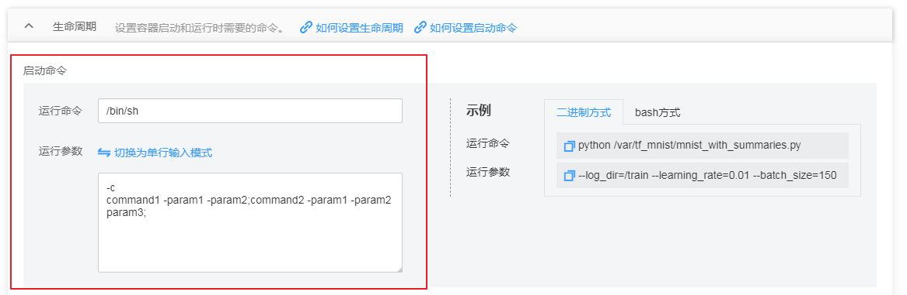
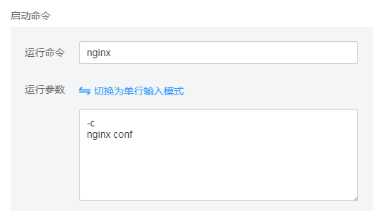
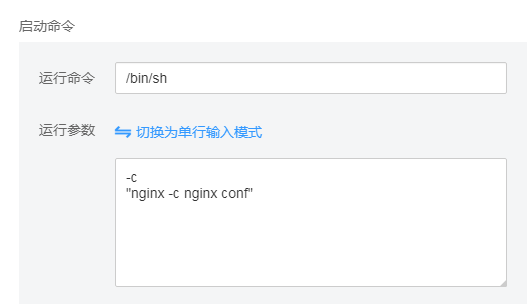
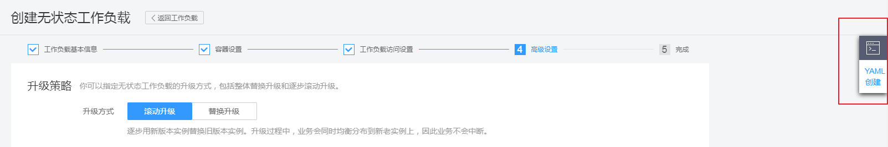

# 设置容器启动命令<a name="cce_01_0008"></a>

创建工作负载或任务时，通常通过镜像指定容器中运行的进程。

在默认情况下，镜像会运行默认命令，如果想运行特定命令或重写镜像默认值，需要用到以下设置：

-   **工作目录：**指定运行命令的工作目录。

    若镜像中未指定工作目录，且在界面中也未指定，默认是“/”。

-   **运行命令：**控制镜像运行的实际命令。
-   **运行参数：**传递给运行命令的参数。

> **须知：**   
>容器启动后，容器中的内容不应修改。如果修改配置项（例如将容器应用的密码、证书、环境变量配置到容器中），当容器重启（例如节点异常重新调度pod）后，会导致配置丢失，业务异常。  
>配置信息应通过入参等方式导入容器中，以免重启后配置丢失。  

## 容器如何执行命令和参数<a name="section913591582414"></a>

Docker 的镜像拥有存储镜像信息的相关元数据，如果不设置生命周期命令和参数，容器运行时会运行镜像制作时提供的默认的命令和参数，Docker 原生定义这两个字段为 “  Entrypoint ” 和 "  CMD "。详情可查看 docker的  [Entrypoint 说明](https://docs.docker.com/engine/reference/builder/#/entrypoint)，[CMD 说明](https://docs.docker.com/engine/reference/builder/#/cmd)。

如果在创建工作负载时填写了容器的运行命令和参数，将会覆盖镜像构建时的默认命令 " Entrypoint "、" CMD "，规则如下：

**表 1** 容器如何执行命令和参数

<a name="table4833929202611"></a>
<table><thead align="left"><tr id="row1683442952610"><th class="cellrowborder" valign="top" width="20%" id="mcps1.2.6.1.1"><p id="p17834192919269"><a name="p17834192919269"></a><a name="p17834192919269"></a>镜像 Entrypoint</p>
</th>
<th class="cellrowborder" valign="top" width="20%" id="mcps1.2.6.1.2"><p id="p168345294268"><a name="p168345294268"></a><a name="p168345294268"></a>镜像CMD</p>
</th>
<th class="cellrowborder" valign="top" width="20%" id="mcps1.2.6.1.3"><p id="p283416297265"><a name="p283416297265"></a><a name="p283416297265"></a>容器运行命令</p>
</th>
<th class="cellrowborder" valign="top" width="20%" id="mcps1.2.6.1.4"><p id="p583412914264"><a name="p583412914264"></a><a name="p583412914264"></a>容器运行参数</p>
</th>
<th class="cellrowborder" valign="top" width="20%" id="mcps1.2.6.1.5"><p id="p198341629182620"><a name="p198341629182620"></a><a name="p198341629182620"></a>最终执行</p>
</th>
</tr>
</thead>
<tbody><tr id="row283622962618"><td class="cellrowborder" valign="top" width="20%" headers="mcps1.2.6.1.1 "><p id="p583642920263"><a name="p583642920263"></a><a name="p583642920263"></a>[touch]</p>
</td>
<td class="cellrowborder" valign="top" width="20%" headers="mcps1.2.6.1.2 "><p id="p128361129162616"><a name="p128361129162616"></a><a name="p128361129162616"></a>[/root/test]</p>
</td>
<td class="cellrowborder" valign="top" width="20%" headers="mcps1.2.6.1.3 "><p id="p15836162952619"><a name="p15836162952619"></a><a name="p15836162952619"></a>未设置</p>
</td>
<td class="cellrowborder" valign="top" width="20%" headers="mcps1.2.6.1.4 "><p id="p18836529172618"><a name="p18836529172618"></a><a name="p18836529172618"></a>未设置</p>
</td>
<td class="cellrowborder" valign="top" width="20%" headers="mcps1.2.6.1.5 "><p id="p1836132922617"><a name="p1836132922617"></a><a name="p1836132922617"></a>[touch /root/test]</p>
</td>
</tr>
<tr id="row283662932612"><td class="cellrowborder" valign="top" width="20%" headers="mcps1.2.6.1.1 "><p id="p3836229172615"><a name="p3836229172615"></a><a name="p3836229172615"></a>[touch]</p>
</td>
<td class="cellrowborder" valign="top" width="20%" headers="mcps1.2.6.1.2 "><p id="p18836142932613"><a name="p18836142932613"></a><a name="p18836142932613"></a>[/root/test]</p>
</td>
<td class="cellrowborder" valign="top" width="20%" headers="mcps1.2.6.1.3 "><p id="p1183602917269"><a name="p1183602917269"></a><a name="p1183602917269"></a>[mkdir]</p>
</td>
<td class="cellrowborder" valign="top" width="20%" headers="mcps1.2.6.1.4 "><p id="p983642982611"><a name="p983642982611"></a><a name="p983642982611"></a>未设置</p>
</td>
<td class="cellrowborder" valign="top" width="20%" headers="mcps1.2.6.1.5 "><p id="p1183612293269"><a name="p1183612293269"></a><a name="p1183612293269"></a>[mkdir]</p>
</td>
</tr>
<tr id="row9836152912618"><td class="cellrowborder" valign="top" width="20%" headers="mcps1.2.6.1.1 "><p id="p167981050113418"><a name="p167981050113418"></a><a name="p167981050113418"></a>[touch]</p>
</td>
<td class="cellrowborder" valign="top" width="20%" headers="mcps1.2.6.1.2 "><p id="p17837142972617"><a name="p17837142972617"></a><a name="p17837142972617"></a>[/root/test]</p>
</td>
<td class="cellrowborder" valign="top" width="20%" headers="mcps1.2.6.1.3 "><p id="p168379292269"><a name="p168379292269"></a><a name="p168379292269"></a>未设置</p>
</td>
<td class="cellrowborder" valign="top" width="20%" headers="mcps1.2.6.1.4 "><p id="p1583702911260"><a name="p1583702911260"></a><a name="p1583702911260"></a>[/opt/test]</p>
</td>
<td class="cellrowborder" valign="top" width="20%" headers="mcps1.2.6.1.5 "><p id="p58371729182613"><a name="p58371729182613"></a><a name="p58371729182613"></a>[touch /opt/test]</p>
</td>
</tr>
<tr id="row16837172972617"><td class="cellrowborder" valign="top" width="20%" headers="mcps1.2.6.1.1 "><p id="p138691301355"><a name="p138691301355"></a><a name="p138691301355"></a>[touch]</p>
</td>
<td class="cellrowborder" valign="top" width="20%" headers="mcps1.2.6.1.2 "><p id="p208371129182610"><a name="p208371129182610"></a><a name="p208371129182610"></a>[/root/test]</p>
</td>
<td class="cellrowborder" valign="top" width="20%" headers="mcps1.2.6.1.3 "><p id="p1283715298267"><a name="p1283715298267"></a><a name="p1283715298267"></a>[mkdir]</p>
</td>
<td class="cellrowborder" valign="top" width="20%" headers="mcps1.2.6.1.4 "><p id="p544733220362"><a name="p544733220362"></a><a name="p544733220362"></a>[/opt/test]</p>
</td>
<td class="cellrowborder" valign="top" width="20%" headers="mcps1.2.6.1.5 "><p id="p20837112917262"><a name="p20837112917262"></a><a name="p20837112917262"></a>[mkdir /opt/test]</p>
</td>
</tr>
</tbody>
</table>

## 设置启动命令<a name="section16375562215"></a>

1.  登录[CCE控制台](https://console.huaweicloud.com/cce2.0/?utm_source=helpcenter)，在创建工作负载或任务时，展开“生命周期“。
2.  在启动命令后，输入运行命令和运行参数，如[表2](#table15533234825)。

    > **说明：**   
    >-   当前启动命令以字符串数组形式提供，对应于Docker的Entrypoint启动命令，格式为： \["executable", "param1", "param2",..\]。Kubernetes的容器启动命令可参见[这里](https://kubernetes.io/docs/tasks/inject-data-application/define-command-argument-container/#running-a-command-in-a-shell)。  
    >-   容器的生命周期与启动命令的生命周期一致，即启动命令执行完成后容器的生命周期结束。  

    **表 2**  容器启动命令

    <a name="table15533234825"></a>
    <table><thead align="left"><tr id="row85331634326"><th class="cellrowborder" valign="top" width="28.999999999999996%" id="mcps1.2.3.1.1"><p id="p18442342527"><a name="p18442342527"></a><a name="p18442342527"></a>命令方式</p>
    </th>
    <th class="cellrowborder" valign="top" width="71%" id="mcps1.2.3.1.2"><p id="p1444519421210"><a name="p1444519421210"></a><a name="p1444519421210"></a>操作步骤</p>
    </th>
    </tr>
    </thead>
    <tbody><tr id="row65339348218"><td class="cellrowborder" valign="top" width="28.999999999999996%" headers="mcps1.2.3.1.1 "><p id="p353573415215"><a name="p353573415215"></a><a name="p353573415215"></a>运行命令</p>
    </td>
    <td class="cellrowborder" valign="top" width="71%" headers="mcps1.2.3.1.2 "><p id="p853515342215"><a name="p853515342215"></a><a name="p853515342215"></a>输入可执行的命令，例如<span class="parmvalue" id="parmvalue429111315417"><a name="parmvalue429111315417"></a><a name="parmvalue429111315417"></a>“/run/server”</span>。</p>
    <p id="p2595134133217"><a name="p2595134133217"></a><a name="p2595134133217"></a>若运行命令有多个，多个命令之间用空格进行分隔。若命令本身带空格，则需要加引号（""）。</p>
    <div class="note" id="note11952193619513"><a name="note11952193619513"></a><a name="note11952193619513"></a><span class="notetitle"> 说明： </span><div class="notebody"><p id="p1795213665120"><a name="p1795213665120"></a><a name="p1795213665120"></a>多命令时，运行命令建议用/bin/sh或其他的shell，其他全部命令作为参数来传入，如<a href="#fig18867161119">图1</a>。</p>
    </div></div>
    </td>
    </tr>
    <tr id="row85351342022"><td class="cellrowborder" valign="top" width="28.999999999999996%" headers="mcps1.2.3.1.1 "><p id="p165351342212"><a name="p165351342212"></a><a name="p165351342212"></a>运行参数</p>
    </td>
    <td class="cellrowborder" valign="top" width="71%" headers="mcps1.2.3.1.2 "><p id="p74728683919"><a name="p74728683919"></a><a name="p74728683919"></a>输入控制容器运行命令参数，例如--port=8080。</p>
    <p id="p10535163420216"><a name="p10535163420216"></a><a name="p10535163420216"></a>若参数有多个，多个参数以换行分隔。</p>
    </td>
    </tr>
    </tbody>
    </table>

    **图 1**  启动命令示例<a name="fig18867161119"></a>  
    

    **下面将以启动一个nginx为例，介绍容器启动命令典型的三个使用场景：**

    示例代码如下：

    ```
    nginx -c nginx.conf
    ```

    -   **场景一：**容器的“运行命令“和“运行参数“均作设置，界面截图如下：

        **图 2**  运行命令和运行参数均设置<a name="fig15894345145911"></a>  
        

        所生成的YAML样例如下：

        ```
                  command:
                    - nginx
                  args:
                    - '-c'
                    - nginx.conf
        ```

    -   **场景二：**仅设置容器的“运行命令“，界面截图如下：

        **图 3**  仅设置运行命令<a name="fig152912552617"></a>  
        

        > **说明：**   
        >运行命令中前后要加英文双引号""，若不加则会按照空格将命令拆分成多条执行。  

        所生成的YAML样例如下：

        ```
                  command:
                    - nginx -c nginx.conf
                  args:
        ```

    -   **场景三：**仅设置容器的“运行参数“，界面截图如下：

        **图 4**  仅设置运行参数<a name="fig4191056173112"></a>  
        

        > **说明：**   
        >如果运行命令没有添加到系统路径中，可以使用/bin/sh来执行命令，命令需要加英文双引号""。  

        所生成的YAML样例如下：

        ```
                  command:
                    - /bin/sh
                  args:
                    - '-c'
                    - '"nginx -c nginx.conf"'
        ```

3.  您可以通过如下方式检查或修改YAML：
    -   创建工作负载时，在“高级设置“步骤中，单击右侧的“YAML创建“。

        **图 5**  检查/修改YAML<a name="fig1441425219418"></a>  
        

    -   工作负载创建完成后，在工作负载列表中，单击工作负载名称后的“更多 \> 编辑YAML“。

        **图 6**  编辑YAML<a name="fig17685174865618"></a>  
        

    -   工作负载创建完成后，进入工作负载详情页面，单击右上角的“编辑YAML“。

        **图 7**  详情页-编辑YAML<a name="fig119824493463"></a>  
        


## 设置容器启动命令-YAML样例<a name="section151181981167"></a>

本节以nginx为例，说明通过kubectl设置容器启动命令的方法。

**前提条件**

请参见[通过kubectl连接集群](通过kubectl连接集群.md)配置kubectl命令，使弹性云服务器连接集群。

**操作步骤**

参见[通过kubectl命令行创建无状态工作负载](创建无状态工作负载(Deployment).md#section155246177178)或[通过kubectl命令行创建有状态工作负载](创建有状态工作负载(StatefulSet).md#section113441881214)时，容器启动命令的参数设置如下所示，详细请参见[kubernetes官方文档](https://kubernetes.io/docs/concepts/workloads/pods/init-containers/)。

```
apiVersion: extensions/v1beta1
kind: Deployment
metadata:
  name: nginx
spec:
  replicas: 1
  selector:
    matchLabels:
      app: nginx
  strategy:
    type: RollingUpdate
  template:
    metadata:
      labels:
        app: nginx
    spec:
      containers:
      - image: nginx 
        command:
        - sleep 3600                        #启动命令
        imagePullPolicy: Always
        lifecycle:
          postStart:
            exec:
              command:
              - /bin/bash
              - install.sh                  #启动后命令
          preStop:
            exec:
              command:
              - /bin/bash
              - uninstall.sh                 #停止前命令
        name: nginx
      imagePullSecrets:
      - name: default-secret
```

