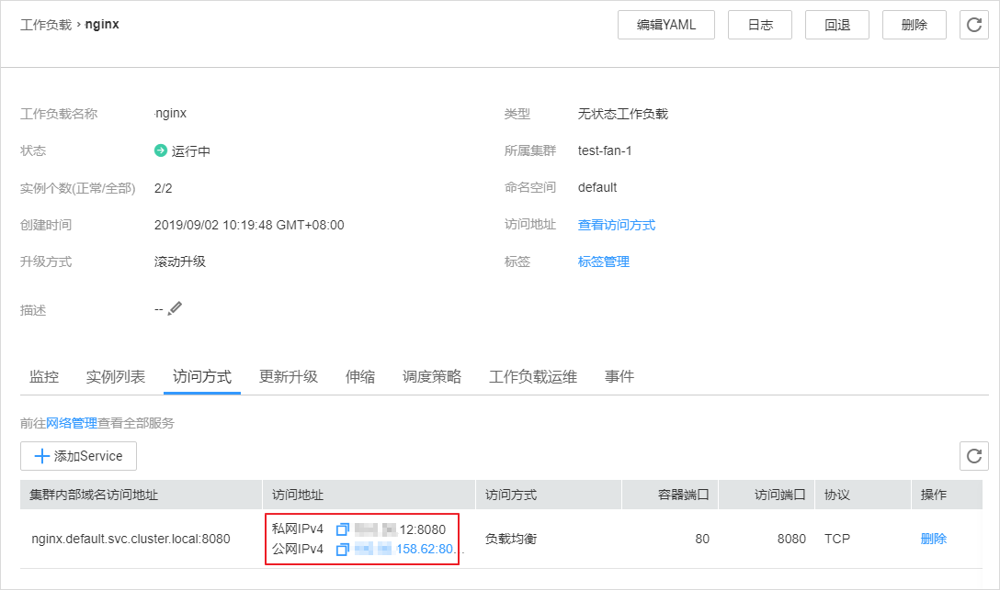

# 负载均衡 \( LoadBalancer \)<a name="cce_01_0014"></a>

负载均衡\( LoadBalancer \)可以通过弹性负载均衡从公网访问到工作负载，与弹性IP方式相比提供了高可靠的保障，一般用于系统中需要暴露到公网的服务。

负载均衡访问方式由公网弹性负载均衡ELB服务地址以及设置的访问端口组成，例如“10.117.117.117:80“。

**图 1**  负载均衡\( LoadBalancer \)<a name="fig1454926316508"></a>  
.png "负载均衡(-LoadBalancer-)")

> **说明：**   
>CCE中的负载均衡 \( LoadBalancer \)访问类型使用[弹性负载均衡 ELB](https://support.huaweicloud.com/productdesc-elb/zh-cn_topic_0015479966.html)提供网络访问，存在如下产品约束：  
>-   自动创建的ELB实例建议不要被其他资源使用，否则会在删除时被占用，导致资源残留。  
>-   正在使用的ELB实例请不要修改监听器名称，否则可能导致无法正常访问。  

## 通过控制台操作<a name="section744117150366"></a>

可以在创建工作负载时通过CCE控制台设置Service访问方式，本节以nginx为例进行说明。

1.  参考[创建无状态工作负载\(Deployment\)](创建无状态工作负载(Deployment).md)或[创建有状态工作负载\(StatefulSet\)](创建有状态工作负载(StatefulSet).md)，在“工作负载访问设置“步骤，单击“添加服务“。
    -   **访问类型：**选择“负载均衡 \( LoadBalancer \)“。
    -   **服务名称：**自定义服务名称，可与工作负载名称保持一致。
    -   **服务亲和：**
        -   集群级别：集群下所有节点的IP+访问端口均可以访问到此服务关联的负载，服务访问会因路由跳转导致一定性能损失，且无法获取到客户端源IP。
        -   节点级别：只有通过负载所在节点的IP+访问端口才可以访问此服务关联的负载，服务访问没有因路由跳转导致的性能损失，且可以获取到客户端源IP。

    -   **负载均衡：**可以将互联网访问流量自动分发到工作负载所在的多个节点上。请根据业务需求选择“公网“或“私网“，具体请参见[公网和私网负载均衡器](https://support.huaweicloud.com/productdesc-elb/zh_cn_elb_01_0004.html)。

        -   公网：支持自动创建和使用已有负载均衡实例两种方式。

            增强型负载均衡配额不足时，请通过新建[增强型弹性负载均衡](https://console.huaweicloud.com/vpc/#/ulb/createUlb)创建，完成后点击刷新按钮。

        -   私网：支持自动创建和使用已有负载均衡实例两种方式。

        负载均衡实例需与当前集群处于相同VPC且为相同公私网类型。

        **其他配置：**

        -   规格配置：选择“公网 \> 自动创建“时显示此配置项，单击“更改配置”可修改负载均衡实例的名称、规格、计费模式和带宽。
        -   企业项目：请选择企业项目名称，选择后可以直接创建在具体的ELB企业项目下。
        -   分配策略类型：可选择加权轮询算法、加权最少连接或源IP算法，权重将根据Service关联的工作负载在每个节点上的实例数量进行动态调整。
            -   加权轮询算法：根据后端服务器的权重，按顺序依次将请求分发给不同的服务器。它用相应的权重表示服务器的处理性能，按照权重的高低以及轮询方式将请求分配给各服务器，相同权重的服务器处理相同数目的连接数。常用于短连接服务，例如HTTP等服务。
            -   加权最少连接：最少连接是通过当前活跃的连接数来估计服务器负载情况的一种动态调度算法。加权最少连接就是在最少连接数的基础上，根据服务器的不同处理能力，给每个服务器分配不同的权重，使其能够接受相应权值数的服务请求。常用于长连接服务，例如数据库连接等服务。
            -   源IP算法：将请求的源IP地址进行Hash运算，得到一个具体的数值，同时对后端服务器进行编号，按照运算结果将请求分发到对应编号的服务器上。这可以使得对不同源IP的访问进行负载分发，同时使得同一个客户端IP的请求始终被派发至某特定的服务器。该方式适合负载均衡无cookie功能的TCP协议。

        -   会话保持：负载均衡监听是基于IP地址的会话保持，即来自同一IP地址的访问请求转发到同一台后端服务器上。默认不开启，可选择“源IP地址“。
        -   健康检查：默认开启。请根据界面提示进行配置，更多参数说明请参见[配置健康检查](https://support.huaweicloud.com/usermanual-elb/zh-cn_topic_0162227063.html)。

    -   **端口配置：**
        -   协议：请根据业务的协议类型选择。
        -   容器端口：容器镜像中工作负载实际监听端口，需用户确定。nginx程序实际监听的端口为80。
        -   访问端口：容器端口最终映射到负载均衡服务地址的端口，用负载均衡服务地址访问工作负载时使用，端口范围为1-65535，可任意指定。

2.  完成配置后，直接单击“确定“。
3.  单击“下一步：高级配置“进入高级设置页面，直接单击“创建“。
4.  创建成功后，单击“工作负载 \> 无状态（Deployment）“或“工作负载 \> 有状态（StatefulSet）“，在工作负载列表页面，单击“工作负载名称“进入工作负载详情页，在“访问方式“页签下，即可获取方式地址，如[图2](#fig756114141119)。

    **图 2**  获取负载均衡访问地址<a name="fig756114141119"></a>  
    

5.  单击访问地址，即可跳转到访问页面。

## 通过kubectl命令行创建<a name="section55123716168"></a>

您可以在创建工作负载时通过kubectl命令行设置Service访问方式。本节以nginx为例，说明kubectl命令实现负载均衡 \( LoadBalancer \)访问的方法。

**前提条件**

请参见[通过kubectl连接集群](通过kubectl连接集群.md)配置kubectl命令，使弹性云服务器连接集群。

**操作步骤**

1.  登录已配置好kubectl命令的弹性云服务器。登录方法请参见[登录Linux弹性云服务器](https://support.huaweicloud.com/usermanual-ecs/zh-cn_topic_0013771089.html)。
2.  创建并编辑nginx-deployment.yaml以及nginx-elb-svc.yaml文件。

    其中，nginx-deployment.yaml和nginx-elb-svc.yaml为自定义名称，您可以随意命名。

    **vi nginx-deployment.yaml**

    ```
    apiVersion: extensions/v1beta1
    kind: Deployment
    metadata:
      name: nginx
    spec:
      replicas: 1
      selector:
        matchLabels:
          app: nginx
      strategy:
        type: RollingUpdate
      template:
        metadata:
          labels:
            app: nginx
        spec:
          containers:
          - image: nginx 
            imagePullPolicy: Always
            name: nginx
          imagePullSecrets:
          - name: default-secret
    ```

    **vi nginx-elb-svc.yaml**

    > **说明：**   
    >若需要开启会话保持，需要满足如下条件：  
    >-   工作负载协议为TCP。  
    >-   工作负载的各实例已设置反亲和部署，即所有的实例都部署在不同节点上。具体请参见[指定工作负载部署在不同节点](https://support.huaweicloud.com/usermanual-cce/cce_01_0051.html#section11)。  

    -   自动创建ELB：

        ```
        apiVersion: v1 
        kind: Service 
        metadata: 
          annotations:   
            kubernetes.io/elb.class: union
            kubernetes.io/session-affinity-mode: SOURCE_IP
            kubernetes.io/elb.subnet-id: 5083f225-9bf8-48fa-9c8b-67bd9693c4c0
            kubernetes.io/elb.enterpriseID: debb7ae2-6d2f-4e6c-a0aa-1ccafd92b8eb
            kubernetes.io/elb.autocreate: '{"type":"public","bandwidth_name":"cce-bandwidth-1551163379627","bandwidth_chargemode":"bandwidth","bandwidth_size":5,"bandwidth_sharetype":"PER","eip_type":"5_bgp","name":"james"}'
          labels: 
            app: nginx 
          name: nginx 
        spec: 
          externalTrafficPolicy: Local
          ports: 
          - name: service0 
            port: 80
            protocol: TCP 
            targetPort: 80
          selector: 
            app: nginx 
          type: LoadBalancer
        ```

    -   使用已有ELB：

        ```
        apiVersion: v1 
        kind: Service 
        metadata: 
          annotations:   
            kubernetes.io/elb.class: union
            kubernetes.io/session-affinity-mode: SOURCE_IP
            kubernetes.io/elb.id: 3c7caa5a-a641-4bff-801a-feace27424b6
            kubernetes.io/elb.subnet-id: 5083f225-9bf8-48fa-9c8b-67bd9693c4c0
          labels: 
            app: nginx 
          name: nginx 
        spec: 
          loadBalancerIP: 10.78.42.242
          externalTrafficPolicy: Local
          ports: 
          - name: service0 
            port: 80
            protocol: TCP 
            targetPort: 80
          selector: 
            app: nginx 
          type: LoadBalancer
        ```

    **表 1**  关键参数说明

    <a name="table1819001615355"></a>
    <table><thead align="left"><tr id="row1519121663519"><th class="cellrowborder" valign="top" width="34.28657134286571%" id="mcps1.2.4.1.1"><p id="p18191161619356"><a name="p18191161619356"></a><a name="p18191161619356"></a>参数</p>
    </th>
    <th class="cellrowborder" valign="top" width="14.118588141185882%" id="mcps1.2.4.1.2"><p id="p1191141613357"><a name="p1191141613357"></a><a name="p1191141613357"></a>参数类型</p>
    </th>
    <th class="cellrowborder" valign="top" width="51.594840515948405%" id="mcps1.2.4.1.3"><p id="p1919116161353"><a name="p1919116161353"></a><a name="p1919116161353"></a>描述</p>
    </th>
    </tr>
    </thead>
    <tbody><tr id="row7430236123515"><td class="cellrowborder" valign="top" width="34.28657134286571%" headers="mcps1.2.4.1.1 "><p id="p2430336153520"><a name="p2430336153520"></a><a name="p2430336153520"></a>kubernetes.io/elb.class</p>
    </td>
    <td class="cellrowborder" valign="top" width="14.118588141185882%" headers="mcps1.2.4.1.2 "><p id="p19430103693512"><a name="p19430103693512"></a><a name="p19430103693512"></a>String</p>
    </td>
    <td class="cellrowborder" valign="top" width="51.594840515948405%" headers="mcps1.2.4.1.3 "><p id="p1380805311426"><a name="p1380805311426"></a><a name="p1380805311426"></a>对接增强型负载均衡时需要增加此参数，值为<span class="uicontrol" id="uicontrol349572644413"><a name="uicontrol349572644413"></a><a name="uicontrol349572644413"></a>“union”</span>。</p>
    </td>
    </tr>
    <tr id="row15191171618357"><td class="cellrowborder" valign="top" width="34.28657134286571%" headers="mcps1.2.4.1.1 "><p id="p204451615124716"><a name="p204451615124716"></a><a name="p204451615124716"></a>kubernetes.io/session-affinity-mode</p>
    </td>
    <td class="cellrowborder" valign="top" width="14.118588141185882%" headers="mcps1.2.4.1.2 "><p id="p1090683224719"><a name="p1090683224719"></a><a name="p1090683224719"></a>String</p>
    </td>
    <td class="cellrowborder" valign="top" width="51.594840515948405%" headers="mcps1.2.4.1.3 "><p id="p12830929125713"><a name="p12830929125713"></a><a name="p12830929125713"></a>可选，若需要开启会话保持，需增加该参数。</p>
    <p id="p16904132104710"><a name="p16904132104710"></a><a name="p16904132104710"></a>取值“SOURCE_IP”表示基于源IP。</p>
    </td>
    </tr>
    <tr id="row81941516153513"><td class="cellrowborder" valign="top" width="34.28657134286571%" headers="mcps1.2.4.1.1 "><p id="p4764162894719"><a name="p4764162894719"></a><a name="p4764162894719"></a>kubernetes.io/elb.id</p>
    </td>
    <td class="cellrowborder" valign="top" width="14.118588141185882%" headers="mcps1.2.4.1.2 "><p id="p77621528184710"><a name="p77621528184710"></a><a name="p77621528184710"></a>String</p>
    </td>
    <td class="cellrowborder" valign="top" width="51.594840515948405%" headers="mcps1.2.4.1.3 "><p id="p59344376579"><a name="p59344376579"></a><a name="p59344376579"></a>可选，但使用已有ELB时必填。</p>
    <p id="p416573016509"><a name="p416573016509"></a><a name="p416573016509"></a>为增强型负载均衡实例的ID。</p>
    </td>
    </tr>
    <tr id="row201957167350"><td class="cellrowborder" valign="top" width="34.28657134286571%" headers="mcps1.2.4.1.1 "><p id="p18758202864719"><a name="p18758202864719"></a><a name="p18758202864719"></a>kubernetes.io/elb.subnet-id</p>
    </td>
    <td class="cellrowborder" valign="top" width="14.118588141185882%" headers="mcps1.2.4.1.2 "><p id="p336744055219"><a name="p336744055219"></a><a name="p336744055219"></a>String</p>
    </td>
    <td class="cellrowborder" valign="top" width="51.594840515948405%" headers="mcps1.2.4.1.3 "><p id="p2075662814474"><a name="p2075662814474"></a><a name="p2075662814474"></a>可选，但自动创建时必填，Kubernetes v1.11.7-r0以上版本的集群可不填。</p>
    </td>
    </tr>
    <tr id="row1543834613532"><td class="cellrowborder" valign="top" width="34.28657134286571%" headers="mcps1.2.4.1.1 "><p id="p443916465535"><a name="p443916465535"></a><a name="p443916465535"></a>kubernetes.io/elb.enterpriseID</p>
    </td>
    <td class="cellrowborder" valign="top" width="14.118588141185882%" headers="mcps1.2.4.1.2 "><p id="p164393463532"><a name="p164393463532"></a><a name="p164393463532"></a>String</p>
    </td>
    <td class="cellrowborder" valign="top" width="51.594840515948405%" headers="mcps1.2.4.1.3 "><p id="p1843954617535"><a name="p1843954617535"></a><a name="p1843954617535"></a>可选，但公网或私网自动创建时必填。</p>
    <p id="p439419360561"><a name="p439419360561"></a><a name="p439419360561"></a>为ELB企业项目名称，选择后可以直接创建在具体的ELB企业项目下。</p>
    </td>
    </tr>
    <tr id="row1719518169356"><td class="cellrowborder" valign="top" width="34.28657134286571%" headers="mcps1.2.4.1.1 "><p id="p9754162844712"><a name="p9754162844712"></a><a name="p9754162844712"></a>kubernetes.io/elb.autocreate</p>
    </td>
    <td class="cellrowborder" valign="top" width="14.118588141185882%" headers="mcps1.2.4.1.2 "><p id="zh-cn_topic_0079615000_p32706975"><a name="zh-cn_topic_0079615000_p32706975"></a><a name="zh-cn_topic_0079615000_p32706975"></a><a href="#table19417184671919">elb.autocreate</a> object</p>
    </td>
    <td class="cellrowborder" valign="top" width="51.594840515948405%" headers="mcps1.2.4.1.3 "><p id="p127521028194718"><a name="p127521028194718"></a><a name="p127521028194718"></a>可选，但公网自动创建时必填，将自动创建ELB所绑定的EIP。私网自动创建时必填，将自动创建ELB。</p>
    <p id="p115519391615"><a name="p115519391615"></a><a name="p115519391615"></a><strong id="b158091351266"><a name="b158091351266"></a><a name="b158091351266"></a>示例：</strong></p>
    <a name="ul286913611614"></a><a name="ul286913611614"></a><ul id="ul286913611614"><li>公网自动创建：<p id="p1286493011369"><a name="p1286493011369"></a><a name="p1286493011369"></a>值为 '{"type":"public","bandwidth_name":"cce-bandwidth-1551163379627","bandwidth_chargemode":"bandwidth","bandwidth_size":5,"bandwidth_sharetype":"PER","eip_type":"5_bgp","name":"james"}'</p>
    </li><li>私网自动创建：<p id="p13182133673615"><a name="p13182133673615"></a><a name="p13182133673615"></a>值为 '{"type":"inner", "name": "A-location-d-test"}'</p>
    </li></ul>
    </td>
    </tr>
    <tr id="row121515334113"><td class="cellrowborder" valign="top" width="34.28657134286571%" headers="mcps1.2.4.1.1 "><p id="p92162033131111"><a name="p92162033131111"></a><a name="p92162033131111"></a>loadBalancerIP</p>
    </td>
    <td class="cellrowborder" valign="top" width="14.118588141185882%" headers="mcps1.2.4.1.2 "><p id="zh-cn_topic_0079615000_p47822814"><a name="zh-cn_topic_0079615000_p47822814"></a><a name="zh-cn_topic_0079615000_p47822814"></a>String</p>
    </td>
    <td class="cellrowborder" valign="top" width="51.594840515948405%" headers="mcps1.2.4.1.3 "><p id="p7217113331120"><a name="p7217113331120"></a><a name="p7217113331120"></a>配置为ELB的IP地址，私网ELB配置私有IP，公网ELB配置为公网IP。</p>
    </td>
    </tr>
    <tr id="row14980162901115"><td class="cellrowborder" valign="top" width="34.28657134286571%" headers="mcps1.2.4.1.1 "><p id="p398162913117"><a name="p398162913117"></a><a name="p398162913117"></a>externalTrafficPolicy</p>
    </td>
    <td class="cellrowborder" valign="top" width="14.118588141185882%" headers="mcps1.2.4.1.2 "><p id="p142173231413"><a name="p142173231413"></a><a name="p142173231413"></a>String</p>
    </td>
    <td class="cellrowborder" valign="top" width="51.594840515948405%" headers="mcps1.2.4.1.3 "><p id="p119811329111112"><a name="p119811329111112"></a><a name="p119811329111112"></a>可选，若需要开启会话保持，需增加该参数，表示请求转到固定节点；若某个服务发布成ELB服务且为Local模式，客户端如果在集群内，那么必须与服务端在同一个节点上才能正常访问。</p>
    </td>
    </tr>
    <tr id="row17120113981313"><td class="cellrowborder" valign="top" width="34.28657134286571%" headers="mcps1.2.4.1.1 "><p id="p17120639161311"><a name="p17120639161311"></a><a name="p17120639161311"></a>port</p>
    </td>
    <td class="cellrowborder" valign="top" width="14.118588141185882%" headers="mcps1.2.4.1.2 "><p id="p1120939161311"><a name="p1120939161311"></a><a name="p1120939161311"></a>Integer</p>
    </td>
    <td class="cellrowborder" valign="top" width="51.594840515948405%" headers="mcps1.2.4.1.3 "><p id="p1120163961310"><a name="p1120163961310"></a><a name="p1120163961310"></a>集群虚拟IP的访问端口，也是注册到负载均衡上的端口。</p>
    </td>
    </tr>
    <tr id="row02694357138"><td class="cellrowborder" valign="top" width="34.28657134286571%" headers="mcps1.2.4.1.1 "><p id="p627233515132"><a name="p627233515132"></a><a name="p627233515132"></a>targetPort</p>
    </td>
    <td class="cellrowborder" valign="top" width="14.118588141185882%" headers="mcps1.2.4.1.2 "><p id="p19272143531318"><a name="p19272143531318"></a><a name="p19272143531318"></a>String</p>
    </td>
    <td class="cellrowborder" valign="top" width="51.594840515948405%" headers="mcps1.2.4.1.3 "><p id="p8272035161316"><a name="p8272035161316"></a><a name="p8272035161316"></a>对应界面上的容器端口</p>
    </td>
    </tr>
    </tbody>
    </table>

    **表 2**  elb.autocreate字段数据结构说明

    <a name="table19417184671919"></a>
    <table><thead align="left"><tr id="row14418174611912"><th class="cellrowborder" valign="top" width="29.727027297270276%" id="mcps1.2.4.1.1"><p id="p1141924611199"><a name="p1141924611199"></a><a name="p1141924611199"></a>参数</p>
    </th>
    <th class="cellrowborder" valign="top" width="18.678132186781323%" id="mcps1.2.4.1.2"><p id="p1641911466191"><a name="p1641911466191"></a><a name="p1641911466191"></a>参数类型</p>
    </th>
    <th class="cellrowborder" valign="top" width="51.594840515948405%" id="mcps1.2.4.1.3"><p id="p1941920463197"><a name="p1941920463197"></a><a name="p1941920463197"></a>描述</p>
    </th>
    </tr>
    </thead>
    <tbody><tr id="row194191846181915"><td class="cellrowborder" valign="top" width="29.727027297270276%" headers="mcps1.2.4.1.1 "><p id="p152321411112318"><a name="p152321411112318"></a><a name="p152321411112318"></a>name</p>
    </td>
    <td class="cellrowborder" valign="top" width="18.678132186781323%" headers="mcps1.2.4.1.2 "><p id="p7419646171920"><a name="p7419646171920"></a><a name="p7419646171920"></a>String</p>
    </td>
    <td class="cellrowborder" valign="top" width="51.594840515948405%" headers="mcps1.2.4.1.3 "><p id="p87791494919"><a name="p87791494919"></a><a name="p87791494919"></a>自动创建的负载均衡的名称。</p>
    <p id="p9912132016296"><a name="p9912132016296"></a><a name="p9912132016296"></a>取值范围：1-64个字符，中英文，数字，下划线，中划线。</p>
    </td>
    </tr>
    <tr id="row142064681919"><td class="cellrowborder" valign="top" width="29.727027297270276%" headers="mcps1.2.4.1.1 "><p id="p20862285225"><a name="p20862285225"></a><a name="p20862285225"></a>type</p>
    </td>
    <td class="cellrowborder" valign="top" width="18.678132186781323%" headers="mcps1.2.4.1.2 "><p id="p8420746101918"><a name="p8420746101918"></a><a name="p8420746101918"></a>String</p>
    </td>
    <td class="cellrowborder" valign="top" width="51.594840515948405%" headers="mcps1.2.4.1.3 "><p id="p4703183013491"><a name="p4703183013491"></a><a name="p4703183013491"></a>负载均衡实例网络类型，公网或者私网。</p>
    <a name="ul152311045124913"></a><a name="ul152311045124913"></a><ul id="ul152311045124913"><li>public：公网型负载均衡</li><li>inner：私网型负载均衡</li></ul>
    </td>
    </tr>
    <tr id="row194201046151910"><td class="cellrowborder" valign="top" width="29.727027297270276%" headers="mcps1.2.4.1.1 "><p id="p128042817221"><a name="p128042817221"></a><a name="p128042817221"></a>bandwidth_name</p>
    </td>
    <td class="cellrowborder" valign="top" width="18.678132186781323%" headers="mcps1.2.4.1.2 "><p id="p1142084619195"><a name="p1142084619195"></a><a name="p1142084619195"></a>String</p>
    </td>
    <td class="cellrowborder" valign="top" width="51.594840515948405%" headers="mcps1.2.4.1.3 "><p id="p6964103318220"><a name="p6964103318220"></a><a name="p6964103318220"></a>带宽的名称，默认值为：cce-bandwidth-******。</p>
    <p id="p1236952875020"><a name="p1236952875020"></a><a name="p1236952875020"></a>1-64 字符，中文、英文字符、数字、下划线、中划线或点组成。</p>
    </td>
    </tr>
    <tr id="row942194619199"><td class="cellrowborder" valign="top" width="29.727027297270276%" headers="mcps1.2.4.1.1 "><p id="p77502811221"><a name="p77502811221"></a><a name="p77502811221"></a>bandwidth_chargemode</p>
    </td>
    <td class="cellrowborder" valign="top" width="18.678132186781323%" headers="mcps1.2.4.1.2 "><p id="p11421446191914"><a name="p11421446191914"></a><a name="p11421446191914"></a>String</p>
    </td>
    <td class="cellrowborder" valign="top" width="51.594840515948405%" headers="mcps1.2.4.1.3 "><p id="p3178181495216"><a name="p3178181495216"></a><a name="p3178181495216"></a>带宽付费模式。</p>
    <a name="ul567215235528"></a><a name="ul567215235528"></a><ul id="ul567215235528"><li>bandwidth：按带宽计费</li><li>traffic：按流量计费</li></ul>
    </td>
    </tr>
    <tr id="row124211046101910"><td class="cellrowborder" valign="top" width="29.727027297270276%" headers="mcps1.2.4.1.1 "><p id="p187492819229"><a name="p187492819229"></a><a name="p187492819229"></a>bandwidth_size</p>
    </td>
    <td class="cellrowborder" valign="top" width="18.678132186781323%" headers="mcps1.2.4.1.2 "><p id="p114229463196"><a name="p114229463196"></a><a name="p114229463196"></a>Integer</p>
    </td>
    <td class="cellrowborder" valign="top" width="51.594840515948405%" headers="mcps1.2.4.1.3 "><p id="p12958233152218"><a name="p12958233152218"></a><a name="p12958233152218"></a>带宽大小，请根据Region带宽支持范围设置，具体请参见<a href="https://support.huaweicloud.com/api-vpc/zh-cn_topic_0020090596.html#ZH-CN_TOPIC_0020090596__table11041789" target="_blank" rel="noopener noreferrer">申请弹性公网IP</a>中<strong id="b198591928137"><a name="b198591928137"></a><a name="b198591928137"></a>表4 bandwidth字段说明中size字段</strong>。</p>
    </td>
    </tr>
    <tr id="row1942224601917"><td class="cellrowborder" valign="top" width="29.727027297270276%" headers="mcps1.2.4.1.1 "><p id="p16731228202214"><a name="p16731228202214"></a><a name="p16731228202214"></a>bandwidth_sharetype</p>
    </td>
    <td class="cellrowborder" valign="top" width="18.678132186781323%" headers="mcps1.2.4.1.2 "><p id="p84221246111913"><a name="p84221246111913"></a><a name="p84221246111913"></a>String</p>
    </td>
    <td class="cellrowborder" valign="top" width="51.594840515948405%" headers="mcps1.2.4.1.3 "><p id="p188864421731"><a name="p188864421731"></a><a name="p188864421731"></a>带宽共享方式。</p>
    <a name="ul51872412"></a><a name="ul51872412"></a><ul id="ul51872412"><li>PER：独享带宽</li><li>WHOLE：共享带宽</li></ul>
    </td>
    </tr>
    <tr id="row1242219461193"><td class="cellrowborder" valign="top" width="29.727027297270276%" headers="mcps1.2.4.1.1 "><p id="p1972102872220"><a name="p1972102872220"></a><a name="p1972102872220"></a>eip_type</p>
    </td>
    <td class="cellrowborder" valign="top" width="18.678132186781323%" headers="mcps1.2.4.1.2 "><p id="p132201811174611"><a name="p132201811174611"></a><a name="p132201811174611"></a>String</p>
    </td>
    <td class="cellrowborder" valign="top" width="51.594840515948405%" headers="mcps1.2.4.1.3 "><p id="p11956103372218"><a name="p11956103372218"></a><a name="p11956103372218"></a>弹性公网IP类型，请参考ELB支持的弹性公网IP类型，具体请参见<a href="https://support.huaweicloud.com/api-vpc/zh-cn_topic_0020090596.html#ZH-CN_TOPIC_0020090596__table11041789" target="_blank" rel="noopener noreferrer">申请弹性公网IP</a>中<strong id="b11814520410"><a name="b11814520410"></a><a name="b11814520410"></a>表3 publicip字段说明type字段</strong>。</p>
    </td>
    </tr>
    </tbody>
    </table>

3.  创建工作负载。

    **kubectl create -f nginx-deployment.yaml**

    回显如下，表示工作负载已开始创建。

    ```
    deployment "nginx" created
    ```

    **kubectl get po**

    回显如下，工作负载状态为Running状态，表示工作负载已运行中。

    ```
    NAME                     READY     STATUS             RESTARTS   AGE
    etcd-0                   0/1       ImagePullBackOff   0          1h
    icagent-m9dkt            0/0       Running            0          3d
    nginx-2601814895-c1xhw   1/1       Running            0          6s
    ```

4.  创建服务。

    **kubectl create -f nginx-elb-svc.yaml**

    回显如下，表示服务已创建。

    ```
    service "nginx" created
    ```

    **kubectl get svc**

    回显如下，表示工作负载访问方式已设置成功，工作负载可访问。

    ```
    NAME         TYPE           CLUSTER-IP       EXTERNAL-IP   PORT(S)        AGE
    etcd-svc     ClusterIP      None             <none>        3120/TCP       1h
    kubernetes   ClusterIP      10.247.0.1       <none>        443/TCP        3d
    nginx        LoadBalancer   10.247.130.196   10.78.42.242   80:31540/TCP   51s
    ```

5.  在浏览器中输入访问地址，例如输入10.78.42.242:31540。10.78.42.242为负载均衡实例IP地址，31540为对应界面上的访问端口。

    可成功访问nginx。

    **图 3**  通过负载均衡访问nginx（二）<a name="fig1498213713356"></a>  
    


## 工作负载创建完成后设置<a name="section51925078171335"></a>

您可以在工作负载创建完成后对Service进行配置，此配置对工作负载状态无影响，且实时生效。具体操作如下：

1.  登录[CCE控制台](https://console.huaweicloud.com/cce2.0/?utm_source=helpcenter)，在左侧导航栏中选择“工作负载 \> 无状态 \( Deployment \)”或“工作负载 \> 有状态（StatefulSet）”，在工作负载列表页单击要设置Service的工作负载名称。
2.  在“访问方式“页签，单击“添加Service”。
3.  在“添加service“页面，访问类型选择“**负载均衡 \( LoadBalancer \)**”。
4.  设置负载均衡参数。
    -   **服务名称：**自定义服务名称，可与工作负载名称保持一致。
    -   **集群名称：**工作负载所在集群的名称，此处不可修改。
    -   **命名空间：**工作负载所在命名空间，此处不可修改。
    -   **关联工作负载：**要添加Service的工作负载，此处不可修改。
    -   **服务亲和：**
        -   集群级别：集群下所有节点的IP+访问端口均可以访问到此服务关联的负载，服务访问会因路由跳转导致一定性能损失，且无法获取到客户端源IP。
        -   节点级别：只有通过负载所在节点的IP+访问端口才可以访问此服务关联的负载，服务访问没有因路由跳转导致的性能损失，且可以获取到客户端源IP。

    -   **负载均衡：**可以将互联网访问流量自动分发到工作负载所在的多个节点上。请根据业务需求选择“公网“或“私网“，具体请参见[公网和私网负载均衡器](https://support.huaweicloud.com/productdesc-elb/zh_cn_elb_01_0004.html)。

        -   公网：支持自动创建和使用已有负载均衡实例两种方式。

            增强型负载均衡配额不足时，请通过新建[增强型弹性负载均衡](https://console.huaweicloud.com/vpc/#/ulb/createUlb)创建，完成后点击刷新按钮。

        -   私网：支持自动创建和使用已有负载均衡实例两种方式。

        负载均衡实例需与当前集群处于相同VPC且为相同公私网类型。

        **其他配置：**

        -   规格配置：选择“公网 \> 自动创建“时显示此配置项，单击可修改负载均衡实例的名称、规格、计费模式和带宽。
        -   企业项目：请选择企业项目名称，选择后可以直接创建在具体的ELB企业项目下。
        -   分配策略类型：可选择加权轮询算法、加权最少连接或源IP算法，权重将根据Service关联的工作负载在每个节点上的实例数量进行动态调整。

            > **说明：**   
            >-   加权轮询算法：根据后端服务器的权重，按顺序依次将请求分发给不同的服务器。它用相应的权重表示服务器的处理性能，按照权重的高低以及轮询方式将请求分配给各服务器，相同权重的服务器处理相同数目的连接数。常用于短连接服务，例如HTTP等服务。  
            >-   加权最少连接：最少连接是通过当前活跃的连接数来估计服务器负载情况的一种动态调度算法。加权最少连接就是在最少连接数的基础上，根据服务器的不同处理能力，给每个服务器分配不同的权重，使其能够接受相应权值数的服务请求。常用于长连接服务，例如数据库连接等服务。  
            >-   源IP算法：将请求的源IP地址进行Hash运算，得到一个具体的数值，同时对后端服务器进行编号，按照运算结果将请求分发到对应编号的服务器上。这可以使得对不同源IP的访问进行负载分发，同时使得同一个客户端IP的请求始终被派发至某特定的服务器。该方式适合负载均衡无cookie功能的TCP协议。  

        -   会话保持：负载均衡监听是基于IP地址的会话保持，即来自同一IP地址的访问请求转发到同一台后端服务器上。当选择“源IP算法“时不显示该参数。
        -   健康检查：默认开启。请根据界面提示进行配置，部分参数可参考[设置容器健康检查](设置容器健康检查.md)。

    -   **端口配置：**
        -   协议：请根据业务的协议类型选择。
        -   容器端口：容器镜像中工作负载程序实际监听的端口，需用户确定。nginx程序实际监听的端口为80。
        -   访问端口：容器端口最终映射到负载均衡服务地址的端口，用负载均衡服务地址访问工作负载时使用，端口范围为1-65535，可任意指定。

5.  单击“创建”。工作负载已添加“负载均衡 \( LoadBalancer \)”的服务。

## 更新Service<a name="section1591712812718"></a>

您可以在添加完Service后，更新此Service的端口配置。操作如下：

1.  登录[CCE控制台](https://console.huaweicloud.com/cce2.0/?utm_source=helpcenter)，在左侧导航栏中选择“资源管理 \> 网络管理”，在**Service**页签下，选择对应的集群和命名空间，单击需要更新端口配置的Service的“更新”。
2.  在“更新Service“页面，访问类型选择“负载均衡 \( LoadBalancer \)“。
3.  更新负载均衡参数：
    -   **集群名称：**工作负载所在集群的名称，更新时此处不可修改。
    -   **命名空间：**工作负载所在命名空间，更新时此处不可修改。
    -   **关联工作负载：**要添加Service的工作负载，更新时此处不可修改。
    -   **服务亲和：**
        -   集群级别：集群下所有节点的IP+访问端口均可以访问到此服务关联的负载，服务访问会因路由跳转导致一定性能损失，且无法获取到客户端源IP。
        -   节点级别：只有通过负载所在节点的IP+访问端口才可以访问此服务关联的负载，服务访问没有因路由跳转导致的性能损失，且可以获取到客户端源IP。

    -   **负载均衡：**更新时此处不可修改。可以将互联网访问流量自动分发到工作负载所在的多个节点上。

        负载均衡实例需与当前集群处于相同VPC且为相同公私网类型。

        **其他配置：**

        -   分配策略类型：可选择加权轮询算法、加权最少连接或源IP算法，权重将根据Service关联的工作负载在每个节点上的实例数量进行动态调整。

            > **说明：**   
            >-   加权轮询算法：根据后端服务器的权重，按顺序依次将请求分发给不同的服务器。它用相应的权重表示服务器的处理性能，按照权重的高低以及轮询方式将请求分配给各服务器，相同权重的服务器处理相同数目的连接数。常用于短连接服务，例如HTTP等服务。  
            >-   加权最少连接：最少连接是通过当前活跃的连接数来估计服务器负载情况的一种动态调度算法。加权最少连接就是在最少连接数的基础上，根据服务器的不同处理能力，给每个服务器分配不同的权重，使其能够接受相应权值数的服务请求。常用于长连接服务，例如数据库连接等服务。  
            >-   源IP算法：将请求的源IP地址进行Hash运算，得到一个具体的数值，同时对后端服务器进行编号，按照运算结果将请求分发到对应编号的服务器上。这可以使得对不同源IP的访问进行负载分发，同时使得同一个客户端IP的请求始终被派发至某特定的服务器。该方式适合负载均衡无cookie功能的TCP协议。  

        -   会话保持：负载均衡监听是基于IP地址的会话保持，即来自同一IP地址的访问请求转发到同一台后端服务器上。
        -   健康检查：默认开启。请根据界面提示进行配置，部分参数请参考[设置容器健康检查](设置容器健康检查.md)。

    -   **端口配置：**
        -   协议：请根据业务的协议类型选择。
        -   容器端口：容器镜像中工作负载程序实际监听的端口，需用户确定。nginx程序实际监听的端口为80。
        -   访问端口：容器端口最终映射到负载均衡服务地址的端口，用负载均衡服务地址访问工作负载时使用，端口范围为1-65535，可任意指定。

4.  单击“更新”。工作负载已更新Service。

