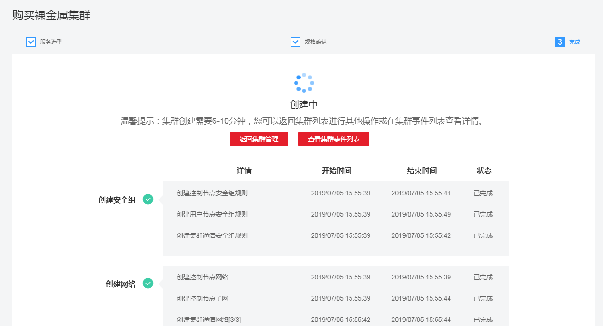

# 购买裸金属集群

裸金属集群是基于裸金属服务提供高计算和高网络性能的kubernetes容器集群，如需使用请先开通裸金属服务。

裸金属集群为保证高速的容器网络性能，要求您在创建裸金属服务器时，添加一块高速网卡。

## 准备工作

-   创建首个集群前，您必须先确保已存在虚拟私有云，否则无法创建集群。若您已有虚拟私有云，可重复使用，无需重复创建。

    虚拟私有云为CCE集群提供一个隔离的、用户自主配置和管理的虚拟网络环境。创建方法请参见[创建虚拟私有云和子网](https://support.huaweicloud.com/usermanual-vpc/zh-cn_topic_0013935842.html)。

-   已购买裸金属服务，具体步骤请参见[创建裸金属服务器](https://support.huaweicloud.com/usermanual-bms/zh-cn_topic_0035100414.html)。
-   已创建高速网络，具体步骤请参见[这里](https://support.huaweicloud.com/usermanual-bms/zh-cn_topic_0053537013.html)。高速网络是“裸金属服务器（简称BMS）“的内部网络，为同一可用区内的BMS之间提供带宽不受限制的网络。

## 创建集群

1.  登录[CCE控制台](https://console.huaweicloud.com/cce2.0/?utm_source=helpcenter)，在左侧导航栏中单击“资源管理 \> 集群管理”，在集群管理页面单击“裸金属集群“下的“购买”。

    **图 1**  购买裸金属集群  
    

2.  参照[表1](#table8638121213265)设置新增集群参数，其中带“\*”的参数为必填参数。

    **表 1**  创建集群参数配置

    
    <table><thead align="left"><tr id="row10638181262612"><th class="cellrowborder" valign="top" width="20%" id="mcps1.2.3.1.1">
参数

    </th>
    <th class="cellrowborder" valign="top" width="80%" id="mcps1.2.3.1.2">
参数说明

    </th>
    </tr>
    </thead>
    <tbody><tr id="row3232711133718"><td class="cellrowborder" valign="top" width="20%" headers="mcps1.2.3.1.1 ">
* 计费模式

    </td>
    <td class="cellrowborder" valign="top" width="80%" headers="mcps1.2.3.1.2 "><ul id="ul463941414445"><li>包年/包月：包周期计费。包年/包月集群创建后不能删除，如需停止使用，请到<a href="https://account.huaweicloud.com/usercenter/#/userindex/retreatManagement" target="_blank" rel="noopener noreferrer">费用中心</a>执行退订操作。</li><li>按需计费：根据实际使用的资源按小时计费，本章讲解按需计费类型的操作。</li></ul>
    </td>
    </tr>
    <tr id="row9824857125213"><td class="cellrowborder" valign="top" width="20%" headers="mcps1.2.3.1.1 ">
* 区域

    </td>
    <td class="cellrowborder" valign="top" width="80%" headers="mcps1.2.3.1.2 ">
请就近选择靠近您业务的区域，可减少网络时延，提高访问速度；不同区域的云服务产品之间内网互不相通。

    </td>
    </tr>
    <tr id="row119431051131213"><td class="cellrowborder" valign="top" width="20%" headers="mcps1.2.3.1.1 ">
* 企业项目

    </td>
    <td class="cellrowborder" valign="top" width="80%" headers="mcps1.2.3.1.2 ">
该参数仅对开通企业项目的企业客户账号显示。请确保选择的企业项目下有集群创建所需相关资源，如虚拟私有云。了解更多企业项目相关信息，请查看<a href="https://support.huaweicloud.com/usermanual-em/zh-cn_topic_0123692049.html" target="_blank" rel="noopener noreferrer">企业管理</a>。

    </td>
    </tr>
    <tr id="row1063812126263"><td class="cellrowborder" valign="top" width="20%" headers="mcps1.2.3.1.1 ">
* 集群名称

    </td>
    <td class="cellrowborder" valign="top" width="80%" headers="mcps1.2.3.1.2 ">
新建集群的名称，创建后不可修改。

    
集群名称长度范围为4-128个字符，以小写字母开头，由小写字母、数字、中划线（-）组成，且不能以中划线（-）结尾。

    </td>
    </tr>
    <tr id="row1820711165158"><td class="cellrowborder" valign="top" width="20%" headers="mcps1.2.3.1.1 ">
* 版本

    </td>
    <td class="cellrowborder" valign="top" width="80%" headers="mcps1.2.3.1.2 ">
选择集群对应的版本，对应Kubernetes社区基线版本。

    
若有Beta版本，您可以选择试用，但不建议用于商用场景。

    </td>
    </tr>
    <tr id="row434114618372"><td class="cellrowborder" valign="top" width="20%" headers="mcps1.2.3.1.1 ">
* 集群管理规模

    </td>
    <td class="cellrowborder" valign="top" width="80%" headers="mcps1.2.3.1.2 ">
当前集群支持管理的最大Node节点规模。若选择10节点，表示当前集群最多可管理10个节点。集群管理规模在集群创建后不支持调整，请在创建时慎重选择。

    
任何一个集群中均包含“Master节点”和“Node节点”，每一个节点对应一台云服务器。<ul id="ul1045015327013"><li>Master节点：集群的控制节点，在创建集群时会自动创建控制节点，负责整个集群的管理和调度。</li><li>Node节点：用户新建集群时或创建集群后购买的节点是集群的Node节点，即工作负载节点。Node节点由管理节点分配，当某个Node节点宕机时，管理节点会将工作负载转移到其他Node节点上。</li></ul>
    

    </td>
    </tr>
    <tr id="row128144815371"><td class="cellrowborder" valign="top" width="20%" headers="mcps1.2.3.1.1 ">
* 高可用

    </td>
    <td class="cellrowborder" valign="top" width="80%" headers="mcps1.2.3.1.2 "><ul id="ul143401352837"><li>高可用模式：将创建一个高可用集群，高可用集群包含多个控制节点（一般为3个），单控制节点故障时，集群依然可用。</li><li>普通模式：将创建一个普通集群，普通集群是单控制节点，当这个控制节点故障时，集群将不可用，但已运行工作负载不受影响。</li></ul>
    
集群创建完成后，高可用模式及普通模式之间不可变更，需要重新创建集群才能调整。请按实际使用场景谨慎选择：<ul id="ul20457121412567"><li>针对生产环境，为提高集群容灾能力，建议开启“高可用”。</li><li>针对开发和测试环境等对可靠性要求不高的场景，可根据业务需求选择是否开启“高可用”。</li></ul>
    

    </td>
    </tr>
    <tr id="row1763991215268"><td class="cellrowborder" valign="top" width="20%" headers="mcps1.2.3.1.1 ">
* 虚拟私有云

    </td>
    <td class="cellrowborder" valign="top" width="80%" headers="mcps1.2.3.1.2 ">
新建集群所在的虚拟私有云。虚拟私有云是通过逻辑方式进行网络隔离，提供安全、隔离的网络环境。

    
若没有可选VPC，单击“新建虚拟私有云”进行创建，完成创建后点击刷新按钮。

    
创建步骤请参见<a href="https://support.huaweicloud.com/usermanual-vpc/zh-cn_topic_0013935842.html" target="_blank" rel="noopener noreferrer">创建虚拟私有云和子网</a>。

    </td>
    </tr>
    <tr id="row15639412132615"><td class="cellrowborder" valign="top" width="20%" headers="mcps1.2.3.1.1 ">
* 所在子网

    </td>
    <td class="cellrowborder" valign="top" width="80%" headers="mcps1.2.3.1.2 ">
节点虚拟机运行的子网环境，通过子网提供与其他网络隔离的、可以独享的网络资源，以提高网络安全。虚拟私有云、子网、集群的关系请参见<a href="集群概述.md">集群概述</a>。

    
<strong id="b4144123118179">集群创建后子网无法修改，请谨慎选择。</strong>

    </td>
    </tr>
    <tr id="row142110462613"><td class="cellrowborder" valign="top" width="20%" headers="mcps1.2.3.1.1 ">
* 网络模型

    </td>
    <td class="cellrowborder" valign="top" width="80%" headers="mcps1.2.3.1.2 ">
Underlay：传统单层网络，是当前数据中心网络基础转发架构的网络。

    </td>
    </tr>
    <tr id="row8378645411"><td class="cellrowborder" valign="top" width="20%" headers="mcps1.2.3.1.1 ">
* 高速网络

    </td>
    <td class="cellrowborder" valign="top" width="80%" headers="mcps1.2.3.1.2 ">
请选择已创建的高速网络。

    
高速网络是“裸金属服务器（简称BMS）”的内部网络，能保证裸金属服务器之间带宽不受限制的高速访问。

    
创建步骤请参见<a href="https://support.huaweicloud.com/usermanual-bms/zh-cn_topic_0053537013.html" target="_blank" rel="noopener noreferrer">管理高速网络</a>。

    </td>
    </tr>
    <tr id="row6514088885942"><td class="cellrowborder" valign="top" width="20%" headers="mcps1.2.3.1.1 ">
* 容器网段

    </td>
    <td class="cellrowborder" valign="top" width="80%" headers="mcps1.2.3.1.2 ">
请根据业务需求选择容器网段，确定容器网段后，容器实例将在规划的网段内分配IP。

    <ul id="ul1423120351449"><li>未勾选“自动选择”：请手动选择网段。若与子网网段有冲突时将有红色文字提示，请重新选择。建议使用网段：10.0.0.0/8~16，172.16.0.0/16，192.168.0.0/16。
<strong id="b02629514118">不同集群使用相同的容器网段，会导致容器IP冲突，应用访问异常。</strong>

    </li><li>勾选“自动选择”：系统将自动分配与子网网段无冲突的网段。</li></ul>
    
容器网段要设置合理的掩码，掩码决定集群内可用节点数量。集群中容器网段掩码设置不合适，会导致集群实际可用的节点较少。设置掩码后，选项下方会有当前网段最多支持的实例估算值，请作参考。

    </td>
    </tr>
    <tr id="row1118716429343"><td class="cellrowborder" valign="top" width="20%" headers="mcps1.2.3.1.1 ">
* 服务网段

    </td>
    <td class="cellrowborder" valign="top" width="80%" headers="mcps1.2.3.1.2 ">
服务网段为kubernetes service ip网段。

    
默认选中，网段将设置为10.247.0.0/16。

    </td>
    </tr>
    <tr id="row03792506375"><td class="cellrowborder" valign="top" width="20%" headers="mcps1.2.3.1.1 ">
鉴权方式

    </td>
    <td class="cellrowborder" valign="top" width="80%" headers="mcps1.2.3.1.2 ">
“RBAC”默认勾选，不可取消。

    
开启RBAC能力后，设置了细粒度权限的子用户使用集群下资源将受到权限控制。

    </td>
    </tr>
    <tr id="row899013277910"><td class="cellrowborder" valign="top" width="20%" headers="mcps1.2.3.1.1 ">
认证方式

    </td>
    <td class="cellrowborder" valign="top" width="80%" headers="mcps1.2.3.1.2 ">
认证机制主要用于对集群下的资源做权限控制。例如A用户只能对某个命名空间下的应用有读写权限，B用户对集群下的资源只有读权限等等。角色权限控制的操作请参见<a href="集群管理权限控制.md">集群管理权限控制</a>。

    <ul id="ul208851410646"><li>“认证能力增强”默认状态下不选定，此时默认开启X509认证模式，X.509是一种非常通用的证书格式。</li><li>若需要对集群进行权限控制，请勾选“认证能力增强”，选择“认证代理”。
单击“CA根证书”后的“上传文件”，上传符合规范且合法的证书，并<strong id="b2356470185">勾选“我已确认上传的证书合法”</strong>。

    
证书若不合法，集群将无法创建成功。请上传小于1MB的文件，上传格式支持.crt或.cer格式。

    </li></ul>
    </td>
    </tr>
    <tr id="row463941216264"><td class="cellrowborder" valign="top" width="20%" headers="mcps1.2.3.1.1 ">
集群描述

    </td>
    <td class="cellrowborder" valign="top" width="80%" headers="mcps1.2.3.1.2 ">
选填，请输入新建容器集群相应的描述信息。

    </td>
    </tr>
    <tr id="row151051543144310"><td class="cellrowborder" valign="top" width="20%" headers="mcps1.2.3.1.1 ">
高级设置

    </td>
    <td class="cellrowborder" valign="top" width="80%" headers="mcps1.2.3.1.2 ">
单击展开后显示高级功能项目。

    
在某些可用区（AZ）中，不支持的功能将隐藏。如：某个可用区中集群Master节点的flavor不支持“多可用区”功能，则多可用区功能将不显示。

    
此处支持的功能参数如下：

    
<strong id="b183512261134">多可用区：</strong>

    
多可用区模式支持集群管理面多可用区容灾，但是对于集群性能有所损耗。

    <ul id="ul173561261313"><li>：未开启状态。Master节点部署在同一个可用区中，如果对应可用区故障，集群将不可用，但已运行工作负载不受影响。</li><li>：开启状态。Master节点分布在不同可用区中，单可用区故障，集群仍然可用。</li></ul>
    
<strong id="b203061532132217">资源标签：</strong>

    
通过为资源添加标签，可以对资源进行自定义标记，实现资源的分类。

    
您可以在TMS中创建“预定义标签”，预定义标签对所有支持标签功能的服务资源可见，通过使用预定义标签可以提升标签创建和迁移效率。具体请参见<a href="https://support.huaweicloud.com/usermanual-tms/zh-cn_topic_0144368884.html" target="_blank" rel="noopener noreferrer">创建预定义标签</a>。

    
<strong id="b15868154114358">CPU管理策略：</strong>

    
该参数仅在v1.13.10-r0及以上版本的集群中显示。

    <ul id="ul14813182993518"><li>开启：支持给工作负载实例配置CPU独占，适用于对CPU缓存和调度延迟敏感的工作负载。</li><li>关闭：关闭工作负载实例独占CPU核的功能，优点是CPU共享池的可分配核数较多。</li></ul>
    
更多CPU管理策略内容请参见<a href="https://kubernetes.io/blog/2018/07/24/feature-highlight-cpu-manager/" target="_blank" rel="noopener noreferrer">Feature Highlight: CPU Manager</a>或<a href="https://bbs.huaweicloud.com/forum/thread-28901-1-1.html" target="_blank" rel="noopener noreferrer">深入理解 Kubernetes CPU Mangager</a>。

    </td>
    </tr>
    <tr id="row1821013512568"><td class="cellrowborder" valign="top" width="20%" headers="mcps1.2.3.1.1 ">
* 购买时长

    </td>
    <td class="cellrowborder" valign="top" width="80%" headers="mcps1.2.3.1.2 ">
若选择创建“包年/包月”的集群，请设置购买时长。

    </td>
    </tr>
    </tbody>
    </table>

3.  配置完成后，单击“下一步：配置确认”。
4.  确认规格和费用后，单击“提交”，集群开始创建。

    > **说明：**   
    >-   若选择购买“包年包月“的集群，请单击“去支付“，根据界面提示进行付款操作。  
    >-   在集群创建页面中，您可以通过选择“启用Istio服务网格“，在混合集群中开启应用服务网格功能。具体请参见[启用服务网格](https://support.huaweicloud.com/usermanual-istio/istio_01_0002.html)。  

    集群创建预计需要6-10分钟，您可以单击“返回集群管理“进行其他操作或单击“查看集群事件列表“后查看集群详情。

    **图 2**  集群创建中  
    

