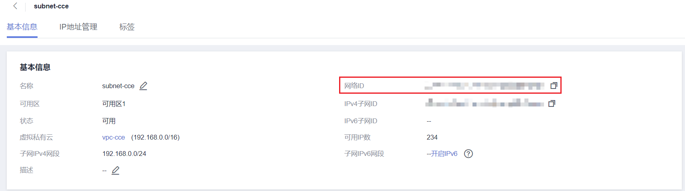

# 创建VPC和子网

## 背景信息

在创建集群之前，您需要创建虚拟私有云（VPC），为CCE服务提供一个安全、隔离的网络环境。

如果用户已有VPC，可重复使用，不需多次创建。

## 创建VPC

1.  登录管理控制台，选择“网络 \> 虚拟私有云 VPC“。
2.  在虚拟私有云控制台，单击右上角的“创建虚拟私有云“，按照提示完成创建。
3.  创建完成后返回虚拟私有云列表，单击创建的VPC名称，在详情页获取VPC的ID，后续[创建集群](创建集群.md)时需要使用。

    **图 1**  获取VPC的ID  
    

## 创建子网

1.  登录管理控制台，选择“网络 \> 虚拟私有云 VPC“。
2.  在“虚拟私有云“列表页面，单击左侧导航栏中“虚拟私有云 \> 子网”，单击右上角“创建子网“。
3.  按照页面提示完成子网创建，并单击子网的名称，获取子网的“网络ID“，后续[创建集群](创建集群.md)时需要使用。

    **图 2**  获取子网的网络ID  
    

