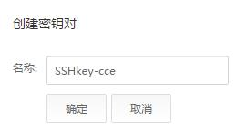

# 创建密钥对

## 背景信息

在创建集群之前，您需要创建密钥对，用于登录工作节点时的身份验证。

如果用户已有密钥对，可重复使用，不需多次创建。

## 操作步骤

1.  登录管理控制台，选择“计算  \>  弹性云服务器“。
2.  在左侧导航树中，选择“密钥对“。
3.  单击“创建密钥对“。

    **图 1**  创建密钥对  
    

4.  输入密钥对名称后，单击“确定”。

    名称只能由英文字母，数字，下划线，中划线组成，且长度小于等于64个字符。

5.  在弹出的对话框中，单击“确定“。

    系统生成密钥文件，自动保存在系统默认目录下。

