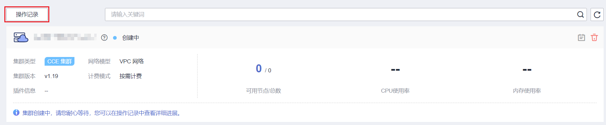

# 如何获取接口URI中参数

## project\_id

project\_id即项目ID，可以通过控制台或API接口获取，具体请参见[获取项目ID](获取项目ID.md)。

## cluster\_id

1.  登录CCE控制台，在左侧导航栏中选择“集群管理”。
2.  单击所创建集群的名称，进入集群详情页面，获取集群ID。

    **图 1**  获取cluster\_id  
    

## node\_id

1.  登录CCE控制台，在左侧导航栏中选择“集群管理”。
2.  单击所创建集群的名称，并在左侧选择“节点管理”，单击对应节点的名称，进入节点详情页面，获取节点ID。

    **图 2**  获取node\_id  
    

## job\_id

1.  登录CCE控制台，在左侧导航栏中选择“集群管理”。此处以集群管理为例，获取正在创建中的集群job\_id。

    **图 3**  创建集群  
    

2.  获取job\_id。

    1.  以Chrome浏览器为例，F12打开浏览器Console，单击“Network”。
    2.  单击CCE控制台中的“操作记录”，查看集群操作记录详情。
    3.  在浏览器Console的“Filter”栏里输入“jobs”，过滤出jobs列表，单击该名称并选择“Preview”页签，在左侧列表选择本次操作对应的job，其中uid字段即为job的uid。

    **图 4**  获取job\_id  
    

