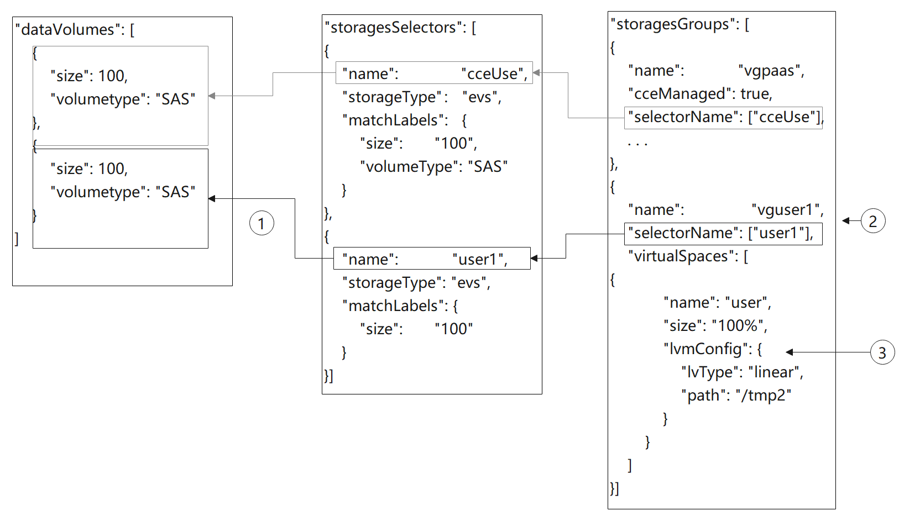

# 节点磁盘挂载<a name="node_storage_example"></a>

## 应用现状<a name="section25471155411"></a>

在自规划磁盘、创建条带逻辑盘等使用场景下，如何在创建节点时，灵活的挂载和划分磁盘成为一个问题。

## 解决方案<a name="section134801851229"></a>

本文对节点创建中storage字段进行详细的解释说明，方便用户通过创建节点API实现较为复杂的磁盘选择与功能划分。

storage字段由storageSelectors和storageGroups组成：storageSelectors字段负责选盘逻辑，storageGroups字段负责磁盘处理逻辑。

字段匹配基础逻辑如下：


1.  storageSelectors根据storageType字段选择evs云盘或是local本地盘。
    1.  local本地盘无精确匹配模式，将全选所有本地盘作为数据盘。

        若需保留部分本地盘，请在安装前启动脚本中将磁盘占用。类似如下脚本。

        ```
        # prepare
        vgName=vg-test
        storageDevice=/dev/vdb
        # vgcreate
        vgcreate ${vgName} ${storageDevice}
        ```

    2.  evs云盘通过matchLabels字段去模糊匹配dataVolumes字段中创建的云盘。

2.  matchLabels的匹配存在优先级，storageSelectors中靠前的策略优先匹配，dataVolumes中靠前的云盘也优先被选择。由于matchLabels采用宽匹配策略，因此建议将匹配范围小的匹配策略前置。例如：

    

    1.  1中匹配大小为100G，存储类型为SAS的evs盘，匹配到dataVolumes中的第一块盘；2中匹配大小为100G的evs盘，由于第一块盘已被选择，因此匹配到第二块盘；
    2.  3中匹配大小为100G的evs盘，由于未填写volumeType或count，因此能匹配到dataVolumes中的两块盘，导致4中无可用磁盘匹配。

3.  storageGroups根据selectorName与storageSelectors做关联。最终选择到两块100G的盘。CCE后端将这两块物理卷（PV）组成一个卷组（VG），并以9：1的比例划分两个逻辑卷（LV）。其中10%的kubernetes逻辑卷以条带（striped）方式进行划分。90%的runtime逻辑卷由于未配置runtimeConfig，采用默认的线性方式进行划分。

## 创建裸盘<a name="section22804228617"></a>

在控制台，单击新增数据盘后，在高级配置中默认，则创建磁盘为裸盘。


使用API调用则可以按如下配置。


1.  cceUse selector匹配到一块100G 数据盘。
2.  所选磁盘被cce管理用作数据盘。
3.  dataVolumes中创建的另一块100G 数据盘未被任何selector选中并被group管理。因此此块云盘作为裸盘挂载至节点，不做初始化。

创建后登录节点查看，可以发现有一块100G的盘已经挂载但没有被初始化。


API示例如下：

```
{
	"kind": "Node",
	"apiVersion": "v3",
	"metadata": {
		"name": "test-83790"
	},
	"spec": {
		"flavor": "c3.large.2",
		"az": "cn-north-4b",
		"os": "EulerOS 2.9",
		"dataVolumes": [
			{
				"size": 100,
				"volumetype": "SAS"
			},
			{
				"size": 100,
				"volumetype": "SAS"
			}
		],
		"billingMode": 0,
		"extendParam": {
			"maxPods": 110
		},
		"nodeNicSpec": {
			"primaryNic": {
				"subnetId": "ca964acf-8468-4735-8229-97940ef6c881"
			}
		},
		"rootVolume": {
			"size": 50,
			"volumetype": "SAS"
		},
		"runtime": {
			"name": "docker"
		},
		"login": {
			"userPassword": {
				"username": "root",
				"password": "JDYkbzhEbE90ckIkY1c0SWJzRy9WeVIzcDFVbC41NFVqa1pxenE0bW9naERlS2RCWEIyWlhqSlpWSjJrL2NmcmdWeE12NGh4T25DeDhlMTdrREVSM2dicHdZNmYzZXh5dy4="
			}
		},
		"storage": {
			"storageSelectors": [
				{
					"name": "cceUse",
					"storageType": "evs",
					"matchLabels": {
						"size": "100",
						"volumeType": "SAS",
						"count": "1"
					}
				}
			],
			"storageGroups": [
				{
					"name": "vgpaas",
					"selectorNames": [
						"cceUse"
					],
					"cceManaged": true,
					"virtualSpaces": [
						{
							"name": "runtime",
							"size": "90%"
						},
						{
							"name": "kubernetes",
							"size": "10%"
						}
					]
				}
			]
		},
		"count": 1
	}
}
```

## 挂载用户磁盘至指定路径<a name="section1112811362118"></a>

在控制台，单击新增数据盘后，在高级配置中选择挂载到指定目录，填写指定的磁盘挂载目录，则由CCE实现该磁盘的默认初始化及挂载。


使用API调用则可以按如下配置。



1.  storageSelectors中的user1选中一块100G的数据盘。
2.  通过LVM管理，创建一个名为vguser1的卷组（VG）。
3.  将全部的vguser1空间划分成名叫user的逻辑卷（LV）。并以ext4的文件格式格式化磁盘。最后挂载到/tmp2的目录下。

创建后登录节点查看，可以发现有一块100G的盘已经挂载且被LVM管理。


API示例如下，有两块数据盘，其中一块给CCE使用，另一块挂载到/tmp2目录下。

```
{
	"kind": "Node",
	"apiVersion": "v3",
	"metadata": {
		"name": "test-37106"
	},
	"spec": {
		"flavor": "c3.large.2",
		"az": "cn-north-4b",
		"os": "EulerOS 2.9",
		"dataVolumes": [
			{
				"size": 100,
				"volumetype": "SAS"
			},
			{
				"size": 100,
				"volumetype": "SAS"
			}
		],
		"billingMode": 0,
		"extendParam": {
			"maxPods": 110
		},
		"nodeNicSpec": {
			"primaryNic": {
				"subnetId": "ca964acf-8468-4735-8229-97940ef6c881"
			}
		},
		"rootVolume": {
			"size": 50,
			"volumetype": "SAS"
		},
		"runtime": {
			"name": "docker"
		},
		"login": {
			"userPassword": {
				"username": "root",
				"password": "JDYkRmJPckIwRkMkR3RXTkFsNmYvNlAxSDdOTUhYSHZmWjQ0b0ttODRzTDk0L1NzMzRIaHBsQVJkRTZiOGI0WTVJbUtSLlF5aTAuTUpwbGZqdHBTdkYxOU9peGZPV2FUYi4="
			}
		},
		"storage": {
			"storageSelectors": [
				{
					"name": "cceUse",
					"storageType": "evs",
					"matchLabels": {
						"size": "100",
						"volumeType": "SAS",
						"count": "1"
					}
				},
				{
					"name": "user1",
					"storageType": "evs",
					"matchLabels": {
						"size": "100",
						"volumeType": "SAS",
						"count": "1"
					}
				}
			],
			"storageGroups": [
				{
					"name": "vgpaas",
					"selectorNames": [
						"cceUse"
					],
					"cceManaged": true,
					"virtualSpaces": [
						{
							"name": "runtime",
							"size": "80%"
						},
						{
							"name": "kubernetes",
							"size": "20%"
						}
					]
				},
				{
					"name": "vguser1",
					"selectorNames": [
						"user1"
					],
					"virtualSpaces": [
						{
							"name": "user",
							"size": "100%",
							"lvmConfig": {
								"lvType": "linear",
								"path": "/tmp2"
							}
						}
					]
				}
			]
		},
		"count": 1
	}
}
```

## 创建条带化逻辑卷，提升磁盘性能<a name="section163256264156"></a>

条带化逻辑卷功能当前仅只支持调用API创建，示例如下。


1.  storageSelectors中matchLables为空，则全选evs盘。
2.  通过LVM管理，创建一个名为vgpaas的卷组（VG）。
3.  将90%的vgpaas空间以条带的方式划分成runtime逻辑卷。
4.  将10%的vgpaas空间以条带的方式划分成kubernetes逻辑卷。

> **说明：** 
>-   需要两块及以上数据盘才能条带化。
>-   创建条带化逻辑卷（LV）时，加入卷组（VG）的物理卷（PV）的类型与大小应尽量保持一致，以免条带化创建失败。

创建后登录节点，使用如下命令可以查看到条带化结果。


API示例如下：

```
{
    "kind": "Node",
    "apiVersion": "v3",
    "metadata": {
        "name": "test-83773"
    },
    "spec": {
        "flavor": "c3.large.2",
        "az": "cn-north-4b",
        "os": "EulerOS 2.9",
        "dataVolumes": [
            {
                "size": 100,
                "volumetype": "SAS"
            },
            {
                "size": 100,
                "volumetype": "SAS"
            }
        ],
        "billingMode": 0,
        "extendParam": {
            "maxPods": 110
        },
        "nodeNicSpec": {
            "primaryNic": {
                "subnetId": "ca964acf-8468-4735-8229-97940ef6c881"
            }
        },
        "rootVolume": {
            "size": 50,
            "volumetype": "SAS"
        },
        "runtime": {
            "name": "docker"
        },
        "login": {
            "userPassword": {
                "username": "root",
                "password": "JDYkbzhEbE90ckIkY1c0SWJzRy9WeVIzcDFVbC41NFVqa1pxenE0bW9naERlS2RCWEIyWlhqSlpWSjJrL2NmcmdWeE12NGh4T25DeDhlMTdrREVSM2dicHdZNmYzZXh5dy4="
            }
        },
        "storage": {
            "storageSelectors": [
                {
                    "name": "cceUse",
                    "storageType": "evs"
                }
            ],
            "storageGroups": [
                {
                    "name": "vgpaas",
                    "selectorNames": [
                        "cceUse"
                    ],
                    "cceManaged": true,
                    "virtualSpaces": [
                        {
                            "name": "runtime",
                            "size": "90%",
                            "runtimeConfig": {
                                "lvType": "striped"
                            }
                        },
                        {
                            "name": "kubernetes",
                            "size": "10%",
                            "lvmConfig": {
                                "lvType": "striped"
                            }
                        }
                    ]
                }
            ]
        },
        "count": 1
    }
}
```

