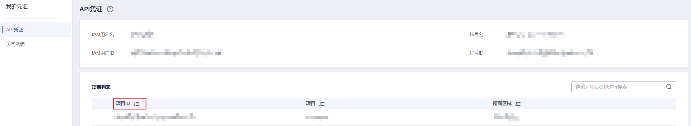

# 获取项目ID<a name="cce_02_0341"></a>

## 操作场景<a name="zh-cn_topic_0121673684_section136545262478"></a>

在调用接口的时候，部分URL中需要填入项目ID，所以需要获取到项目ID。有如下两种获取方式：

-   [调用API获取项目ID](#zh-cn_topic_0121673684_section86806471133)
-   [从控制台获取项目ID](#zh-cn_topic_0121673684_section11508201712212)

## 调用API获取项目ID<a name="zh-cn_topic_0121673684_section86806471133"></a>

项目ID可以通过调用[查询指定条件下的项目列表](https://support.huaweicloud.com/api-iam/iam_06_0001.html)API获取。

获取项目ID的接口为“GET https://\{Endpoint\}/v3/projects”，其中\{Endpoint\}为IAM的终端节点，可以从[地区和终端节点](https://developer.huaweicloud.com/endpoint)获取。接口的认证鉴权请参见[认证鉴权](认证鉴权.md)。

响应示例如下，其中projects下的“id”即为项目ID。

```
{
    "projects": [
        {
            "domain_id": "65382450e8f64ac0870cd180d14e684b",
            "is_domain": false,
            "parent_id": "65382450e8f64ac0870cd180d14e684b",
            "name": "project_name",
            "description": "",
            "links": {
                "next": null,
                "previous": null,
                "self": "https://www.example.com/v3/projects/a4a5d4098fb4474fa22cd05f897d6b99"
            },
            "id": "a4a5d4098fb4474fa22cd05f897d6b99",
            "enabled": true
        }
    ],
    "links": {
        "next": null,
        "previous": null,
        "self": "https://www.example.com/v3/projects"
    }
}
```

## 从控制台获取项目ID<a name="zh-cn_topic_0121673684_section11508201712212"></a>

从控制台获取项目ID的步骤如下：

1.  登录管理控制台。
2.  鼠标悬停在右上角的用户名，选择下拉列表中的“我的凭证”。

    在“API凭证”页面的项目列表中查看项目ID。


**图 1**  查看项目ID<a name="zh-cn_topic_0121673684_fig153321731184811"></a>  


