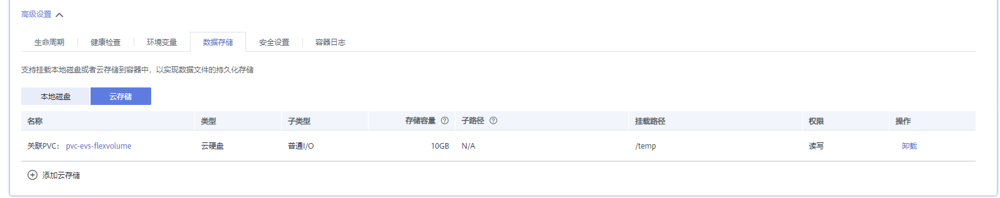
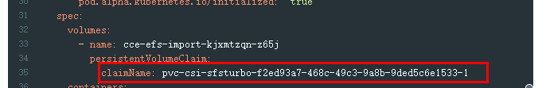

# 1.15集群如何从Flexvolume存储类型迁移到CSI Everest存储类型<a name="cce_01_0343"></a>

在v1.15.11-r1之后版本的集群中，CSI Everest插件已接管fuxi Flexvolume（即storage-driver插件）容器存储的所有功能，建议将对fuxi Flexvolume的使用切换CSI Everest上。

迁移的主要原理是通过创建静态PV的形式关联原有底层存储，并创建新的PVC关联该新建的静态PV，之后应用升级挂载这个新的PVC到原有挂载路径，实现存储卷迁移。

> **警告：** 
>迁移时会造成服务断服，请合理规划迁移时间，并做好相关备份。

## 操作步骤<a name="zh-cn_topic_0285037038_section1914417445277"></a>

1.  数据备份（可选，主要防止异常情况下数据丢失）。
2.  <a name="zh-cn_topic_0285037038_li1219802032512"></a>根据FlexVolume格式的PV，准备CSI格式的PV的yaml文件关联已有存储。

    执行如下命令，配置名为“pv-example.yaml”的创建PV的yaml文件。

    **touch pv-example.yaml**

    **vi pv-example.yaml**

    **云硬盘存储卷PV**的配置示例如下：

    ```
    apiVersion: v1
    kind: PersistentVolume
    metadata:
      labels:
        failure-domain.beta.kubernetes.io/region: cn-north-4
        failure-domain.beta.kubernetes.io/zone: <zone name>
      annotations:
        pv.kubernetes.io/provisioned-by: everest-csi-provisioner
      name: pv-evs-example
    spec:
      accessModes:
      - ReadWriteOnce
      capacity:
        storage: 10Gi
      csi:
        driver: disk.csi.everest.io
        fsType: ext4
        volumeAttributes:
          everest.io/disk-mode: SCSI
          everest.io/disk-volume-type: SAS
          storage.kubernetes.io/csiProvisionerIdentity: everest-csi-provisioner
        volumeHandle: 0992dbda-6340-470e-a74e-4f0db288ed82
      persistentVolumeReclaimPolicy: Delete
      storageClassName: csi-disk
    ```

    加粗标红字段需要重点关注，其中参数说明如下：

    **表 1**  云硬盘存储卷PV配置参数说明

    <a name="zh-cn_topic_0285037038_table1819001615355"></a>
    <table><thead align="left"><tr id="zh-cn_topic_0285037038_row1519121663519"><th class="cellrowborder" valign="top" width="26.1%" id="mcps1.2.3.1.1"><p id="zh-cn_topic_0285037038_p18191161619356"><a name="zh-cn_topic_0285037038_p18191161619356"></a><a name="zh-cn_topic_0285037038_p18191161619356"></a>参数</p>
    </th>
    <th class="cellrowborder" valign="top" width="73.9%" id="mcps1.2.3.1.2"><p id="zh-cn_topic_0285037038_p1919116161353"><a name="zh-cn_topic_0285037038_p1919116161353"></a><a name="zh-cn_topic_0285037038_p1919116161353"></a>描述</p>
    </th>
    </tr>
    </thead>
    <tbody><tr id="zh-cn_topic_0285037038_row2318123021219"><td class="cellrowborder" valign="top" width="26.1%" headers="mcps1.2.3.1.1 "><p id="zh-cn_topic_0285037038_p1995180962"><a name="zh-cn_topic_0285037038_p1995180962"></a><a name="zh-cn_topic_0285037038_p1995180962"></a>failure-domain.beta.kubernetes.io/region</p>
    </td>
    <td class="cellrowborder" valign="top" width="73.9%" headers="mcps1.2.3.1.2 "><p id="zh-cn_topic_0285037038_p1861300612"><a name="zh-cn_topic_0285037038_p1861300612"></a><a name="zh-cn_topic_0285037038_p1861300612"></a>云硬盘所在region，可参考FlexVolume PV的相同字段。</p>
    </td>
    </tr>
    <tr id="zh-cn_topic_0285037038_row163191830121220"><td class="cellrowborder" valign="top" width="26.1%" headers="mcps1.2.3.1.1 "><p id="zh-cn_topic_0285037038_p168517016619"><a name="zh-cn_topic_0285037038_p168517016619"></a><a name="zh-cn_topic_0285037038_p168517016619"></a>failure-domain.beta.kubernetes.io/zone</p>
    </td>
    <td class="cellrowborder" valign="top" width="73.9%" headers="mcps1.2.3.1.2 "><p id="zh-cn_topic_0285037038_p12892459355"><a name="zh-cn_topic_0285037038_p12892459355"></a><a name="zh-cn_topic_0285037038_p12892459355"></a>云硬盘所在可用区，可参考FlexVolume PV的相同字段。</p>
    </td>
    </tr>
    <tr id="zh-cn_topic_0285037038_row9653154613512"><td class="cellrowborder" valign="top" width="26.1%" headers="mcps1.2.3.1.1 "><p id="zh-cn_topic_0285037038_p166542461356"><a name="zh-cn_topic_0285037038_p166542461356"></a><a name="zh-cn_topic_0285037038_p166542461356"></a>name</p>
    </td>
    <td class="cellrowborder" valign="top" width="73.9%" headers="mcps1.2.3.1.2 "><p id="zh-cn_topic_0285037038_p126541746357"><a name="zh-cn_topic_0285037038_p126541746357"></a><a name="zh-cn_topic_0285037038_p126541746357"></a>PV资源的名称，集群下唯一。</p>
    </td>
    </tr>
    <tr id="zh-cn_topic_0285037038_row36542464516"><td class="cellrowborder" valign="top" width="26.1%" headers="mcps1.2.3.1.1 "><p id="zh-cn_topic_0285037038_p2065516461655"><a name="zh-cn_topic_0285037038_p2065516461655"></a><a name="zh-cn_topic_0285037038_p2065516461655"></a>storage</p>
    </td>
    <td class="cellrowborder" valign="top" width="73.9%" headers="mcps1.2.3.1.2 "><p id="zh-cn_topic_0285037038_p1065544610519"><a name="zh-cn_topic_0285037038_p1065544610519"></a><a name="zh-cn_topic_0285037038_p1065544610519"></a>云硬盘的容量，单位为Gi。可参考FlexVolume PV的spec.capacity.storage。</p>
    </td>
    </tr>
    <tr id="zh-cn_topic_0285037038_row95681351352"><td class="cellrowborder" valign="top" width="26.1%" headers="mcps1.2.3.1.1 "><p id="zh-cn_topic_0285037038_p115681951655"><a name="zh-cn_topic_0285037038_p115681951655"></a><a name="zh-cn_topic_0285037038_p115681951655"></a>driver</p>
    </td>
    <td class="cellrowborder" valign="top" width="73.9%" headers="mcps1.2.3.1.2 "><p id="zh-cn_topic_0285037038_p556912511555"><a name="zh-cn_topic_0285037038_p556912511555"></a><a name="zh-cn_topic_0285037038_p556912511555"></a>挂载依赖的存储驱动，EVS云硬盘配置为“disk.csi.everest.io”。</p>
    </td>
    </tr>
    <tr id="zh-cn_topic_0285037038_row856925110517"><td class="cellrowborder" valign="top" width="26.1%" headers="mcps1.2.3.1.1 "><p id="zh-cn_topic_0285037038_p1756925110517"><a name="zh-cn_topic_0285037038_p1756925110517"></a><a name="zh-cn_topic_0285037038_p1756925110517"></a>volumeHandle</p>
    </td>
    <td class="cellrowborder" valign="top" width="73.9%" headers="mcps1.2.3.1.2 "><p id="zh-cn_topic_0285037038_p11569175120514"><a name="zh-cn_topic_0285037038_p11569175120514"></a><a name="zh-cn_topic_0285037038_p11569175120514"></a>云硬盘的volumeID，可参考FlexVolume PV的spec.flexVolume.options.volumeID。</p>
    </td>
    </tr>
    <tr id="zh-cn_topic_0285037038_row19351157557"><td class="cellrowborder" valign="top" width="26.1%" headers="mcps1.2.3.1.1 "><p id="zh-cn_topic_0285037038_p183510571550"><a name="zh-cn_topic_0285037038_p183510571550"></a><a name="zh-cn_topic_0285037038_p183510571550"></a>everest.io/disk-mode</p>
    </td>
    <td class="cellrowborder" valign="top" width="73.9%" headers="mcps1.2.3.1.2 "><p id="zh-cn_topic_0285037038_p163511571556"><a name="zh-cn_topic_0285037038_p163511571556"></a><a name="zh-cn_topic_0285037038_p163511571556"></a>云硬盘磁盘模式，可参考FlexVolume PV的spec.flexVolume.options.disk-mode。</p>
    </td>
    </tr>
    <tr id="zh-cn_topic_0285037038_row15352571556"><td class="cellrowborder" valign="top" width="26.1%" headers="mcps1.2.3.1.1 "><p id="zh-cn_topic_0285037038_p3357571053"><a name="zh-cn_topic_0285037038_p3357571053"></a><a name="zh-cn_topic_0285037038_p3357571053"></a>everest.io/disk-volume-type</p>
    </td>
    <td class="cellrowborder" valign="top" width="73.9%" headers="mcps1.2.3.1.2 "><p id="zh-cn_topic_0285037038_p1936105718517"><a name="zh-cn_topic_0285037038_p1936105718517"></a><a name="zh-cn_topic_0285037038_p1936105718517"></a>云硬盘类型，当前支持高I/O（SAS）、超高I/O（SSD）。可参考FlexVolume PV的spec.storageClassName对应的sc中的parameters."kubernetes.io/volumetype"。</p>
    </td>
    </tr>
    <tr id="zh-cn_topic_0285037038_row153610571511"><td class="cellrowborder" valign="top" width="26.1%" headers="mcps1.2.3.1.1 "><p id="zh-cn_topic_0285037038_p03614576517"><a name="zh-cn_topic_0285037038_p03614576517"></a><a name="zh-cn_topic_0285037038_p03614576517"></a>storageClassName</p>
    </td>
    <td class="cellrowborder" valign="top" width="73.9%" headers="mcps1.2.3.1.2 "><p id="zh-cn_topic_0285037038_p1436557154"><a name="zh-cn_topic_0285037038_p1436557154"></a><a name="zh-cn_topic_0285037038_p1436557154"></a>存储卷动态供应关联的K8s storage class名称；云硬盘需使用“csi-disk”。</p>
    </td>
    </tr>
    </tbody>
    </table>

    **文件存储卷PV**配置示例如下：

    ```
    apiVersion: v1
    kind: PersistentVolume
    metadata:
      name: pv-sfs-example
      annotations:
        pv.kubernetes.io/provisioned-by: everest-csi-provisioner
    spec:
      accessModes:
      - ReadWriteMany
      capacity:
        storage: 10Gi
      csi:
        driver: nas.csi.everest.io
        fsType: nfs
        volumeAttributes:
          everest.io/share-export-location: sfs-nas01.cn-south-1.myhuaweicloud.com:/share-436304e8 
          storage.kubernetes.io/csiProvisionerIdentity: everest-csi-provisioner
        volumeHandle: 682f00bb-ace0-41d8-9b3e-913c9aa6b695
      persistentVolumeReclaimPolicy: Delete
      storageClassName: csi-nas
    ```

    加粗标红字段需要重点关注，其中参数说明如下：

    **表 2**  文件存储卷PV配置参数说明

    <a name="zh-cn_topic_0285037038_table10859183316916"></a>
    <table><thead align="left"><tr id="zh-cn_topic_0285037038_row38591633994"><th class="cellrowborder" valign="top" width="26.1%" id="mcps1.2.3.1.1"><p id="zh-cn_topic_0285037038_p1385913337917"><a name="zh-cn_topic_0285037038_p1385913337917"></a><a name="zh-cn_topic_0285037038_p1385913337917"></a>参数</p>
    </th>
    <th class="cellrowborder" valign="top" width="73.9%" id="mcps1.2.3.1.2"><p id="zh-cn_topic_0285037038_p3859733090"><a name="zh-cn_topic_0285037038_p3859733090"></a><a name="zh-cn_topic_0285037038_p3859733090"></a>描述</p>
    </th>
    </tr>
    </thead>
    <tbody><tr id="zh-cn_topic_0285037038_row88591233395"><td class="cellrowborder" valign="top" width="26.1%" headers="mcps1.2.3.1.1 "><p id="zh-cn_topic_0285037038_p108591533693"><a name="zh-cn_topic_0285037038_p108591533693"></a><a name="zh-cn_topic_0285037038_p108591533693"></a>name</p>
    </td>
    <td class="cellrowborder" valign="top" width="73.9%" headers="mcps1.2.3.1.2 "><p id="zh-cn_topic_0285037038_p148592335912"><a name="zh-cn_topic_0285037038_p148592335912"></a><a name="zh-cn_topic_0285037038_p148592335912"></a>PV资源的名称，集群下唯一。</p>
    </td>
    </tr>
    <tr id="zh-cn_topic_0285037038_row158595338918"><td class="cellrowborder" valign="top" width="26.1%" headers="mcps1.2.3.1.1 "><p id="zh-cn_topic_0285037038_p785919331096"><a name="zh-cn_topic_0285037038_p785919331096"></a><a name="zh-cn_topic_0285037038_p785919331096"></a>storage</p>
    </td>
    <td class="cellrowborder" valign="top" width="73.9%" headers="mcps1.2.3.1.2 "><p id="zh-cn_topic_0285037038_p186003319918"><a name="zh-cn_topic_0285037038_p186003319918"></a><a name="zh-cn_topic_0285037038_p186003319918"></a>文件存储的大小，单位为Gi。可参考FlexVolume PV的spec.capacity.storage。</p>
    </td>
    </tr>
    <tr id="zh-cn_topic_0285037038_row48607331494"><td class="cellrowborder" valign="top" width="26.1%" headers="mcps1.2.3.1.1 "><p id="zh-cn_topic_0285037038_p1686014331913"><a name="zh-cn_topic_0285037038_p1686014331913"></a><a name="zh-cn_topic_0285037038_p1686014331913"></a>driver</p>
    </td>
    <td class="cellrowborder" valign="top" width="73.9%" headers="mcps1.2.3.1.2 "><p id="zh-cn_topic_0285037038_p3860173312917"><a name="zh-cn_topic_0285037038_p3860173312917"></a><a name="zh-cn_topic_0285037038_p3860173312917"></a>挂载依赖的存储驱动，文件存储配置为“nas.csi.everest.io”。</p>
    </td>
    </tr>
    <tr id="zh-cn_topic_0285037038_row6808112520114"><td class="cellrowborder" valign="top" width="26.1%" headers="mcps1.2.3.1.1 "><p id="zh-cn_topic_0285037038_p17809172511117"><a name="zh-cn_topic_0285037038_p17809172511117"></a><a name="zh-cn_topic_0285037038_p17809172511117"></a>everest.io/share-export-location</p>
    </td>
    <td class="cellrowborder" valign="top" width="73.9%" headers="mcps1.2.3.1.2 "><p id="zh-cn_topic_0285037038_p780919259115"><a name="zh-cn_topic_0285037038_p780919259115"></a><a name="zh-cn_topic_0285037038_p780919259115"></a>文件存储的共享路径。可参考FlexVolume PV的spec.flexVolume.options.deviceMountPath。</p>
    </td>
    </tr>
    <tr id="zh-cn_topic_0285037038_row78601833094"><td class="cellrowborder" valign="top" width="26.1%" headers="mcps1.2.3.1.1 "><p id="zh-cn_topic_0285037038_p18601933393"><a name="zh-cn_topic_0285037038_p18601933393"></a><a name="zh-cn_topic_0285037038_p18601933393"></a>volumeHandle</p>
    </td>
    <td class="cellrowborder" valign="top" width="73.9%" headers="mcps1.2.3.1.2 "><p id="zh-cn_topic_0285037038_p148602331397"><a name="zh-cn_topic_0285037038_p148602331397"></a><a name="zh-cn_topic_0285037038_p148602331397"></a>文件存储的ID。可参考FlexVolume PV的spec.flexVolume.options.volumeID。</p>
    </td>
    </tr>
    <tr id="zh-cn_topic_0285037038_row5860143317914"><td class="cellrowborder" valign="top" width="26.1%" headers="mcps1.2.3.1.1 "><p id="zh-cn_topic_0285037038_p178608331994"><a name="zh-cn_topic_0285037038_p178608331994"></a><a name="zh-cn_topic_0285037038_p178608331994"></a>storageClassName</p>
    </td>
    <td class="cellrowborder" valign="top" width="73.9%" headers="mcps1.2.3.1.2 "><p id="zh-cn_topic_0285037038_p1786013338917"><a name="zh-cn_topic_0285037038_p1786013338917"></a><a name="zh-cn_topic_0285037038_p1786013338917"></a>K8s storage class名称；需配置为"csi-nas"。</p>
    </td>
    </tr>
    </tbody>
    </table>

    **对象存储卷PV**配置示例如下：

    ```
    apiVersion: v1
    kind: PersistentVolume
    metadata:
      name: pv-obs-example
      annotations:
        pv.kubernetes.io/provisioned-by: everest-csi-provisioner
    spec:
      accessModes:
      - ReadWriteMany
      capacity:
        storage: 1Gi
      csi:
        driver: obs.csi.everest.io
        fsType: s3fs
        volumeAttributes:
          everest.io/obs-volume-type: STANDARD
          everest.io/region: cn-north-4
          storage.kubernetes.io/csiProvisionerIdentity: everest-csi-provisioner
        volumeHandle: obs-normal-static-pv
      persistentVolumeReclaimPolicy: Delete
      storageClassName: csi-obs
    ```

    加粗标红字段需要重点关注，其中参数说明如下：

    **表 3**  对象存储卷PV配置参数说明

    <a name="zh-cn_topic_0285037038_table147634352126"></a>
    <table><thead align="left"><tr id="zh-cn_topic_0285037038_row1376383591219"><th class="cellrowborder" valign="top" width="26.1%" id="mcps1.2.3.1.1"><p id="zh-cn_topic_0285037038_p187631357122"><a name="zh-cn_topic_0285037038_p187631357122"></a><a name="zh-cn_topic_0285037038_p187631357122"></a>参数</p>
    </th>
    <th class="cellrowborder" valign="top" width="73.9%" id="mcps1.2.3.1.2"><p id="zh-cn_topic_0285037038_p147631357126"><a name="zh-cn_topic_0285037038_p147631357126"></a><a name="zh-cn_topic_0285037038_p147631357126"></a>描述</p>
    </th>
    </tr>
    </thead>
    <tbody><tr id="zh-cn_topic_0285037038_row20763935101212"><td class="cellrowborder" valign="top" width="26.1%" headers="mcps1.2.3.1.1 "><p id="zh-cn_topic_0285037038_p10763335141218"><a name="zh-cn_topic_0285037038_p10763335141218"></a><a name="zh-cn_topic_0285037038_p10763335141218"></a>name</p>
    </td>
    <td class="cellrowborder" valign="top" width="73.9%" headers="mcps1.2.3.1.2 "><p id="zh-cn_topic_0285037038_p1876313352123"><a name="zh-cn_topic_0285037038_p1876313352123"></a><a name="zh-cn_topic_0285037038_p1876313352123"></a>PV资源的名称，集群下唯一。</p>
    </td>
    </tr>
    <tr id="zh-cn_topic_0285037038_row2763183511126"><td class="cellrowborder" valign="top" width="26.1%" headers="mcps1.2.3.1.1 "><p id="zh-cn_topic_0285037038_p12763143541213"><a name="zh-cn_topic_0285037038_p12763143541213"></a><a name="zh-cn_topic_0285037038_p12763143541213"></a>storage</p>
    </td>
    <td class="cellrowborder" valign="top" width="73.9%" headers="mcps1.2.3.1.2 "><p id="zh-cn_topic_0285037038_p10763143561217"><a name="zh-cn_topic_0285037038_p10763143561217"></a><a name="zh-cn_topic_0285037038_p10763143561217"></a>存储容量，单位为Gi。此处配置为固定值1Gi。</p>
    </td>
    </tr>
    <tr id="zh-cn_topic_0285037038_row17763635161217"><td class="cellrowborder" valign="top" width="26.1%" headers="mcps1.2.3.1.1 "><p id="zh-cn_topic_0285037038_p12763143516123"><a name="zh-cn_topic_0285037038_p12763143516123"></a><a name="zh-cn_topic_0285037038_p12763143516123"></a>driver</p>
    </td>
    <td class="cellrowborder" valign="top" width="73.9%" headers="mcps1.2.3.1.2 "><p id="zh-cn_topic_0285037038_p476403511217"><a name="zh-cn_topic_0285037038_p476403511217"></a><a name="zh-cn_topic_0285037038_p476403511217"></a>挂载依赖的存储驱动，对象存储配置为“obs.csi.everest.io”。</p>
    </td>
    </tr>
    <tr id="zh-cn_topic_0285037038_row87641035151214"><td class="cellrowborder" valign="top" width="26.1%" headers="mcps1.2.3.1.1 "><p id="zh-cn_topic_0285037038_p2764133531218"><a name="zh-cn_topic_0285037038_p2764133531218"></a><a name="zh-cn_topic_0285037038_p2764133531218"></a>fsType</p>
    </td>
    <td class="cellrowborder" valign="top" width="73.9%" headers="mcps1.2.3.1.2 "><p id="zh-cn_topic_0285037038_p1764163514127"><a name="zh-cn_topic_0285037038_p1764163514127"></a><a name="zh-cn_topic_0285037038_p1764163514127"></a>文件类型，支持“obsfs”与“s3fs”，取值为s3fs时创建是obs对象桶，配套使用s3fs挂载；取值为obsfs时创建的是obs并行文件系统，配套使用obsfs挂载。可参考FlexVolume PV的spec.flexVolume.options.posix的对应关系：true（obsfs）、false/空值（s3fs）。</p>
    </td>
    </tr>
    <tr id="zh-cn_topic_0285037038_row671295211146"><td class="cellrowborder" valign="top" width="26.1%" headers="mcps1.2.3.1.1 "><p id="zh-cn_topic_0285037038_p671313522145"><a name="zh-cn_topic_0285037038_p671313522145"></a><a name="zh-cn_topic_0285037038_p671313522145"></a>everest.io/obs-volume-type</p>
    </td>
    <td class="cellrowborder" valign="top" width="73.9%" headers="mcps1.2.3.1.2 "><p id="zh-cn_topic_0285037038_p9713452161412"><a name="zh-cn_topic_0285037038_p9713452161412"></a><a name="zh-cn_topic_0285037038_p9713452161412"></a>存储类型，包括STANDARD（标准桶）、WARM（低频访问桶）。可参考FlexVolume PV的spec.flexVolume.options.<span>storage_class</span>的对应关系：<span>standard（标准桶）、standard_ia（低频访问桶）</span>。</p>
    </td>
    </tr>
    <tr id="zh-cn_topic_0285037038_row1929744911413"><td class="cellrowborder" valign="top" width="26.1%" headers="mcps1.2.3.1.1 "><p id="zh-cn_topic_0285037038_p7298164941418"><a name="zh-cn_topic_0285037038_p7298164941418"></a><a name="zh-cn_topic_0285037038_p7298164941418"></a>everest.io/region</p>
    </td>
    <td class="cellrowborder" valign="top" width="73.9%" headers="mcps1.2.3.1.2 "><p id="zh-cn_topic_0285037038_p1429844971411"><a name="zh-cn_topic_0285037038_p1429844971411"></a><a name="zh-cn_topic_0285037038_p1429844971411"></a>对象存储所在的region。可参考FlexVolume PV的spec.flexVolume.options.region。</p>
    </td>
    </tr>
    <tr id="zh-cn_topic_0285037038_row19764935181217"><td class="cellrowborder" valign="top" width="26.1%" headers="mcps1.2.3.1.1 "><p id="zh-cn_topic_0285037038_p476416354129"><a name="zh-cn_topic_0285037038_p476416354129"></a><a name="zh-cn_topic_0285037038_p476416354129"></a>volumeHandle</p>
    </td>
    <td class="cellrowborder" valign="top" width="73.9%" headers="mcps1.2.3.1.2 "><p id="zh-cn_topic_0285037038_p1476433581210"><a name="zh-cn_topic_0285037038_p1476433581210"></a><a name="zh-cn_topic_0285037038_p1476433581210"></a>对象存储的桶名称。可参考FlexVolume PV的spec.flexVolume.options.volumeID。</p>
    </td>
    </tr>
    <tr id="zh-cn_topic_0285037038_row197641935171213"><td class="cellrowborder" valign="top" width="26.1%" headers="mcps1.2.3.1.1 "><p id="zh-cn_topic_0285037038_p576413351125"><a name="zh-cn_topic_0285037038_p576413351125"></a><a name="zh-cn_topic_0285037038_p576413351125"></a>storageClassName</p>
    </td>
    <td class="cellrowborder" valign="top" width="73.9%" headers="mcps1.2.3.1.2 "><p id="zh-cn_topic_0285037038_p576473510123"><a name="zh-cn_topic_0285037038_p576473510123"></a><a name="zh-cn_topic_0285037038_p576473510123"></a>K8s storage class名称；需配置为"csi-obs”。</p>
    </td>
    </tr>
    </tbody>
    </table>

    **极速文件存储卷PV**配置示例如下：

    ```
    apiVersion: v1
    kind: PersistentVolume
    metadata:
      name: pv-efs-example
      annotations:
        pv.kubernetes.io/provisioned-by: everest-csi-provisioner
    spec:
      accessModes:
      - ReadWriteMany
      capacity:
        storage: 10Gi
      csi:
        driver: sfsturbo.csi.everest.io
        fsType: nfs
        volumeAttributes:
          everest.io/share-export-location: 192.168.0.169:/
          storage.kubernetes.io/csiProvisionerIdentity: everest-csi-provisioner
        volumeHandle: 8962a2a2-a583-4b7f-bb74-fe76712d8414
      persistentVolumeReclaimPolicy: Delete
      storageClassName: csi-sfsturbo
    ```

    加粗标红字段需要重点关注，其中参数说明如下：

    **表 4**  极速文件存储卷PV配置参数说明

    <a name="zh-cn_topic_0285037038_table7581741152015"></a>
    <table><thead align="left"><tr id="zh-cn_topic_0285037038_row2058124162013"><th class="cellrowborder" valign="top" width="26.1%" id="mcps1.2.3.1.1"><p id="zh-cn_topic_0285037038_p13591241202019"><a name="zh-cn_topic_0285037038_p13591241202019"></a><a name="zh-cn_topic_0285037038_p13591241202019"></a>参数</p>
    </th>
    <th class="cellrowborder" valign="top" width="73.9%" id="mcps1.2.3.1.2"><p id="zh-cn_topic_0285037038_p1859204152010"><a name="zh-cn_topic_0285037038_p1859204152010"></a><a name="zh-cn_topic_0285037038_p1859204152010"></a>描述</p>
    </th>
    </tr>
    </thead>
    <tbody><tr id="zh-cn_topic_0285037038_row185944110206"><td class="cellrowborder" valign="top" width="26.1%" headers="mcps1.2.3.1.1 "><p id="zh-cn_topic_0285037038_p185919415209"><a name="zh-cn_topic_0285037038_p185919415209"></a><a name="zh-cn_topic_0285037038_p185919415209"></a>name</p>
    </td>
    <td class="cellrowborder" valign="top" width="73.9%" headers="mcps1.2.3.1.2 "><p id="zh-cn_topic_0285037038_p1259144113208"><a name="zh-cn_topic_0285037038_p1259144113208"></a><a name="zh-cn_topic_0285037038_p1259144113208"></a>PV资源的名称，集群下唯一。</p>
    </td>
    </tr>
    <tr id="zh-cn_topic_0285037038_row1459141112011"><td class="cellrowborder" valign="top" width="26.1%" headers="mcps1.2.3.1.1 "><p id="zh-cn_topic_0285037038_p13592417202"><a name="zh-cn_topic_0285037038_p13592417202"></a><a name="zh-cn_topic_0285037038_p13592417202"></a>storage</p>
    </td>
    <td class="cellrowborder" valign="top" width="73.9%" headers="mcps1.2.3.1.2 "><p id="zh-cn_topic_0285037038_p2059174162015"><a name="zh-cn_topic_0285037038_p2059174162015"></a><a name="zh-cn_topic_0285037038_p2059174162015"></a>文件存储的大小。可参考FlexVolume PV的spec.capacity.storage。</p>
    </td>
    </tr>
    <tr id="zh-cn_topic_0285037038_row8597411207"><td class="cellrowborder" valign="top" width="26.1%" headers="mcps1.2.3.1.1 "><p id="zh-cn_topic_0285037038_p9591841152015"><a name="zh-cn_topic_0285037038_p9591841152015"></a><a name="zh-cn_topic_0285037038_p9591841152015"></a>driver</p>
    </td>
    <td class="cellrowborder" valign="top" width="73.9%" headers="mcps1.2.3.1.2 "><p id="zh-cn_topic_0285037038_p16595418201"><a name="zh-cn_topic_0285037038_p16595418201"></a><a name="zh-cn_topic_0285037038_p16595418201"></a>挂载依赖的存储驱动，极速文件存储配置为“sfsturbo.csi.everest.io”。</p>
    </td>
    </tr>
    <tr id="zh-cn_topic_0285037038_row1601741132014"><td class="cellrowborder" valign="top" width="26.1%" headers="mcps1.2.3.1.1 "><p id="zh-cn_topic_0285037038_p10883193912218"><a name="zh-cn_topic_0285037038_p10883193912218"></a><a name="zh-cn_topic_0285037038_p10883193912218"></a>everest.io/share-export-location</p>
    </td>
    <td class="cellrowborder" valign="top" width="73.9%" headers="mcps1.2.3.1.2 "><p id="zh-cn_topic_0285037038_p4882153911226"><a name="zh-cn_topic_0285037038_p4882153911226"></a><a name="zh-cn_topic_0285037038_p4882153911226"></a>极速文件存储的共享路径。可参考FlexVolume PV的spec.flexVolume.options.deviceMountPath。</p>
    </td>
    </tr>
    <tr id="zh-cn_topic_0285037038_row176012417202"><td class="cellrowborder" valign="top" width="26.1%" headers="mcps1.2.3.1.1 "><p id="zh-cn_topic_0285037038_p11881839112219"><a name="zh-cn_topic_0285037038_p11881839112219"></a><a name="zh-cn_topic_0285037038_p11881839112219"></a>volumeHandle</p>
    </td>
    <td class="cellrowborder" valign="top" width="73.9%" headers="mcps1.2.3.1.2 "><p id="zh-cn_topic_0285037038_p288013962213"><a name="zh-cn_topic_0285037038_p288013962213"></a><a name="zh-cn_topic_0285037038_p288013962213"></a>极速文件存储的ID。可参考FlexVolume PV的spec.flexVolume.options.volumeID。</p>
    </td>
    </tr>
    <tr id="zh-cn_topic_0285037038_row12603415203"><td class="cellrowborder" valign="top" width="26.1%" headers="mcps1.2.3.1.1 "><p id="zh-cn_topic_0285037038_p11879153915225"><a name="zh-cn_topic_0285037038_p11879153915225"></a><a name="zh-cn_topic_0285037038_p11879153915225"></a>storageClassName</p>
    </td>
    <td class="cellrowborder" valign="top" width="73.9%" headers="mcps1.2.3.1.2 "><p id="zh-cn_topic_0285037038_p19878539112216"><a name="zh-cn_topic_0285037038_p19878539112216"></a><a name="zh-cn_topic_0285037038_p19878539112216"></a>指定K8s storage class名称；极速文件存储卷需配置为"csi-sfsturbo”。</p>
    </td>
    </tr>
    </tbody>
    </table>

3.  <a name="zh-cn_topic_0285037038_li1710710385418"></a>根据FlexVolume格式的PVC，准备CSI格式的PVC的yaml文件关联上述步骤准备的静态PV。

    执行如下命令，配置名为“pvc-example.yaml”的创建PVC的yaml文件。

    **touch pvc-example.yaml**

    **vi pvc-example.yaml**

    **云硬盘存储卷PVC**的配置示例如下：

    ```
    apiVersion: v1  
    kind: PersistentVolumeClaim
    metadata:
      labels:
        failure-domain.beta.kubernetes.io/region: cn-north-4
        failure-domain.beta.kubernetes.io/zone: <zone name>
      annotations:
        everest.io/disk-volume-type: SAS
        volume.beta.kubernetes.io/storage-provisioner: everest-csi-provisioner
      name: pvc-evs-example
      namespace: default
    spec:
      accessModes:
      - ReadWriteOnce
      resources:
        requests:
          storage: 10Gi
      volumeName:  pv-evs-example
      storageClassName: csi-disk
    ```

    加粗标红字段需要重点关注，其中参数说明如下：

    **表 5**  云硬盘存储卷PVC配置参数说明

    <a name="zh-cn_topic_0285037038_table16812928132411"></a>
    <table><thead align="left"><tr id="zh-cn_topic_0285037038_row4813122818245"><th class="cellrowborder" valign="top" width="26.1%" id="mcps1.2.3.1.1"><p id="zh-cn_topic_0285037038_p16813112818246"><a name="zh-cn_topic_0285037038_p16813112818246"></a><a name="zh-cn_topic_0285037038_p16813112818246"></a>参数</p>
    </th>
    <th class="cellrowborder" valign="top" width="73.9%" id="mcps1.2.3.1.2"><p id="zh-cn_topic_0285037038_p198131028112415"><a name="zh-cn_topic_0285037038_p198131028112415"></a><a name="zh-cn_topic_0285037038_p198131028112415"></a>描述</p>
    </th>
    </tr>
    </thead>
    <tbody><tr id="zh-cn_topic_0285037038_row081318282243"><td class="cellrowborder" valign="top" width="26.1%" headers="mcps1.2.3.1.1 "><p id="zh-cn_topic_0285037038_p1732144516242"><a name="zh-cn_topic_0285037038_p1732144516242"></a><a name="zh-cn_topic_0285037038_p1732144516242"></a>failure-domain.beta.kubernetes.io/region</p>
    </td>
    <td class="cellrowborder" valign="top" width="73.9%" headers="mcps1.2.3.1.2 "><p id="zh-cn_topic_0285037038_p1431974514243"><a name="zh-cn_topic_0285037038_p1431974514243"></a><a name="zh-cn_topic_0285037038_p1431974514243"></a>集群所在region。可参考FlexVolume PVC的相同字段。</p>
    </td>
    </tr>
    <tr id="zh-cn_topic_0285037038_row1581342816246"><td class="cellrowborder" valign="top" width="26.1%" headers="mcps1.2.3.1.1 "><p id="zh-cn_topic_0285037038_p1631844572420"><a name="zh-cn_topic_0285037038_p1631844572420"></a><a name="zh-cn_topic_0285037038_p1631844572420"></a>failure-domain.beta.kubernetes.io/zone</p>
    </td>
    <td class="cellrowborder" valign="top" width="73.9%" headers="mcps1.2.3.1.2 "><p id="zh-cn_topic_0285037038_p18317184513249"><a name="zh-cn_topic_0285037038_p18317184513249"></a><a name="zh-cn_topic_0285037038_p18317184513249"></a>EVS云硬盘所在可用区。可参考FlexVolume PVC的相同字段。</p>
    </td>
    </tr>
    <tr id="zh-cn_topic_0285037038_row181462811245"><td class="cellrowborder" valign="top" width="26.1%" headers="mcps1.2.3.1.1 "><p id="zh-cn_topic_0285037038_p133168454241"><a name="zh-cn_topic_0285037038_p133168454241"></a><a name="zh-cn_topic_0285037038_p133168454241"></a>everest.io/disk-volume-type</p>
    </td>
    <td class="cellrowborder" valign="top" width="73.9%" headers="mcps1.2.3.1.2 "><p id="zh-cn_topic_0285037038_p0315114552411"><a name="zh-cn_topic_0285037038_p0315114552411"></a><a name="zh-cn_topic_0285037038_p0315114552411"></a>云硬盘存储类型，支持SAS、SSD。和上述步骤的PV保持一致。</p>
    </td>
    </tr>
    <tr id="zh-cn_topic_0285037038_row681442812241"><td class="cellrowborder" valign="top" width="26.1%" headers="mcps1.2.3.1.1 "><p id="zh-cn_topic_0285037038_p123141645112413"><a name="zh-cn_topic_0285037038_p123141645112413"></a><a name="zh-cn_topic_0285037038_p123141645112413"></a>name</p>
    </td>
    <td class="cellrowborder" valign="top" width="73.9%" headers="mcps1.2.3.1.2 "><p id="zh-cn_topic_0285037038_p531364572411"><a name="zh-cn_topic_0285037038_p531364572411"></a><a name="zh-cn_topic_0285037038_p531364572411"></a>PVC资源名称，同namespace下唯一。保证在namespace下唯一即可。（若PVC是由有状态应用动态创建，则保持和FlexVolume PVC的name一致）。</p>
    </td>
    </tr>
    <tr id="zh-cn_topic_0285037038_row14814112802420"><td class="cellrowborder" valign="top" width="26.1%" headers="mcps1.2.3.1.1 "><p id="zh-cn_topic_0285037038_p12312104542415"><a name="zh-cn_topic_0285037038_p12312104542415"></a><a name="zh-cn_topic_0285037038_p12312104542415"></a>namespace</p>
    </td>
    <td class="cellrowborder" valign="top" width="73.9%" headers="mcps1.2.3.1.2 "><p id="zh-cn_topic_0285037038_p23111645172416"><a name="zh-cn_topic_0285037038_p23111645172416"></a><a name="zh-cn_topic_0285037038_p23111645172416"></a>PVC资源命名空间。可参考FlexVolume PVC的相同字段。</p>
    </td>
    </tr>
    <tr id="zh-cn_topic_0285037038_row29461842142512"><td class="cellrowborder" valign="top" width="26.1%" headers="mcps1.2.3.1.1 "><p id="zh-cn_topic_0285037038_p17946114232518"><a name="zh-cn_topic_0285037038_p17946114232518"></a><a name="zh-cn_topic_0285037038_p17946114232518"></a>storage</p>
    </td>
    <td class="cellrowborder" valign="top" width="73.9%" headers="mcps1.2.3.1.2 "><p id="zh-cn_topic_0285037038_p139473427251"><a name="zh-cn_topic_0285037038_p139473427251"></a><a name="zh-cn_topic_0285037038_p139473427251"></a>PVC申请容量，必须和已有PV的storage大小保持一致。</p>
    </td>
    </tr>
    <tr id="zh-cn_topic_0285037038_row49479423257"><td class="cellrowborder" valign="top" width="26.1%" headers="mcps1.2.3.1.1 "><p id="zh-cn_topic_0285037038_p18947342152514"><a name="zh-cn_topic_0285037038_p18947342152514"></a><a name="zh-cn_topic_0285037038_p18947342152514"></a>volumeName</p>
    </td>
    <td class="cellrowborder" valign="top" width="73.9%" headers="mcps1.2.3.1.2 "><p id="zh-cn_topic_0285037038_p3947184232520"><a name="zh-cn_topic_0285037038_p3947184232520"></a><a name="zh-cn_topic_0285037038_p3947184232520"></a>PV的名称。使用上述步骤的静态PV的名称。</p>
    </td>
    </tr>
    <tr id="zh-cn_topic_0285037038_row18815102892413"><td class="cellrowborder" valign="top" width="26.1%" headers="mcps1.2.3.1.1 "><p id="zh-cn_topic_0285037038_p8310164517245"><a name="zh-cn_topic_0285037038_p8310164517245"></a><a name="zh-cn_topic_0285037038_p8310164517245"></a>storageClassName</p>
    </td>
    <td class="cellrowborder" valign="top" width="73.9%" headers="mcps1.2.3.1.2 "><p id="zh-cn_topic_0285037038_p1530854517246"><a name="zh-cn_topic_0285037038_p1530854517246"></a><a name="zh-cn_topic_0285037038_p1530854517246"></a>指定K8s storage class名称；云硬盘需使用“csi-disk”。</p>
    </td>
    </tr>
    </tbody>
    </table>

    **文件存储卷PVC**配置示例如下：

    ```
    apiVersion: v1
    kind: PersistentVolumeClaim
    metadata:
      annotations:
        volume.beta.kubernetes.io/storage-provisioner: everest-csi-provisioner
      name: pvc-sfs-example
      namespace: default
    spec:
      accessModes:
      - ReadWriteMany
      resources:
        requests:
          storage: 10Gi
      storageClassName: csi-nas
      volumeName: pv-sfs-example
    ```

    加粗标红字段需要重点关注，其中参数说明如下：

    **表 6**  文件存储卷PVC配置参数说明

    <a name="zh-cn_topic_0285037038_table422493310266"></a>
    <table><thead align="left"><tr id="zh-cn_topic_0285037038_row1922563392612"><th class="cellrowborder" valign="top" width="26.1%" id="mcps1.2.3.1.1"><p id="zh-cn_topic_0285037038_p22251033152613"><a name="zh-cn_topic_0285037038_p22251033152613"></a><a name="zh-cn_topic_0285037038_p22251033152613"></a>参数</p>
    </th>
    <th class="cellrowborder" valign="top" width="73.9%" id="mcps1.2.3.1.2"><p id="zh-cn_topic_0285037038_p8225933132618"><a name="zh-cn_topic_0285037038_p8225933132618"></a><a name="zh-cn_topic_0285037038_p8225933132618"></a>描述</p>
    </th>
    </tr>
    </thead>
    <tbody><tr id="zh-cn_topic_0285037038_row2225333122619"><td class="cellrowborder" valign="top" width="26.1%" headers="mcps1.2.3.1.1 "><p id="zh-cn_topic_0285037038_p8945032152711"><a name="zh-cn_topic_0285037038_p8945032152711"></a><a name="zh-cn_topic_0285037038_p8945032152711"></a>name</p>
    </td>
    <td class="cellrowborder" valign="top" width="73.9%" headers="mcps1.2.3.1.2 "><p id="zh-cn_topic_0285037038_p10943203272712"><a name="zh-cn_topic_0285037038_p10943203272712"></a><a name="zh-cn_topic_0285037038_p10943203272712"></a>PVC资源名称，同namespace下唯一。保证在namespace下唯一即可。（若PVC是由有状态应用动态创建，则保持和FlexVolume PVC的name一致）。</p>
    </td>
    </tr>
    <tr id="zh-cn_topic_0285037038_row12258330265"><td class="cellrowborder" valign="top" width="26.1%" headers="mcps1.2.3.1.1 "><p id="zh-cn_topic_0285037038_p199433322276"><a name="zh-cn_topic_0285037038_p199433322276"></a><a name="zh-cn_topic_0285037038_p199433322276"></a>namespace</p>
    </td>
    <td class="cellrowborder" valign="top" width="73.9%" headers="mcps1.2.3.1.2 "><p id="zh-cn_topic_0285037038_p1794193282720"><a name="zh-cn_topic_0285037038_p1794193282720"></a><a name="zh-cn_topic_0285037038_p1794193282720"></a>PVC资源命名空间。可参考FlexVolume PVC的相同字段。</p>
    </td>
    </tr>
    <tr id="zh-cn_topic_0285037038_row4226193317265"><td class="cellrowborder" valign="top" width="26.1%" headers="mcps1.2.3.1.1 "><p id="zh-cn_topic_0285037038_p3941123222711"><a name="zh-cn_topic_0285037038_p3941123222711"></a><a name="zh-cn_topic_0285037038_p3941123222711"></a>storage</p>
    </td>
    <td class="cellrowborder" valign="top" width="73.9%" headers="mcps1.2.3.1.2 "><p id="zh-cn_topic_0285037038_p1937163220275"><a name="zh-cn_topic_0285037038_p1937163220275"></a><a name="zh-cn_topic_0285037038_p1937163220275"></a>存储容量，单位Gi，必须和已有pv的storage大小保持一致。</p>
    </td>
    </tr>
    <tr id="zh-cn_topic_0285037038_row122267331266"><td class="cellrowborder" valign="top" width="26.1%" headers="mcps1.2.3.1.1 "><p id="zh-cn_topic_0285037038_p693723214276"><a name="zh-cn_topic_0285037038_p693723214276"></a><a name="zh-cn_topic_0285037038_p693723214276"></a>storageClassName</p>
    </td>
    <td class="cellrowborder" valign="top" width="73.9%" headers="mcps1.2.3.1.2 "><p id="zh-cn_topic_0285037038_p12935432172717"><a name="zh-cn_topic_0285037038_p12935432172717"></a><a name="zh-cn_topic_0285037038_p12935432172717"></a>需配置为"csi-nas"。</p>
    </td>
    </tr>
    <tr id="zh-cn_topic_0285037038_row16226173312266"><td class="cellrowborder" valign="top" width="26.1%" headers="mcps1.2.3.1.1 "><p id="zh-cn_topic_0285037038_p13935113202710"><a name="zh-cn_topic_0285037038_p13935113202710"></a><a name="zh-cn_topic_0285037038_p13935113202710"></a>volumeName</p>
    </td>
    <td class="cellrowborder" valign="top" width="73.9%" headers="mcps1.2.3.1.2 "><p id="zh-cn_topic_0285037038_p1789783262714"><a name="zh-cn_topic_0285037038_p1789783262714"></a><a name="zh-cn_topic_0285037038_p1789783262714"></a>PV的名称。参考上述步骤的静态PV的名称。</p>
    </td>
    </tr>
    </tbody>
    </table>

    **对象存储卷PVC**配置示例如下：

    ```
    apiVersion: v1
    kind: PersistentVolumeClaim
    metadata:
      annotations:
        volume.beta.kubernetes.io/storage-provisioner: everest-csi-provisioner
        everest.io/obs-volume-type: STANDARD
        csi.storage.k8s.io/fstype: s3fs
      name: pvc-obs-example
      namespace: default
    spec:
      accessModes:
      - ReadWriteMany
      resources:
        requests:
          storage: 1Gi
      storageClassName: csi-obs
      volumeName: pv-obs-example
    ```

    加粗标红字段需要重点关注，其中参数说明如下：

    **表 7**  对象存储卷PVC配置参数说明

    <a name="zh-cn_topic_0285037038_table17773144214281"></a>
    <table><thead align="left"><tr id="zh-cn_topic_0285037038_row177312429288"><th class="cellrowborder" valign="top" width="26.1%" id="mcps1.2.3.1.1"><p id="zh-cn_topic_0285037038_p1577319428281"><a name="zh-cn_topic_0285037038_p1577319428281"></a><a name="zh-cn_topic_0285037038_p1577319428281"></a>参数</p>
    </th>
    <th class="cellrowborder" valign="top" width="73.9%" id="mcps1.2.3.1.2"><p id="zh-cn_topic_0285037038_p18773114202812"><a name="zh-cn_topic_0285037038_p18773114202812"></a><a name="zh-cn_topic_0285037038_p18773114202812"></a>描述</p>
    </th>
    </tr>
    </thead>
    <tbody><tr id="zh-cn_topic_0285037038_row577312423281"><td class="cellrowborder" valign="top" width="26.1%" headers="mcps1.2.3.1.1 "><p id="zh-cn_topic_0285037038_p193015559284"><a name="zh-cn_topic_0285037038_p193015559284"></a><a name="zh-cn_topic_0285037038_p193015559284"></a>everest.io/obs-volume-type</p>
    </td>
    <td class="cellrowborder" valign="top" width="73.9%" headers="mcps1.2.3.1.2 "><p id="zh-cn_topic_0285037038_p992585519282"><a name="zh-cn_topic_0285037038_p992585519282"></a><a name="zh-cn_topic_0285037038_p992585519282"></a>obs存储类型；当前支持标准（STANDARD）和低频（WARM）两种存储类型。和上述步骤的PV保持一致。</p>
    </td>
    </tr>
    <tr id="zh-cn_topic_0285037038_row19773144211282"><td class="cellrowborder" valign="top" width="26.1%" headers="mcps1.2.3.1.1 "><p id="zh-cn_topic_0285037038_p5923855162815"><a name="zh-cn_topic_0285037038_p5923855162815"></a><a name="zh-cn_topic_0285037038_p5923855162815"></a>csi.storage.k8s.io/fstype</p>
    </td>
    <td class="cellrowborder" valign="top" width="73.9%" headers="mcps1.2.3.1.2 "><p id="zh-cn_topic_0285037038_p39171555102815"><a name="zh-cn_topic_0285037038_p39171555102815"></a><a name="zh-cn_topic_0285037038_p39171555102815"></a>指定文件类型，支持“obsfs”与“s3fs”。与上述步骤中静态obs存储的PV的fsType保持一致。</p>
    </td>
    </tr>
    <tr id="zh-cn_topic_0285037038_row477319428280"><td class="cellrowborder" valign="top" width="26.1%" headers="mcps1.2.3.1.1 "><p id="zh-cn_topic_0285037038_p1291685572817"><a name="zh-cn_topic_0285037038_p1291685572817"></a><a name="zh-cn_topic_0285037038_p1291685572817"></a>name</p>
    </td>
    <td class="cellrowborder" valign="top" width="73.9%" headers="mcps1.2.3.1.2 "><p id="zh-cn_topic_0285037038_p109121355172817"><a name="zh-cn_topic_0285037038_p109121355172817"></a><a name="zh-cn_topic_0285037038_p109121355172817"></a>PVC资源名称，同namespace下唯一。保证在namespace下唯一即可。（若PVC是由有状态应用动态创建，则保持和FlexVolume PVC的name一致）。</p>
    </td>
    </tr>
    <tr id="zh-cn_topic_0285037038_row1774942132812"><td class="cellrowborder" valign="top" width="26.1%" headers="mcps1.2.3.1.1 "><p id="zh-cn_topic_0285037038_p1991165552819"><a name="zh-cn_topic_0285037038_p1991165552819"></a><a name="zh-cn_topic_0285037038_p1991165552819"></a>namespace</p>
    </td>
    <td class="cellrowborder" valign="top" width="73.9%" headers="mcps1.2.3.1.2 "><p id="zh-cn_topic_0285037038_p5906185532810"><a name="zh-cn_topic_0285037038_p5906185532810"></a><a name="zh-cn_topic_0285037038_p5906185532810"></a>PVC资源命名空间。可参考FlexVolume PVC的相同字段。</p>
    </td>
    </tr>
    <tr id="zh-cn_topic_0285037038_row45426588296"><td class="cellrowborder" valign="top" width="26.1%" headers="mcps1.2.3.1.1 "><p id="zh-cn_topic_0285037038_p18543135842910"><a name="zh-cn_topic_0285037038_p18543135842910"></a><a name="zh-cn_topic_0285037038_p18543135842910"></a>storage</p>
    </td>
    <td class="cellrowborder" valign="top" width="73.9%" headers="mcps1.2.3.1.2 "><p id="zh-cn_topic_0285037038_p5543125816296"><a name="zh-cn_topic_0285037038_p5543125816296"></a><a name="zh-cn_topic_0285037038_p5543125816296"></a>存储容量，单位为Gi。此处配置为固定值1Gi。</p>
    </td>
    </tr>
    <tr id="zh-cn_topic_0285037038_row19543858172911"><td class="cellrowborder" valign="top" width="26.1%" headers="mcps1.2.3.1.1 "><p id="zh-cn_topic_0285037038_p185431558192914"><a name="zh-cn_topic_0285037038_p185431558192914"></a><a name="zh-cn_topic_0285037038_p185431558192914"></a>storageClassName</p>
    </td>
    <td class="cellrowborder" valign="top" width="73.9%" headers="mcps1.2.3.1.2 "><p id="zh-cn_topic_0285037038_p12544958192916"><a name="zh-cn_topic_0285037038_p12544958192916"></a><a name="zh-cn_topic_0285037038_p12544958192916"></a>K8s storage class名称；需配置为"csi-obs”。</p>
    </td>
    </tr>
    <tr id="zh-cn_topic_0285037038_row1577494282811"><td class="cellrowborder" valign="top" width="26.1%" headers="mcps1.2.3.1.1 "><p id="zh-cn_topic_0285037038_p169043554284"><a name="zh-cn_topic_0285037038_p169043554284"></a><a name="zh-cn_topic_0285037038_p169043554284"></a>volumeName</p>
    </td>
    <td class="cellrowborder" valign="top" width="73.9%" headers="mcps1.2.3.1.2 "><p id="zh-cn_topic_0285037038_p14898135517281"><a name="zh-cn_topic_0285037038_p14898135517281"></a><a name="zh-cn_topic_0285037038_p14898135517281"></a>PV的名称。参考上述步骤创建的静态PV的名称。</p>
    </td>
    </tr>
    </tbody>
    </table>

    **极速文件存储卷PVC**配置示例如下：

    ```
    apiVersion: v1
    kind: PersistentVolumeClaim
    metadata:
      annotations:
        volume.beta.kubernetes.io/storage-provisioner: everest-csi-provisioner
      name: pvc-efs-example
      namespace: default
    spec:
      accessModes:
      - ReadWriteMany
      resources:
        requests:
          storage: 10Gi
      storageClassName: csi-sfsturbo
      volumeName: pv-efs-example
    ```

    加粗标红字段需要重点关注，其中参数说明如下：

    **表 8**  极速文件存储卷PVC配置参数说明

    <a name="zh-cn_topic_0285037038_table671111213311"></a>
    <table><thead align="left"><tr id="zh-cn_topic_0285037038_row1471215263113"><th class="cellrowborder" valign="top" width="26.1%" id="mcps1.2.3.1.1"><p id="zh-cn_topic_0285037038_p67121726317"><a name="zh-cn_topic_0285037038_p67121726317"></a><a name="zh-cn_topic_0285037038_p67121726317"></a>参数</p>
    </th>
    <th class="cellrowborder" valign="top" width="73.9%" id="mcps1.2.3.1.2"><p id="zh-cn_topic_0285037038_p1271218216314"><a name="zh-cn_topic_0285037038_p1271218216314"></a><a name="zh-cn_topic_0285037038_p1271218216314"></a>描述</p>
    </th>
    </tr>
    </thead>
    <tbody><tr id="zh-cn_topic_0285037038_row57121926319"><td class="cellrowborder" valign="top" width="26.1%" headers="mcps1.2.3.1.1 "><p id="zh-cn_topic_0285037038_p0943764313"><a name="zh-cn_topic_0285037038_p0943764313"></a><a name="zh-cn_topic_0285037038_p0943764313"></a>name</p>
    </td>
    <td class="cellrowborder" valign="top" width="73.9%" headers="mcps1.2.3.1.2 "><p id="zh-cn_topic_0285037038_p199421860316"><a name="zh-cn_topic_0285037038_p199421860316"></a><a name="zh-cn_topic_0285037038_p199421860316"></a>PVC资源名称，同namespace下唯一。保证在namespace下唯一即可。（若PVC是由有状态应用动态创建，则保持和FlexVolume PVC的name一致）。</p>
    </td>
    </tr>
    <tr id="zh-cn_topic_0285037038_row57124233111"><td class="cellrowborder" valign="top" width="26.1%" headers="mcps1.2.3.1.1 "><p id="zh-cn_topic_0285037038_p494114615316"><a name="zh-cn_topic_0285037038_p494114615316"></a><a name="zh-cn_topic_0285037038_p494114615316"></a>namespace</p>
    </td>
    <td class="cellrowborder" valign="top" width="73.9%" headers="mcps1.2.3.1.2 "><p id="zh-cn_topic_0285037038_p49399611316"><a name="zh-cn_topic_0285037038_p49399611316"></a><a name="zh-cn_topic_0285037038_p49399611316"></a>PVC资源命名空间。可参考FlexVolume PVC的相同字段。</p>
    </td>
    </tr>
    <tr id="zh-cn_topic_0285037038_row10712132133110"><td class="cellrowborder" valign="top" width="26.1%" headers="mcps1.2.3.1.1 "><p id="zh-cn_topic_0285037038_p193419653113"><a name="zh-cn_topic_0285037038_p193419653113"></a><a name="zh-cn_topic_0285037038_p193419653113"></a>storageClassName</p>
    </td>
    <td class="cellrowborder" valign="top" width="73.9%" headers="mcps1.2.3.1.2 "><p id="zh-cn_topic_0285037038_p593318613110"><a name="zh-cn_topic_0285037038_p593318613110"></a><a name="zh-cn_topic_0285037038_p593318613110"></a>指定K8s storage class名称；需配置为"csi-sfsturbo”。</p>
    </td>
    </tr>
    <tr id="zh-cn_topic_0285037038_row97131621319"><td class="cellrowborder" valign="top" width="26.1%" headers="mcps1.2.3.1.1 "><p id="zh-cn_topic_0285037038_p11933106203116"><a name="zh-cn_topic_0285037038_p11933106203116"></a><a name="zh-cn_topic_0285037038_p11933106203116"></a>storage</p>
    </td>
    <td class="cellrowborder" valign="top" width="73.9%" headers="mcps1.2.3.1.2 "><p id="zh-cn_topic_0285037038_p179324633110"><a name="zh-cn_topic_0285037038_p179324633110"></a><a name="zh-cn_topic_0285037038_p179324633110"></a>存储容量，单位Gi，必须和已有pv的storage大小保持一致。</p>
    </td>
    </tr>
    <tr id="zh-cn_topic_0285037038_row17131626319"><td class="cellrowborder" valign="top" width="26.1%" headers="mcps1.2.3.1.1 "><p id="zh-cn_topic_0285037038_p39311762316"><a name="zh-cn_topic_0285037038_p39311762316"></a><a name="zh-cn_topic_0285037038_p39311762316"></a>volumeName</p>
    </td>
    <td class="cellrowborder" valign="top" width="73.9%" headers="mcps1.2.3.1.2 "><p id="zh-cn_topic_0285037038_p1393016623115"><a name="zh-cn_topic_0285037038_p1393016623115"></a><a name="zh-cn_topic_0285037038_p1393016623115"></a>PV的名称。参考上述步骤创建的静态PV的名称。</p>
    </td>
    </tr>
    </tbody>
    </table>

4.  <a name="zh-cn_topic_0285037038_li487255772614"></a>应用升级替换成新的PVC。

    **无状态应用**

    1.  通过kubectl create -f的形式创建pv和pvc。

        **kubectl create -f pv-example.yaml**

        **kubectl create -f pvc-example.yaml**

        > **说明：** 
        >命令中的yaml名称是示例，请以实际步骤[2](#zh-cn_topic_0285037038_li1219802032512)和步骤[3](#zh-cn_topic_0285037038_li1710710385418)创建的pv和pvc的yaml名字为准。

    2.  进入应用更新升级界面：更新升级 - 高级设置 - 数据存储 - 云存储。

        

    3.  卸载老存储，同时添加CSI格式的PVC的云存储，容器内挂载路径和以前保持一致，实现存储迁移。
    4.  单击提交，确认后升级生效。
    5.  等待pod running。

    **升级使用已有存储的有状态应用**

    1.  通过kubectl create -f的形式创建pv和pvc

        **kubectl create -f pv-example.yaml**

        **kubectl create -f pvc-example.yaml**

        > **说明：** 
        >命令中的yaml名称是示例，请以实际步骤[2](#zh-cn_topic_0285037038_li1219802032512)和步骤[3](#zh-cn_topic_0285037038_li1710710385418)创建的pv和pvc的yaml名字为准。

    2.  通过kubectl edit的方式修改有状态应使用新建的PVC。

        **kubectl edit sts sts-example -n**  xxx

        

        > **说明：** 
        >命令中的sts-example为待升级的有状态应用的名称，请以实际为准。xxx指代有状态应用所在的命名空间。

    3.  等待pod running。

    > **说明：** 
    >当前界面暂未提供有状态应用添加新的云存储，因此升级替换成新PVC需要通过后台kubectl命里实现。

    **升级使用动态分配存储的有状态应用**

    1.  备份当前有状态应用使用的flexVolume格式的PV和PVC。

        **kubectl get pvc xxx -n \{namespaces\} -oyaml \> pvc-backup.yaml**

        **kubectl get pv xxx -n \{namespaces\} -oyaml \> pv-backup.yaml**

    2.  将应用的实例数修改成0。
    3.  在存储界面解关联有状态应用使用的flexVolume格式的PVC。
    4.  通过kubectl create -f的形式创建pv和pvc。

        **kubectl create -f pv-example.yaml**

        **kubectl create -f pvc-example.yaml**

        > **说明：** 
        >命令中的yaml名称是示例，请以实际步骤[2](#zh-cn_topic_0285037038_li1219802032512)和步骤[3](#zh-cn_topic_0285037038_li1710710385418)创建的pv和pvc的yaml名字为准。

    5.  将应用的实例数恢复，等待pod running。

    > **说明：** 
    >有状态应用动态创建存储是通过volumeClaimTemplates机制实现，而该字段K8s无法修改，因此无法通过更换新PVC的方式实现数据迁移。
    >volumeClaimTemplates的PVC命名格式是固定的，当符合命名格式的PVC已经存在的时候则直接使用该PVC。
    >因此需要些解关联原有PVC之后，创建同名的CSI格式的PVC来实现存储迁移。

    6. 迁移完成，但是如果不重建有状态应用，扩容时仍是FlexVolume格式的PVC（按需操作）。

    -   获取当前有状态应用yaml：

    **kubectl get sts xxx -n \{namespaces\} -oyaml \> sts.yaml**

    -   备份当前有状态应用yaml：

    **cp sts.yaml sts-backup.yaml**

    -   修改有状态应用yaml中volumeClaimTemplates的定义：

    **vi sts.yaml**

    **云硬盘存储卷volumeClaimTemplates**的配置示例如下：

    ```
      volumeClaimTemplates:
        - metadata:
            name: pvc-161070049798261342
            namespace: default
            creationTimestamp: null
            annotations:
              everest.io/disk-volume-type: SAS
          spec:
            accessModes:
              - ReadWriteOnce
            resources:
              requests:
                storage: 10Gi
            storageClassName: csi-disk
    ```

    其中参数和上述步骤创建的云硬盘存储卷的PVC保持一致。

    **文件存储卷volumeClaimTemplates**配置示例如下：

    ```
      volumeClaimTemplates:
        - metadata:
            name: pvc-161063441560279697
            namespace: default
            creationTimestamp: null
          spec:
            accessModes:
              - ReadWriteMany
            resources:
              requests:
                storage: 10Gi
            storageClassName: csi-nas
    ```

    其中参数和上述步骤创建的文件存储卷PVC保持一致。

    **对象存储卷PVC**配置示例如下：

    ```
      volumeClaimTemplates:
        - metadata:
            name: pvc-161070100417416148
            namespace: default
            creationTimestamp: null
            annotations:
              csi.storage.k8s.io/fstype: s3fs
              everest.io/obs-volume-type: STANDARD
          spec:
            accessModes:
              - ReadWriteMany
            resources:
              requests:
                storage: 1Gi
            storageClassName: csi-obs
    ```

    其中参数和上述步骤创建的对象存储卷PVC保持一致。

    -   删除原有状态应用：

    **kubectl delete sts xxx -n**  \{namespaces\}

    -   创建新的有状态应用

    **kubectl create -f sts.yaml**

5.  检查业务功能。

    1.  检查业务功能是否正常。
    2.  检查数据是否丢失。

    > **说明：** 
    >若功能或数据检查异常需要回退，请执行步骤[4](#zh-cn_topic_0285037038_li487255772614)，选择FlexVolume格式的PVC并单击提交升级。

6.  卸载FlexVolume格式的PVC。

    检查正常，存储管理界面执行解关联操作。

    也可以后台通过kubectl指令删除Flexvolume格式的PVC和PV。

    > **注意：** 
    >在删除之前需要修改PV的回收策略persistentVolumeReclaimPolicy为Retain，否则底层存储会被回收。
    >在存储迁移执行前已完成集群升级可能会导致无法删除PV，可以去除PV的保护字段finalizers来实现PV删除
    >kubectl patch pv \{pv\_name\} -p '\{"metadata":\{"finalizers":null\}\}'


