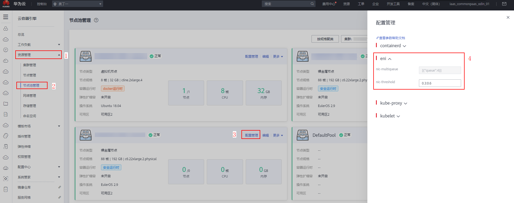
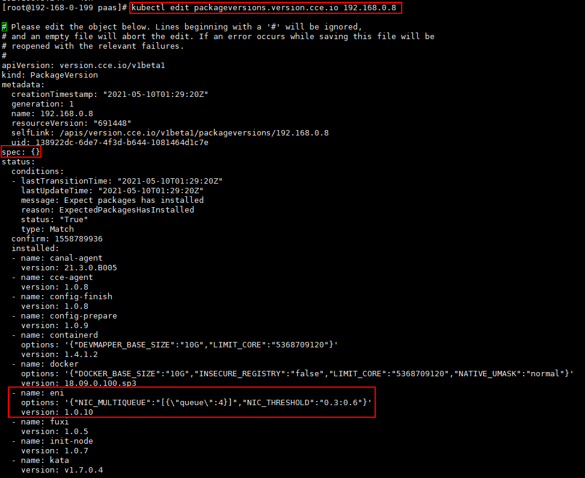
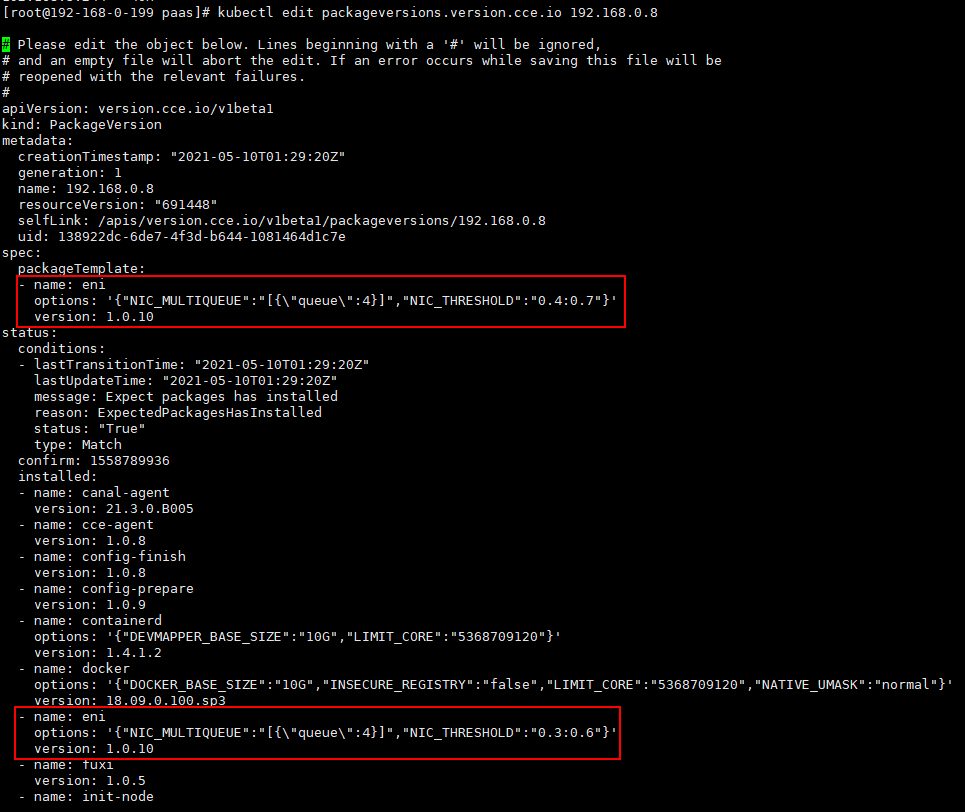
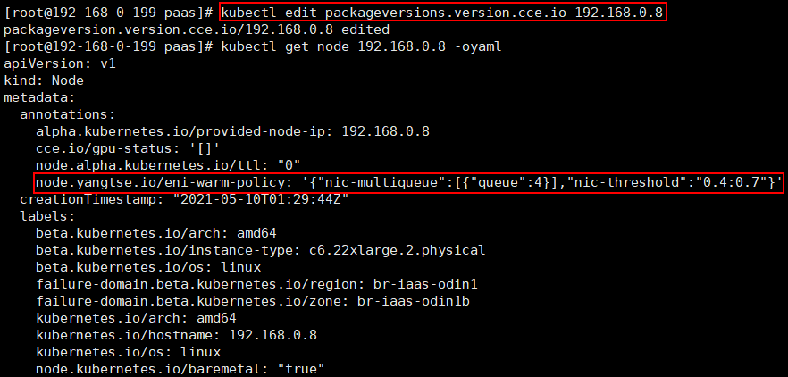

# CCE Turbo共池BMS节点容器网卡多队列配置<a name="cce_01_0358"></a>

由于BMS节点支持配置网卡的队列数，以及保障带宽等配置，所以BMS的预绑定策略跟ECS的大不一样，目前BMS只有节点级别的，没有全局的缺省配置。

网卡多队列是一种技术手段，可以解决网络I/O带宽QoS（Quality of Service）问题。网卡多队列驱动将各个队列通过中断绑定到不同的核上，从而解决网络I/O带宽升高时单核CPU的处理瓶颈，提升网络PPS和带宽性能。经测试，在相同的网络PPS和网络带宽的条件下，与1个队列相比，2个队列最多可提升性能达50%到100%，4个队列的性能提升更大。

## 固定队列预绑定策略<a name="zh-cn_topic_0251753944_section84851391244"></a>

所谓固定队列预绑定策略，即某个节点只预绑定某个队列数的弹性网卡。在创建节点或者节点池时，在extenParam参数中添加nicMultiqueue和nicThreshold字段可实现BMS节点的弹性网卡预热配置。固定队列预绑，即在nicMultiqueue配置中只配置一个queue。如下所示：

API调用详情请参考[创建节点池](https://support.huaweicloud.com/api-cce/cce_02_0354.html)。

```
"extendParam": {
    "nicMultiqueue": "[{\"queue\":4}]",
    "nicThreshold": "0.3:0.6"
}
```

**nicMultiqueue：弹性网卡队列数配置**

-   queue为弹性网卡的队列数。
-   BMS节点当前支持可配置的队列数以及相应最多可绑定的弹性网卡数：\{"1":128, "2":92, "4":92, "8":32, "16":16, "28":9\}，即1队列的弹性网卡最多可绑定128张，2队列的弹性网卡最多可绑定92张，以此类推。
-   弹性网卡队列数越多，性能越强，但可绑定弹性网卡数越少，请根据您的需求进行配置（创建后不可修改）。

**nicThreshold：弹性网卡预绑定比例配置**

-   第一位小数：预绑定低水位，最小预绑定弹性网卡数 = Min（128 \* 预绑定低水位，该队列最多可支持绑定的弹性网卡数）。
-   第二位小数：预绑定高水位，最大预绑定弹性网卡数 = Min（128 \* 预绑定高水位，该队列最多可支持绑定的弹性网卡数）。
-   预绑定网卡数的高低水位阈值同时受某个队列数最多可绑定的弹性网卡数限制。
-   BMS节点上绑定的弹性网卡数：当前Pod使用的弹性网卡数 + 预绑定的弹性网卡数 。
-   BMS节点上当预绑定弹性网卡数 + 当前Pod使用的弹性网卡数 < 最小预绑定弹性网卡数时，会绑定弹性网卡使得预绑定弹性网卡数 + 当前Pod使用的弹性网卡数 = 最小预绑定弹性网卡数。
-   BMS节点上当预绑定弹性网卡数 + 当前Pod使用的弹性网卡数 \> 最大预绑定弹性网卡数，会定时释放弹性网卡（约2分钟一次），直到预绑定弹性网卡数 + 当前Pod使用的弹性网卡数 = 最大预绑定弹性网卡数。
-   取值范围：\[0.0, 1.0\]; 一位小数; 低水位 <= 高水位。
-   仅在turbo集群的BMS节点时，该字段才可配置。
-   弹性网卡预绑定能加快工作负载的创建，但会占用IP，请根据您的需求进行配置。

## 网卡多队列配置修改<a name="zh-cn_topic_0251753944_section6141345191318"></a>

网卡多队列配置修改根据是否为节点池节点，分成两种方式：

-   节点池修改：修改节点池配置参数。
-   普通节点修改：修改节点packageVersion CRD的配置参数。

1.  **节点池修改**

    登录华为云控制台，单击“服务列表“，选择云容器引擎CCE，在CCE控制台中单击左侧栏目树中的“资源管理 \> 节点池管理“， 选择对应节点池的配置管理中的“eni“选项，可修改nicThreshold。

    当前节点池仅支持弹性网卡预绑定比例修改，暂不支持弹性网卡队列数修改。弹性网卡队列数修改，请提交工单。

    

2.  **普通节点修改**
    1.  登录节点。
    2.  编辑对应节点包配置管理中的弹性网卡预热配置参数：

        kubectl edit packageversions.version.cce.io 192.168.0.8

        

    3.  修改spec，将status.installed中的eni参数拷贝至spec.packageTemplate下，并修改参数后保存。

        

3.  **修改完后确认，node.annotations下eni-warm-policy的配置参数是否与修改一致。**

    


