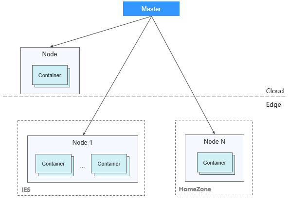

# CCE Turbo集群与CCE集群的区别

## CCE Turbo集群与CCE集群对比

CCE支持多种类型的集群创建，以满足您各种业务需求，如下为CCE Turbo集群与CCE集群区别：

**表 1**  集群类型对比

<table><thead align="left"><tr id="zh-cn_topic_0000001151389047_row19289164182216"><th class="cellrowborder" valign="top" width="9.699030096990302%" id="mcps1.2.5.1.1">
维度

</th>
<th class="cellrowborder" valign="top" width="12.218778122187782%" id="mcps1.2.5.1.2">
子维度

</th>
<th class="cellrowborder" valign="top" width="40.965903409659035%" id="mcps1.2.5.1.3">
CCE Turbo集群

</th>
<th class="cellrowborder" valign="top" width="37.11628837116288%" id="mcps1.2.5.1.4">
CCE集群

</th>
</tr>
</thead>
<tbody><tr id="zh-cn_topic_0000001151389047_row0378353192912"><td class="cellrowborder" rowspan="2" valign="top" width="9.699030096990302%" headers="mcps1.2.5.1.1 ">
集群

</td>
<td class="cellrowborder" valign="top" width="12.218778122187782%" headers="mcps1.2.5.1.2 ">
定位

</td>
<td class="cellrowborder" valign="top" width="40.965903409659035%" headers="mcps1.2.5.1.3 ">
面向云原生2.0的新一代容器集群产品，计算、网络、调度全面加速

</td>
<td class="cellrowborder" valign="top" width="37.11628837116288%" headers="mcps1.2.5.1.4 ">
标准版本集群，提供商用级的容器集群服务

</td>
</tr>
<tr id="zh-cn_topic_0000001151389047_row132892412218"><td class="cellrowborder" valign="top" headers="mcps1.2.5.1.1 ">
节点形态

</td>
<td class="cellrowborder" valign="top" headers="mcps1.2.5.1.2 ">
支持虚拟机和裸金属服务器混合

</td>
<td class="cellrowborder" valign="top" headers="mcps1.2.5.1.3 ">
支持虚拟机和裸金属服务器混合

</td>
</tr>
<tr id="zh-cn_topic_0000001151389047_row19562502266"><td class="cellrowborder" rowspan="3" valign="top" width="9.699030096990302%" headers="mcps1.2.5.1.1 ">
网络

</td>
<td class="cellrowborder" valign="top" width="12.218778122187782%" headers="mcps1.2.5.1.2 ">
网络模型

</td>
<td class="cellrowborder" valign="top" width="40.965903409659035%" headers="mcps1.2.5.1.3 ">
<strong id="zh-cn_topic_0000001151389047_b111991280296">云原生网络2.0</strong>：面向大规模和高性能的场景。

组网规模最大支持2000节点

</td>
<td class="cellrowborder" valign="top" width="37.11628837116288%" headers="mcps1.2.5.1.4 ">
<strong id="zh-cn_topic_0000001151389047_b113401315112712">云原生网络1.0</strong>：面向性能和规模要求不高的场景。

<ul id="zh-cn_topic_0000001151389047_ul2055005123618"><li>容器隧道网络模式</li><li>VPC网络模式</li></ul>
</td>
</tr>
<tr id="zh-cn_topic_0000001151389047_row133581631175511"><td class="cellrowborder" valign="top" headers="mcps1.2.5.1.1 ">
网络性能

</td>
<td class="cellrowborder" valign="top" headers="mcps1.2.5.1.2 ">
VPC网络和容器网络融合，性能无损耗

</td>
<td class="cellrowborder" valign="top" headers="mcps1.2.5.1.3 ">
VPC网络叠加容器网络，性能有一定损耗

</td>
</tr>
<tr id="zh-cn_topic_0000001151389047_row1328914432215"><td class="cellrowborder" valign="top" headers="mcps1.2.5.1.1 ">
容器网络隔离

</td>
<td class="cellrowborder" valign="top" headers="mcps1.2.5.1.2 ">
Pod可直接关联安全组，基于安全组的隔离策略，支持集群内外部统一的安全隔离。

</td>
<td class="cellrowborder" valign="top" headers="mcps1.2.5.1.3 "><ul id="zh-cn_topic_0000001151389047_ul29571941173617"><li>隧道网络模式：集群内部网络隔离策略，支持Networkpolicy。</li><li>VPC网络模式：不支持</li></ul>
</td>
</tr>
<tr id="zh-cn_topic_0000001151389047_row17290144506"><td class="cellrowborder" valign="top" width="9.699030096990302%" headers="mcps1.2.5.1.1 ">
安全

</td>
<td class="cellrowborder" valign="top" width="12.218778122187782%" headers="mcps1.2.5.1.2 ">
隔离性

</td>
<td class="cellrowborder" valign="top" width="40.965903409659035%" headers="mcps1.2.5.1.3 "><ul id="zh-cn_topic_0000001151389047_ul125981418125012"><li>物理机：安全容器，支持虚机级别的隔离</li><li>虚拟机：普通容器</li></ul>
</td>
<td class="cellrowborder" valign="top" width="37.11628837116288%" headers="mcps1.2.5.1.4 ">
普通容器，Cgroups隔离

</td>
</tr>
</tbody>
</table>

## CCE Turbo分布式集群

> **说明：** 
>CCE Turbo 分布式集群需要注册了边缘小站后才可见。

CCE Turbo分布式集群在CCE Turbo集群的基础上增加了**管理边缘基础设施**的能力，包括智能边缘云Homezone和智能边缘小站IES。启用分布式集群后，一个集群可以统一管理数据中心和边缘的计算资源，用户可以便捷地根据应用的诉求将其部署在对应的区域。

**核心概念**

为了区分云上资源和分布在不同边缘区域的资源，也为了方便用户使用和管理处于不同区域的资源，引入了**分区**概念，定义如下：

-   计算角度：一个分区是一组“风火水电”相互隔离、但网络位置靠近（通常互访时延小于2ms）的数据中心可用区（available zone）的集合。将应用分散在一个分区内不同可用区可以实现应用高可用性。
-   网络角度：一个分区内节点和容器需要使用创建在该分区内可用区下的虚拟私有云（VPC）子网。为方便配置和管理，分区创建时需设定默认子网，当创建节点不指定子网时，会填入分区默认子网。
-   其他属性：分区包含资源类别，即中心云、Homezone或IES。该属性的配置方便后续负载的调度。

**约束与限制**

-   节点：分布式集群当前仅支持普通x86虚拟机。
-   节点池：节点池随机调度功能仅限于分区内；暂不支持节点迁移功能。
-   存储：当前仅支持在边缘区域创建云硬盘（EVS），其他种类存储方式不推荐使用。
-   服务与路由：仅支持独享型ELB；仅支持在Homezone类型的分区创建4层ELB，其他类型需要将ELB实例创建在中心分区。
-   插件：分布式集群支持如下插件，且优先将插件部署在云上节点。
    -   everest
    -   coredns
    -   node-local-dns
    -   autoscaler
    -   metrics-server
    -   dashboard
    -   huawei-npu
    -   gpu-beta

## CCE Turbo集群Pod批量创建性能说明

CCE Turbo集群的Pod容器网卡申请自VPC的弹性网卡或者辅助弹性网卡，目前Pod与网卡（弹性网卡或辅助弹性网卡）的关联操作发生在Pod调度完成之后，Pod创建的速度受网卡创建与绑定速度的影响，具体限制如下表所示。

**表 2**  容器网卡创建耗时

<table><thead align="left"><tr id="row6460551719"><th class="cellrowborder" valign="top" width="5.140000000000001%" id="mcps1.2.8.1.1">
节点类型

</th>
<th class="cellrowborder" valign="top" width="7.64%" id="mcps1.2.8.1.2">
网卡类型

</th>
<th class="cellrowborder" valign="top" width="9.82%" id="mcps1.2.8.1.3">
可支持的最大网卡数

</th>
<th class="cellrowborder" valign="top" width="11.15%" id="mcps1.2.8.1.4">
网卡绑定到节点上的操作

</th>
<th class="cellrowborder" valign="top" width="15.52%" id="mcps1.2.8.1.5">
网卡可用耗时

</th>
<th class="cellrowborder" valign="top" width="9.69%" id="mcps1.2.8.1.6">
并发控制

</th>
<th class="cellrowborder" valign="top" width="41.04%" id="mcps1.2.8.1.7">
节点上的容器网卡默认预热配置

</th>
</tr>
</thead>
<tbody><tr id="row2460552719"><td class="cellrowborder" valign="top" width="5.140000000000001%" headers="mcps1.2.8.1.1 ">
ECS节点

</td>
<td class="cellrowborder" valign="top" width="7.64%" headers="mcps1.2.8.1.2 ">
辅助弹性网卡

</td>
<td class="cellrowborder" valign="top" width="9.82%" headers="mcps1.2.8.1.3 ">
256

</td>
<td class="cellrowborder" valign="top" width="11.15%" headers="mcps1.2.8.1.4 ">
指定该节点的弹性网卡创建辅助弹性网卡

</td>
<td class="cellrowborder" valign="top" width="15.52%" headers="mcps1.2.8.1.5 ">
1s以内

</td>
<td class="cellrowborder" valign="top" width="9.69%" headers="mcps1.2.8.1.6 ">
租户级别：600/分钟

</td>
<td class="cellrowborder" valign="top" width="41.04%" headers="mcps1.2.8.1.7 ">
1.19.16-r2、1.21.5-r0、1.23.3-r0之前的集群版本：容器网卡不预热

1.19.16-r2、1.21.5-r0、1.23.3-r0到1.19.16-r4、1.21.7-r0、1.23.5-r0之间的集群版本：容器网卡动态预热（nic-minimum-target=10；nic-warm-target=2）

1.19.16-r4、1.21.7-r0、1.23.5-r0、1.25.1-r0及以上集群版本：容器网卡动态预热（nic-minimum-target=10；nic-maximum-target=2；nic-warm-target=2；nic-max-above-warm-target=2）

</td>
</tr>
<tr id="row11461855176"><td class="cellrowborder" valign="top" width="5.140000000000001%" headers="mcps1.2.8.1.1 ">
BMS节点

</td>
<td class="cellrowborder" valign="top" width="7.64%" headers="mcps1.2.8.1.2 ">
弹性网卡

</td>
<td class="cellrowborder" valign="top" width="9.82%" headers="mcps1.2.8.1.3 ">
128

</td>
<td class="cellrowborder" valign="top" width="11.15%" headers="mcps1.2.8.1.4 ">
节点绑定弹性网卡

</td>
<td class="cellrowborder" valign="top" width="15.52%" headers="mcps1.2.8.1.5 ">
20s-30s

</td>
<td class="cellrowborder" valign="top" width="9.69%" headers="mcps1.2.8.1.6 ">
节点级别：3并发

</td>
<td class="cellrowborder" valign="top" width="41.04%" headers="mcps1.2.8.1.7 ">
1.19.16-r4、1.21.7-r0、1.23.5-r0之前的集群版本：容器网卡总数高低水位预热（nic-threshold=0.3:0.6）

1.19.16-r4、1.21.7-r0、1.23.5-r0、1.25.1-r0及以上集群版本：容器网卡动态预热（nic-minimum-target=10；nic-maximum-target=2；nic-warm-target=2；nic-max-above-warm-target=2）

</td>
</tr>
</tbody>
</table>

> **说明：** 
>容器网卡预热会提前消耗容器子网的IP地址，进而影响集群可运行的Pod数规模，请根据业务规模合理规划配置容器网卡动态预热参数，详情请参见[CCE Turbo配置容器网卡动态预热](https://support.huaweicloud.com/bestpractice-cce/cce_bestpractice_10010.html)。

**ECS节点创建Pod说明（采用辅助弹性网卡）**

-   当Pod调度的节点上没有可用的已经预热的容器网卡时，会调用辅助弹性网卡的创建API，在该节点的一个弹性网卡上创建一个辅助弹性网卡；并把该辅助弹性网卡分配给该Pod。
-   当Pod调度的节点上有可用的已经预热的容器网卡时，会选择最早未使用的一张辅助弹性网卡分配给该Pod。
-   受限于辅助弹性网卡的租户并发创建速度，容器网卡不预热的场景下，每分钟最多创建成功600个Pod；如果有更高的弹性要求，可根据业务场景合理配置容器网卡动态预热参数。

**BMS节点创建Pod说明（采用弹性网卡）**

-   当Pod调度的节点上没有可用的已经预热的容器网卡时，会调用节点绑定网卡的API，在该节点上绑定一个弹性网卡；并把该弹性网卡分配给该Pod。目前BMS节点绑定一张弹性网卡直至完全可用大约耗时在20s到30s不等。
-   当Pod调度的节点上有可用的已经预热的容器网卡时，会选择最早未使用的一张弹性网卡分配给该Pod。
-   受限于BMS节点绑定弹性网卡的速度，容器网卡不预热的场景下，同一节点的Pod启动速度为：3个/20秒；所以针对BMS节点，强烈建议用户配置容器网卡全预热。

