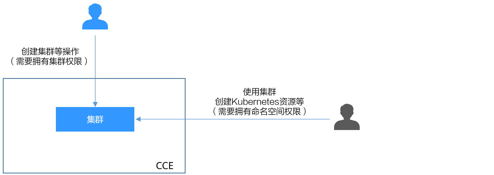

# CCE权限概述

CCE权限管理是在统一身份认证服务（IAM）与Kubernetes的角色访问控制（RBAC）的能力基础上，打造的细粒度权限管理功能，支持基于IAM的细粒度权限控制和IAM Token认证，支持集群级别、命名空间级别的权限控制，帮助用户便捷灵活的对租户下的IAM用户、用户组设定不同的操作权限。

如果您需要对华为云上购买的CCE集群及相关资源进行精细的权限管理，例如限制不同部门的员工拥有部门内资源的细粒度权限，您可以使用CCE权限管理提供的增强能力进行多维度的权限管理。

本章节将介绍CCE权限管理机制及其涉及到的基本概念。如果当前华为云帐号已经能满足您的要求，您可以跳过本章节，不影响您使用CCE服务的其它功能。

## CCE支持的权限管理能力

CCE的权限管理包括“集群权限”和“命名空间权限”两种能力，能够从集群和命名空间层面对用户组或用户进行细粒度授权，具体解释如下：

-   **[集群权限](集群权限（IAM授权）-179.md)：**是基于IAM系统策略的授权，可以通过用户组功能实现IAM用户的授权。用户组是用户的集合，通过集群权限设置可以让某些用户组操作集群（如创建/删除集群、节点、节点池、模板、插件等），而让某些用户组仅能查看集群。

    集群权限涉及CCE非Kubernetes API，支持IAM细粒度策略、企业项目管理相关能力。

-   **[命名空间权限](命名空间权限（Kubernetes-RBAC授权）-180.md)：**是基于Kubernetes RBAC（Role-Based Access Control，基于角色的访问控制）能力的授权，通过权限设置可以让不同的用户或用户组拥有操作不同Kubernetes资源的权限。同时CCE基于开源能力进行了增强，可以支持基于IAM用户或用户组粒度进行RBAC授权、IAM token直接访问API进行RBAC认证鉴权。

    命名空间权限涉及CCE Kubernetes API，基于Kubernetes RBAC能力进行增强，支持对接IAM用户/用户组进行授权和认证鉴权，但与IAM细粒度策略独立。

    CCE从v1.11.7-r2版本起的集群支持配置命名空间权限，1.11.7-r2之前的版本默认拥有全部命名空间权限。

CCE的权限可以从使用的阶段分为两个阶段来看，第一个阶段是创建和管理集群的权限，也就是拥有创建/删除集群、节点等资源的权限。第二个阶段是使用集群Kubernetes资源（如工作负载、Service等）的权限。

**图 1**  权限示例图  

清楚了集群权限和命名空间权限后，您就可以通过这两步授权，做到精细化的权限控制。

## 集群权限（IAM授权）与命名空间权限（Kubernetes RBAC授权）的关系

拥有不同集群权限（IAM授权）的用户，其拥有的命名空间权限（Kubernetes RBAC授权）不同。[表1](#table886210176509)给出了不同用户拥有的命名空间权限详情。

**表 1**  不同用户拥有的命名空间权限

<table><thead align="left"><tr id="row14863201719502"><th class="cellrowborder" valign="top" width="46.54%" id="mcps1.2.3.1.1">
用户类型

</th>
<th class="cellrowborder" valign="top" width="53.459999999999994%" id="mcps1.2.3.1.2">
权限范围

</th>
</tr>
</thead>
<tbody><tr id="row138631617185012"><td class="cellrowborder" valign="top" width="46.54%" headers="mcps1.2.3.1.1 ">
拥有Tenant Administrator权限的用户（例如华为云账号）

</td>
<td class="cellrowborder" valign="top" width="53.459999999999994%" headers="mcps1.2.3.1.2 ">
全部命名空间权限

</td>
</tr>
<tr id="row138631317205019"><td class="cellrowborder" valign="top" width="46.54%" headers="mcps1.2.3.1.1 ">
拥有CCE Administrator权限的IAM用户

</td>
<td class="cellrowborder" valign="top" width="53.459999999999994%" headers="mcps1.2.3.1.2 ">
全部命名空间权限

</td>
</tr>
<tr id="row1386412176506"><td class="cellrowborder" valign="top" width="46.54%" headers="mcps1.2.3.1.1 ">
拥有CCE&nbsp;FullAccess或者CCE&nbsp;ReadOnlyAccess权限的IAM用户

</td>
<td class="cellrowborder" valign="top" width="53.459999999999994%" headers="mcps1.2.3.1.2 ">
按Kubernetes RBAC授权

</td>
</tr>
<tr id="row28641117145019"><td class="cellrowborder" valign="top" width="46.54%" headers="mcps1.2.3.1.1 ">
拥有Tenant Guest权限的IAM用户

</td>
<td class="cellrowborder" valign="top" width="53.459999999999994%" headers="mcps1.2.3.1.2 ">
按Kubernetes RBAC授权

</td>
</tr>
</tbody>
</table>

## kubectl权限说明

您可以通过[kubectl访问集群](通过kubectl连接集群-7.md)的Kubernetes资源，那kubectl拥有哪些Kubernetes资源的权限呢？

kubectl访问CCE集群是通过集群上生成的配置文件（kubeconfig.json）进行认证，kubeconfig.json文件内包含用户信息，CCE根据用户信息的权限判断kubectl有权限访问哪些Kubernetes资源。即哪个用户获取的kubeconfig.json文件，kubeconfig.json就拥有哪个用户的信息，这样使用kubectl访问时就拥有这个用户的权限。而用户拥有的权限就是[表1](#table886210176509)所示的权限。

## IAM支持的授权项

策略包含系统策略和自定义策略，如果系统策略不满足授权要求，管理员可以创建自定义策略，并通过给用户组授予自定义策略来进行精细的访问控制。策略支持的操作与API相对应，授权项列表说明如下：

-   权限：允许或拒绝某项操作。
-   对应API接口：自定义策略实际调用的API接口。
-   授权项：自定义策略中支持的Action，在自定义策略中的Action中写入授权项，可以实现授权项对应的权限功能。
-   依赖的授权项：部分Action存在对其他Action的依赖，需要将依赖的Action同时写入授权项，才能实现对应的权限功能。
-   IAM项目\(Project\)/企业项目\(Enterprise Project\)：自定义策略的授权范围，包括IAM项目与企业项目。授权范围如果同时支持IAM项目和企业项目，表示此授权项对应的自定义策略，可以在IAM和企业管理两个服务中给用户组授权并生效。如果仅支持IAM项目，不支持企业项目，表示仅能在IAM中给用户组授权并生效，如果在企业管理中授权，则该自定义策略不生效。关于IAM项目与企业项目的区别，详情请参见：[IAM与企业管理的区别](https://support.huaweicloud.com/iam_faq/iam_01_0101.html)。

> **说明：** 
>“√”表示支持，“x”表示暂不支持。

云容器引擎（CCE）支持的自定义策略授权项如下所示：

**表 2**  Cluster

<table><thead align="left"><tr id="zh-cn_topic_0272459940_row5041122"><th class="cellrowborder" valign="top" width="18.74187418741874%" id="mcps1.2.6.1.1">
权限

</th>
<th class="cellrowborder" valign="top" width="32.503250325032504%" id="mcps1.2.6.1.2">
对应API接口

</th>
<th class="cellrowborder" valign="top" width="17.431743174317432%" id="mcps1.2.6.1.3">
授权项（Action）

</th>
<th class="cellrowborder" valign="top" width="13.511351135113511%" id="mcps1.2.6.1.4">
IAM项目(Project)

</th>
<th class="cellrowborder" valign="top" width="17.811781178117812%" id="mcps1.2.6.1.5">
企业项目 (Enterprise Project)

</th>
</tr>
</thead>
<tbody><tr id="zh-cn_topic_0272459940_row6218729231"><td class="cellrowborder" valign="top" width="18.74187418741874%" headers="mcps1.2.6.1.1 ">
获取指定项目下的集群

</td>
<td class="cellrowborder" valign="top" width="32.503250325032504%" headers="mcps1.2.6.1.2 ">
GET /api/v3/projects/{project_id}/clusters

</td>
<td class="cellrowborder" valign="top" width="17.431743174317432%" headers="mcps1.2.6.1.3 ">
cce:cluster:list

</td>
<td class="cellrowborder" valign="top" width="13.511351135113511%" headers="mcps1.2.6.1.4 ">
√

</td>
<td class="cellrowborder" valign="top" width="17.811781178117812%" headers="mcps1.2.6.1.5 ">
√

</td>
</tr>
<tr id="zh-cn_topic_0272459940_row60174342914"><td class="cellrowborder" valign="top" width="18.74187418741874%" headers="mcps1.2.6.1.1 ">
获取指定的集群

</td>
<td class="cellrowborder" valign="top" width="32.503250325032504%" headers="mcps1.2.6.1.2 ">
GET /api/v3/projects/{project_id}/clusters/{cluster_id}

</td>
<td class="cellrowborder" valign="top" width="17.431743174317432%" headers="mcps1.2.6.1.3 ">
cce:cluster:get

</td>
<td class="cellrowborder" valign="top" width="13.511351135113511%" headers="mcps1.2.6.1.4 ">
√

</td>
<td class="cellrowborder" valign="top" width="17.811781178117812%" headers="mcps1.2.6.1.5 ">
√

</td>
</tr>
<tr id="zh-cn_topic_0272459940_row1930454173014"><td class="cellrowborder" valign="top" width="18.74187418741874%" headers="mcps1.2.6.1.1 ">
创建集群

</td>
<td class="cellrowborder" valign="top" width="32.503250325032504%" headers="mcps1.2.6.1.2 ">
POST /api/v3/projects/{project_id}/clusters

</td>
<td class="cellrowborder" valign="top" width="17.431743174317432%" headers="mcps1.2.6.1.3 ">
cce:cluster:create

</td>
<td class="cellrowborder" valign="top" width="13.511351135113511%" headers="mcps1.2.6.1.4 ">
√

</td>
<td class="cellrowborder" valign="top" width="17.811781178117812%" headers="mcps1.2.6.1.5 ">
√

</td>
</tr>
<tr id="zh-cn_topic_0272459940_row47112191304"><td class="cellrowborder" valign="top" width="18.74187418741874%" headers="mcps1.2.6.1.1 ">
更新指定的集群

</td>
<td class="cellrowborder" valign="top" width="32.503250325032504%" headers="mcps1.2.6.1.2 ">
PUT /api/v3/projects/{project_id}/clusters/{cluster_id}

</td>
<td class="cellrowborder" valign="top" width="17.431743174317432%" headers="mcps1.2.6.1.3 ">
cce:cluster:update

</td>
<td class="cellrowborder" valign="top" width="13.511351135113511%" headers="mcps1.2.6.1.4 ">
√

</td>
<td class="cellrowborder" valign="top" width="17.811781178117812%" headers="mcps1.2.6.1.5 ">
√

</td>
</tr>
<tr id="zh-cn_topic_0272459940_row12227515103011"><td class="cellrowborder" valign="top" width="18.74187418741874%" headers="mcps1.2.6.1.1 ">
删除集群

</td>
<td class="cellrowborder" valign="top" width="32.503250325032504%" headers="mcps1.2.6.1.2 ">
DELETE /api/v3/projects/{project_id}/clusters/{cluster_id}

</td>
<td class="cellrowborder" valign="top" width="17.431743174317432%" headers="mcps1.2.6.1.3 ">
cce:cluster:delete

</td>
<td class="cellrowborder" valign="top" width="13.511351135113511%" headers="mcps1.2.6.1.4 ">
√

</td>
<td class="cellrowborder" valign="top" width="17.811781178117812%" headers="mcps1.2.6.1.5 ">
√

</td>
</tr>
<tr id="zh-cn_topic_0272459940_row08371357151013"><td class="cellrowborder" valign="top" width="18.74187418741874%" headers="mcps1.2.6.1.1 ">
升级集群

</td>
<td class="cellrowborder" valign="top" width="32.503250325032504%" headers="mcps1.2.6.1.2 ">
POST /api/v2/projects/:projectid/clusters/:clusterid/upgrade

</td>
<td class="cellrowborder" valign="top" width="17.431743174317432%" headers="mcps1.2.6.1.3 ">
cce:cluster:upgrade

</td>
<td class="cellrowborder" valign="top" width="13.511351135113511%" headers="mcps1.2.6.1.4 ">
√

</td>
<td class="cellrowborder" valign="top" width="17.811781178117812%" headers="mcps1.2.6.1.5 ">
√

</td>
</tr>
<tr id="zh-cn_topic_0272459940_row44931332122"><td class="cellrowborder" valign="top" width="18.74187418741874%" headers="mcps1.2.6.1.1 ">
唤醒集群

</td>
<td class="cellrowborder" valign="top" width="32.503250325032504%" headers="mcps1.2.6.1.2 ">
POST /api/v3/projects/{project_id}/clusters/{cluster_id}/operation/awake

</td>
<td class="cellrowborder" valign="top" width="17.431743174317432%" headers="mcps1.2.6.1.3 ">
cce:cluster:start

</td>
<td class="cellrowborder" valign="top" width="13.511351135113511%" headers="mcps1.2.6.1.4 ">
√

</td>
<td class="cellrowborder" valign="top" width="17.811781178117812%" headers="mcps1.2.6.1.5 ">
√

</td>
</tr>
<tr id="zh-cn_topic_0272459940_row111668189129"><td class="cellrowborder" valign="top" width="18.74187418741874%" headers="mcps1.2.6.1.1 ">
休眠集群

</td>
<td class="cellrowborder" valign="top" width="32.503250325032504%" headers="mcps1.2.6.1.2 ">
POST /api/v3/projects/{project_id}/clusters/{cluster_id}/operation/hibernate

</td>
<td class="cellrowborder" valign="top" width="17.431743174317432%" headers="mcps1.2.6.1.3 ">
cce:cluster:stop

</td>
<td class="cellrowborder" valign="top" width="13.511351135113511%" headers="mcps1.2.6.1.4 ">
√

</td>
<td class="cellrowborder" valign="top" width="17.811781178117812%" headers="mcps1.2.6.1.5 ">
√

</td>
</tr>
<tr id="zh-cn_topic_0272459940_row1841934513124"><td class="cellrowborder" valign="top" width="18.74187418741874%" headers="mcps1.2.6.1.1 ">
变更集群规格

</td>
<td class="cellrowborder" valign="top" width="32.503250325032504%" headers="mcps1.2.6.1.2 ">
POST /api/v2/projects/{project_id}/clusters/:clusterid/resize

</td>
<td class="cellrowborder" valign="top" width="17.431743174317432%" headers="mcps1.2.6.1.3 ">
cce:cluster:resize

</td>
<td class="cellrowborder" valign="top" width="13.511351135113511%" headers="mcps1.2.6.1.4 ">
√

</td>
<td class="cellrowborder" valign="top" width="17.811781178117812%" headers="mcps1.2.6.1.5 ">
√

</td>
</tr>
<tr id="zh-cn_topic_0272459940_row3113121214304"><td class="cellrowborder" valign="top" width="18.74187418741874%" headers="mcps1.2.6.1.1 ">
获取集群证书

</td>
<td class="cellrowborder" valign="top" width="32.503250325032504%" headers="mcps1.2.6.1.2 ">
POST /api/v3/projects/{project_id}/clusters/{cluster_id}/clustercert

</td>
<td class="cellrowborder" valign="top" width="17.431743174317432%" headers="mcps1.2.6.1.3 ">
cce:cluster:get

</td>
<td class="cellrowborder" valign="top" width="13.511351135113511%" headers="mcps1.2.6.1.4 ">
√

</td>
<td class="cellrowborder" valign="top" width="17.811781178117812%" headers="mcps1.2.6.1.5 ">
√

</td>
</tr>
</tbody>
</table>

**表 3**  Node

<table><thead align="left"><tr id="zh-cn_topic_0272459940_row1547020324819"><th class="cellrowborder" valign="top" width="18.66%" id="mcps1.2.6.1.1">
权限

</th>
<th class="cellrowborder" valign="top" width="32.42%" id="mcps1.2.6.1.2">
对应API接口

</th>
<th class="cellrowborder" valign="top" width="17.540000000000003%" id="mcps1.2.6.1.3">
授权项

</th>
<th class="cellrowborder" valign="top" width="13.330000000000004%" id="mcps1.2.6.1.4">
IAM项目(Project)

</th>
<th class="cellrowborder" valign="top" width="18.05%" id="mcps1.2.6.1.5">
企业项目 (Enterprise Project)

</th>
</tr>
</thead>
<tbody><tr id="zh-cn_topic_0272459940_row1847116323811"><td class="cellrowborder" valign="top" width="18.66%" headers="mcps1.2.6.1.1 ">
获取集群下所有节点

</td>
<td class="cellrowborder" valign="top" width="32.42%" headers="mcps1.2.6.1.2 ">
GET /api/v3/projects/{project_id}/clusters/{cluster_id}/nodes

</td>
<td class="cellrowborder" valign="top" width="17.540000000000003%" headers="mcps1.2.6.1.3 ">
cce:node:list

</td>
<td class="cellrowborder" valign="top" width="13.330000000000004%" headers="mcps1.2.6.1.4 ">
√

</td>
<td class="cellrowborder" valign="top" width="18.05%" headers="mcps1.2.6.1.5 ">
√

</td>
</tr>
<tr id="zh-cn_topic_0272459940_row84718324816"><td class="cellrowborder" valign="top" width="18.66%" headers="mcps1.2.6.1.1 ">
获取指定的节点

</td>
<td class="cellrowborder" valign="top" width="32.42%" headers="mcps1.2.6.1.2 ">
GET /api/v3/projects/{project_id}/clusters/{cluster_id}/nodes/{node_id}

</td>
<td class="cellrowborder" valign="top" width="17.540000000000003%" headers="mcps1.2.6.1.3 ">
cce:node:get

</td>
<td class="cellrowborder" valign="top" width="13.330000000000004%" headers="mcps1.2.6.1.4 ">
√

</td>
<td class="cellrowborder" valign="top" width="18.05%" headers="mcps1.2.6.1.5 ">
√

</td>
</tr>
<tr id="zh-cn_topic_0272459940_row16472153216811"><td class="cellrowborder" valign="top" width="18.66%" headers="mcps1.2.6.1.1 ">
创建节点

</td>
<td class="cellrowborder" valign="top" width="32.42%" headers="mcps1.2.6.1.2 ">
POST /api/v3/projects/{project_id}/clusters/{cluster_id}/nodes

</td>
<td class="cellrowborder" valign="top" width="17.540000000000003%" headers="mcps1.2.6.1.3 ">
cce:node:create

</td>
<td class="cellrowborder" valign="top" width="13.330000000000004%" headers="mcps1.2.6.1.4 ">
√

</td>
<td class="cellrowborder" valign="top" width="18.05%" headers="mcps1.2.6.1.5 ">
√

</td>
</tr>
<tr id="zh-cn_topic_0272459940_row44727324814"><td class="cellrowborder" valign="top" width="18.66%" headers="mcps1.2.6.1.1 ">
更新指定的节点

</td>
<td class="cellrowborder" valign="top" width="32.42%" headers="mcps1.2.6.1.2 ">
PUT /api/v3/projects/{project_id}/clusters/{cluster_id}/nodes/{node_id}

</td>
<td class="cellrowborder" valign="top" width="17.540000000000003%" headers="mcps1.2.6.1.3 ">
cce:node:update

</td>
<td class="cellrowborder" valign="top" width="13.330000000000004%" headers="mcps1.2.6.1.4 ">
√

</td>
<td class="cellrowborder" valign="top" width="18.05%" headers="mcps1.2.6.1.5 ">
√

</td>
</tr>
<tr id="zh-cn_topic_0272459940_row184721532483"><td class="cellrowborder" valign="top" width="18.66%" headers="mcps1.2.6.1.1 ">
删除节点

</td>
<td class="cellrowborder" valign="top" width="32.42%" headers="mcps1.2.6.1.2 ">
DELETE /api/v3/projects/{project_id}/clusters/{cluster_id}/nodes/{node_id}

</td>
<td class="cellrowborder" valign="top" width="17.540000000000003%" headers="mcps1.2.6.1.3 ">
cce:node:delete

</td>
<td class="cellrowborder" valign="top" width="13.330000000000004%" headers="mcps1.2.6.1.4 ">
√

</td>
<td class="cellrowborder" valign="top" width="18.05%" headers="mcps1.2.6.1.5 ">
√

</td>
</tr>
</tbody>
</table>

**表 4**  Job

<table><thead align="left"><tr id="zh-cn_topic_0272459940_row118231534784"><th class="cellrowborder" valign="top" width="18.47%" id="mcps1.2.6.1.1">
权限

</th>
<th class="cellrowborder" valign="top" width="32.35%" id="mcps1.2.6.1.2">
对应API接口

</th>
<th class="cellrowborder" valign="top" width="17.72%" id="mcps1.2.6.1.3">
授权项

</th>
<th class="cellrowborder" valign="top" width="13.41%" id="mcps1.2.6.1.4">
IAM项目(Project)

</th>
<th class="cellrowborder" valign="top" width="18.05%" id="mcps1.2.6.1.5">
企业项目 (Enterprise Project)

</th>
</tr>
</thead>
<tbody><tr id="zh-cn_topic_0272459940_row2826163416814"><td class="cellrowborder" valign="top" width="18.47%" headers="mcps1.2.6.1.1 ">
获取任务信息

</td>
<td class="cellrowborder" valign="top" width="32.35%" headers="mcps1.2.6.1.2 ">
GET /api/v3/projects/{project_id}/jobs/{job_id}

</td>
<td class="cellrowborder" valign="top" width="17.72%" headers="mcps1.2.6.1.3 ">
cce:job:get

</td>
<td class="cellrowborder" valign="top" width="13.41%" headers="mcps1.2.6.1.4 ">
√

</td>
<td class="cellrowborder" valign="top" width="18.05%" headers="mcps1.2.6.1.5 ">
√

</td>
</tr>
<tr id="zh-cn_topic_0272459940_row98269343810"><td class="cellrowborder" valign="top" width="18.47%" headers="mcps1.2.6.1.1 ">
列出所有任务

</td>
<td class="cellrowborder" valign="top" width="32.35%" headers="mcps1.2.6.1.2 ">
GET /api/v2/projects/{project_id}/jobs

</td>
<td class="cellrowborder" valign="top" width="17.72%" headers="mcps1.2.6.1.3 ">
cce:job:list

</td>
<td class="cellrowborder" valign="top" width="13.41%" headers="mcps1.2.6.1.4 ">
√

</td>
<td class="cellrowborder" valign="top" width="18.05%" headers="mcps1.2.6.1.5 ">
√

</td>
</tr>
<tr id="zh-cn_topic_0272459940_row148275341788"><td class="cellrowborder" valign="top" width="18.47%" headers="mcps1.2.6.1.1 ">
删除所有任务或删除单个任务

</td>
<td class="cellrowborder" valign="top" width="32.35%" headers="mcps1.2.6.1.2 ">
DELETE /api/v2/projects/{project_id}/jobs

DELETE /api/v2/projects/{project_id}/jobs/{job_id}

</td>
<td class="cellrowborder" valign="top" width="17.72%" headers="mcps1.2.6.1.3 ">
cce:job:delete

</td>
<td class="cellrowborder" valign="top" width="13.41%" headers="mcps1.2.6.1.4 ">
√

</td>
<td class="cellrowborder" valign="top" width="18.05%" headers="mcps1.2.6.1.5 ">
√

</td>
</tr>
</tbody>
</table>

**表 5**  Nodepool

<table><thead align="left"><tr id="zh-cn_topic_0272459940_row1929910371383"><th class="cellrowborder" valign="top" width="18.47%" id="mcps1.2.6.1.1">
权限

</th>
<th class="cellrowborder" valign="top" width="32.35%" id="mcps1.2.6.1.2">
对应API接口

</th>
<th class="cellrowborder" valign="top" width="17.72%" id="mcps1.2.6.1.3">
授权项

</th>
<th class="cellrowborder" valign="top" width="13.15%" id="mcps1.2.6.1.4">
IAM项目(Project)

</th>
<th class="cellrowborder" valign="top" width="18.310000000000002%" id="mcps1.2.6.1.5">
企业项目 (Enterprise Project)

</th>
</tr>
</thead>
<tbody><tr id="zh-cn_topic_0272459940_row1230410371989"><td class="cellrowborder" valign="top" width="18.47%" headers="mcps1.2.6.1.1 ">
获取集群下所有节点池

</td>
<td class="cellrowborder" valign="top" width="32.35%" headers="mcps1.2.6.1.2 ">
GET /api/v3/projects/{project_id}/clusters/{cluster_id}/nodepools

</td>
<td class="cellrowborder" valign="top" width="17.72%" headers="mcps1.2.6.1.3 ">
cce:nodepool:list

</td>
<td class="cellrowborder" valign="top" width="13.15%" headers="mcps1.2.6.1.4 ">
√

</td>
<td class="cellrowborder" valign="top" width="18.310000000000002%" headers="mcps1.2.6.1.5 ">
√

</td>
</tr>
<tr id="zh-cn_topic_0272459940_row93056379817"><td class="cellrowborder" valign="top" width="18.47%" headers="mcps1.2.6.1.1 ">
获取节点池

</td>
<td class="cellrowborder" valign="top" width="32.35%" headers="mcps1.2.6.1.2 ">
GET /api/v3/projects/{project_id}/clusters/{cluster_id}/nodepools/{nodepool_id}

</td>
<td class="cellrowborder" valign="top" width="17.72%" headers="mcps1.2.6.1.3 ">
cce:nodepool:get

</td>
<td class="cellrowborder" valign="top" width="13.15%" headers="mcps1.2.6.1.4 ">
√

</td>
<td class="cellrowborder" valign="top" width="18.310000000000002%" headers="mcps1.2.6.1.5 ">
√

</td>
</tr>
<tr id="zh-cn_topic_0272459940_row1530513370816"><td class="cellrowborder" valign="top" width="18.47%" headers="mcps1.2.6.1.1 ">
创建节点池

</td>
<td class="cellrowborder" valign="top" width="32.35%" headers="mcps1.2.6.1.2 ">
POST /api/v3/projects/{project_id}/clusters/{cluster_id}/nodepools

</td>
<td class="cellrowborder" valign="top" width="17.72%" headers="mcps1.2.6.1.3 ">
cce:nodepool:create

</td>
<td class="cellrowborder" valign="top" width="13.15%" headers="mcps1.2.6.1.4 ">
√

</td>
<td class="cellrowborder" valign="top" width="18.310000000000002%" headers="mcps1.2.6.1.5 ">
√

</td>
</tr>
<tr id="zh-cn_topic_0272459940_row43051437685"><td class="cellrowborder" valign="top" width="18.47%" headers="mcps1.2.6.1.1 ">
更新节点池信息

</td>
<td class="cellrowborder" valign="top" width="32.35%" headers="mcps1.2.6.1.2 ">
PUT /api/v3/projects/{project_id}/clusters/{cluster_id}/nodepools/{nodepool_id}

</td>
<td class="cellrowborder" valign="top" width="17.72%" headers="mcps1.2.6.1.3 ">
cce:nodepool:update

</td>
<td class="cellrowborder" valign="top" width="13.15%" headers="mcps1.2.6.1.4 ">
√

</td>
<td class="cellrowborder" valign="top" width="18.310000000000002%" headers="mcps1.2.6.1.5 ">
√

</td>
</tr>
<tr id="zh-cn_topic_0272459940_row1130518373815"><td class="cellrowborder" valign="top" width="18.47%" headers="mcps1.2.6.1.1 ">
删除节点池

</td>
<td class="cellrowborder" valign="top" width="32.35%" headers="mcps1.2.6.1.2 ">
DELETE /api/v3/projects/{project_id}/clusters/{cluster_id}/nodepools/{nodepool_id}

</td>
<td class="cellrowborder" valign="top" width="17.72%" headers="mcps1.2.6.1.3 ">
cce:nodepool:delete

</td>
<td class="cellrowborder" valign="top" width="13.15%" headers="mcps1.2.6.1.4 ">
√

</td>
<td class="cellrowborder" valign="top" width="18.310000000000002%" headers="mcps1.2.6.1.5 ">
√

</td>
</tr>
</tbody>
</table>

**表 6**  Chart

<table><thead align="left"><tr id="zh-cn_topic_0272459940_row1168194213814"><th class="cellrowborder" valign="top" width="18.47%" id="mcps1.2.6.1.1">
权限

</th>
<th class="cellrowborder" valign="top" width="32.43%" id="mcps1.2.6.1.2">
对应API接口

</th>
<th class="cellrowborder" valign="top" width="17.46%" id="mcps1.2.6.1.3">
授权项

</th>
<th class="cellrowborder" valign="top" width="13.33%" id="mcps1.2.6.1.4">
IAM项目(Project)

</th>
<th class="cellrowborder" valign="top" width="18.310000000000002%" id="mcps1.2.6.1.5">
企业项目 (Enterprise Project)

</th>
</tr>
</thead>
<tbody><tr id="zh-cn_topic_0272459940_row1368415426810"><td class="cellrowborder" valign="top" width="18.47%" headers="mcps1.2.6.1.1 ">
更新模板

</td>
<td class="cellrowborder" valign="top" width="32.43%" headers="mcps1.2.6.1.2 ">
PUT /v2/charts/{id}

</td>
<td class="cellrowborder" valign="top" width="17.46%" headers="mcps1.2.6.1.3 ">
cce:chart:update

</td>
<td class="cellrowborder" valign="top" width="13.33%" headers="mcps1.2.6.1.4 ">
√

</td>
<td class="cellrowborder" valign="top" width="18.310000000000002%" headers="mcps1.2.6.1.5 ">
×

</td>
</tr>
<tr id="zh-cn_topic_0272459940_row2068464217811"><td class="cellrowborder" valign="top" width="18.47%" headers="mcps1.2.6.1.1 ">
上传模板

</td>
<td class="cellrowborder" valign="top" width="32.43%" headers="mcps1.2.6.1.2 ">
POST /v2/charts

</td>
<td class="cellrowborder" valign="top" width="17.46%" headers="mcps1.2.6.1.3 ">
cce:chart:upload

</td>
<td class="cellrowborder" valign="top" width="13.33%" headers="mcps1.2.6.1.4 ">
√

</td>
<td class="cellrowborder" valign="top" width="18.310000000000002%" headers="mcps1.2.6.1.5 ">
×

</td>
</tr>
<tr id="zh-cn_topic_0272459940_row9684194215810"><td class="cellrowborder" valign="top" width="18.47%" headers="mcps1.2.6.1.1 ">
列出所有模板

</td>
<td class="cellrowborder" valign="top" width="32.43%" headers="mcps1.2.6.1.2 ">
GET /v2/charts

</td>
<td class="cellrowborder" valign="top" width="17.46%" headers="mcps1.2.6.1.3 ">
cce:chart:list

</td>
<td class="cellrowborder" valign="top" width="13.33%" headers="mcps1.2.6.1.4 ">
√

</td>
<td class="cellrowborder" valign="top" width="18.310000000000002%" headers="mcps1.2.6.1.5 ">
×

</td>
</tr>
<tr id="zh-cn_topic_0272459940_row168411421085"><td class="cellrowborder" valign="top" width="18.47%" headers="mcps1.2.6.1.1 ">
获取模板信息

</td>
<td class="cellrowborder" valign="top" width="32.43%" headers="mcps1.2.6.1.2 ">
GET /v2/charts/{id}

</td>
<td class="cellrowborder" valign="top" width="17.46%" headers="mcps1.2.6.1.3 ">
cce:chart:get

</td>
<td class="cellrowborder" valign="top" width="13.33%" headers="mcps1.2.6.1.4 ">
√

</td>
<td class="cellrowborder" valign="top" width="18.310000000000002%" headers="mcps1.2.6.1.5 ">
×

</td>
</tr>
<tr id="zh-cn_topic_0272459940_row168420421686"><td class="cellrowborder" valign="top" width="18.47%" headers="mcps1.2.6.1.1 ">
删除模板

</td>
<td class="cellrowborder" valign="top" width="32.43%" headers="mcps1.2.6.1.2 ">
DELETE /v2/charts/{id}

</td>
<td class="cellrowborder" valign="top" width="17.46%" headers="mcps1.2.6.1.3 ">
cce:chart:delete

</td>
<td class="cellrowborder" valign="top" width="13.33%" headers="mcps1.2.6.1.4 ">
√

</td>
<td class="cellrowborder" valign="top" width="18.310000000000002%" headers="mcps1.2.6.1.5 ">
×

</td>
</tr>
</tbody>
</table>

**表 7**  Release

<table><thead align="left"><tr id="zh-cn_topic_0272459940_row1039918456810"><th class="cellrowborder" valign="top" width="18.47%" id="mcps1.2.6.1.1">
权限

</th>
<th class="cellrowborder" valign="top" width="32.61%" id="mcps1.2.6.1.2">
对应API接口

</th>
<th class="cellrowborder" valign="top" width="17.46%" id="mcps1.2.6.1.3">
授权项

</th>
<th class="cellrowborder" valign="top" width="12.97%" id="mcps1.2.6.1.4">
IAM项目(Project)

</th>
<th class="cellrowborder" valign="top" width="18.490000000000002%" id="mcps1.2.6.1.5">
企业项目 (Enterprise Project)

</th>
</tr>
</thead>
<tbody><tr id="zh-cn_topic_0272459940_row1640320451087"><td class="cellrowborder" valign="top" width="18.47%" headers="mcps1.2.6.1.1 ">
更新升级模板实例

</td>
<td class="cellrowborder" valign="top" width="32.61%" headers="mcps1.2.6.1.2 ">
PUT /v2/releases/{name}

</td>
<td class="cellrowborder" valign="top" width="17.46%" headers="mcps1.2.6.1.3 ">
cce:release:update

</td>
<td class="cellrowborder" valign="top" width="12.97%" headers="mcps1.2.6.1.4 ">
√

</td>
<td class="cellrowborder" valign="top" width="18.490000000000002%" headers="mcps1.2.6.1.5 ">
√

</td>
</tr>
<tr id="zh-cn_topic_0272459940_row84031459816"><td class="cellrowborder" valign="top" width="18.47%" headers="mcps1.2.6.1.1 ">
列出所有模板实例

</td>
<td class="cellrowborder" valign="top" width="32.61%" headers="mcps1.2.6.1.2 ">
GET /v2/releases

</td>
<td class="cellrowborder" valign="top" width="17.46%" headers="mcps1.2.6.1.3 ">
cce:release:list

</td>
<td class="cellrowborder" valign="top" width="12.97%" headers="mcps1.2.6.1.4 ">
√

</td>
<td class="cellrowborder" valign="top" width="18.490000000000002%" headers="mcps1.2.6.1.5 ">
√

</td>
</tr>
<tr id="zh-cn_topic_0272459940_row040384517813"><td class="cellrowborder" valign="top" width="18.47%" headers="mcps1.2.6.1.1 ">
创建模板实例

</td>
<td class="cellrowborder" valign="top" width="32.61%" headers="mcps1.2.6.1.2 ">
POST /v2/releases

</td>
<td class="cellrowborder" valign="top" width="17.46%" headers="mcps1.2.6.1.3 ">
cce:release:create

</td>
<td class="cellrowborder" valign="top" width="12.97%" headers="mcps1.2.6.1.4 ">
√

</td>
<td class="cellrowborder" valign="top" width="18.490000000000002%" headers="mcps1.2.6.1.5 ">
√

</td>
</tr>
<tr id="zh-cn_topic_0272459940_row1540474517818"><td class="cellrowborder" valign="top" width="18.47%" headers="mcps1.2.6.1.1 ">
获取模板实例信息

</td>
<td class="cellrowborder" valign="top" width="32.61%" headers="mcps1.2.6.1.2 ">
GET /v2/releases/{name}

</td>
<td class="cellrowborder" valign="top" width="17.46%" headers="mcps1.2.6.1.3 ">
cce:release:get

</td>
<td class="cellrowborder" valign="top" width="12.97%" headers="mcps1.2.6.1.4 ">
√

</td>
<td class="cellrowborder" valign="top" width="18.490000000000002%" headers="mcps1.2.6.1.5 ">
√

</td>
</tr>
<tr id="zh-cn_topic_0272459940_row164043451489"><td class="cellrowborder" valign="top" width="18.47%" headers="mcps1.2.6.1.1 ">
删除模板实例

</td>
<td class="cellrowborder" valign="top" width="32.61%" headers="mcps1.2.6.1.2 ">
DELETE /v2/releases/{name}

</td>
<td class="cellrowborder" valign="top" width="17.46%" headers="mcps1.2.6.1.3 ">
cce:release:delete

</td>
<td class="cellrowborder" valign="top" width="12.97%" headers="mcps1.2.6.1.4 ">
√

</td>
<td class="cellrowborder" valign="top" width="18.490000000000002%" headers="mcps1.2.6.1.5 ">
√

</td>
</tr>
</tbody>
</table>

**表 8**  Storage

<table><thead align="left"><tr id="zh-cn_topic_0272459940_row256025917122"><th class="cellrowborder" valign="top" width="18.47%" id="mcps1.2.6.1.1">
权限

</th>
<th class="cellrowborder" valign="top" width="32.519999999999996%" id="mcps1.2.6.1.2">
对应API接口

</th>
<th class="cellrowborder" valign="top" width="17.44%" id="mcps1.2.6.1.3">
授权项

</th>
<th class="cellrowborder" valign="top" width="13%" id="mcps1.2.6.1.4">
IAM项目(Project)

</th>
<th class="cellrowborder" valign="top" width="18.57%" id="mcps1.2.6.1.5">
企业项目 (Enterprise Project)

</th>
</tr>
</thead>
<tbody><tr id="zh-cn_topic_0272459940_row95611059181211"><td class="cellrowborder" valign="top" width="18.47%" headers="mcps1.2.6.1.1 ">
创建PersistentVolumeClaim

</td>
<td class="cellrowborder" valign="top" width="32.519999999999996%" headers="mcps1.2.6.1.2 ">
POST /api/v1/namespaces/{namespace}/cloudpersistentvolumeclaims

</td>
<td class="cellrowborder" valign="top" width="17.44%" headers="mcps1.2.6.1.3 ">
cce:storage:create

</td>
<td class="cellrowborder" valign="top" width="13%" headers="mcps1.2.6.1.4 ">
√

</td>
<td class="cellrowborder" valign="top" width="18.57%" headers="mcps1.2.6.1.5 ">
√

</td>
</tr>
<tr id="zh-cn_topic_0272459940_row15561259191219"><td class="cellrowborder" valign="top" width="18.47%" headers="mcps1.2.6.1.1 ">
删除PersistentVolumeClaim

</td>
<td class="cellrowborder" valign="top" width="32.519999999999996%" headers="mcps1.2.6.1.2 ">
DELETE /api/v1/namespaces/{namespace}/cloudpersistentvolumeclaims/{name}

</td>
<td class="cellrowborder" valign="top" width="17.44%" headers="mcps1.2.6.1.3 ">
cce:storage:delete

</td>
<td class="cellrowborder" valign="top" width="13%" headers="mcps1.2.6.1.4 ">
√

</td>
<td class="cellrowborder" valign="top" width="18.57%" headers="mcps1.2.6.1.5 ">
√

</td>
</tr>
<tr id="zh-cn_topic_0272459940_row2065421302"><td class="cellrowborder" valign="top" width="18.47%" headers="mcps1.2.6.1.1 ">
列出所有磁盘

</td>
<td class="cellrowborder" valign="top" width="32.519999999999996%" headers="mcps1.2.6.1.2 ">
GET /storage/api/v1/namespaces/{namespace}/listvolumes

</td>
<td class="cellrowborder" valign="top" width="17.44%" headers="mcps1.2.6.1.3 ">
cce:storage:list

</td>
<td class="cellrowborder" valign="top" width="13%" headers="mcps1.2.6.1.4 ">
√

</td>
<td class="cellrowborder" valign="top" width="18.57%" headers="mcps1.2.6.1.5 ">
√

</td>
</tr>
</tbody>
</table>

**表 9**  Addon

<table><thead align="left"><tr id="zh-cn_topic_0272459940_row1137711110131"><th class="cellrowborder" valign="top" width="18.47%" id="mcps1.2.6.1.1">
权限

</th>
<th class="cellrowborder" valign="top" width="32.61%" id="mcps1.2.6.1.2">
对应API接口

</th>
<th class="cellrowborder" valign="top" width="17.37%" id="mcps1.2.6.1.3">
授权项

</th>
<th class="cellrowborder" valign="top" width="13.059999999999999%" id="mcps1.2.6.1.4">
IAM项目(Project)

</th>
<th class="cellrowborder" valign="top" width="18.490000000000002%" id="mcps1.2.6.1.5">
企业项目 (Enterprise Project)

</th>
</tr>
</thead>
<tbody><tr id="zh-cn_topic_0272459940_row1379511136"><td class="cellrowborder" valign="top" width="18.47%" headers="mcps1.2.6.1.1 ">
创建插件实例

</td>
<td class="cellrowborder" valign="top" width="32.61%" headers="mcps1.2.6.1.2 ">
POST /api/v3/addons

</td>
<td class="cellrowborder" valign="top" width="17.37%" headers="mcps1.2.6.1.3 ">
cce:addonInstance:create

</td>
<td class="cellrowborder" valign="top" width="13.059999999999999%" headers="mcps1.2.6.1.4 ">
√

</td>
<td class="cellrowborder" valign="top" width="18.490000000000002%" headers="mcps1.2.6.1.5 ">
√

</td>
</tr>
<tr id="zh-cn_topic_0272459940_row33795131318"><td class="cellrowborder" valign="top" width="18.47%" headers="mcps1.2.6.1.1 ">
获取插件实例

</td>
<td class="cellrowborder" valign="top" width="32.61%" headers="mcps1.2.6.1.2 ">
GET /api/v3/addons/{id}?cluster_id={cluster_id}

</td>
<td class="cellrowborder" valign="top" width="17.37%" headers="mcps1.2.6.1.3 ">
cce:addonInstance:get

</td>
<td class="cellrowborder" valign="top" width="13.059999999999999%" headers="mcps1.2.6.1.4 ">
√

</td>
<td class="cellrowborder" valign="top" width="18.490000000000002%" headers="mcps1.2.6.1.5 ">
√

</td>
</tr>
<tr id="zh-cn_topic_0272459940_row437941181310"><td class="cellrowborder" valign="top" width="18.47%" headers="mcps1.2.6.1.1 ">
列出所有插件实例

</td>
<td class="cellrowborder" valign="top" width="32.61%" headers="mcps1.2.6.1.2 ">
GET /api/v3/addons?cluster_id={cluster_id}

</td>
<td class="cellrowborder" valign="top" width="17.37%" headers="mcps1.2.6.1.3 ">
cce:addonInstance:list

</td>
<td class="cellrowborder" valign="top" width="13.059999999999999%" headers="mcps1.2.6.1.4 ">
√

</td>
<td class="cellrowborder" valign="top" width="18.490000000000002%" headers="mcps1.2.6.1.5 ">
√

</td>
</tr>
<tr id="zh-cn_topic_0272459940_row337911171317"><td class="cellrowborder" valign="top" width="18.47%" headers="mcps1.2.6.1.1 ">
删除插件实例

</td>
<td class="cellrowborder" valign="top" width="32.61%" headers="mcps1.2.6.1.2 ">
DELETE /api/v3/addons/{id}?cluster_id={cluster_id}

</td>
<td class="cellrowborder" valign="top" width="17.37%" headers="mcps1.2.6.1.3 ">
cce:addonInstance:delete

</td>
<td class="cellrowborder" valign="top" width="13.059999999999999%" headers="mcps1.2.6.1.4 ">
√

</td>
<td class="cellrowborder" valign="top" width="18.490000000000002%" headers="mcps1.2.6.1.5 ">
√

</td>
</tr>
<tr id="zh-cn_topic_0272459940_row838015113136"><td class="cellrowborder" valign="top" width="18.47%" headers="mcps1.2.6.1.1 ">
更新升级插件实例

</td>
<td class="cellrowborder" valign="top" width="32.61%" headers="mcps1.2.6.1.2 ">
PUT /api/v3/addons/{id}

</td>
<td class="cellrowborder" valign="top" width="17.37%" headers="mcps1.2.6.1.3 ">
cce:addonInstance:update

</td>
<td class="cellrowborder" valign="top" width="13.059999999999999%" headers="mcps1.2.6.1.4 ">
√

</td>
<td class="cellrowborder" valign="top" width="18.490000000000002%" headers="mcps1.2.6.1.5 ">
√

</td>
</tr>
</tbody>
</table>

**表 10**  Quota

<table><thead align="left"><tr id="zh-cn_topic_0272459940_row1891881493618"><th class="cellrowborder" valign="top" width="18.47%" id="mcps1.2.6.1.1">
权限

</th>
<th class="cellrowborder" valign="top" width="32.61%" id="mcps1.2.6.1.2">
对应API接口

</th>
<th class="cellrowborder" valign="top" width="17.37%" id="mcps1.2.6.1.3">
授权项

</th>
<th class="cellrowborder" valign="top" width="13.059999999999999%" id="mcps1.2.6.1.4">
IAM项目(Project)

</th>
<th class="cellrowborder" valign="top" width="18.490000000000002%" id="mcps1.2.6.1.5">
企业项目 (Enterprise Project)

</th>
</tr>
</thead>
<tbody><tr id="zh-cn_topic_0272459940_row3919181416368"><td class="cellrowborder" valign="top" width="18.47%" headers="mcps1.2.6.1.1 ">
查询配额详情

</td>
<td class="cellrowborder" valign="top" width="32.61%" headers="mcps1.2.6.1.2 ">
GET /api/v3/projects/{project_id}/quotas

</td>
<td class="cellrowborder" valign="top" width="17.37%" headers="mcps1.2.6.1.3 ">
cce:quota:get

</td>
<td class="cellrowborder" valign="top" width="13.059999999999999%" headers="mcps1.2.6.1.4 ">
√

</td>
<td class="cellrowborder" valign="top" width="18.490000000000002%" headers="mcps1.2.6.1.5 ">
√

</td>
</tr>
</tbody>
</table>

