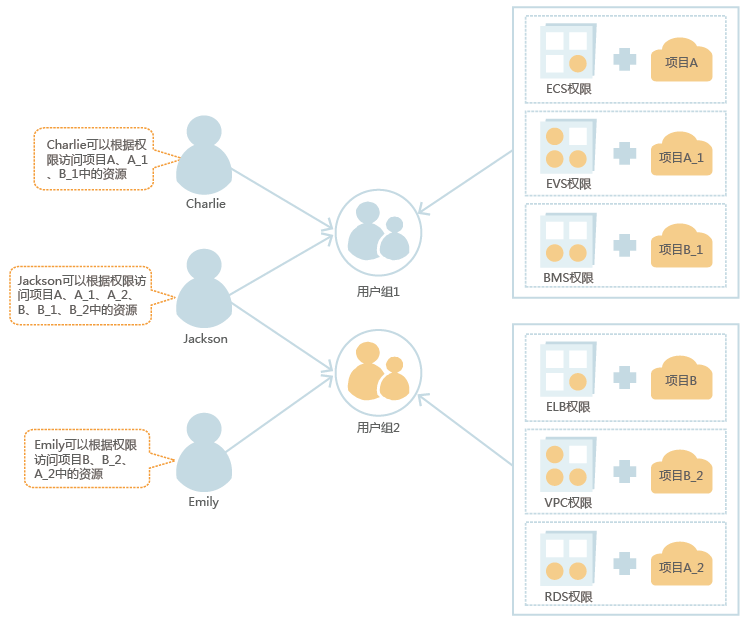
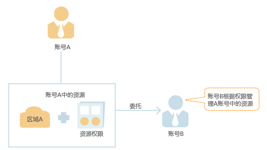
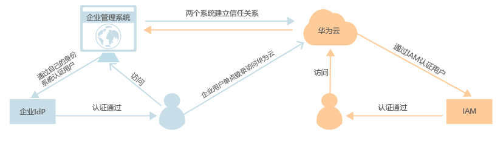

# CCE权限概述

CCE权限管理是在[统一身份认证服务（IAM）](#section1752652204618)与[Kubernetes的角色访问控制（RBAC）](#section89884567218)的能力基础上，打造的细粒度权限管理功能，支持基于IAM的细粒度权限控制和IAM Token认证，支持集群级别、命名空间级别的权限控制，帮助用户便捷灵活的对租户下的IAM用户、用户组设定不同的操作权限。

如果您需要对华为云上购买的CCE集群及相关资源进行精细的权限管理，例如限制不同部门的员工拥有部门内资源的细粒度权限，您可以使用CCE权限管理提供的增强能力进行多维度的权限管理。

本章节将介绍CCE权限管理机制及其涉及到的基本概念。如果当前华为云账号已经能满足您的要求，您可以跳过本章节，不影响您使用CCE服务的其它功能。

## CCE支持的权限管理能力

CCE权限管理主要分为集群权限、命名空间权限，能够从集群和命名空间层面对用户组或用户进行细粒度授权，具体解释如下：

-   **[集群权限](#section824312412013)：**是基于IAM系统策略的授权，可以通过用户组功能实现IAM用户的授权。用户组是用户的集合，通过集群权限设置可以让某些用户组操作集群（如创建、删除集群等），而让某些用户组仅能查看集群。

    集群权限涉及CCE非Kubernetes API，支持IAM细粒度策略、企业项目管理相关能力。

-   **[命名空间权限](#section944114820217)：**是基于Kubernetes RBAC能力的授权，通过权限设置可以让不同的用户或用户组拥有操作不同Kubernetes资源的权限。同时CCE基于开源能力进行了增强，可以支持基于IAM用户或用户组粒度进行RBAC授权、IAM token直接访问 API进行RBAC认证鉴权。

    命名空间权限涉及CCE Kubernetes API，基于Kubernetes RBAC能力进行增强，支持对接IAM 用户/用户组进行授权和认证鉴权，但与IAM细粒度策略独立。

> **注意：**   
>“集群权限“仅针对与集群相关的资源（如集群、节点等）有效，您必须确保同时配置了“命名空间权限“，才能有操作Kubernetes资源（如工作负载、Service等）的权限。  

**图 1**  CCE权限管理  

## 统一身份认证服务（IAM）

统一身份认证（Identity and Access Management，简称IAM）是华为云提供权限管理的基础服务，可以帮助您安全地控制华为云服务和资源的访问权限。

关于账号\(租户\)、IAM用户、账号与IAM用户的关系、用户组、权限、授权、项目等使用IAM服务时常用的基本概念，请参见[IAM基本概念](https://support.huaweicloud.com/productdesc-iam/iam_01_0023.html)。

**以下为IAM的优势：**

**对华为云的资源进行精细访问控制**

您注册华为云后，系统自动创建账号，账号是资源的归属以及使用计费的主体，对其所拥有的资源具有完全控制权限，可以访问华为云所有的云服务。

如果您在华为云购买了多种资源，例如弹性云服务器、云硬盘、裸金属服务器等，您的团队或应用程序需要使用您在华为云中的资源，您可以使用IAM的用户管理功能，给员工或应用程序创建IAM用户，并授予IAM用户刚好能完成工作所需的权限，新创建的IAM用户可以使用自己单独的用户名和密码登录华为云。IAM用户的作用是多用户协同操作同一账号时，避免分享账号的密码。

除了IAM外，还有企业管理服务同样可以进行资源权限管理，相对于IAM，企业管理对资源的控制粒度更为精细，同时还支持企业项目费用的管理，建议结合企业需求选择IAM或是企业管理进行资源权限管理，关于两者的详细区别，请参见：[IAM与企业管理的区别](https://support.huaweicloud.com/iam_faq/iam_01_0101.html)及[IAM项目和企业项目的区别](https://support.huaweicloud.com/iam_faq/iam_01_0606.html)。

**跨账号的资源操作与授权**

如果您在华为云购买了多种资源，其中一种资源希望由其它账号管理，您可以使用IAM提供的委托功能。

例如您在华为云上购买的部分资源，希望委托给一家专业的代运维公司来运维，通过IAM的委托功能，代运维公司可以使用自己的账号对您委托的资源进行运维。当委托关系发生变化时，您可以随时修改或撤消对代运维公司的授权。下图中账号A即为委托方，账号B为被委托方。

**使用企业已有账号登录华为云**

当您希望本企业员工可以使用企业内部的认证系统登录华为云，而不需要在华为云中重新创建对应的IAM用户，您可以使用IAM的身份提供商功能，建立您所在企业与华为云的信任关系，通过联合认证使员工使用企业已有账号直接登录华为云，实现单点登录。

## Kubernetes的角色访问控制（RBAC）

Kubernetes基于角色的访问控制（Role-Based Access Control, 即”RBAC”）使用”rbac.authorization.k8s.io” API Group实现授权决策，允许管理员通过Kubernetes API动态配置策略。详情请参见[命名空间权限](命名空间权限.md)。

