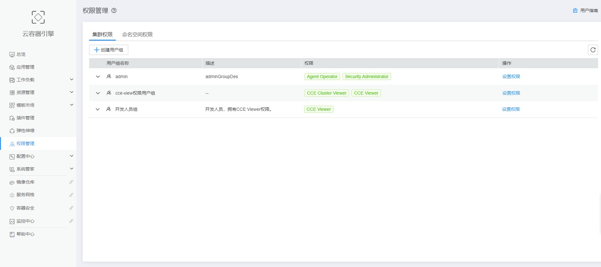

# CCE权限说明

CCE权限管理是在Kubernetes的角色访问控制（RBAC）与统一身份认证服务（IAM）的能力基础上，打造的细粒度权限管理功能，支持基于IAM的细粒度权限控制和IAM Token认证，支持集群级别、命名空间级别的权限控制，帮助用户便捷灵活的对租户下的IAM用户、用户组设定不同的操作权限。

CCE的权限管理包括“集群权限“和“命名空间权限“两种能力，能够从集群和命名空间层面对用户组或用户进行细粒度授权，具体解释如下：

-   **[集群权限](#section824312412013)：**是基于IAM系统策略的授权，可以通过用户组功能实现IAM用户的授权。用户组是用户的集合，通过集群权限设置可以让某些用户组操作集群（如创建、删除集群等），而让某些用户组仅能查看集群。
-   **[命名空间权限](#section944114820217)：**是基于Kubernetes RBAC能力的授权。通过权限设置可以让不同的用户或用户组拥有操作不同Kubernetes资源的权限。

**图 1**  CCE权限管理  

## 集群权限

集群权限是基于IAM系统策略的授权，可以通过用户组功能实现IAM用户的授权，当前包含**CCE FullAccess**和**CCE ReadOnlyAccess**两种策略。

CCE FullAccess策略权限如下：

**表 1**  CCE FullAccess策略主要权限

<table><thead align="left"><tr id="row64098000"><th class="cellrowborder" valign="top" width="20.4%" id="mcps1.2.4.1.1">
操作（Action）

</th>
<th class="cellrowborder" valign="top" width="26.6%" id="mcps1.2.4.1.2">
Action详情

</th>
<th class="cellrowborder" valign="top" width="53%" id="mcps1.2.4.1.3">
说明

</th>
</tr>
</thead>
<tbody><tr id="row33671837142011"><td class="cellrowborder" rowspan="19" valign="top" width="20.4%" headers="mcps1.2.4.1.1 ">
cce:*:*

</td>
<td class="cellrowborder" valign="top" width="26.6%" headers="mcps1.2.4.1.2 ">
cce:cluster:create

</td>
<td class="cellrowborder" valign="top" width="53%" headers="mcps1.2.4.1.3 ">
创建集群

</td>
</tr>
<tr id="row1136803716207"><td class="cellrowborder" valign="top" headers="mcps1.2.4.1.1 ">
cce:cluster:delete

</td>
<td class="cellrowborder" valign="top" headers="mcps1.2.4.1.2 ">
删除集群

</td>
</tr>
<tr id="row236893713200"><td class="cellrowborder" valign="top" headers="mcps1.2.4.1.1 ">
cce:cluster:update

</td>
<td class="cellrowborder" valign="top" headers="mcps1.2.4.1.2 ">
更新集群，如后续允许集群支持RBAC，调度参数更新等

</td>
</tr>
<tr id="row14369237182014"><td class="cellrowborder" valign="top" headers="mcps1.2.4.1.1 ">
cce:cluster:upgrade

</td>
<td class="cellrowborder" valign="top" headers="mcps1.2.4.1.2 ">
升级集群

</td>
</tr>
<tr id="row336911371201"><td class="cellrowborder" valign="top" headers="mcps1.2.4.1.1 ">
cce:cluster:start

</td>
<td class="cellrowborder" valign="top" headers="mcps1.2.4.1.2 ">
唤醒集群

</td>
</tr>
<tr id="row10369173792011"><td class="cellrowborder" valign="top" headers="mcps1.2.4.1.1 ">
cce:cluster:stop

</td>
<td class="cellrowborder" valign="top" headers="mcps1.2.4.1.2 ">
休眠集群

</td>
</tr>
<tr id="row9371153720209"><td class="cellrowborder" valign="top" headers="mcps1.2.4.1.1 ">
cce:cluster:list

</td>
<td class="cellrowborder" valign="top" headers="mcps1.2.4.1.2 ">
查询集群列表

</td>
</tr>
<tr id="row1337193719205"><td class="cellrowborder" valign="top" headers="mcps1.2.4.1.1 ">
cce:cluster:get

</td>
<td class="cellrowborder" valign="top" headers="mcps1.2.4.1.2 ">
查询集群详情

</td>
</tr>
<tr id="row183721437152013"><td class="cellrowborder" valign="top" headers="mcps1.2.4.1.1 ">
cce:node:create

</td>
<td class="cellrowborder" valign="top" headers="mcps1.2.4.1.2 ">
添加节点

</td>
</tr>
<tr id="row1337223782012"><td class="cellrowborder" valign="top" headers="mcps1.2.4.1.1 ">
cce:node:delete

</td>
<td class="cellrowborder" valign="top" headers="mcps1.2.4.1.2 ">
删除节点/批量删除节点

</td>
</tr>
<tr id="row537316378201"><td class="cellrowborder" valign="top" headers="mcps1.2.4.1.1 ">
cce:node:update

</td>
<td class="cellrowborder" valign="top" headers="mcps1.2.4.1.2 ">
更新节点，如更新节点名称

</td>
</tr>
<tr id="row9374137182017"><td class="cellrowborder" valign="top" headers="mcps1.2.4.1.1 ">
cce:node:get

</td>
<td class="cellrowborder" valign="top" headers="mcps1.2.4.1.2 ">
查询节点详情

</td>
</tr>
<tr id="row95581429192015"><td class="cellrowborder" valign="top" headers="mcps1.2.4.1.1 ">
cce:node:list

</td>
<td class="cellrowborder" valign="top" headers="mcps1.2.4.1.2 ">
查询节点列表

</td>
</tr>
<tr id="row4559162992016"><td class="cellrowborder" valign="top" headers="mcps1.2.4.1.1 ">
cce:job:list

</td>
<td class="cellrowborder" valign="top" headers="mcps1.2.4.1.2 ">
查询任务列表（集群层面的job）

</td>
</tr>
<tr id="row195591929132018"><td class="cellrowborder" valign="top" headers="mcps1.2.4.1.1 ">
cce:job:delete

</td>
<td class="cellrowborder" valign="top" headers="mcps1.2.4.1.2 ">
删除任务/批量删除任务（集群层面的job）

</td>
</tr>
<tr id="row2056082962010"><td class="cellrowborder" valign="top" headers="mcps1.2.4.1.1 ">
cce:job:get

</td>
<td class="cellrowborder" valign="top" headers="mcps1.2.4.1.2 ">
查询任务详情（集群层面的job）

</td>
</tr>
<tr id="row176811342112812"><td class="cellrowborder" valign="top" headers="mcps1.2.4.1.1 ">
cce:storage:create

</td>
<td class="cellrowborder" valign="top" headers="mcps1.2.4.1.2 ">
创建存储

</td>
</tr>
<tr id="row17431133642816"><td class="cellrowborder" valign="top" headers="mcps1.2.4.1.1 ">
cce:storage:delete

</td>
<td class="cellrowborder" valign="top" headers="mcps1.2.4.1.2 ">
删除存储

</td>
</tr>
<tr id="row1355001813192"><td class="cellrowborder" valign="top" headers="mcps1.2.4.1.1 ">
cce:kubernetes:*

</td>
<td class="cellrowborder" valign="top" headers="mcps1.2.4.1.2 ">
操作所有kubernetes资源，具体权限请在<a href="#section944114820217">命名空间权限</a>中配置。

</td>
</tr>
<tr id="row7655154602020"><td class="cellrowborder" valign="top" width="20.4%" headers="mcps1.2.4.1.1 ">
ecs:*:*

</td>
<td class="cellrowborder" valign="top" width="26.6%" headers="mcps1.2.4.1.2 ">
-

</td>
<td class="cellrowborder" valign="top" width="53%" headers="mcps1.2.4.1.3 ">
ECS（弹性云服务器）服务的所有权限。

</td>
</tr>
<tr id="row13685854112019"><td class="cellrowborder" valign="top" width="20.4%" headers="mcps1.2.4.1.1 ">
evs:*:*

</td>
<td class="cellrowborder" valign="top" width="26.6%" headers="mcps1.2.4.1.2 ">
具体action详见：<a href="https://support.huaweicloud.com/api-evs/evs_04_0026.html" target="_blank" rel="noopener noreferrer">云硬盘v2接口的授权信息</a>。

</td>
<td class="cellrowborder" valign="top" width="53%" headers="mcps1.2.4.1.3 ">
EVS（云硬盘）的所有权限。

可以将云硬盘挂载到云服务器，并可以随时扩容云硬盘容量

</td>
</tr>
<tr id="row1222410528205"><td class="cellrowborder" valign="top" width="20.4%" headers="mcps1.2.4.1.1 ">
vpc:*:*

</td>
<td class="cellrowborder" valign="top" width="26.6%" headers="mcps1.2.4.1.2 ">
-

</td>
<td class="cellrowborder" valign="top" width="53%" headers="mcps1.2.4.1.3 ">
VPC（虚拟私有云，包含二代ELB）的所有权限。

创建的集群需要运行在虚拟私有云中，创建命名空间时，需要创建或关联VPC，创建在命名空间的容器都运行在VPC之内。

</td>
</tr>
<tr id="row11629359101313"><td class="cellrowborder" valign="top" width="20.4%" headers="mcps1.2.4.1.1 ">
sfs:*:get*

</td>
<td class="cellrowborder" valign="top" width="26.6%" headers="mcps1.2.4.1.2 ">
-

</td>
<td class="cellrowborder" valign="top" width="53%" headers="mcps1.2.4.1.3 ">
SFS（弹性文件服务）资源详情的查看权限。

</td>
</tr>
<tr id="row630418590147"><td class="cellrowborder" valign="top" width="20.4%" headers="mcps1.2.4.1.1 ">
aom:*:get

</td>
<td class="cellrowborder" valign="top" width="26.6%" headers="mcps1.2.4.1.2 ">
-

</td>
<td class="cellrowborder" valign="top" width="53%" headers="mcps1.2.4.1.3 ">
AOM（应用运维管理）资源详情的查看权限。

</td>
</tr>
<tr id="row1767414251516"><td class="cellrowborder" valign="top" width="20.4%" headers="mcps1.2.4.1.1 ">
aom:*:list

</td>
<td class="cellrowborder" valign="top" width="26.6%" headers="mcps1.2.4.1.2 ">
-

</td>
<td class="cellrowborder" valign="top" width="53%" headers="mcps1.2.4.1.3 ">
AOM（应用运维管理）资源列表的查看权限。

</td>
</tr>
<tr id="row873810362151"><td class="cellrowborder" valign="top" width="20.4%" headers="mcps1.2.4.1.1 ">
aom:autoScalingRule:*

</td>
<td class="cellrowborder" valign="top" width="26.6%" headers="mcps1.2.4.1.2 ">
-

</td>
<td class="cellrowborder" valign="top" width="53%" headers="mcps1.2.4.1.3 ">
AOM（应用运维管理）自动扩缩容规则的所有操作权限。

</td>
</tr>
</tbody>
</table>

CCE ReadOnlyAccess策略权限如下：

**表 2**  CCE ReadOnlyAccess策略主要权限

<table><thead align="left"><tr id="row156351513348"><th class="cellrowborder" valign="top" width="19.97%" id="mcps1.2.4.1.1">
操作（Action）

</th>
<th class="cellrowborder" valign="top" width="27.029999999999998%" id="mcps1.2.4.1.2">
操作（Action）

</th>
<th class="cellrowborder" valign="top" width="53%" id="mcps1.2.4.1.3">
说明

</th>
</tr>
</thead>
<tbody><tr id="row20566115103417"><td class="cellrowborder" rowspan="3" valign="top" width="19.97%" headers="mcps1.2.4.1.1 ">
cce:*:get

</td>
<td class="cellrowborder" valign="top" width="27.029999999999998%" headers="mcps1.2.4.1.2 ">
cce:cluster:get

</td>
<td class="cellrowborder" valign="top" width="53%" headers="mcps1.2.4.1.3 ">
查询集群详情

</td>
</tr>
<tr id="row1356613154348"><td class="cellrowborder" valign="top" headers="mcps1.2.4.1.1 ">
cce:node:get

</td>
<td class="cellrowborder" valign="top" headers="mcps1.2.4.1.2 ">
查询节点详情

</td>
</tr>
<tr id="row5568101519341"><td class="cellrowborder" valign="top" headers="mcps1.2.4.1.1 ">
cce:job:get

</td>
<td class="cellrowborder" valign="top" headers="mcps1.2.4.1.2 ">
查询任务详情（集群层面的job）

</td>
</tr>
<tr id="row155691015153414"><td class="cellrowborder" rowspan="3" valign="top" width="19.97%" headers="mcps1.2.4.1.1 ">
cce:*:list

</td>
<td class="cellrowborder" valign="top" width="27.029999999999998%" headers="mcps1.2.4.1.2 ">
cce:cluster:list

</td>
<td class="cellrowborder" valign="top" width="53%" headers="mcps1.2.4.1.3 ">
查询集群列表

</td>
</tr>
<tr id="row95691715183418"><td class="cellrowborder" valign="top" headers="mcps1.2.4.1.1 ">
cce:node:list

</td>
<td class="cellrowborder" valign="top" headers="mcps1.2.4.1.2 ">
查询节点列表

</td>
</tr>
<tr id="row65691715113412"><td class="cellrowborder" valign="top" headers="mcps1.2.4.1.1 ">
cce:job:list

</td>
<td class="cellrowborder" valign="top" headers="mcps1.2.4.1.2 ">
查询任务列表（集群层面的job）

</td>
</tr>
<tr id="row170241171817"><td class="cellrowborder" valign="top" width="19.97%" headers="mcps1.2.4.1.1 ">
cce:kubernetes:*

</td>
<td class="cellrowborder" valign="top" width="27.029999999999998%" headers="mcps1.2.4.1.2 ">
-

</td>
<td class="cellrowborder" valign="top" width="53%" headers="mcps1.2.4.1.3 ">
操作所有kubernetes资源，具体权限请在<a href="#section944114820217">命名空间权限</a>中配置。

</td>
</tr>
<tr id="row1557101593414"><td class="cellrowborder" valign="top" width="19.97%" headers="mcps1.2.4.1.1 ">
ecs:*:get

</td>
<td class="cellrowborder" valign="top" width="27.029999999999998%" headers="mcps1.2.4.1.2 ">
-

</td>
<td class="cellrowborder" valign="top" width="53%" headers="mcps1.2.4.1.3 ">
ECS（弹性云服务器）所有资源详情的查看权限。

CCE中的一个节点就是具有多个云硬盘的一台弹性云服务器

</td>
</tr>
<tr id="row486071571816"><td class="cellrowborder" valign="top" width="19.97%" headers="mcps1.2.4.1.1 ">
ecs:*:list

</td>
<td class="cellrowborder" valign="top" width="27.029999999999998%" headers="mcps1.2.4.1.2 ">
-

</td>
<td class="cellrowborder" valign="top" width="53%" headers="mcps1.2.4.1.3 ">
ECS（弹性云服务器）所有资源列表的查看权限。

</td>
</tr>
<tr id="row2572115143411"><td class="cellrowborder" valign="top" width="19.97%" headers="mcps1.2.4.1.1 ">
evs:*:get

</td>
<td class="cellrowborder" valign="top" width="27.029999999999998%" headers="mcps1.2.4.1.2 ">
-

</td>
<td class="cellrowborder" valign="top" width="53%" headers="mcps1.2.4.1.3 ">
EVS（云硬盘）所有资源详情的查看权限。可以将云硬盘挂载到云服务器，并可以随时扩容云硬盘容量

</td>
</tr>
<tr id="row4788111418218"><td class="cellrowborder" valign="top" width="19.97%" headers="mcps1.2.4.1.1 ">
evs:*:list

</td>
<td class="cellrowborder" valign="top" width="27.029999999999998%" headers="mcps1.2.4.1.2 ">
-

</td>
<td class="cellrowborder" valign="top" width="53%" headers="mcps1.2.4.1.3 ">
EVS（云硬盘）所有资源列表的查看权限。

</td>
</tr>
<tr id="row17392173118217"><td class="cellrowborder" valign="top" width="19.97%" headers="mcps1.2.4.1.1 ">
evs:*:count

</td>
<td class="cellrowborder" valign="top" width="27.029999999999998%" headers="mcps1.2.4.1.2 ">
-

</td>
<td class="cellrowborder" valign="top" width="53%" headers="mcps1.2.4.1.3 ">
-

</td>
</tr>
<tr id="row12573171515343"><td class="cellrowborder" valign="top" width="19.97%" headers="mcps1.2.4.1.1 ">
vpc:*:get

</td>
<td class="cellrowborder" valign="top" width="27.029999999999998%" headers="mcps1.2.4.1.2 ">
-

</td>
<td class="cellrowborder" valign="top" width="53%" headers="mcps1.2.4.1.3 ">
VPC（虚拟私有云，包含二代ELB）所有资源详情的查看权限。

创建的集群需要运行在虚拟私有云中，创建命名空间时，需要创建或关联VPC，创建在命名空间的容器都运行在VPC之内

</td>
</tr>
<tr id="row178108018228"><td class="cellrowborder" valign="top" width="19.97%" headers="mcps1.2.4.1.1 ">
vpc:*:list

</td>
<td class="cellrowborder" valign="top" width="27.029999999999998%" headers="mcps1.2.4.1.2 ">
-

</td>
<td class="cellrowborder" valign="top" width="53%" headers="mcps1.2.4.1.3 ">
VPC（虚拟私有云，包含二代ELB）所有资源列表的查看权限。

</td>
</tr>
<tr id="row12542155562412"><td class="cellrowborder" valign="top" width="19.97%" headers="mcps1.2.4.1.1 ">
sfs:*:get*

</td>
<td class="cellrowborder" valign="top" width="27.029999999999998%" headers="mcps1.2.4.1.2 ">
-

</td>
<td class="cellrowborder" valign="top" width="53%" headers="mcps1.2.4.1.3 ">
SFS（弹性文件服务）服务所有资源详情的查看权限。

</td>
</tr>
<tr id="row5862111011257"><td class="cellrowborder" valign="top" width="19.97%" headers="mcps1.2.4.1.1 ">
aom:*:get

</td>
<td class="cellrowborder" valign="top" width="27.029999999999998%" headers="mcps1.2.4.1.2 ">
-

</td>
<td class="cellrowborder" valign="top" width="53%" headers="mcps1.2.4.1.3 ">
AOM（应用运维管理）服务所有资源详情的查看权限。

</td>
</tr>
<tr id="row1197081652510"><td class="cellrowborder" valign="top" width="19.97%" headers="mcps1.2.4.1.1 ">
aom:*:list

</td>
<td class="cellrowborder" valign="top" width="27.029999999999998%" headers="mcps1.2.4.1.2 ">
-

</td>
<td class="cellrowborder" valign="top" width="53%" headers="mcps1.2.4.1.3 ">
AOM（应用运维管理）服务所有资源列表的查看权限。

</td>
</tr>
<tr id="row107584135256"><td class="cellrowborder" valign="top" width="19.97%" headers="mcps1.2.4.1.1 ">
aom:autoScalingRule:*

</td>
<td class="cellrowborder" valign="top" width="27.029999999999998%" headers="mcps1.2.4.1.2 ">
-

</td>
<td class="cellrowborder" valign="top" width="53%" headers="mcps1.2.4.1.3 ">
AOM（应用运维管理）服务自动扩缩容规则的所有操作权限。

</td>
</tr>
</tbody>
</table>

## 命名空间权限

Kubernetes RBAC API定义了四种类型：Role、ClusterRole、RoleBinding与ClusterRoleBinding，这四种类型之间的关系和简要说明如下：

-   **Role和ClusterRole：**描述角色和权限的关系。在Kubernetes的RBAC API中，一个角色定义了一组特定权限的规则。命名空间范围内的角色由Role对象定义，而整个Kubernetes集群范围内有效的角色则通过ClusterRole对象实现。
-   **RoleBinding和ClusterRoleBinding：**描述 subjects （包含users, groups, service accounts）和 角色的关系。角色绑定将一个角色中定义的各种权限授予一个或者一组用户，则该用户或用户组则具有对应绑定的Role或ClusterRole定义的权限。

**表 3**  RBAC API所定义的四种类型

<table><thead align="left"><tr id="row1914410211164"><th class="cellrowborder" valign="top" width="30.620000000000005%" id="mcps1.2.3.1.1">
类型名称

</th>
<th class="cellrowborder" valign="top" width="69.38%" id="mcps1.2.3.1.2">
说明

</th>
</tr>
</thead>
<tbody><tr id="row1014417217164"><td class="cellrowborder" valign="top" width="30.620000000000005%" headers="mcps1.2.3.1.1 ">
Role

</td>
<td class="cellrowborder" valign="top" width="69.38%" headers="mcps1.2.3.1.2 ">
Role对象只能用于授予对某一namespace中资源的访问权限。

</td>
</tr>
<tr id="row2014418219161"><td class="cellrowborder" valign="top" width="30.620000000000005%" headers="mcps1.2.3.1.1 ">
ClusterRole

</td>
<td class="cellrowborder" valign="top" width="69.38%" headers="mcps1.2.3.1.2 ">
ClusterRole对象可以授予整个集群范围内资源访问权限， 也可以对以下几种资源的授予访问权限：

<ul id="ul11279114152116"><li>集群范围资源（例如节点，即node）。</li><li>非资源类型endpoint（例如”/healthz”）。</li><li>跨所有namespaces的范围资源（例如pod，需要运行命令kubectl get pods --all-namespaces来查询集群中所有的pod)。</li></ul>
</td>
</tr>
<tr id="row16145329168"><td class="cellrowborder" valign="top" width="30.620000000000005%" headers="mcps1.2.3.1.1 ">
RoleBinding

</td>
<td class="cellrowborder" valign="top" width="69.38%" headers="mcps1.2.3.1.2 ">
RoleBinding可以将同一namespace中的subject（用户）绑定到某个具有特定权限的Role下，则此subject即具有该Role定义的权限。

</td>
</tr>
<tr id="row121452211165"><td class="cellrowborder" valign="top" width="30.620000000000005%" headers="mcps1.2.3.1.1 ">
ClusterRoleBinding

</td>
<td class="cellrowborder" valign="top" width="69.38%" headers="mcps1.2.3.1.2 ">
ClusterRoleBinding在整个集群级别和所有namespaces将特定的subject与ClusterRole绑定，授予权限。

</td>
</tr>
</tbody>
</table>

**CCE命名空间权限**

CCE中的命名空间权限是基于Kubernetes RBAC能力的授权，通过权限设置可以让不同的用户或用户组拥有操作不同Kubernetes资源的权限。

CCE的kubernetes资源通过命名空间进行权限设置，目前包含**admin**、**edit**、**view**三种角色，详见[表4](#table174765455252)。

**表 4**  用户/用户组角色说明

<table><thead align="left"><tr id="row19540194512257"><th class="cellrowborder" valign="top" width="34.300000000000004%" id="mcps1.2.3.1.1">
默认的ClusterRole

</th>
<th class="cellrowborder" valign="top" width="65.7%" id="mcps1.2.3.1.2">
描述

</th>
</tr>
</thead>
<tbody><tr id="row195412454251"><td class="cellrowborder" valign="top" width="34.300000000000004%" headers="mcps1.2.3.1.1 ">
admin

</td>
<td class="cellrowborder" valign="top" width="65.7%" headers="mcps1.2.3.1.2 ">
允许admin访问，可以限制在一个namespace中使用RoleBinding。如果在RoleBinding中使用，则允许对namespace中大多数资源进行读写访问，其中包含创建角色和角色绑定的能力。这一角色不允许操作namespace本身，也不能写入资源限额。

</td>
</tr>
<tr id="row12541445182514"><td class="cellrowborder" valign="top" width="34.300000000000004%" headers="mcps1.2.3.1.1 ">
edit

</td>
<td class="cellrowborder" valign="top" width="65.7%" headers="mcps1.2.3.1.2 ">
允许对命名空间内的大多数资源进行读写操作，不允许查看或修改角色，以及角色绑定。

</td>
</tr>
<tr id="row15541154516259"><td class="cellrowborder" valign="top" width="34.300000000000004%" headers="mcps1.2.3.1.1 ">
view

</td>
<td class="cellrowborder" valign="top" width="65.7%" headers="mcps1.2.3.1.2 ">
允许对多数对象进行只读操作，但是对角色、角色绑定及secret是不可访问的。

</td>
</tr>
</tbody>
</table>

更多Kubernetes RBAC授权的内容可以参考[Kubernetes RBAC官方文档](https://kubernetes.io/docs/admin/authorization/rbac/)。

