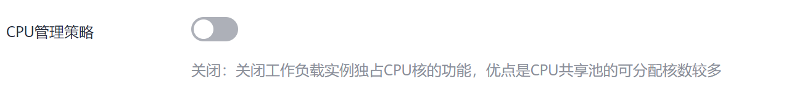

# CPU管理策略

默认情况下，kubelet 使用  [CFS 配额](https://en.wikipedia.org/wiki/Completely_Fair_Scheduler)  来执行 Pod 的 CPU 约束。 当节点上运行了很多 CPU 密集的 Pod 时，工作负载可能会迁移到不同的 CPU 核， 这取决于调度时 Pod 是否被扼制，以及哪些 CPU 核是可用的。许多工作负载对这种迁移不敏感，因此无需任何干预即可正常工作。

在创建集群时可以配置CPU管理策略，如下图所示。

CPU 管理策略通过 kubelet 参数 --cpu-manager-policy 来指定。支持两种策略：

-   关闭（none）：默认策略，显式地启用现有的默认 CPU 亲和方案，不提供操作系统调度器默认行为之外的亲和性策略。
-   开启（static）：针对具有整数型 CPU requests 的 Guaranteed Pod ，它允许该类 Pod 中的容器访问节点上的独占 CPU 资源。

CPU管理策略的详情请参见[CPU 管理策略](https://kubernetes.io/zh/docs/tasks/administer-cluster/cpu-management-policies/)。

