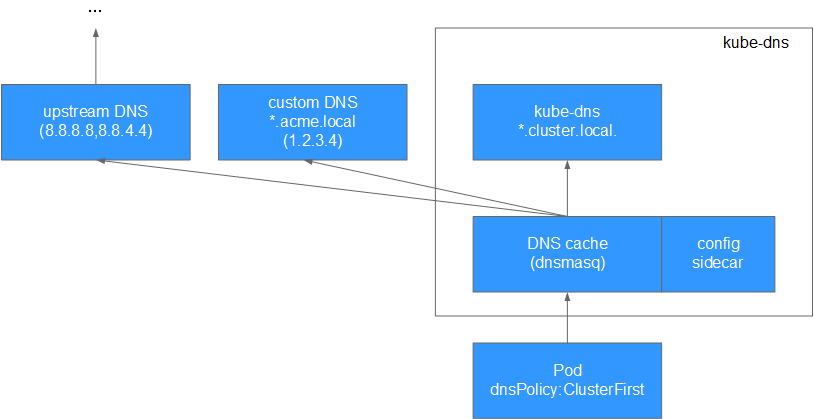

# CoreDNS插件<a name="cce_01_0129"></a>

CoreDNS插件是一款通过链式插件的方式给Kubernetes提供域名解析服务的DNS服务器。（仅在k8s 1.11及以上版本的集群支持）

## 插件简介<a name="section25311744154917"></a>

CoreDNS是一款由CNCF孵化的开源软件，用于Cloud-Native环境下的DNS服务器和服务发现解决方案。CoreDNS实现了插件链式架构，能够按需组合插件，运行效率高、配置灵活。在kubernetes集群中使用CoreDNS能够自动发现集群内的服务，并为这些服务提供域名解析。同时，通过级联华为云的DNS服务器，还能够为集群内的工作负载提供外部域名的解析服务。目前CoreDNS已经成为社区k8s 1.11及以上版本集群推荐的DNS服务器解决方案。

## 使用场景<a name="section202191122814"></a>

在CCE中新建的k8s 1.11集群默认会安装CoreDNS插件，当插件有升级或者BUG修复时，用户无需升级集群或新建集群来升级，仅需安装或升级CoreDNS插件。

## 配置存根域和上游域名服务器<a name="section5202157467"></a>

通过为 kube-dns （kube-system:kube-dns）提供 ConfigMap，集群管理员能够指定自定义存根域和上游域名服务器。

例如，下面的 ConfigMap 建立了一个 DNS 配置，它具有一个单独的存根域和两个上游域名服务器：

```
apiVersion: v1
kind: ConfigMap
metadata:
  name: kube-dns
  namespace: kube-system
data:
  stubDomains: |
    {"acme.local": ["1.2.3.4"]}
  upstreamNameservers: |
    ["8.8.8.8", "8.8.4.4"]
```

按如上说明，具有“.acme.local”后缀的 DNS 请求被转发到 DNS 1.2.3.4。Google公共 DNS服务器为上游查询提供服务。

下表描述了具有特定域名的查询如何映射到它们的目标 DNS 服务器：

**表 1**  特定域名查询映射到目标DNS服务器

<a name="table15371165717620"></a>
<table><thead align="left"><tr id="row437111572610"><th class="cellrowborder" valign="top" width="50%" id="mcps1.2.3.1.1"><p id="p19464152913305"><a name="p19464152913305"></a><a name="p19464152913305"></a>域名</p>
</th>
<th class="cellrowborder" valign="top" width="50%" id="mcps1.2.3.1.2"><p id="p1196414461287"><a name="p1196414461287"></a><a name="p1196414461287"></a>响应查询的服务器</p>
</th>
</tr>
</thead>
<tbody><tr id="row7359114242810"><td class="cellrowborder" valign="top" width="50%" headers="mcps1.2.3.1.1 "><p id="p183717571164"><a name="p183717571164"></a><a name="p183717571164"></a>kubernetes.default.svc.cluster.local</p>
</td>
<td class="cellrowborder" valign="top" width="50%" headers="mcps1.2.3.1.2 "><p id="p837125719619"><a name="p837125719619"></a><a name="p837125719619"></a>kube-dns</p>
</td>
</tr>
<tr id="row1137111571961"><td class="cellrowborder" valign="top" width="50%" headers="mcps1.2.3.1.1 "><p id="p13711957069"><a name="p13711957069"></a><a name="p13711957069"></a>foo.acme.local</p>
</td>
<td class="cellrowborder" valign="top" width="50%" headers="mcps1.2.3.1.2 "><p id="p1337119570616"><a name="p1337119570616"></a><a name="p1337119570616"></a>自定义 DNS (1.2.3.4)</p>
</td>
</tr>
<tr id="row63711357469"><td class="cellrowborder" valign="top" width="50%" headers="mcps1.2.3.1.1 "><p id="p173719572067"><a name="p173719572067"></a><a name="p173719572067"></a>widget.com</p>
</td>
<td class="cellrowborder" valign="top" width="50%" headers="mcps1.2.3.1.2 "><p id="p14371185712614"><a name="p14371185712614"></a><a name="p14371185712614"></a>上游 DNS (8.8.8.8, 8.8.4.4，其中之一)</p>
</td>
</tr>
</tbody>
</table>

## kubernetes中的域名解析逻辑<a name="section1860523212152"></a>

可以为每个 Pod 设置 DNS 策略。当前 Kubernetes 支持两种 Pod 特定的 DNS 策略：“Default” 和 “ClusterFirst”，可以通过 dnsPolicy 标志来指定这些策略。

> **说明：**   
>“Default” 不是默认的 DNS 策略。如果没有显式地指定  _dnsPolicy_，将会使用“ClusterFirst”。  

**“Default”DNS 策略**

如果 dnsPolicy 被设置为“Default”，则名字解析配置会继承自 Pod 运行所在的节点。 自定义上游域名服务器和存根域不能够与这个策略一起使用。

**“ClusterFirst”DNS 策略**

如果 dnsPolicy 被设置为“ClusterFirst”，处理名字解析有所不同，依赖于是否配置了存根域和上游 DNS 服务器。

**未进行自定义配置：**没有匹配上配置的集群域名后缀的任何请求，例如 “www.kubernetes.io”，将会被转发到继承自节点的上游域名服务器。

**进行自定义配置：**如果配置了存根域和上游 DNS 服务器（类似于[配置存根域和上游域名服务器](#section5202157467)配置的内容），DNS 查询将基于下面的流程对请求进行路由：

1.  查询首先被发送到 kube-dns 中的 DNS 缓存层。
2.  从缓存层，检查请求的后缀，并根据下面的情况转发到对应的 DNS 上：
    -   具有集群后缀的名字（例如“.cluster.local”）：请求被发送到 kube-dns。

    -   具有存根域后缀的名字（例如“.acme.local”）：请求被发送到配置的自定义 DNS 解析器（例如：监听在 1.2.3.4）。
    -   未能匹配上后缀的名字（例如“widget.com”）：请求被转发到上游 DNS（例如：Google 公共 DNS 服务器，8.8.8.8 和 8.8.4.4）。


**图 1**  路由请求流程<a name="fig7582181514118"></a>  


## 安装插件<a name="section776571919194"></a>

1.  在CCE控制台中，单击左侧导航栏的“资源管理  \>  插件管理“，在“插件市场“中，单击**coredns**插件下的“安装插件“。

    > **注意：**   
    >由于CoreDNS插件默认以双实例规格进行安装，所以请确认当前集群下至少有两个可用节点。  
    >当前CCE暂不支持在界面上配置上游域名服务器，如需要可自行到后台修改名为“coredns”的configmap。  

2.  在安装插件页面，选择安装的集群和插件版本，单击“下一步“。
3.  为CoreDNS配置存根域。点击“添加“，在“域名”框输入DNS后缀域名，在“IP地址”输入对应的域名服务器（可填多个，由字符“,”隔开）。例子如下：

    单个域名服务器：acme.local -- 1.2.3.4

    多个域名服务器：acme.local -- 1.2.3.4,6.7.8.9

    在单击安装前，可不断通过“添加”和“删除”按钮分别对存根域进行添加和删除。

4.  单击“安装”。安装完成后，会在当前集群中安装该插件实例。

## 升级插件<a name="section19566181513486"></a>

1.  在CCE控制台中，单击左侧导航栏的“资源管理 \> 插件管理“，在“插件实例“页签中，单击**coredns**下的“ 升级“，如果升级按钮处于冻结状态，则说明当前插件版本是最新的版本，不需要进行升级操作；若升级按钮可点击，则点击升级按钮即可升级CoreDNS插件。升级CoreDNS插件时，会对CoreDNS服务进行滚动升级，逐步替换旧版本的CoreDNS，确保域名解析服务不中断。
2.  在弹出的窗口中，单击“确认“，可升级该插件。

## 卸载插件<a name="section7582615184814"></a>

1.  在CCE控制台中，单击左侧导航栏的“资源管理 \> 插件管理“，在“插件实例“页签中，单击**coredns**下的“ 卸载“。
2.  在弹出的窗口中，单击“确认“，可卸载该插件。

