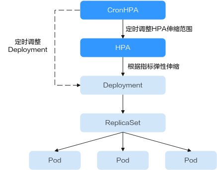
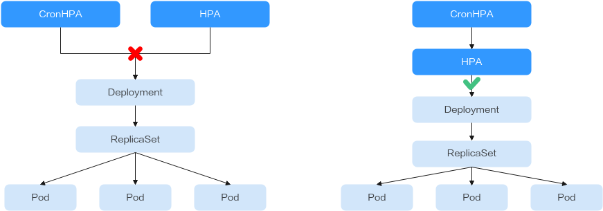
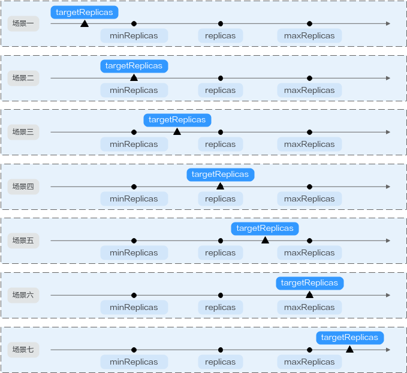

# CronHPA定时策略<a name="cce_10_0415"></a>

## 概述<a name="section431171812233"></a>

在一些复杂的业务场景下，可能有固定时间段高峰业务，又有日常突发高峰业务。此种情况下，用户既期望能定时弹性伸缩应对固定时间段高峰业务，又期望能根据指标弹性伸缩应对日常突发高峰业务。CCE提供CronHPA的自定义资源，实现在固定时间段对集群进行扩缩容，并且可以和HPA策略共同作用，定时调整HPA伸缩范围，实现复杂场景下的工作负载伸缩。



CronHPA支持定时调整HPA策略的最大和最小实例数，也可以直接定时调整Deployment的Pod实例数。

CronHPA的YAML示例如下：

```
apiVersion: autoscaling.cce.io/v2alpha1
kind: CronHorizontalPodAutoscaler
metadata:
  name: ccetest
  namespace: default
spec:
   scaleTargetRef:                  # 关联HPA策略或Deployment
      apiVersion: autoscaling/v1
      kind: HorizontalPodAutoscaler
      name: hpa-test
   rules:
   - ruleName: "scale-down"    
     schedule: "15 * * * *"         # 指定任务运行时间与周期，参数格式请参见[Cron](https://kubernetes.io/zh-cn/docs/concepts/workloads/controllers/cron-jobs/#cron-schedule-syntax)，例如0 * * * * 或@hourly。
     targetReplicas: 1              # 目标实例数量
     disable: false
   - ruleName: "scale-up"
     schedule: "13 * * * *"
     targetReplicas: 6
     disable: false
```

**表 1**  CronHPA关键字段说明

<a name="table1512293113521"></a>
<table><thead align="left"><tr id="row17122231145211"><th class="cellrowborder" valign="top" width="26.810000000000002%" id="mcps1.2.3.1.1"><p id="p19122123135217"><a name="p19122123135217"></a><a name="p19122123135217"></a>字段</p>
</th>
<th class="cellrowborder" valign="top" width="73.19%" id="mcps1.2.3.1.2"><p id="p5122331135214"><a name="p5122331135214"></a><a name="p5122331135214"></a>说明</p>
</th>
</tr>
</thead>
<tbody><tr id="row1412213105211"><td class="cellrowborder" valign="top" width="26.810000000000002%" headers="mcps1.2.3.1.1 "><p id="p20651164795210"><a name="p20651164795210"></a><a name="p20651164795210"></a>apiVersion</p>
</td>
<td class="cellrowborder" valign="top" width="73.19%" headers="mcps1.2.3.1.2 "><p id="p1512273115525"><a name="p1512273115525"></a><a name="p1512273115525"></a>API版本，固定值“autoscaling.cce.io/v2alpha1”。</p>
</td>
</tr>
<tr id="row812253135220"><td class="cellrowborder" valign="top" width="26.810000000000002%" headers="mcps1.2.3.1.1 "><p id="p12317352155217"><a name="p12317352155217"></a><a name="p12317352155217"></a>kind</p>
</td>
<td class="cellrowborder" valign="top" width="73.19%" headers="mcps1.2.3.1.2 "><p id="p137081531128"><a name="p137081531128"></a><a name="p137081531128"></a>API类型，固定值“CronHorizontalPodAutoscaler”。</p>
</td>
</tr>
<tr id="row111221531115213"><td class="cellrowborder" valign="top" width="26.810000000000002%" headers="mcps1.2.3.1.1 "><p id="p66951356175215"><a name="p66951356175215"></a><a name="p66951356175215"></a>metadata.name</p>
</td>
<td class="cellrowborder" valign="top" width="73.19%" headers="mcps1.2.3.1.2 "><p id="p151225314528"><a name="p151225314528"></a><a name="p151225314528"></a>CronHPA策略名称。</p>
</td>
</tr>
<tr id="row19122133115213"><td class="cellrowborder" valign="top" width="26.810000000000002%" headers="mcps1.2.3.1.1 "><p id="p18122133112529"><a name="p18122133112529"></a><a name="p18122133112529"></a>metadata.namespace</p>
</td>
<td class="cellrowborder" valign="top" width="73.19%" headers="mcps1.2.3.1.2 "><p id="p13122193119523"><a name="p13122193119523"></a><a name="p13122193119523"></a>CronHPA策略所在的命名空间。</p>
</td>
</tr>
<tr id="row18122231135213"><td class="cellrowborder" valign="top" width="26.810000000000002%" headers="mcps1.2.3.1.1 "><p id="p3122143115528"><a name="p3122143115528"></a><a name="p3122143115528"></a>spec.scaleTargetRef</p>
</td>
<td class="cellrowborder" valign="top" width="73.19%" headers="mcps1.2.3.1.2 "><p id="p13679321742"><a name="p13679321742"></a><a name="p13679321742"></a>指定CronHPA的扩缩容对象，可配置以下字段：</p>
<a name="ul1677718101761"></a><a name="ul1677718101761"></a><ul id="ul1677718101761"><li>apiVersion：CronHPA扩缩容对象的API版本。</li><li>kind：CronHPA扩缩容对象的API类型。</li><li>name：CronHPA扩缩容对象的名称。</li></ul>
<p id="p111221631115220"><a name="p111221631115220"></a><a name="p111221631115220"></a>CronHPA支持HPA策略或Deployment，具体用法请参见<a href="#section858719277369">使用CronHPA调整HPA伸缩范围</a>或<a href="#section850961716561">使用CronHPA直接调整Deployment实例数量</a>。</p>
</td>
</tr>
<tr id="row114835120518"><td class="cellrowborder" valign="top" width="26.810000000000002%" headers="mcps1.2.3.1.1 "><p id="p7483161220519"><a name="p7483161220519"></a><a name="p7483161220519"></a>spec.rules</p>
</td>
<td class="cellrowborder" valign="top" width="73.19%" headers="mcps1.2.3.1.2 "><p id="p94831712858"><a name="p94831712858"></a><a name="p94831712858"></a>CronHPA策略规则，可添加多个规则。每个规则可配置以下字段：</p>
<a name="ul316713331779"></a><a name="ul316713331779"></a><ul id="ul316713331779"><li>ruleName：CronHPA规则名称，该名称需唯一。</li><li>schedule：指定任务运行时间与周期，参数格式与CronTab类似，请参见<a href="https://kubernetes.io/zh-cn/docs/concepts/workloads/controllers/cron-jobs/#cron-schedule-syntax" target="_blank" rel="noopener noreferrer">Cron</a>，例如0 * * * * 或@hourly。</li><li>targetReplicas：扩缩容的Pod数目。</li><li>disable：参数值为<span class="parmvalue" id="parmvalue1520816457127"><a name="parmvalue1520816457127"></a><a name="parmvalue1520816457127"></a>“true”</span>或<span class="parmvalue" id="parmvalue11873184771213"><a name="parmvalue11873184771213"></a><a name="parmvalue11873184771213"></a>“false”</span>。其中<span class="parmvalue" id="parmvalue1622365212125"><a name="parmvalue1622365212125"></a><a name="parmvalue1622365212125"></a>“false”</span>表示该规则生效，<span class="parmvalue" id="parmvalue6156155514125"><a name="parmvalue6156155514125"></a><a name="parmvalue6156155514125"></a>“true”</span>则表示该规则不生效。</li></ul>
</td>
</tr>
</tbody>
</table>

## 前提条件<a name="section14842515153518"></a>

已安装1.2.13及以上版本[cce-hpa-controller](cce-hpa-controller.md)。

## 使用CronHPA调整HPA伸缩范围<a name="section858719277369"></a>

CronHPA支持定时调整HPA策略的最大和最小实例数，满足复杂场景下的工作负载伸缩。

由于HPA与CronHPA均通过scaleTargetRef字段来获取伸缩对象，如果CronHPA和HPA同时设置Deployment为伸缩对象，两个伸缩策略相互独立，后执行的操作会覆盖先执行的操作，导致伸缩效果不符合预期，因此需避免这种情况发生。



当CronHPA与HPA兼容使用时，需要将CronHPA中的scaleTargetRef字段设置为HPA策略，而HPA策略的scaleTargetRef字段设置为Deployment，这样CronHPA策略会在固定的时间调整HPA策略的实例数量上下限，即可实现工作负载定时伸缩和弹性伸缩的兼容。

1.  <a name="li92391896233"></a>为Deployment创建HPA策略。

    ```
    apiVersion: autoscaling/v1
    kind: HorizontalPodAutoscaler
    metadata:
      name: hpa-test
      namespace: default
    spec:
      maxReplicas: 10               #  最大实例数
      minReplicas: 5               #  最小实例数
      scaleTargetRef:              #  关联Deployment
        apiVersion: apps/v1
        kind: Deployment
        name: nginx
      targetCPUUtilizationPercentage: 50
    ```

2.  创建CronHPA策略，并关联[1](#li92391896233)中创建的HPA策略。

    ```
    apiVersion: autoscaling.cce.io/v2alpha1
    kind: CronHorizontalPodAutoscaler
    metadata:
      name: ccetest
      namespace: default
    spec:
       scaleTargetRef:                  # 关联HPA策略
          apiVersion: autoscaling/v1
          kind: HorizontalPodAutoscaler
          name: hpa-test
       rules:
       - ruleName: "scale-down"    
         schedule: "15 * * * *"         # 指定任务运行时间与周期，参数格式请参见[Cron](https://kubernetes.io/zh-cn/docs/concepts/workloads/controllers/cron-jobs/#cron-schedule-syntax)，例如0 * * * * 或@hourly。
         targetReplicas: 1              # 目标实例数量
         disable: false
       - ruleName: "scale-up"
         schedule: "13 * * * *"
         targetReplicas: 11
         disable: false
    ```

    在CronHPA与HPA共同使用时，CronHPA规则是在HPA策略的基础上生效的，CronHPA不会直接调整Deployment的副本数目，而是通过HPA来操作Deployment，因此了解以下参数可帮助您更好地理解其工作原理。

    -   CronHPA的目标实例数（targetReplicas）：表示CronHPA设定的实例数，在CronHPA生效时用于调整HPA的最大/最小实例数，从而间接调整Deployment实例数。
    -   HPA的最小实例数（minReplicas）：Deployment的实例数下限。
    -   HPA的最大实例数（maxReplicas）：Deployment的实例数上限。
    -   Deployment的实例数（replicas）：CronHPA策略生效之前Deployment的Pod数量。

    在CronHPA规则生效时，通过比较目标实例数（targetReplicas）与实际Deployment的实例数，并结合HPA的最小实例数或最小实例数的数值大小，来调整Deployment实例数的上下限值。

    **图 1**  CronHPA扩缩容场景<a name="fig8528823151719"></a>  
    

    [图1](#fig8528823151719)中为可能存在的扩缩容场景，如下表格以举例的形式说明了不同场景下CronHPA修改HPA的情况。

    <a name="table1259511111590"></a>
    <table><thead align="left"><tr id="row1359391175913"><th class="cellrowborder" valign="top" width="7.140000000000001%" id="mcps1.1.8.1.1"><p id="p1913916712434"><a name="p1913916712434"></a><a name="p1913916712434"></a>场景</p>
    </th>
    <th class="cellrowborder" valign="top" width="21.63%" id="mcps1.1.8.1.2"><p id="p1998551910408"><a name="p1998551910408"></a><a name="p1998551910408"></a>场景说明</p>
    </th>
    <th class="cellrowborder" valign="top" width="11.95%" id="mcps1.1.8.1.3"><p id="p35921112597"><a name="p35921112597"></a><a name="p35921112597"></a>Cronhpa</p>
    <p id="p16592161155912"><a name="p16592161155912"></a><a name="p16592161155912"></a>(targetReplicas)</p>
    </th>
    <th class="cellrowborder" valign="top" width="10.43%" id="mcps1.1.8.1.4"><p id="p659331145918"><a name="p659331145918"></a><a name="p659331145918"></a>Deployment</p>
    <p id="p6593191145918"><a name="p6593191145918"></a><a name="p6593191145918"></a>(replicas)</p>
    </th>
    <th class="cellrowborder" valign="top" width="11.459999999999999%" id="mcps1.1.8.1.5"><p id="p135921113597"><a name="p135921113597"></a><a name="p135921113597"></a>HPA</p>
    <p id="p1059241155911"><a name="p1059241155911"></a><a name="p1059241155911"></a>(minReplicas / maxReplicas)</p>
    </th>
    <th class="cellrowborder" valign="top" width="12.83%" id="mcps1.1.8.1.6"><p id="p1959318105914"><a name="p1959318105914"></a><a name="p1959318105914"></a>最终结果</p>
    </th>
    <th class="cellrowborder" valign="top" width="24.560000000000002%" id="mcps1.1.8.1.7"><p id="p1939718541250"><a name="p1939718541250"></a><a name="p1939718541250"></a>操作说明</p>
    </th>
    </tr>
    </thead>
    <tbody><tr id="row5784203864815"><td class="cellrowborder" valign="top" width="7.140000000000001%" headers="mcps1.1.8.1.1 "><p id="p192157405219"><a name="p192157405219"></a><a name="p192157405219"></a>场景一</p>
    </td>
    <td class="cellrowborder" valign="top" width="21.63%" headers="mcps1.1.8.1.2 "><p id="p199851919164011"><a name="p199851919164011"></a><a name="p199851919164011"></a><strong id="b37940110514"><a name="b37940110514"></a><a name="b37940110514"></a>targetReplicas</strong> &lt; minReplicas ≤ replicas ≤ maxReplicas</p>
    </td>
    <td class="cellrowborder" valign="top" width="11.95%" headers="mcps1.1.8.1.3 "><p id="p05930115913"><a name="p05930115913"></a><a name="p05930115913"></a>4</p>
    </td>
    <td class="cellrowborder" valign="top" width="10.43%" headers="mcps1.1.8.1.4 "><p id="p1659311116596"><a name="p1659311116596"></a><a name="p1659311116596"></a>5</p>
    </td>
    <td class="cellrowborder" valign="top" width="11.459999999999999%" headers="mcps1.1.8.1.5 "><p id="p1659351165914"><a name="p1659351165914"></a><a name="p1659351165914"></a>5/10</p>
    </td>
    <td class="cellrowborder" valign="top" width="12.83%" headers="mcps1.1.8.1.6 "><p id="p859315116597"><a name="p859315116597"></a><a name="p859315116597"></a>HPA: <span>4</span>/10</p>
    <p id="p1559481195913"><a name="p1559481195913"></a><a name="p1559481195913"></a>Deployment: 5</p>
    </td>
    <td class="cellrowborder" valign="top" width="24.560000000000002%" headers="mcps1.1.8.1.7 "><p id="p0582134217113"><a name="p0582134217113"></a><a name="p0582134217113"></a>CronHPA目标实例数低于HPA最小实例数（minReplicas）时：</p>
    <a name="ul8223124413111"></a><a name="ul8223124413111"></a><ul id="ul8223124413111"><li>修改HPA的最小实例数。</li><li>Deployment实例数无修改。</li></ul>
    </td>
    </tr>
    <tr id="row1399713196109"><td class="cellrowborder" valign="top" width="7.140000000000001%" headers="mcps1.1.8.1.1 "><p id="p62152401825"><a name="p62152401825"></a><a name="p62152401825"></a>场景二</p>
    </td>
    <td class="cellrowborder" valign="top" width="21.63%" headers="mcps1.1.8.1.2 "><p id="p1898514194405"><a name="p1898514194405"></a><a name="p1898514194405"></a><strong id="b478416247517"><a name="b478416247517"></a><a name="b478416247517"></a>targetReplicas</strong> = minReplicas ≤ replicas ≤ maxReplicas</p>
    </td>
    <td class="cellrowborder" valign="top" width="11.95%" headers="mcps1.1.8.1.3 "><p id="p1699712195104"><a name="p1699712195104"></a><a name="p1699712195104"></a>5</p>
    </td>
    <td class="cellrowborder" valign="top" width="10.43%" headers="mcps1.1.8.1.4 "><p id="p299851920104"><a name="p299851920104"></a><a name="p299851920104"></a>6</p>
    </td>
    <td class="cellrowborder" valign="top" width="11.459999999999999%" headers="mcps1.1.8.1.5 "><p id="p89971191101"><a name="p89971191101"></a><a name="p89971191101"></a>5/10</p>
    </td>
    <td class="cellrowborder" valign="top" width="12.83%" headers="mcps1.1.8.1.6 "><p id="p19820153311019"><a name="p19820153311019"></a><a name="p19820153311019"></a>HPA: 5/10</p>
    <p id="p6821173361011"><a name="p6821173361011"></a><a name="p6821173361011"></a>Deployment: 6</p>
    </td>
    <td class="cellrowborder" valign="top" width="24.560000000000002%" headers="mcps1.1.8.1.7 "><p id="p1739616545254"><a name="p1739616545254"></a><a name="p1739616545254"></a>CronHPA目标实例数等于HPA最小实例数（minReplicas）时：</p>
    <a name="ul4395195512128"></a><a name="ul4395195512128"></a><ul id="ul4395195512128"><li>HPA的最小实例数无修改。</li><li>Deployment实例数无修改。</li></ul>
    </td>
    </tr>
    <tr id="row1559310119598"><td class="cellrowborder" valign="top" width="7.140000000000001%" headers="mcps1.1.8.1.1 "><p id="p82154401427"><a name="p82154401427"></a><a name="p82154401427"></a>场景三</p>
    </td>
    <td class="cellrowborder" valign="top" width="21.63%" headers="mcps1.1.8.1.2 "><p id="p798591964013"><a name="p798591964013"></a><a name="p798591964013"></a>minReplicas &lt;<strong id="b15983343515"><a name="b15983343515"></a><a name="b15983343515"></a> targetReplicas</strong> &lt; replicas ≤ maxReplicas</p>
    </td>
    <td class="cellrowborder" valign="top" width="11.95%" headers="mcps1.1.8.1.3 "><p id="p1593514595"><a name="p1593514595"></a><a name="p1593514595"></a>4</p>
    </td>
    <td class="cellrowborder" valign="top" width="10.43%" headers="mcps1.1.8.1.4 "><p id="p1459318117591"><a name="p1459318117591"></a><a name="p1459318117591"></a>5</p>
    </td>
    <td class="cellrowborder" valign="top" width="11.459999999999999%" headers="mcps1.1.8.1.5 "><p id="p165938185917"><a name="p165938185917"></a><a name="p165938185917"></a>1/10</p>
    </td>
    <td class="cellrowborder" valign="top" width="12.83%" headers="mcps1.1.8.1.6 "><p id="p1759381155920"><a name="p1759381155920"></a><a name="p1759381155920"></a>HPA: <span>4</span>/10</p>
    <p id="p8593011596"><a name="p8593011596"></a><a name="p8593011596"></a>Deployment: 5</p>
    </td>
    <td class="cellrowborder" valign="top" width="24.560000000000002%" headers="mcps1.1.8.1.7 "><p id="p148621488137"><a name="p148621488137"></a><a name="p148621488137"></a>CronHPA目标实例数大于HPA最小实例数（minReplicas），小于Deployment实例数（replicas）时：</p>
    <a name="ul1718616118132"></a><a name="ul1718616118132"></a><ul id="ul1718616118132"><li>修改HPA的最小实例数。</li><li>Deployment实例数无修改。</li></ul>
    </td>
    </tr>
    <tr id="row17410155411386"><td class="cellrowborder" valign="top" width="7.140000000000001%" headers="mcps1.1.8.1.1 "><p id="p3139137124316"><a name="p3139137124316"></a><a name="p3139137124316"></a>场景四</p>
    </td>
    <td class="cellrowborder" valign="top" width="21.63%" headers="mcps1.1.8.1.2 "><p id="p1098551944010"><a name="p1098551944010"></a><a name="p1098551944010"></a>minReplicas &lt;<strong id="b1650845155212"><a name="b1650845155212"></a><a name="b1650845155212"></a> targetReplicas</strong> = replicas &lt; maxReplicas</p>
    </td>
    <td class="cellrowborder" valign="top" width="11.95%" headers="mcps1.1.8.1.3 "><p id="p1741035413383"><a name="p1741035413383"></a><a name="p1741035413383"></a>5</p>
    </td>
    <td class="cellrowborder" valign="top" width="10.43%" headers="mcps1.1.8.1.4 "><p id="p1410354173812"><a name="p1410354173812"></a><a name="p1410354173812"></a>5</p>
    </td>
    <td class="cellrowborder" valign="top" width="11.459999999999999%" headers="mcps1.1.8.1.5 "><p id="p941017547385"><a name="p941017547385"></a><a name="p941017547385"></a>1/10</p>
    </td>
    <td class="cellrowborder" valign="top" width="12.83%" headers="mcps1.1.8.1.6 "><p id="p15852131733917"><a name="p15852131733917"></a><a name="p15852131733917"></a>HPA: <span>5</span>/10</p>
    <p id="p185291743913"><a name="p185291743913"></a><a name="p185291743913"></a>Deployment: 5</p>
    </td>
    <td class="cellrowborder" valign="top" width="24.560000000000002%" headers="mcps1.1.8.1.7 "><p id="p15647136141313"><a name="p15647136141313"></a><a name="p15647136141313"></a>CronHPA目标实例数大于HPA最小实例数（minReplicas），等于Deployment实例数（replicas）时：</p>
    <a name="ul7587104761511"></a><a name="ul7587104761511"></a><ul id="ul7587104761511"><li>修改HPA的最小实例数。</li><li>Deployment实例数无修改。</li></ul>
    </td>
    </tr>
    <tr id="row0594611592"><td class="cellrowborder" valign="top" width="7.140000000000001%" headers="mcps1.1.8.1.1 "><p id="p1514114284818"><a name="p1514114284818"></a><a name="p1514114284818"></a>场景五</p>
    </td>
    <td class="cellrowborder" valign="top" width="21.63%" headers="mcps1.1.8.1.2 "><p id="p191401142204820"><a name="p191401142204820"></a><a name="p191401142204820"></a>minReplicas ≤ replicas &lt;<strong id="b363710045318"><a name="b363710045318"></a><a name="b363710045318"></a> targetReplicas</strong> &lt; maxReplicas</p>
    </td>
    <td class="cellrowborder" valign="top" width="11.95%" headers="mcps1.1.8.1.3 "><p id="p14594131185910"><a name="p14594131185910"></a><a name="p14594131185910"></a>6</p>
    </td>
    <td class="cellrowborder" valign="top" width="10.43%" headers="mcps1.1.8.1.4 "><p id="p0594111105910"><a name="p0594111105910"></a><a name="p0594111105910"></a>5</p>
    </td>
    <td class="cellrowborder" valign="top" width="11.459999999999999%" headers="mcps1.1.8.1.5 "><p id="p95945185918"><a name="p95945185918"></a><a name="p95945185918"></a>1/10</p>
    </td>
    <td class="cellrowborder" valign="top" width="12.83%" headers="mcps1.1.8.1.6 "><p id="p65941715593"><a name="p65941715593"></a><a name="p65941715593"></a>HPA: <span>6</span>/10</p>
    <p id="p105947155912"><a name="p105947155912"></a><a name="p105947155912"></a>Deployment: <span>6</span></p>
    </td>
    <td class="cellrowborder" valign="top" width="24.560000000000002%" headers="mcps1.1.8.1.7 "><p id="p1818115661517"><a name="p1818115661517"></a><a name="p1818115661517"></a>CronHPA目标实例数大于Deployment实例数（replicas），小于HPA最大实例数（maxReplicas）时：</p>
    <a name="ul1918115564154"></a><a name="ul1918115564154"></a><ul id="ul1918115564154"><li>修改HPA的最小实例数。</li><li>修改Deployment实例数。</li></ul>
    </td>
    </tr>
    <tr id="row1359411114596"><td class="cellrowborder" valign="top" width="7.140000000000001%" headers="mcps1.1.8.1.1 "><p id="p21391179436"><a name="p21391179436"></a><a name="p21391179436"></a>场景六</p>
    </td>
    <td class="cellrowborder" valign="top" width="21.63%" headers="mcps1.1.8.1.2 "><p id="p1985161934020"><a name="p1985161934020"></a><a name="p1985161934020"></a>minReplicas ≤ replicas &lt;<strong id="b36939297543"><a name="b36939297543"></a><a name="b36939297543"></a> targetReplicas</strong> = maxReplicas</p>
    </td>
    <td class="cellrowborder" valign="top" width="11.95%" headers="mcps1.1.8.1.3 "><p id="p101751726351"><a name="p101751726351"></a><a name="p101751726351"></a>10</p>
    </td>
    <td class="cellrowborder" valign="top" width="10.43%" headers="mcps1.1.8.1.4 "><p id="p817522616512"><a name="p817522616512"></a><a name="p817522616512"></a>5</p>
    </td>
    <td class="cellrowborder" valign="top" width="11.459999999999999%" headers="mcps1.1.8.1.5 "><p id="p5175826953"><a name="p5175826953"></a><a name="p5175826953"></a>1/10</p>
    </td>
    <td class="cellrowborder" valign="top" width="12.83%" headers="mcps1.1.8.1.6 "><p id="p3175126356"><a name="p3175126356"></a><a name="p3175126356"></a>HPA: <span>10</span>/10</p>
    <p id="p617517266517"><a name="p617517266517"></a><a name="p617517266517"></a>Deployment: <span>10</span></p>
    </td>
    <td class="cellrowborder" valign="top" width="24.560000000000002%" headers="mcps1.1.8.1.7 "><p id="p6579155819161"><a name="p6579155819161"></a><a name="p6579155819161"></a>CronHPA目标实例数大于Deployment实例数（replicas），等于HPA最大实例数（maxReplicas）时：</p>
    <a name="ul145799583165"></a><a name="ul145799583165"></a><ul id="ul145799583165"><li>修改HPA的最小实例数。</li><li>修改Deployment实例数。</li></ul>
    </td>
    </tr>
    <tr id="row135948165919"><td class="cellrowborder" valign="top" width="7.140000000000001%" headers="mcps1.1.8.1.1 "><p id="p17941446154618"><a name="p17941446154618"></a><a name="p17941446154618"></a>场景七</p>
    </td>
    <td class="cellrowborder" valign="top" width="21.63%" headers="mcps1.1.8.1.2 "><p id="p15555583563"><a name="p15555583563"></a><a name="p15555583563"></a>minReplicas ≤ replicas ≤ maxReplicas &lt; <strong id="b105810375716"><a name="b105810375716"></a><a name="b105810375716"></a>targetReplicas</strong></p>
    </td>
    <td class="cellrowborder" valign="top" width="11.95%" headers="mcps1.1.8.1.3 "><p id="p1259414145914"><a name="p1259414145914"></a><a name="p1259414145914"></a>11</p>
    </td>
    <td class="cellrowborder" valign="top" width="10.43%" headers="mcps1.1.8.1.4 "><p id="p17594111135916"><a name="p17594111135916"></a><a name="p17594111135916"></a>5</p>
    </td>
    <td class="cellrowborder" valign="top" width="11.459999999999999%" headers="mcps1.1.8.1.5 "><p id="p159411165920"><a name="p159411165920"></a><a name="p159411165920"></a>5/10</p>
    </td>
    <td class="cellrowborder" valign="top" width="12.83%" headers="mcps1.1.8.1.6 "><p id="p1159451165918"><a name="p1159451165918"></a><a name="p1159451165918"></a>HPA: <span>11</span>/<span>11</span></p>
    <p id="p259491195913"><a name="p259491195913"></a><a name="p259491195913"></a>Deployment: <span>11</span></p>
    </td>
    <td class="cellrowborder" valign="top" width="24.560000000000002%" headers="mcps1.1.8.1.7 "><p id="p6489141601715"><a name="p6489141601715"></a><a name="p6489141601715"></a>CronHPA目标实例数大于HPA最大实例数（maxReplicas）时：</p>
    <a name="ul4490151619174"></a><a name="ul4490151619174"></a><ul id="ul4490151619174"><li>修改HPA的最小实例数。</li><li>修改HPA的最大实例数。</li><li>修改Deployment实例数。</li></ul>
    </td>
    </tr>
    </tbody>
    </table>


## 使用CronHPA直接调整Deployment实例数量<a name="section850961716561"></a>

CronHPA还可以单独调整关联Deployment，定时调整Deployment的实例数，使用方法如下。

```
apiVersion: autoscaling.cce.io/v2alpha1
kind: CronHorizontalPodAutoscaler
metadata:
  name: ccetest
  namespace: default
spec:
   scaleTargetRef:             # 关联Deployment
      apiVersion: apps/v1
      kind: Deployment
      name: nginx
   rules:
   - ruleName: "scale-down"
     schedule: "08 * * * *"    # 指定任务运行时间与周期，参数格式请参见[Cron](https://kubernetes.io/zh-cn/docs/concepts/workloads/controllers/cron-jobs/#cron-schedule-syntax)，例如0 * * * * 或@hourly。
     targetReplicas: 1
     disable: false
   - ruleName: "scale-up"
     schedule: "05 * * * *"
     targetReplicas: 3
     disable: false
```

