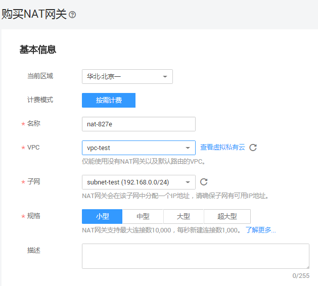
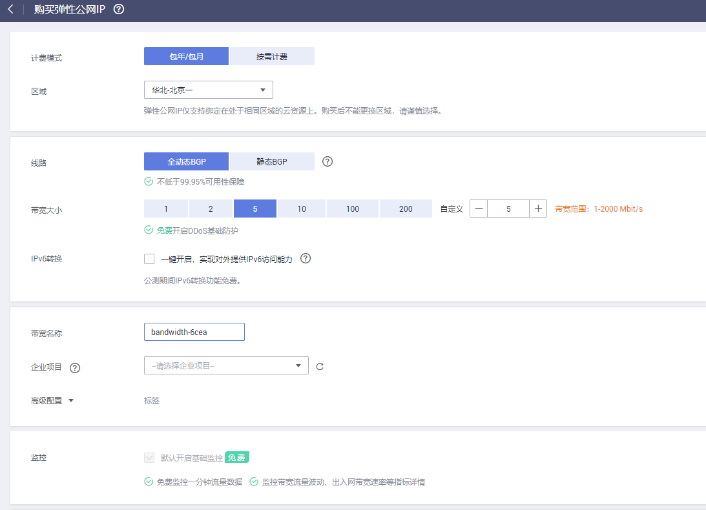

# DNAT网关\(DNAT\)<a name="cce_01_0058"></a>

“DNAT网关“可以为集群节点提供网络地址转换服务，使多个节点可以共享使用弹性IP。

NAT网关与弹性IP方式相比增强了可靠性，弹性IP无需与单个节点绑定，任何节点状态的异常不影响其访问。访问方式由公网弹性IP地址以及设置的访问端口组成，例如“10.117.117.117:80”。

**图 1**  DNAT网关 \( DNAT \)<a name="fig1623231054319"></a>  
.png "DNAT网关-(-DNAT-)")

## 约束与限制<a name="section1153345812121"></a>

关于NAT网关的使用，您需要注意以下几点：

-   同一个NAT网关下的多条规则可以复用同一个弹性公网IP，不同网关下的规则必须使用不同的弹性公网IP。
-   每个VPC支持的NAT网关数为1。
-   用户不能在VPC下手动添加默认路由。
-   VPC内的每个子网只能添加一条SNAT规则。
-   SNAT规则和DNAT规则一般面向不同的业务，如果使用相同的EIP，会面临业务相互抢占问题，请尽量避免。SNAT规则不能和全端口的DNAT规则共用EIP。
-   DNAT规则不支持将弹性公网IP绑定到虚拟IP。
-   当云主机同时配置弹性公网IP服务和NAT网关服务时，数据均通过弹性公网IP转发。
-   SNAT规则中添加的自定义网段，对于虚拟私有云的配置，必须是虚拟私有云子网网段的子集，不能相等。
-   SNAT规则中添加的自定义网段，对于云专线的配置，必须是云专线侧网段，且不能与虚拟私有云侧的网段冲突。
-   当执行云服务器底层资源操作（如变更规格）时，会导致已配置的NAT规则失效，需要删除后重新配置。
-   创建service后，如果[服务亲和](#li36098269511)从集群级别切换为节点级别，连接跟踪表将不会被清理，建议用户创建service后不要修改服务亲和属性，如需修改请重新创建servcie。

## 前提条件<a name="section33871214153614"></a>

你需要提前创建NAT网关实例和弹性IP，具体操作步骤如下：

1.  登录管理控制台，在服务列表中选择“网络 \> NAT网关”，单击页面右上角的“购买NAT网关“。下图是购买NAT网关的案例，请根据实际业务需求填写相关内容。

    > **说明：** 
    >购买NAT网关，选择VPC和子网时，请确保与CCE中运行业务的集群VPC和子网一致。

    **图 2**  购买NAT网关<a name="fig65141147164317"></a>  
    

2.  在管理控制台，在服务列表中选择“网络 \> 弹性公网IP”，单击右上角的“购买弹性公网IP”。下图是购买弹性IP的案例，请根据实际业务需求填写相关内容。

    **图 3**  购买弹性公网IP<a name="fig1665717534483"></a>  
    


## 工作负载创建时设置<a name="section744117150366"></a>

您可以在创建工作负载时通过CCE控制台设置Service访问方式，本节以nginx为例进行说明。具体操作如下：

1.  参考[创建无状态负载\(Deployment\)](创建无状态负载(Deployment).md)、[创建有状态负载\(StatefulSet\)](创建有状态负载(StatefulSet).md)或[创建守护进程集\(DaemonSet\)](创建守护进程集(DaemonSet).md)，在“工作负载访问设置“步骤，单击“添加服务“。
    -   **访问类型：**选择“DNAT网关 \( DNAT \)“。
    -   **Service名称：**自定义服务名称，可与工作负载名称保持一致。
    -   <a name="li36098269511"></a>**服务亲和：**
        -   集群级别：集群下所有节点的IP+访问端口均可以访问到此服务关联的负载，服务访问会因路由跳转导致一定性能损失，且无法获取到客户端源IP。
        -   节点级别：只有通过负载所在节点的IP+访问端口才可以访问此服务关联的负载，服务访问没有因路由跳转导致的性能损失，且可以获取到客户端源IP。

    -   **NAT网关：**
        -   NAT网关：请选择对应的NAT网关，若没有请单击“创建NAT网关”进行创建，NAT网关需与当前集群处于相同VPC。
        -   弹性公网IP：请选择对应的弹性公网IP，若没有请单击“创建弹性公网IP”进行创建。
        -   阅读并确认“NAT网关使用约束“后，单击勾选“我已阅读和同意NAT网关使用约束“。

    -   **端口配置：**
        -   协议：请根据业务的协议类型选择。
        -   容器端口：容器镜像中工作负载实际监听端口，需用户确定。nginx程序实际监听的端口为80。
        -   访问端口：容器端口映射端口，访问工作负载时使用，端口范围为1-65535，可任意指定。

2.  完成配置后，直接单击“确定“。
3.  单击“下一步“进入“高级设置“页面，直接单击“创建“。
4.  工作负载创建成功后，单击“工作负载 \> 无状态负载 Deployment“或“工作负载 \> 有状态负载 StatefulSet“，在工作负载列表页面，单击“查看应用详情“进入工作负载详情页，在“访问方式“页签下，获取方式地址，例如“10.154.78.160:2“。
5.  单击访问地址，即可跳转到访问页面。

    **图 4**  通过NAT网关访问nginx（一）<a name="fig1543716518012"></a>  
    


## 工作负载创建完成后设置<a name="section156711537124016"></a>

您可以在工作负载创建完成后对Service进行配置，此配置对工作负载状态无影响，且实时生效。具体操作如下：

1.  登录[CCE控制台](https://console.huaweicloud.com/cce2.0/?utm_source=helpcenter)，在左侧导航栏中选择“工作负载 \> 无状态负载 Deployment”，在工作负载列表页单击要设置Service的工作负载名称。
2.  在“访问方式“页签，单击“添加Service”。
3.  在“添加Service“页面，访问类型选择“DNAT网关 \( DNAT \)”。
4.  设置DNAT网关参数。
    -   **Servcie名称：**自定义服务名称，可与工作负载名称保持一致。
    -   **集群名称：**工作负载所在集群，此处不可修改。
    -   **命名空间：**工作负载所在命名空间，此处不可修改。
    -   **关联工作负载：**要添加Service的工作负载，此处不可修改。
    -   **服务亲和：**
        -   集群级别：集群下所有节点的IP+访问端口均可以访问到此服务关联的负载，服务访问会因路由跳转导致一定性能损失，且无法获取到客户端源IP。
        -   节点级别：只有通过负载所在节点的IP+访问端口才可以访问此服务关联的负载，服务访问没有因路由跳转导致的性能损失，且可以获取到客户端源IP。

    -   **NAT网关：**
        -   请选择对应的NAT网关，若没有请单击“创建NAT网关”创建，NAT网关需与当前集群处于相同VPC。
        -   请选择对应的弹性公网IP，若没有请单击“创建弹性公网IP”创建。
        -   确认并阅读“NAT网关使用约束“后，单击勾选“我已阅读和同意NAT网关使用约束“。

    -   **端口配置：**
        -   协议：请根据业务的协议类型选择。
        -   容器端口：容器镜像中工作负载程序实际监听端口，需用户确定。nginx程序实际监听的端口为80。
        -   访问端口：容器端口映射端口，访问工作负载时使用，端口范围为1-65535，可任意指定。

5.  单击“创建”。工作负载已添加“DNAT网关 \( DNAT \)”的服务。

## 更新Service<a name="section1335271211407"></a>

暂不支持DNAT网关 \( DNAT \)的更新。

## 通过kubectl命令行创建<a name="section646312404363"></a>

您可以在创建工作负载时通过kubectl命令行设置Service访问方式。本节以nginx为例，说明kubectl命令实现集群内访问的方法。

**前提条件**

请参见[通过kubectl或web-terminal插件连接CCE集群](通过kubectl或web-terminal插件连接CCE集群.md)配置kubectl命令，使弹性云服务器连接集群。

**操作步骤**

1.  登录已配置好kubectl命令的弹性云服务器。登录方法请参见[登录Linux弹性云服务器](https://support.huaweicloud.com/usermanual-ecs/zh-cn_topic_0013771089.html)。
2.  创建并编辑nginx-deployment.yaml以及nginx-nat-svc.yaml文件。

    其中，nginx-deployment.yaml和nginx-nat-svc.yaml为自定义名称，您可以随意命名。

    **vi nginx-deployment.yaml**

    ```
    apiVersion: extensions/v1beta1
    kind: Deployment
    metadata:
      name: nginx
    spec:
      replicas: 1
      selector:
        matchLabels:
          app: nginx
      strategy:
        type: RollingUpdate
      template:
        metadata:
          labels:
            app: nginx
        spec:
          containers:
          - image: nginx 
            imagePullPolicy: Always
            name: nginx
          imagePullSecrets:
          - name: default-secret
    ```

    以上字段的解释请参见[表3](创建无状态负载(Deployment).md#table132326831016)。

    **vi nginx-nat-svc.yaml**

    ```
    apiVersion: v1 
    kind: Service 
    metadata: 
      labels: 
        app: nginx 
      name: nginx 
      annotations:
        kubernetes.io/elb.class: dnat
        kubernetes.io/natgateway.id: e4a1cfcf-29df-4ab8-a4ea-c05dc860f554
    spec: 
      loadBalancerIP: 10.78.42.242
      ports: 
      - name: service0 
        port: 80 
        protocol: TCP 
        targetPort: 80 
      selector: 
        app: nginx 
      type: LoadBalancer
    ```

    **表 1**  关键参数说明

    <a name="table1819001615355"></a>
    <table><thead align="left"><tr id="row1519121663519"><th class="cellrowborder" valign="top" width="30.416958304169583%" id="mcps1.2.4.1.1"><p id="p18191161619356"><a name="p18191161619356"></a><a name="p18191161619356"></a>参数</p>
    </th>
    <th class="cellrowborder" valign="top" width="17.98820117988201%" id="mcps1.2.4.1.2"><p id="p1191141613357"><a name="p1191141613357"></a><a name="p1191141613357"></a>参数类型</p>
    </th>
    <th class="cellrowborder" valign="top" width="51.594840515948405%" id="mcps1.2.4.1.3"><p id="p1919116161353"><a name="p1919116161353"></a><a name="p1919116161353"></a>描述</p>
    </th>
    </tr>
    </thead>
    <tbody><tr id="row15191171618357"><td class="cellrowborder" valign="top" width="30.416958304169583%" headers="mcps1.2.4.1.1 "><p id="p102011514170"><a name="p102011514170"></a><a name="p102011514170"></a>kubernetes.io/elb.class</p>
    </td>
    <td class="cellrowborder" valign="top" width="17.98820117988201%" headers="mcps1.2.4.1.2 "><p id="p1090683224719"><a name="p1090683224719"></a><a name="p1090683224719"></a>String</p>
    </td>
    <td class="cellrowborder" valign="top" width="51.594840515948405%" headers="mcps1.2.4.1.3 "><p id="p16904132104710"><a name="p16904132104710"></a><a name="p16904132104710"></a>该参数配置为DNAT用于对接NAT网关服务添加DNAT规则。</p>
    </td>
    </tr>
    <tr id="row81941516153513"><td class="cellrowborder" valign="top" width="30.416958304169583%" headers="mcps1.2.4.1.1 "><p id="p4764162894719"><a name="p4764162894719"></a><a name="p4764162894719"></a>kubernetes.io/natgateway.id</p>
    </td>
    <td class="cellrowborder" valign="top" width="17.98820117988201%" headers="mcps1.2.4.1.2 "><p id="p77621528184710"><a name="p77621528184710"></a><a name="p77621528184710"></a>String</p>
    </td>
    <td class="cellrowborder" valign="top" width="51.594840515948405%" headers="mcps1.2.4.1.3 "><p id="p416573016509"><a name="p416573016509"></a><a name="p416573016509"></a>用于指定NAT网关ID。</p>
    </td>
    </tr>
    <tr id="row201957167350"><td class="cellrowborder" valign="top" width="30.416958304169583%" headers="mcps1.2.4.1.1 "><p id="p18966182113208"><a name="p18966182113208"></a><a name="p18966182113208"></a>loadBalancerIP</p>
    </td>
    <td class="cellrowborder" valign="top" width="17.98820117988201%" headers="mcps1.2.4.1.2 "><p id="p336744055219"><a name="p336744055219"></a><a name="p336744055219"></a>String</p>
    </td>
    <td class="cellrowborder" valign="top" width="51.594840515948405%" headers="mcps1.2.4.1.3 "><p id="p2075662814474"><a name="p2075662814474"></a><a name="p2075662814474"></a>公网弹性IP。</p>
    </td>
    </tr>
    <tr id="row17773517113812"><td class="cellrowborder" valign="top" width="30.416958304169583%" headers="mcps1.2.4.1.1 "><p id="p17120639161311"><a name="p17120639161311"></a><a name="p17120639161311"></a>port</p>
    </td>
    <td class="cellrowborder" valign="top" width="17.98820117988201%" headers="mcps1.2.4.1.2 "><p id="p1120939161311"><a name="p1120939161311"></a><a name="p1120939161311"></a>Integer</p>
    </td>
    <td class="cellrowborder" valign="top" width="51.594840515948405%" headers="mcps1.2.4.1.3 "><p id="p1120163961310"><a name="p1120163961310"></a><a name="p1120163961310"></a>对应界面上的访问端口，取值范围为1 ~ 65535。</p>
    </td>
    </tr>
    <tr id="row2339171473819"><td class="cellrowborder" valign="top" width="30.416958304169583%" headers="mcps1.2.4.1.1 "><p id="p2022520488387"><a name="p2022520488387"></a><a name="p2022520488387"></a>targetPort</p>
    </td>
    <td class="cellrowborder" valign="top" width="17.98820117988201%" headers="mcps1.2.4.1.2 "><p id="p522534816381"><a name="p522534816381"></a><a name="p522534816381"></a>String</p>
    </td>
    <td class="cellrowborder" valign="top" width="51.594840515948405%" headers="mcps1.2.4.1.3 "><p id="p52251448103812"><a name="p52251448103812"></a><a name="p52251448103812"></a>对应界面上的容器端口，取值范围为1 ~ 65535。</p>
    </td>
    </tr>
    <tr id="row02694357138"><td class="cellrowborder" valign="top" width="30.416958304169583%" headers="mcps1.2.4.1.1 "><p id="p627233515132"><a name="p627233515132"></a><a name="p627233515132"></a>type</p>
    </td>
    <td class="cellrowborder" valign="top" width="17.98820117988201%" headers="mcps1.2.4.1.2 "><p id="p19272143531318"><a name="p19272143531318"></a><a name="p19272143531318"></a>String</p>
    </td>
    <td class="cellrowborder" valign="top" width="51.594840515948405%" headers="mcps1.2.4.1.3 "><p id="p8272035161316"><a name="p8272035161316"></a><a name="p8272035161316"></a>NAT网关服务需要配置为LoadBalancer类型。</p>
    </td>
    </tr>
    </tbody>
    </table>

3.  创建工作负载。

    **kubectl create -f nginx-deployment.yaml**

    回显如下表示工作负载开始创建。

    ```
    deployment "nginx" created
    ```

    **kubectl get po**

    回显如下，工作负载状态为Running，表示工作负载已运行中。

    ```
    NAME                     READY     STATUS             RESTARTS   AGE
    etcd-0                   0/1       ImagePullBackOff   0          59m
    icagent-m9dkt            0/0       Running            0          3d
    nginx-2601814895-sf71t   1/1       Running            0          8s
    ```

4.  创建服务。

    **kubectl create -f nginx-nat-svc.yaml**

    回显如下表示服务已创建成功。

    ```
    service "nginx-eip" created
    ```

    **kubectl get svc**

    回显如下表示服务访问方式已设置成功。

    ```
    NAME         TYPE        CLUSTER-IP       EXTERNAL-IP   PORT(S)        AGE 
    etcd-svc     ClusterIP   None             <none>        3120/TCP       59m 
    kubernetes   ClusterIP   10.247.0.1       <none>        443/TCP        3d 
    nginx-nat    LoadBalancer 10.247.226.2  10.154.74.98   80:30589/TCP  5s
    ```

5.  在浏览器中输入访问地址，例如为**10.154.74.98**:80访问地址。

    其中**10.154.74.98**为弹性IP地址，80为上一步中获取的节点端口号。


