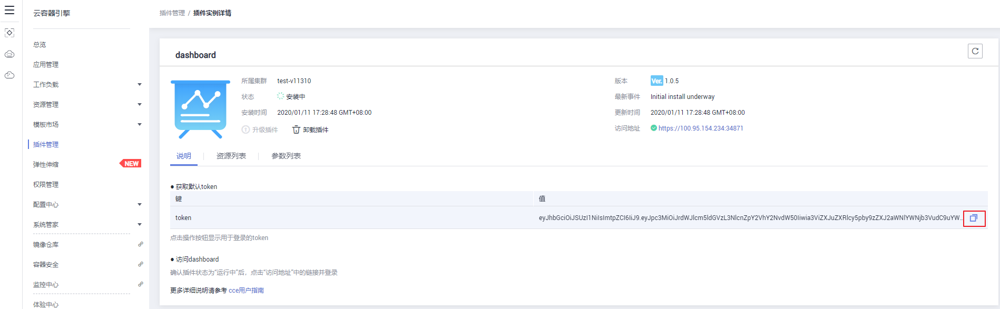
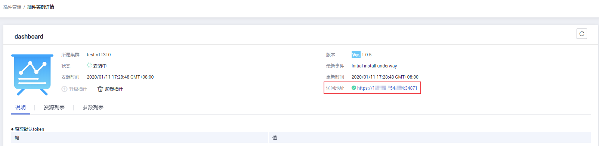

# Dashboard

## 插件简介

Kubernetes Dashboard是Kubernetes集群基于Web的通用UI，集合了命令行可以操作的所有命令。它允许用户管理在集群中运行应用程序并对其进行故障排除，以及管理集群本身。

> **说明：**   
>当前华为云CCE提供的Dashboard插件已将对应镜像升级到v1.10.1版本，不受Kubernetes Dashboard漏洞CVE-2018-18264影响。  
>安全漏洞CVE-2018-18264的详细信息，请参考：  
>-   [https://github.com/kubernetes/dashboard/pull/3289](https://github.com/kubernetes/dashboard/pull/3289?spm=a2c4g.11186623.2.10.34d16d21dGsJMe)  
>-   [https://github.com/kubernetes/dashboard/pull/3400](https://github.com/kubernetes/dashboard/pull/3400?spm=a2c4g.11186623.2.11.34d16d21dGsJMe)  
>-   [https://github.com/kubernetes/dashboard/releases/tag/v1.10.1](https://github.com/kubernetes/dashboard/releases/tag/v1.10.1)  

## 安装步骤

1.  在[CCE控制台](https://console.huaweicloud.com/cce2.0/?utm_source=helpcenter)中，单击左侧导航栏的“插件管理“，在“插件市场“中，单击dashboard插件下的“安装插件“。
2.  在安装插件页面，选择安装的集群和插件版本，单击“下一步：规格配置”。
3.  在规格配置页面，配置以下参数。
    -   证书配置：dashboard服务端使用的证书。
        -   默认选中，可手动上传证书。
            -   证书文件：单击查看证书文件样例参考。
            -   证书私钥：单击查看证书私钥样例参考。

        -   不选择，将不需要上传证书。

            > **须知：**   
            >dashboard默认生成的证书不合法，将影响浏览器正常访问，建议您选择手动上传合法证书，以便通过浏览器校验，保证连接的安全性，合法证书购买方法请参见[购买证书](https://support.huaweicloud.com/qs-scm/scm_07_0002.html)。  

    -   访问类型：可以选择节点访问（NodePort）和负载均衡（LoadBalancer）两种类型。
        -   节点访问：
            -   绑定弹性IP：若集群没有绑定弹性IP，需点击  [此处](https://console.huaweicloud.com/vpc/#/vpc/vpcmanager/eips)  绑定弹性IP，绑定后单击刷新按钮。

                该插件默认以NodePort形式提供访问，需为集群任意一个节点绑定弹性IP才能使用。

        -   负载均衡：
            -   负载均衡：选择弹性负载均衡实例。若无弹性负载均衡实例，需新建[增强型弹性负载均衡](https://console.huaweicloud.com/vpc/#/ulb/createUlb)，完成后点击刷新按钮。

                > **说明：**   
                >负载均衡实例需与当前集群处于相同VPC且为公网类型。  

            -   端口配置：访问类型为负载均衡时，需端口配置。
                -   协议：默认为TCP。
                -   容器端口：默认为8443。
                -   访问端口：容器端口最终映射到负载均衡服务地址的端口，用负载均衡服务地址访问工作负载时使用，端口范围为1-65535，可任意指定。

4.  单击“安装“。

    待插件安装完成后，单击“返回插件管理“，在“插件实例“页签中，选择对应的集群，可查看到运行中的实例，这表明该插件已在当前集群的各节点中安装。

## 安装后续操作

成功安装dashboard后，需完成如下步骤才能使用：

**Version 1.0.4及以上**

1.  **获取认证token**

    请于“插件管理”-\>“插件实例”-\>“dashboard”完成操作。

2.  **访问dashboard**

    “插件管理”-\>“插件实例”-\>“dashboard”，点击“访问地址”中的链接并通过token登录。

**Version 1.0.3**

1.  进入dashboard实例详情界面。
2.  若访问类型为“节点访问”，需确认是否已为集群任意节点绑定弹性IP。若未绑定需根据界面引导进行绑定，若已绑定则跳过此步。
3.  选择“说明”页签，单击“获取默认token”下的“操作”，复制“值”。
4.  点击“访问地址”中的链接进入终端，选择“令牌”的登录方式，通过上一步获取的token值登录（当前只支持使用令牌方式进行登录）。

**Version 1.0.2**

1.  **绑定弹性IP**
    -   在弹性公网服务的弹性公网IP界面，为插件所在集群的任意节点绑定弹性IP，若已有节点绑定弹性IP则跳过此步。
    -   在工作负载页面，选择命名空间kube-system，复制工作负载kubernetes-dashboard对应的外部访问地址。用户在浏览器内输入相应的链接进行访问。链接的格式为：https://外部访问地址。

2.  **获取认证token**

    在“配置中心”-\>“密钥（Secret）”页面，选择实例所在集群，选择命名空间kube-system，选择密钥kubernetes-dashboard-token-XXXXX，查看密钥数据中键token对应的值。

3.  **登陆终端**

    将上一步获取到的Token值进行base64解密并复制到dashboard的登录界面中，完成登录（当前只支持使用令牌方式进行登录）。

## 访问dashboard

确认dashboard插件状态为“运行中“后，单击“访问地址“中的链接并登录，详细操作如下：

1.  在[CCE控制台](https://console.huaweicloud.com/cce2.0/?utm_source=helpcenter)中，单击左侧导航栏的“插件管理“，在“插件实例”页签中，确认dashboard插件状态为“运行中“后，单击插件名称“dashboard“进入插件实例详情页。
2.  在详情页下方的“说明”页签中，单击“获取默认token”右侧“操作”栏中的，复制“值”栏中的信息。

    **图 1**  复制token  
    

3.  在插件详情页，单击“访问地址“中的链接，将会打开Kubernetes仪表盘登录页面。

    > **说明：**   
    >使用Chrome浏览器访问时，会出现如下“ERR\_CERT\_INVALID”的报错导致无法正常进入登录界面，解决方法请参见[附：访问报错解决方法](#section913875232612)。  

    **图 2**  访问地址  
    

4.  在登录页面中选择“令牌”的登录方式，粘贴输入复制的“值”，单击“登录“按钮。

    > **说明：**   
    >本插件默认不支持使用证书认证的kubeconfig进行登录，推荐使用令牌方式登录。详细信息请参考：[https://github.com/kubernetes/dashboard/issues/2474\#issuecomment-348912376](https://github.com/kubernetes/dashboard/issues/2474#issuecomment-348912376)  

    **图 3**  令牌方式登录  
    

5.  登录后效果，如[图4](#fig12780143011555)。

    **图 4**  Dashboard概览页  
    

## 权限修改

安装Dashboard插件后初始角色仅拥有对大部分资源的只读权限，若想让Dashboard界面支持更多操作，需自行在后台对RBAC相关资源进行修改。

**具体修改方式：**

可对名为“kubernetes-dashboard-minimal”这个ClusterRole中的规则进行调整。

关于使用RBAC的具体细节可参看文档：[https://kubernetes.io/docs/reference/access-authn-authz/rbac/](https://kubernetes.io/docs/reference/access-authn-authz/rbac/)。

## 升级插件

1.  在[CCE控制台](https://console.huaweicloud.com/cce2.0/?utm_source=helpcenter)中，单击左侧导航栏的“插件管理“，在“插件实例“页签中，选择对应的集群，单击dashboard下的“ 升级“。

    > **说明：**   
    >-   如果升级按钮处于冻结状态，则说明当前插件版本是最新的版本，不需要进行升级操作；  
    >-   若升级按钮可点击，则点击升级按钮即可升级dashboard插件。  
    >-   升级dashboard插件时，会替换原先节点上的旧版本的dashboard插件，安装最新版本的dashboard插件以实现功能的快速升级。  

2.  在弹出的窗口中，单击“确认“，可升级该插件。

## 卸载插件

1.  在[CCE控制台](https://console.huaweicloud.com/cce2.0/?utm_source=helpcenter)中，单击左侧导航栏的“插件管理“，在“插件实例“页签中，选择对应的集群，单击dashboard下的“ 卸载“。
2.  在弹出的窗口中，单击“确认“，可卸载该插件。

## 附：访问报错解决方法

使用Chrome浏览器访问时，会出现如下“ERR\_CERT\_INVALID”的报错导致无法正常进入登录界面，原因是dashboard默认生成的证书未通过Chrome校验，当前有以下两种解决方式：

**图 5**  Chrome浏览器报错信息  

-   方式一：使用火狐浏览器访问链接，为当前地址添加“例外”后即可进入登录页面。

    **图 6**  添加“例外”  
    

-   方式二：通过启动Chrome时添加“--ignore-certificate-errors”开关忽略证书报错。

    Windows：保存链接地址，关闭所有已经打开的Chrome浏览器窗口，Windows键 +“R”弹出“运行”对话框，输入“chrome --ignore-certificate-errors”启动新的chrome窗口，输入地址进入登录界面。

    **图 7**  启动chrome浏览器窗口  
    

