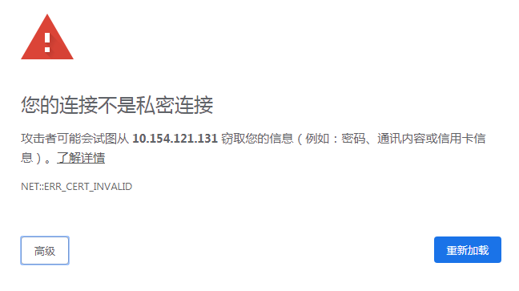
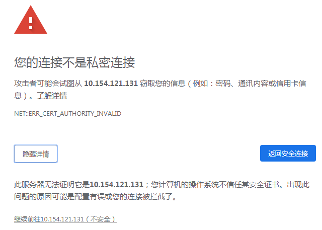

# Dashboard插件<a name="cce_01_0128"></a>

## 插件简介<a name="section1418513434428"></a>

Kubernetes Dashboard是Kubernetes集群的基于Web的通用UI。它允许用户管理在集群中运行的应用程序并对其进行故障排除，以及管理集群本身。

> **说明：**   
>当前华为云CCE提供的Dashboard插件已将对应镜像升级到v1.10.1版本，不受Kubernetes Dashboard漏洞CVE-2018-18264影响。  
>安全漏洞CVE-2018-18264的详细信息，请参考：  
>-   [https://github.com/kubernetes/dashboard/pull/3289](https://github.com/kubernetes/dashboard/pull/3289?spm=a2c4g.11186623.2.10.34d16d21dGsJMe)  
>-   [https://github.com/kubernetes/dashboard/pull/3400](https://github.com/kubernetes/dashboard/pull/3400?spm=a2c4g.11186623.2.11.34d16d21dGsJMe)  
>-   [https://github.com/kubernetes/dashboard/releases/tag/v1.10.1](https://github.com/kubernetes/dashboard/releases/tag/v1.10.1)  

## 安装步骤<a name="section46701613154319"></a>

1.  在CCE控制台中，单击左侧导航栏的“资源管理  \>  插件管理“，在“插件市场“中，单击dashboard插件下的“安装插件“。
2.  在安装插件页面，选择安装的集群和插件版本，单击“下一步”。
3.  在规格配置页面，配置以下参数。
    -   访问类型：
        -   节点访问：若集群没有绑定弹性IP，需绑定弹性IP。
        -   负载均衡：选择弹性负载均衡实例。若无增强型弹性负载均衡实例，需新建增强型弹性负载均衡。

    -   端口配置：访问类型为负载均衡时，需端口配置。
        -   协议：默认为TCP。
        -   容器端口：默认为3000。
        -   访问端口：容器端口最终映射到负载均衡服务地址的端口，用负载均衡服务地址访问工作负载时使用，端口范围为1-65535，可任意指定。


4.  单击“安装“。安装完成后，在当前集群的各节点上会安装该插件实例。
5.  在CCE控制台中，单击左侧导航栏的“资源管理  \>  插件管理“，在“插件实例”中，单击“dashboard”进入详情页。
6.  选择“说明”页签，单击“获取默认token”下的“操作”，复制“值”，单击“访问地址”后的链接，选择“令牌”的登录方式，输入“值”即可登录。

> **说明：**   
>本插件不支持“Kubeconfig”的登录方式，因为dashboard默认不支持使用证书认证的kubeconfig进行登录，详细信息请参考：https://github.com/kubernetes-incubator/kube-aws/issues/1051  

## 访问报错解决方法<a name="section913875232612"></a>

使用Chrome浏览器访问时，会出现如下“ERR\_CERT\_INVALID”的报错导致无法正常进入登录界面，原因是dashboard默认生成的证书未通过Chrome校验，当前有以下三种解决方式：

**图 1**  报错<a name="fig1873703218416"></a>  


-   方式一：使用火狐浏览器访问链接，为当前地址添加“例外”后即可进入登录页面。

    **图 2**  添加“例外”<a name="fig013354622913"></a>  
    

-   方式二：通过启动Chrome时添加“--ignore-certificate-errors”开关忽略证书报错。

    Windows：保存链接地址，关闭所有已经打开的Chrome实例，Windows键 +“R”弹出“运行”对话框，输入“chrome --ignore-certificate-errors”启动新的chrome实例，输入地址进入登录界面。

    **图 3**  启动chrome实例<a name="fig9331181553117"></a>  
    

-   方式三：手动生成并配置证书。

    该教程以openssl生成的证书为例，用户可自行选择其他证书。

    1.  准备一个可以使用kubectl操作集群，并能够使用openssl的环境。
    2.  进入任意空目录，执行如下指令：

    ```
    $ openssl req -nodes -newkey rsa:2048 -keyout dashboard.key -out dashboard.csr -subj "/C=/ST=/L=/O=/OU=/CN=kubernetes-dashboard"
    $ openssl x509 -req -sha256 -days 365 -in dashboard.csr -signkey dashboard.key -out dashboard.crt
    ```

    3. 分别将dashboard.crt和dashboard.key中的数据（包含头尾行）通过base64编码并保存。

    4. 执行如下指令，开始修改dashboard对应的证书信息：

    ```
    $ kubectl edit secret kubernetes-dashboard-certs -n kube-system
    ```

    5. 将第三步获取的数据以下图的格式写入当前secret中，完成后保存：

    **图 4**  手动生成并配置证书<a name="fig1750175215911"></a>  
    

    

    6. 通过浏览器访问链接，进入登录界面。

    > **说明：**   
    >该教程生成的证书不是由可信第三方颁布，登录时仍会出现如下报错，点击“高级”\>“继续前往...”即可。在此推荐用户配置dashboard时使用可信第三方颁布的证书。  

    **图 5**  访问链接<a name="fig1150214522919"></a>  
    


## 权限修改<a name="section10659162018415"></a>

安装Dashboard插件后初始角色仅拥有对大部分资源的只读权限，若想让Dashboard界面支持更多操作，需自行在后台对RBAC相关资源进行修改。

**具体修改方式：**

可对名为“kubernetes-dashboard-minimal”这个ClusterRole中的规则进行调整。

关于使用RBAC的具体细节可参看文档：[https://kubernetes.io/docs/reference/access-authn-authz/rbac/](https://kubernetes.io/docs/reference/access-authn-authz/rbac/)。

## 升级插件<a name="section455343310401"></a>

1.  在CCE控制台中，单击左侧导航栏的“资源管理 \> 插件管理“，在“插件实例“页签中，选择对应的集群，单击dashboard下的“ 升级“。

    > **说明：**   
    >-   如果升级按钮处于冻结状态，则说明当前插件版本是最新的版本，不需要进行升级操作；  
    >-   若升级按钮可点击，则点击升级按钮即可升级dashboard插件。  
    >-   升级dashboard插件时，会替换原先节点上的旧版本的dashboard插件，安装最新版本的dashboard插件以实现功能的快速升级。  

2.  在弹出的窗口中，单击“确认“，可升级该插件。

## 卸载插件<a name="section20765191931911"></a>

1.  在CCE控制台中，单击左侧导航栏的“资源管理 \> 插件管理“，在“插件实例“页签中，选择对应的集群，单击dashboard下的“ 卸载“。
2.  在弹出的窗口中，单击“确认“，可卸载该插件。

> **注意：**   
>目前只支持nodeport访问，用户必须绑定EIP才能在浏览器访问，访问方式https://eip:访问端口。  

