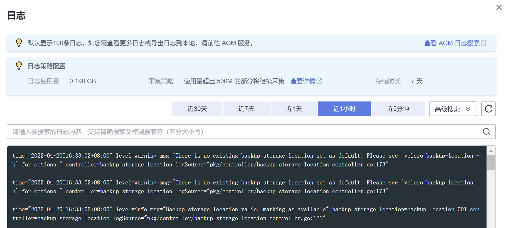
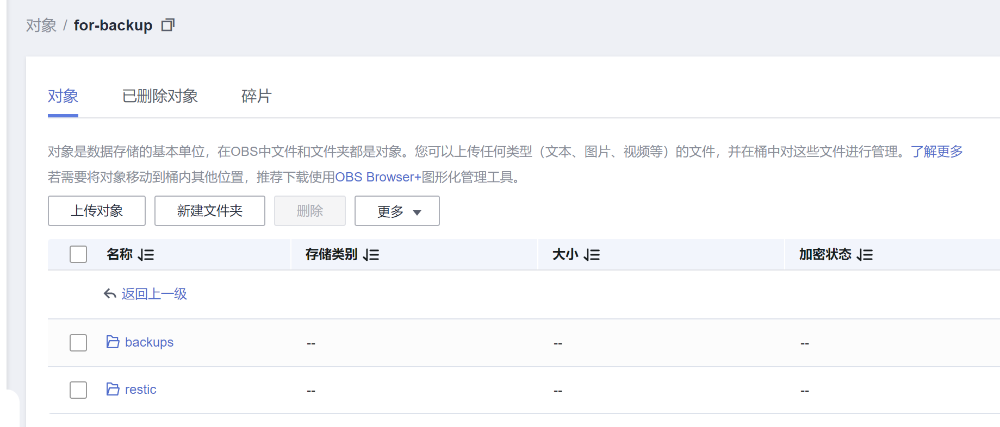

# e-backup<a name="cce_10_0395"></a>

## 插件简介<a name="section13441104311208"></a>

E-Backup提供集群备份恢复能力。它将用户应用数据和业务数据备份到OBS桶中，并提供数据的本地备份和远程备份的能力。

## 使用约束<a name="section9717216192118"></a>

-   备份/恢复过程中，用户要保证集群处于稳态，不要触发增删改等变更行为，以免出现备份/恢复失败或不完整；
-   若集群发生变更，建议等15分钟后，集群处于稳态，再做备份操作；
-   使用 云盘快照备份 时，仅提供EVS类型的PV卷做快照备份，并遵循快照的约束（如：不支持跨AZ恢复等），计费参考“云盘快照”；
-   使用 restic备份 时，提供对EVS、SFS、SFS Turbo、OBS类型的PV卷做数据备份，并上传到OBS备份仓库中；
-   开源的restic会对备份时间点的数据做自有快照，并上传数据，不影响用户后续数据的读写，但restic不做文件内容的校验和业务一致性校验，其特性遵循restic约束；
-   restic占用内存与初次备份的PV卷数据大小有关，若数据大于500G，建议采用云存储提供的迁移方式进行，若使用本插件可以参考操作指南修改restic容器的资源配额；
-   备份过程中有状态应用业务数据一致性，需要用户可通过Hooks来保证业务数据一致性，比如：同步内存数据到文件中等；
-   在恢复过程中，支持通过配置调整来适应迁移前后的环境差异：
    -   应用可以从原命名空间恢复到指定的另一个命名空间中，但需要用户确认恢复应用间没有通过固定的service来访问该应用；
    -   可以将应用的镜像地址\(repo\)换成另一个镜像地址，镜像名字和版本号在恢复过程中是保持不变的；
    -   可以将应用使用的StorageClass的名字更换成新的StorageClass，注意需要使用同类型替换，比如：块存储 -\> 块存储。

-   遵循开源velero和restic插件的约束，比如：在恢复过程中Service会清除clusterIP的IP地址，这样才能更适应源、目标K8s集群的差异。

## 安装插件<a name="section19447194914319"></a>

1.  登录CCE控制台，单击左侧导航栏的“插件市场“，找到e-backup插件，单击e-backup插件下的“安装“。
2.  在安装插件页面，选择要安装的集群，配置参数，然后单击“安装“。

    当前支持配置如下参数。

    **volumeWorkerNum**：备份volume的工作并发数量，默认为3。


## 使用插件<a name="section8678190171911"></a>

E-Backup使用OBS桶作为后端存储库，在备份前需要[准备密钥](#section614514242712)并[创建存储库](#section111141472815)。

备份支持[备用应用（立即备份）](#section20885165233817)和[备用应用（定时备份）](#section454444004516)，恢复支持[立即恢复](#section141018019611)。

## 准备密钥<a name="section614514242712"></a>

1.  获取访问密钥。

    登录CCE控制台，在右上角用户名下选择“我的凭证“，在左侧选择“访问密钥“，单击“新增访问密钥“。

2.  <a name="li12643172610310"></a>创建密钥文件，并通过 base64 格式化成字符串。

    ```
    # 创建密钥文件
    $ vi credential-for-huawei-obs
    HUAWEI_CLOUD_ACCESS_KEY_ID=your_access_key
    HUAWEI_CLOUD_SECRET_ACCESS_KEY=your_secret_key
    
    # 使用 base64 格式化字符串
    $ base64 -w 0 credential-for-huawei-obs
    XXXXXXXXXXXXXXXXXXXXXXXXXXXXXXXXXXXXXXXXXXXXXXXXXXXXXXXXXXXXXXHWOBS
    ```

3.  创建Secret。

    按如下YAML文件创建Secret。

    ```
    apiVersion: v1
    kind: Secret
    metadata:
      labels:
        secret.everest.io/backup: 'true'   #标识该secret用于E-Backup访问备份存储库
      name: secret-secure-opaque
      namespace: velero                  #必须和E-Backup置于同一namespace，取值必须为velero
    type: cfe/secure-opaque
    data:
      # credential文件经过base64编码后得到的字符串
      cloud: XXXXXXXXXXXXXXXXXXXXXXXXXXXXXXXXXXXXXXXXXXXXXXXXXXXXXXXXXXXXXXHWOBS
    ```

    -   secret 所在 namespace 必须和 E-Backup 实例所在namespace一致，即 velero。
    -   secret.data 中存储的是访问对象存储服务的秘钥，其中 key 必须为 cloud，而 value 为[2](#li12643172610310)中通过 base64 编码得到的字符串。一般通过 base64 编码后显示的字符串会有换行符，请在写入 secret.data 中时手动去除这些换行符。
    -   secret 需要打上标签“secret.everest.io/backup: true”，标识该 secret 是用于备份存储库的管理。


## 创建存储库<a name="section111141472815"></a>

这里的备份存储库是指 E-Backup 用于获取和检测后端对象存储服务相关信息的 K8s 资源对象。

```
apiVersion: velero.io/v1
kind: BackupStorageLocation
metadata:
  name: backup-location-001
  namespace: velero            #必须和E-Backup处于同一namespace
spec:
  config:
    endpoint: obs.{regionname}.myhuaweicloud.com   # OBS的endpoint
  credential:
    name: secret-secure-opaque   # 此前创建的secret的名字
    key: cloud                   # secret.data中的key值
  objectStorage:
    bucket: tools-cce        # OBS中的桶名
    prefix: for-backup       # 子路径名
  provider: huawei           # 使用OBS服务
```

-   **除了 prefix 字段为选填外，其他字段必填**。provider 为固定值 huawei。
-   endpoint 可以到[地区和终端节点](https://developer.huaweicloud.com/endpoint?OBS)获取，都需要保证集群内各节点可访问该地址。当endpoint 不带协议头时（http或者https），默认启用 https。
-   credential中的 name 和 key 需要配置正确，否则 E-Backup 无法访问后端存储库。

创建完成后等待30s用于备份存储库的检查和同步等工作，随后查看该备份存储库状态是否可用，PHASE 为 Available 表示可用，其他表示不可用。

```
$ kubectl get backupstoragelocations.velero.io backup-location-001 -n velero 
NAME                  PHASE       LAST VALIDATED   AGE   DEFAULT
backup-location-001   Available   23s              23m  
```

此处如果PHASE 长时间没有Available，可通过查看E-Backup的日志定位问题。E-Backup安装后会在velero命名空间创建一个名为velero的工作负载，查看velero的日志即可。



## 立即备份<a name="section20885165233817"></a>

立即备份操作后会立刻执行备份过程，备份完成后停止，适用于克隆/迁移。

编辑备份模板，如下所示，随后通过 kubectl create 命令创建。

```
apiVersion: velero.io/v1
kind: Backup
metadata:
  name: backup-01
  namespace: velero
spec:
  includedNamespaces:
  - nginx
  - mysql
  labelSelector:
    matchExpressions:
    - key: direction
      operator: In
      values:
      - back
      - front
    matchLabels:
      app: nginx
      backup: velero
  runMode: Normal
  appData:
    volumes: Restic
  hooks:
    resources:
    - name: hook01
      includedNamespaces:
      - nginx
      labelSelector: {}
      pre:
      - exec:
          command:
          - /bin/sh
          - -c
          - echo hello > hello.txt && echo goodbye > goodbye.txt
          container: container-0
          onError: Fail
          timeout: 30s
      post:
      - exec:
          command:
          - /bin/sh
          - -c
          - echo hello > hello.txt && echo goodbye > goodbye.txt
          container: container-0
          onError: Fail
          timeout: 30s
  storageLocation: backup-location-001
  ttl: 720h0m0s
```

参数说明如下。

-   备份参数
    -   **storageLocation**：指定了使用的备份存储库的名称，备份后的内容将会放置到对应的后端对象存储中，为**必填**字段。
    -   **ttl**：指定了备份的内容将会在存储库中存放的时间，超期后会被删除，必须按照指定格式进行配置：h，m，s 分别表示“时，分，秒”。例如24h 表示一天，3h4m5s 表示 三小时四分钟五秒，默认为30天（720h0m0s）。

-   资源过滤相关：以下字段为过滤条件，都配置时取交集，相当于对集群中的所有资源进行筛选。
    -   **includedNamespaces**/**excludedNamespaces**：指定对某些命名空间下的资源备份/不备份，互斥选项，选择一项配置即可，可选择多个namespace，默认表示所有namespace。
    -   **labelSelector**：指定对具有特定标签的资源进行备份，参照 K8s 的标准用法，按需选择。
    -   **runMode**：选择备份的运行方式，**必填**，Normal（备份应用和数据）/AppOnly（仅备份应用）/DataOnly（仅备份数据）/DryRun（用于验证，不备份）。

-   业务数据备份相关：当前支持两种方式对业务产生的实际数据进行备份，一种是 everest 快照，只适用于使用 evs 类型的持久卷（pvc）作为数据卷；另一种是 restic 备份，可备份除去 hostpath 类型以外的所有数据卷。两种方式支持混用。
    -   **appData**：备份持久卷数据的方式，Restic/Snapshot，Snapshot默认不启用。Snapshot方式是为支持快照能力的存储，且集群中部署了csi快照插件时才能生效。

-   **hook**：hook是用于在备份前或备份后执行某些指令，实现用户对备份的精细化控制，hook 类似于执行 kubectl exec 命令，目前只对 Pod 有效。

    -   includedNamespaces/excludedNamespaces：指定对某些 namespace 下的 Pod 执行/不执行 hook ，互斥选项，默认表示所有namespace
    -   labelSelector：指定对具有某些 label 的 Pod 执行 hook，参照 K8s 的标准用法，按需选择
    -   command：指定 hook 的执行命令
    -   container	：指定执行命令的容器名，当 Pod 有多个容器时用于精细化控制，默认为Pod 的第一个容器。
    -   onError：指定 hook 执行失败时的行为，可选择 Continue/Fail ，默认为 Fail。
    -   Continue：表示 hook 执行失败不影响后续动作的继续执行；Fail 表示 hook 执行失败将不会继续后续备份动作。
    -   timeout：指定 hook 执行的超时时间，超过时间后认为 hook 执行失败，默认为 30s。

    hook 是针对 Pod 而言，hook 执行失败可能影响的后续备份动作也是针对执行 hook 的 Pod 而言，对其他对象比如 services 等的备份没有影响。

    由于 hook 是针对 Pod 而言，因此 hook 并非全局可用的。当需要执行 hook 的 Pod 没有被选择为备份对象时，hook 不会被执行。可以认为 hook 的"includedNamespaces/excludedNamespaces" 配置是在被筛选为需要备份的对象中进一步进行筛选。


> **说明：** 
>上文我们给出了所有的可配置项，在这里一方面基于实际备份场景，一方面为了用于便于操作，给出**备份配置建议**。
>-   备份的保存时间按照"天"（24h）粒度进行控制。
>-   当前应用基本会部署到特定namespace中，因此建议使用 includeNamespace 划定备份范围。如果需要更精细的备份对象控制，可以应用 labelSelector，前提是明确所有需要备份的对象具有相应的label。"includeNamespace + labelSelector" 能够满足绝大多数场景的使用。
>-   使用 restic 备份业务数据时，如果对 OUT/IN 方式不熟悉，可以不对需要备份卷的 pod 增加 annotation，通过简单的配置 defaultVolumesToRestic 选项为 true/false 对 pod 使用的卷整体进行业务数据备份/不备份。
>-   在需要对备份进行精细化控制时使用 hook ，尽量避免执行长时间运行的任务。另外，hook 中执行的命令不要直接操作文件系统。

备份执行后，可通过如下命令**查看备份状态**。status中会列出详细的状态。

```
$ kubectl -n velero get backups backup-01 -o yaml | grep  "phase"
  phase: Completed

$ kubectl -n velero get backups backup-01 -o yaml
……
status:
  ……
```

备份状态说明

-   FailedValidation：备份模板配置错误，可以查看 Backup.Status.ValidationErrors 发现错误配置原因
-   InProgress：备份正在进行中
-   Completed：备份完成，没有错误
-   PartiallyFailed：备份完成，但是备份某些对象的过程中出现错误（比如 hook 执行错误）
-   Failed：备份失败，出现影响整体备份的错误
-   Deleting：备份正在删除中

首次备份完成后，OBS桶中会出现backups和restic两个文件夹。



**备份日志存储在OBS桶中**，假设备份名为 backup-001，进入到OBS存储服务的页面，根据在备份存储库中配置的桶名和子路径名找到存储位置，进入 backups/backup-01 目录下，找到 backup-01-logs.gz 文件，随后下载、解压并查看。

## 周期备份<a name="section454444004516"></a>

操作后会基于配置以一定的周期重复性地执行备份过程，比较适用于容灾。

编辑 Schedule 模板，如下所示，随后通过 kubectl create 命令创建。用户可以自行按照需要给 Schedule 模板打上 label，Schedule 上的 label 都会打到通过 schedule 创建的 backup 上。Schedule 创建到集群后，会立即执行一次备份，后续按照设定的定时周期重复执行备份过程。

```
apiVersion: velero.io/v1
kind: Schedule
metadata:
  name: schedule-backup-001
  namespace: velero
spec:
  schedule: 0 */10 * * *
  template:
    runMode: Normal
    hooks: {}
    includedNamespaces:
    - nginx
    - mysql
    labelSelector:
      matchExpressions:
      - key: direction
        operator: In
        values:
        - back
        - front
      matchLabels:
        app: nginx
        backup: velero
    storageLocation: backup-location-001
    ttl: 720h0m0s
```

参数说明如下。

-   schedule：创建的定时表达式，指定备份的周期执行时间。支持 @every格式 和 Linux标准cron表达式。
    -   @every  _**N**_Unit：其中N表示一个正整数，Unit可以为s, m, h，表示每隔N个Unit时间触发一次，例如：@every 2h30m，每隔2小时30分执行一次。
    -   标准cron表达式：采用五子表达式，分别是 Minute，Hour，Day-of-Month，Month，Day-of-Week。

-   template：备份的模板，与[备用应用（立即备份）](#section20885165233817)中spec一致。

## 删除备份<a name="section188881961812"></a>

删除集群中创建的备份对象及其相关对象（比如：Backup/Restore/Schedule等），并且将后端存储库中的备份内容删除，适用于产生大量备份数据时进行的清理工作。

编辑 DeleteBackupRequest 模板，如下所示，随后通过 kubectl create 命令创建。

```
apiVersion: velero.io/v1
kind: DeleteBackupRequest
metadata:
  name: backup-001-delete
  namespace: velero
spec:
  backupName: backup-001  # 指定要删除的备份名
```

查看状态。

```
$ kubectl -n velero get deletebackuprequests backup-001-delete -o yaml | grep " phase"
   phase: InProgress
```

-   InProgress：删除任务正在进行中。
-   Processed：删除任务已经被处理过。

> **注意：** 
>-   Processed 状态只意味着 E-Backup 处理过该任务，但是不一定能够完成该任务。可以通过查看 deletebackuprequest.status.errors 字段查看执行删除任务期间出现的错误。如果 E-Backup 正确完整地处理完删除任务，则该 deletebackuprequest 对象本身也会被删除。
>-   后端存储库（OBS桶）中的内容不要人为进行手动删除。

## 立即恢复<a name="section141018019611"></a>

将某个立即备份作为数据源，恢复应用到另一个 namespace/集群 中，全场景适用。

编辑 Restore 模板，如下所示，随后通过 kubectl create 命令创建。

```
apiVersion: velero.io/v1
kind: Restore
metadata:
  name: restore-01
  namespace: velero
spec:
  backupName: backup-01
  hooks:
    resources:
    - name: restore-hook-1
      includedNamespaces:
      - mysql
      labelSelector: {}
      postHooks:
      - init:
          initContainers:
          - name: restore-hook-init1
            image: alpine:latest
            volumeMounts:
            - mountPath: /restores/pvc1-vm
              name: pvc1-vm
            command:
            - /bin/ash
            - -c
            - echo -n "FOOBARBAZ" >> /restores/pvc1-vm/foobarbaz
          - name: restore-hook-init2
            image: alpine:latest
            volumeMounts:
            - mountPath: /restores/pvc2-vm
              name: pvc2-vm
            command:
            - /bin/ash
            - -c
            - echo -n "DEADFEED" >> /restores/pvc2-vm/deadfeed
      - exec:
          execTimeout: 1m
          waitTimeout: 5m
          onError: Fail
          container: mysql
          command:
          - /bin/bash
          - '-c'
          - 'while ! mysql_isready; do sleep 1; done'
      - exec:
          container: mysql
          waitTimeout: 6m
          execTimeout: 1m
          onError: Continue
          command:
          - /bin/bash
          - '-c'
          - 'mysql < /backup/backup.sql'
  includedNamespaces:
  - nginx
  - mysql
  namespaceMapping:
    nginx: nginx-another
    mysql: mysql-another
  labelSelector: {}
  preserveNodePorts: false
  storageClassMapping:
    disk: csi-disk
    obs: csi-obs
  imageRepositoryMapping:
    quay.io/coreos: swr.cn-south-1.myhuaweicloud.com/everest 
```

参数说明如下。

-   选择数据源

    **backupName** 	指定某个立即备份作为数据源，对该备份中的内容进行恢复，**必填**项。

-   资源过滤相关：这里的过滤是指对已经备份的内容进行的过滤，参考[备用应用（立即备份）](#section20885165233817)中资源过滤相关的配置。
-   特殊处理相关
    -   **namespaceMapping**：指定将已备份的内容恢复到另一个 namespace 中，以 map 形式给出，格式为"source: target"，不要求新的 namespace 在目的集群存在
    -   **storageClassMapping**：改变备份资源PV、PVC等使用的storageClassName，要求StorageClass类型相同。
    -   **imageRepositoryMapping**：改变备份资源的images字段，用于仓库的映射关系，不包含镜像名字和标签的改变（防止迁移和升级耦合在一起），比如：quay.io/coreos/etcd:2.5 搬迁到SWR后，使用本地镜像仓库下 s**wr.cn-south-1.myhuaweicloud.com/everest/etcd:2.5**，配置格式为：**quay.io/coreos: swr.cn-south-1.myhuaweicloud.com/everest**
    -   **preserveNodePorts**：如果设置成不保留，则不保留的是 Service 自动生成的 nodePort，用户手动配置的 nodePort 仍然会保留

-   **hook**相关：Restore 模板的 hook 配置和 Backup 模板的不太相同，共有两种类型，一种是 init 类型，用于向 pod 中添加 initContainer；一种是 exec 类型，用于执行某些指令。init 类型的 hook 请参照 K8s 中 initContainers 的定义方式进行配置，下面介绍有关 hook 整体选择的参数和 exec 类型的参数。
    -   **includedNamespaces**/**excludedNamespaces**：指定对某些 namespace 下的 pod 执行/不执行 hook ，互斥选项，默认表示所有namespace
    -   **labelSelector**：指定对具有某些 label 的 pod 执行 hook，参照 K8s 的标准用法，按需选择。
    -   **command**：指定 hook 的执行命令。
    -   **container**：指定执行命令的容器名，当 pod 有多个容器时用于精细化控制，默认为pod的第一个容器。
    -   **onError：**指定 hook 执行失败时的行为，可选择 Continue/Fail ，默认为 Fail。
    -   **Continue **：表示 hook 执行失败不影响后续动作的继续执行；Fail 表示 hook 执行失败将不会继续后续动作。
    -   **execTimeout**：指定 hook 执行的超时时间，超过时间后认为 hook 执行失败，默认为 30s。
    -   **waitTimeout**：指定 E-Backup 准备执行 hook 时到容器开始执行 hook 的等待超时时间，超时后认为 hook 执行失败，默认为 0s，表示没有超时限制。


> **说明：** 
>-   数据源的选择请指定正确，保证该 Backup 是 Completed 状态
>-   资源过滤相关的参数只在确有需要的时候进行配置，否则无需配置
>-   业务数据的恢复由 E-Backup 自行根据备份时选择的方式进行针对性的恢复，用户无需担心，也没有相应的配置
>-   hook 的使用建议参照立即备份中的 hook 使用建议，waitTimeout 在无必要的情况下可以不进行配置
>-   恢复时最好配置恢复到新的 namespace 下，按照备份什么就恢复什么的原则，避免自行的配置失误导致恢复后的应用无法启动运行

恢复执行后，可通过如下命令**查看恢复状态**。status中会列出详细的状态。

```
$ kubectl -n velero get restores restore-01 -o yaml | grep " phase"
  phase: Completed

$ kubectl -n velero get restores restore-01 -o yaml
……
status:
  ……

```

恢复状态说明

-   FailedValidation：恢复模板配置错误，可以查看 Restore.Status.ValidationErrors 发现错误配置原因。
-   InProgress：恢复正在进行中。
-   Completed：恢复完成，没有错误。
-   PartiallyFailed：恢复完成，但是恢复某些对象的过程中出现错误（比如 hook 执行错误）。
-   Failed：恢复失败，出现影响整体恢复的错误。

**查看恢复日志以及过程中的 warnings 和 errors 信息**。

假设恢复名为 restore-01 ，进入到OBS控制台，根据在备份存储库中配置的桶名和子路径名找到存储位置，进入 restores/restore-01 目录下，有如下两个文件。

-   restore-01-logs.gz：日志文件，随后下载、解压并查看日志。
-   restore-01-results.gz：恢复结果文件，包含 warnings 和 errors 信息。

## 版本记录<a name="section183121449435"></a>

**表 1**  CCE插件版本记录

<a name="table88489551792"></a>
<table><thead align="left"><tr id="row139251455994"><th class="cellrowborder" valign="top" width="37.50531236719082%" id="mcps1.2.3.1.1"><p id="p13601510205420"><a name="p13601510205420"></a><a name="p13601510205420"></a>插件版本</p>
</th>
<th class="cellrowborder" valign="top" width="62.494687632809175%" id="mcps1.2.3.1.2"><p id="p156011107542"><a name="p156011107542"></a><a name="p156011107542"></a>支持的集群版本</p>
</th>
</tr>
</thead>
<tbody><tr id="row8757710175517"><td class="cellrowborder" valign="top" width="37.50531236719082%" headers="mcps1.2.3.1.1 "><p id="p1347794815513"><a name="p1347794815513"></a><a name="p1347794815513"></a>1.2.0</p>
</td>
<td class="cellrowborder" valign="top" width="62.494687632809175%" headers="mcps1.2.3.1.2 "><p id="p1647714812555"><a name="p1647714812555"></a><a name="p1647714812555"></a>/v1.(15|17|19|21).*/</p>
</td>
</tr>
</tbody>
</table>

