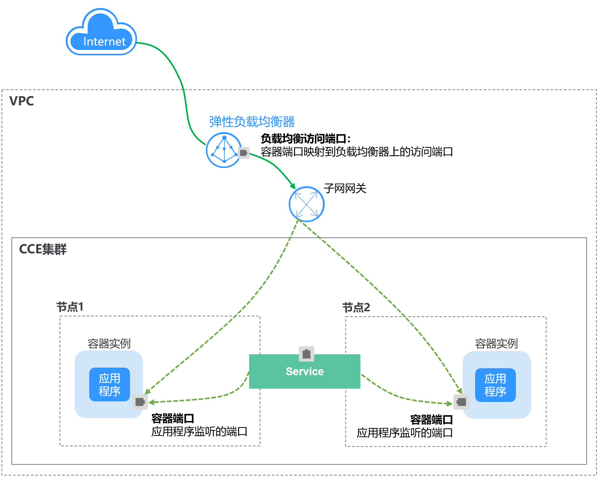
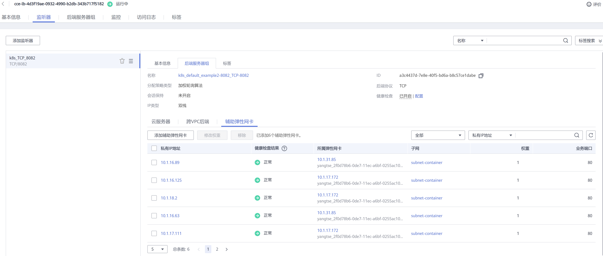

# ENI负载均衡 \( ENI LoadBalancer \)<a name="cce_01_0114"></a>

## 操作场景<a name="section025118182286"></a>

ENI负载均衡 \( ENI LoadBalancer \)使用弹性负载均衡器直通容器，使部署在容器中的业务时延降低、性能无损耗。

从集群外部访问时，从ELB直接转发到Pod；集群内部访问可通过Service转发到Pod。



## 约束与限制<a name="section121316392287"></a>

-   仅支持独享型ELB实例，且ELB实例需要支持网络型（TCP/UDP）。
-   ELB实例创建出来后没法更改flavor，因此对应CCE自动创建的ELB实例，Service自动创建的ELB实例只支持对接Service；对接已有的实例不受此约束限制。
-   集群必须为1.17及以上版本。
-   仅支持绑定弹性网卡的工作负载（即容器对接ENI）的访问类型选择“ENI负载均衡 \( ENI LoadBalancer \)“。

## 工作负载创建时设置<a name="section17753911588"></a>

可以在创建工作负载时通过CCE控制台设置Service，本节以nginx为例进行说明。

1.  参考[创建无状态负载\(Deployment\)](创建无状态负载(Deployment).md)、[创建有状态负载\(StatefulSet\)](创建有状态负载(StatefulSet).md)或[创建守护进程集\(DaemonSet\)](创建守护进程集(DaemonSet).md)，在“工作负载访问设置“步骤，单击“添加服务“。

    -   **访问类型：**选择“ENI负载均衡 \( ENI LoadBalancer \)“，前提需要在创建工作负载，填写工作负载基本信息时，勾选“绑定弹性网卡”。
    -   **Service名称：**自定义服务名称，可与工作负载名称保持一致。

    **负载均衡配置：**

    -   **负载均衡：**仅支持独享型负载均衡器类型。

        独享型：独享型负载均衡实例资源独享，实例的性能不受其它实例的影响，提供IPv6功能。

        根据业务需求选择“公网“或“私网“。

        -   公网：支持自动创建和使用已有负载均衡实例两种方式。
        -   私网：支持自动创建和使用已有负载均衡实例两种方式。

        负载均衡实例需与当前集群处于相同VPC且为相同公网或私网类型。

        -   企业项目：请选择企业项目名称，选择后可以直接创建在具体的ELB企业项目下。
        -   规格配置：选择“公网 \> 自动创建“时显示此配置项，单击可修改负载均衡实例的名称、规格、计费模式和带宽。
        -   独享型专属配置
            -   可用区：独享型负载均衡可同时部署在多个可用区，提供更高的可靠性。
            -   所在子网：负载均衡后端所在子网。

                负载均衡会根据不同的实例规格，占用不同数量的子网IP数，因此不建议使用其他资源（如集群，节点等）的子网网段。

            -   实例规格：实例规格决定了负载均衡可创建的监听器类型，可根据业务特点选择规格类型，根据业务量选择规格大小。具体请参见[独享型负载均衡实例规格](https://support.huaweicloud.com/productdesc-elb/zh-cn_topic_0287737145.html)。

        -   分配策略类型：可选择加权轮询算法、加权最少连接或源IP算法，权重将根据Service关联的工作负载在每个节点上的实例数量进行动态调整。

            > **说明：** 
            >-   加权轮询算法：根据后端服务器的权重，按顺序依次将请求分发给不同的服务器。它用相应的权重表示服务器的处理性能，按照权重的高低以及轮询方式将请求分配给各服务器，相同权重的服务器处理相同数目的连接数。常用于短连接服务，例如HTTP等服务。
            >-   加权最少连接：最少连接是通过当前活跃的连接数来估计服务器负载情况的一种动态调度算法。加权最少连接就是在最少连接数的基础上，根据服务器的不同处理能力，给每个服务器分配不同的权重，使其能够接受相应权值数的服务请求。常用于长连接服务，例如数据库连接等服务。
            >-   源IP算法：将请求的源IP地址进行Hash运算，得到一个具体的数值，同时对后端服务器进行编号，按照运算结果将请求分发到对应编号的服务器上。这可以使得对不同源IP的访问进行负载分发，同时使得同一个客户端IP的请求始终被派发至某特定的服务器。该方式适合负载均衡无cookie功能的TCP协议。

        -   会话保持：默认不启用，可选择“源IP地址“。负载均衡监听是基于IP地址的会话保持，即来自同一IP地址的访问请求转发到同一台后端服务器上。
        -   健康检查：默认开启。此处健康检查是设置负载均衡的健康检查配置，其参数详细解释可参见[配置健康检查](https://support.huaweicloud.com/usermanual-elb/zh-cn_topic_0162227063.html#section2)。

    -   **端口配置：**
        -   协议：请根据业务的协议类型选择。
        -   容器端口：容器镜像中工作负载实际监听端口，需用户确定。nginx程序实际监听的端口为80。
        -   访问端口：容器端口最终映射到负载均衡服务地址的端口，用负载均衡服务地址访问工作负载时使用，端口范围为1-65535，可任意指定。

2.  完成配置后，直接单击“确定“。
3.  单击“下一步：高级配置“进入高级设置页面，直接单击“创建“。
4.  创建成功后，单击“工作负载 \> 无状态负载 Deployment“或“工作负载 \> 有状态负载 StatefulSet“，在工作负载列表页面，单击“工作负载名称“进入工作负载详情页，在“访问方式“页签下，即可获取方式地址。
5.  单击访问地址，即可跳转到访问页面。

## 工作负载创建完成后设置<a name="section157831895585"></a>

您可以在工作负载创建完成后对Service进行配置，此配置对工作负载状态无影响，且实时生效。具体操作如下：

1.  登录CCE控制台，在左侧导航栏中选择“资源管理 \> 网络管理”。
2.  在Service页签下单击“添加Service”。

    参数与[工作负载创建时设置](#section17753911588)一致。

3.  单击“创建”。工作负载已添加“ENI负载均衡 \( ENI LoadBalancer \)”的服务。

## 使用kubectl创建-自动创建ELB<a name="section132363317202"></a>

相对于非ENI类型[ENI负载均衡 \( ENI LoadBalancer \)](ENI负载均衡-(-ENI-LoadBalancer-).md)，ENI LoadBalancer Service仅支持独享型ELB，在创建Service时无需要指定nodeport。

```
apiVersion: v1
kind: Service
metadata:
    name: example
    annotations:
        kubernetes.io/elb.class: performance
        kubernetes.io/elb.subnet-id: f7c755be-77f4-48f0-8305-788573931ef7    # ELB实例所在子网ID，替换为实际取值
        kubernetes.io/elb.enterpriseID: '0'
        kubernetes.io/elb.autocreate: 
          '
          {
              "type": "public",
              "bandwidth_name": "cce-bandwidth-1630813564682",
              "bandwidth_chargemode": "bandwidth",
              "bandwidth_size": 5,
              "bandwidth_sharetype": "PER",
              "eip_type": "5_bgp",
              "available_zone": [
                  "cn-east-3a"
              ],
              "l7_flavor_name": "L7_flavor.elb.s2.medium",
              "l4_flavor_name": "L4_flavor.elb.s1.small"
          }
          '
        kubernetes.io/elb.lb-algorithm: ROUND_ROBIN
        kubernetes.io/elb.health-check-flag: 'on'
        kubernetes.io/elb.health-check-option: '{"protocol":"TCP","delay":"5","timeout":"10","max_retries":"3"}'
spec:
    selector:
        app: example
    ports:
        -   name: cce-service-0
            targetPort: 80
            port: 8082
            protocol: TCP
    type: LoadBalancer
```

详细的参数说明请参见[表4](负载均衡(LoadBalancer).md#table133089105019)。

## 使用kubectl创建-使用已有ELB<a name="section740235552010"></a>

使用已有ELB实例创建时，指定ELB实例的类型和ID即可。

```
apiVersion: v1
kind: Service
metadata:
    name: example
    annotations:
        kubernetes.io/elb.class: performance
        kubernetes.io/elb.id: bcc44e84-d0b5-4192-8bec-b2ca55ce5025     # ELB实例ID，替换为实际取值
spec:
    selector:
        app: example
    ports:
        -   name: cce-service-0
            targetPort: 80
            port: 8082
            protocol: TCP
    type: LoadBalancer
```

## ELB转发说明<a name="section1959173710195"></a>

ENI LoadBalancer类型Service创建完后，可以在ELB控制台查看ELB实例的监听器转发规则，如下所示。

**图 1**  ELB转发说明<a name="fig18321515105911"></a>  


可以看到这个ELB实例创建了一个监听器，其后端服务器地址是Pod的IP地址，业务端口是容器端口。这是因为Pod使用了ENI或Sub-ENI，ELB会直通Pod，当有流量通过ELB请求时，会直接转发给Pod，从而访问到Pod，这跟[操作场景](#section025118182286)中所述是一致的。

