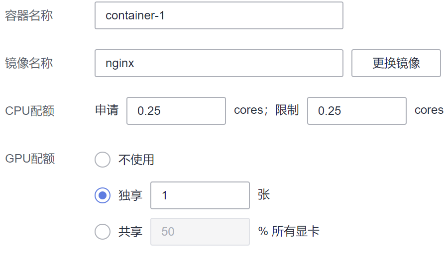

# GPU调度<a name="cce_10_0345"></a>

CCE支持在容器中使用GPU资源。

## 前提条件<a name="section18703125715210"></a>

-   创建GPU类型节点，具体请参见[创建节点](创建节点.md)。
-   安装gpu-beta插件，安装时注意要选择节点上GPU对应的驱动，具体请参见[gpu-beta](gpu-beta.md)。
-   gpu-beta会把驱动的目录挂载到/usr/local/nvidia/lib64，在容器中使用GPU资源需要将/usr/local/nvidia/lib64追加到LD\_LIBRARY\_PATH环境变量中。

    通常可以通过如下三种方式追加。

    1.  制作镜像的Dockerfile中配置LD\_LIBRARY\_PATH。（推荐）

        ```
        ENV LD_LIBRARY_PATH /usr/local/nvidia/lib64:$LD_LIBRARY_PATH
        ```

    2.  镜像的启动命令中配置LD\_LIBRARY\_PATH。

        ```
        /bin/bash -c "export LD_LIBRARY_PATH=/usr/local/nvidia/lib64:$LD_LIBRARY_PATH && ..."
        ```

    3.  创建工作负载时定义LD\_LIBRARY\_PATH环境变量（需确保容器内未配置该变量，不然会被覆盖）。

        ```
                  env:
                    - name: LD_LIBRARY_PATH
                      value: /usr/local/nvidia/lib64
        ```


## 使用GPU<a name="section17426191045420"></a>

创建工作负载申请GPU资源，可按如下方法配置，指定显卡的数量。

```
apiVersion: apps/v1
kind: Deployment
metadata:
  name: gpu-test
  namespace: default
spec:
  replicas: 1
  selector:
    matchLabels:
      app: gpu-test
  template:
    metadata:
      labels:
        app: gpu-test
    spec:
      containers:
      - image: nginx:perl
        name: container-0
        resources:
          requests:
            cpu: 250m
            memory: 512Mi
            nvidia.com/gpu: 1   # 申请GPU的数量
          limits:
            cpu: 250m
            memory: 512Mi
            nvidia.com/gpu: 1   # GPU数量的使用上限
      imagePullSecrets:
      - name: default-secret
```

通过  **nvidia.com/gpu**  指定申请GPU的数量，支持申请设置为小于1的数量，比如** nvidia.com/gpu: 0.5**，这样可以多个Pod共享使用GPU。GPU数量小于1时，不支持跨GPU分配，如0.5 GPU只会分配到一张卡上。

指定**nvidia.com/gpu**后，在调度时不会将负载调度到没有GPU的节点。如果缺乏GPU资源，会报类似如下的Kubernetes事件。

-   0/2 nodes are available: 2 Insufficient nvidia.com/gpu.
-   0/4 nodes are available: 1 InsufficientResourceOnSingleGPU, 3 Insufficient nvidia.com/gpu.

在CCE控制台使用GPU资源，只需在创建负载时，勾选GPU配额，并指定使用的比例即可，如下图所示。

**图 1**  使用GPU<a name="fig348242715203"></a>  


## GPU节点标签<a name="section1869217223111"></a>

创建GPU节点后，CCE会给节点打上对应标签，如下所示，不同类型的GPU节点有不同标签。

```
$ kubectl get node -L accelerator
NAME           STATUS   ROLES    AGE     VERSION                                    ACCELERATOR
10.100.2.179   Ready    <none>   8m43s   v1.19.10-r0-CCE21.11.1.B006-21.11.1.B006   nvidia-t4
```

在使用GPU时，可以根据标签让Pod与节点亲和，从而让Pod选择正确的节点，如下所示。

```
apiVersion: apps/v1
kind: Deployment
metadata:
  name: gpu-test
  namespace: default
spec:
  replicas: 1
  selector:
    matchLabels:
      app: gpu-test
  template:
    metadata:
      labels:
        app: gpu-test
    spec:
      nodeSelector:
        accelerator: nvidia-t4
      containers:
      - image: nginx:perl
        name: container-0
        resources:
          requests:
            cpu: 250m
            memory: 512Mi
            nvidia.com/gpu: 1   # 申请GPU的数量
          limits:
            cpu: 250m
            memory: 512Mi
            nvidia.com/gpu: 1   # GPU数量的使用上限
      imagePullSecrets:
      - name: default-secret
```

