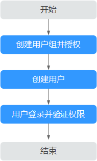

# IAM权限管理说明

如果您需要对云容器引擎（CCE）服务进行精细的权限管理，可以使用统一身份认证服务（Identity and Access Management，简称IAM），通过IAM，您可以：

-   根据企业的业务组织，在您的华为云账号中，给企业中不同职能部门的员工创建IAM用户，让员工拥有唯一安全凭证，并使用CCE资源。
-   根据企业用户的职能，设置不同的访问权限，以达到用户之间的权限隔离。
-   将CCE资源委托给更专业、高效的其他华为云账号或云服务，这些账号或云服务可以根据权限进行代运维。

如果华为云账号已能满足您的要求，不需要创建独立的IAM用户，您可以跳过本章节，不影响您使用CCE服务的其它功能。

本手册写作使用IAM的常见操作，包括创建用户、用户组、给用户组授权以及创建自定义策略，如果需要使用IAM进行其它操作，请参见[IAM 用户指南](https://support.huaweicloud.com/usermanual-iam/zh-cn_topic_0079496985.html)。

## 前提条件

-   “CCE FullAccess”属于策略，请先在IAM控制台中开通基于策略的访问控制公测，开通方法请参见：[申请基于策略的访问控制公测](https://support.huaweicloud.com/usermanual-iam/iam_01_019.html)。
-   给用户组授权之前，请您了解用户组可以添加的CCE权限，并结合实际需求进行选择，CCE支持的系统权限，请参见：[CCE系统权限](https://support.huaweicloud.com/productdesc-cce/cce_productdesc_0002.html)。若您需要对除CCE之外的其它服务授权，IAM支持服务的所有权限请参见[权限策略](https://support.huaweicloud.com/permissions/policy_list.html?product=cce)。

## 示例流程

**图 1**  给用户授权CCE权限流程  

1.  [创建用户组并授权](https://support.huaweicloud.com/usermanual-iam/zh-cn_topic_0046611269.html)

    在IAM控制台创建用户组，并授予云容器实例只读权限“CCE ReadOnlyAccess”。

2.  [创建用户并加入用户组](https://support.huaweicloud.com/usermanual-iam/zh-cn_topic_0046611303.html)

    在IAM控制台创建用户，并将其加入[1](#li2706103635114)中创建的用户组。

3.  [用户登录](https://support.huaweicloud.com/usermanual-iam/iam_01_0552.html)并验证权限

    新创建的用户登录控制台，切换至授权区域，验证权限：

    -   在“服务列表”中选择云容器实例，进入CCE主界面，左侧导航栏中选择“工作负载 \> 无状态负载 Deployment“，在右侧页面单击“创建无状态负载“，如果无法创建工作负载（假设当前权限仅包含CCE ReadOnlyAccess），表示“CCE ReadOnlyAccess”已生效。
    -   在“服务列表”中选择除“云容器引擎 CCE“外（假设当前策略仅包含CCE ReadOnlyAccess）的任一服务，若提示权限不足，表示“CCE ReadOnlyAccess”已生效。

