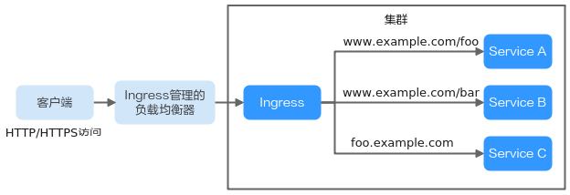
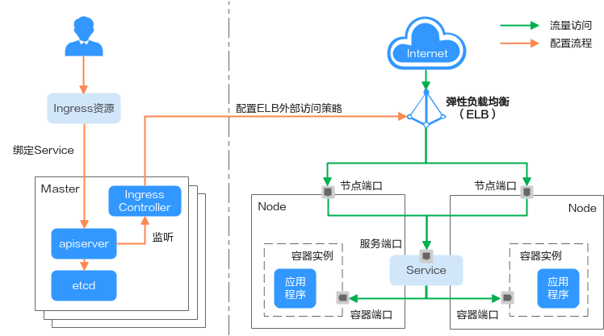
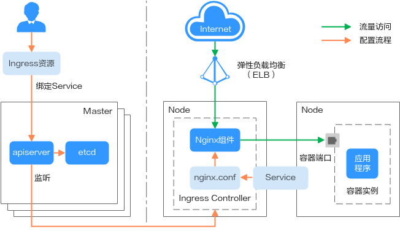

# Ingress概述

## 为什么需要Ingress

Service基于TCP和UDP协议进行访问转发，为集群提供了四层负载均衡的能力。但是在实际场景中，Service无法满足应用层中存在着大量的HTTP/HTTPS访问需求。因此，Kubernetes集群提供了另一种基于HTTP协议的访问方式——Ingress。

Ingress是Kubernetes集群中一种独立的资源，制定了集群外部访问流量的转发规则。如[图1](#fig18155819416)所示，用户可根据域名和路径对转发规则进行自定义，完成对访问流量的细粒度划分。

**图 1**  Ingress示意图  

下面对Ingress的相关定义进行介绍：

-   Ingress资源：一组基于域名或URL把请求转发到指定Service实例的访问规则，是Kubernetes的一种资源对象，通过接口服务实现增、删、改、查的操作。
-   Ingress Controller：请求转发的执行器，用以实时监控资源对象Ingress、Service、End-point、Secret（主要是TLS证书和Key）、Node、ConfigMap的变化，解析Ingress定义的规则并负责将请求转发到相应的后端Service。

Ingress Controller在不同厂商之间的实现方式不同，根据负载均衡器种类的不同，可以将其分成ELB型和Nginx型。CCE支持上述两种Ingress Controller类型，其中ELB Ingress Controller基于弹性负载均衡服务（ELB）实现流量转发；而Nginx Ingress Controller使用Kubernetes社区维护的模板与镜像，通过Nginx组件完成流量转发。

## Ingress特性对比

**表 1**  Ingress特性对比

<table><thead align="left"><tr id="row75114173117"><th class="cellrowborder" valign="top" width="33.24332433243324%" id="mcps1.2.4.1.1">
特性

</th>
<th class="cellrowborder" valign="top" width="33.423342334233425%" id="mcps1.2.4.1.2">
ELB Ingress Controller

</th>
<th class="cellrowborder" valign="top" width="33.33333333333333%" id="mcps1.2.4.1.3">
Nginx Ingress Controller

</th>
</tr>
</thead>
<tbody><tr id="row55117175111"><td class="cellrowborder" valign="top" width="33.24332433243324%" headers="mcps1.2.4.1.1 ">
运维

</td>
<td class="cellrowborder" valign="top" width="33.423342334233425%" headers="mcps1.2.4.1.2 ">
免运维，更新升级由华为云负责

</td>
<td class="cellrowborder" valign="top" width="33.33333333333333%" headers="mcps1.2.4.1.3 ">
自行安装、升级、维护

</td>
</tr>
<tr id="row051116176117"><td class="cellrowborder" rowspan="3" valign="top" width="33.24332433243324%" headers="mcps1.2.4.1.1 ">
性能

</td>
<td class="cellrowborder" valign="top" width="33.423342334233425%" headers="mcps1.2.4.1.2 ">
一个Ingress支持一个ELB实例

</td>
<td class="cellrowborder" valign="top" width="33.33333333333333%" headers="mcps1.2.4.1.3 ">
多个Ingress只支持一个ELB实例

</td>
</tr>
<tr id="row4511101711111"><td class="cellrowborder" valign="top" headers="mcps1.2.4.1.1 ">
使用企业级LB，高性能高可用，升级、故障等场景不影响业务转发

</td>
<td class="cellrowborder" valign="top" headers="mcps1.2.4.1.2 ">
性能依赖pod的资源配置

</td>
</tr>
<tr id="row155117172115"><td class="cellrowborder" valign="top" headers="mcps1.2.4.1.1 ">
支持配置动态加载

</td>
<td class="cellrowborder" valign="top" headers="mcps1.2.4.1.2 ">
更新配置需reload，可能会造成业务中断

</td>
</tr>
<tr id="row651121711115"><td class="cellrowborder" valign="top" width="33.24332433243324%" headers="mcps1.2.4.1.1 ">
组件部署

</td>
<td class="cellrowborder" valign="top" width="33.423342334233425%" headers="mcps1.2.4.1.2 ">
Master节点，不占用工作节点

</td>
<td class="cellrowborder" valign="top" width="33.33333333333333%" headers="mcps1.2.4.1.3 ">
Worker节点，需要Nginx组件运行成本

</td>
</tr>
<tr id="row1351111713118"><td class="cellrowborder" valign="top" width="33.24332433243324%" headers="mcps1.2.4.1.1 ">
路由重定向

</td>
<td class="cellrowborder" valign="top" width="33.423342334233425%" headers="mcps1.2.4.1.2 ">
不支持

</td>
<td class="cellrowborder" valign="top" width="33.33333333333333%" headers="mcps1.2.4.1.3 ">
支持

</td>
</tr>
<tr id="row8511817191119"><td class="cellrowborder" valign="top" width="33.24332433243324%" headers="mcps1.2.4.1.1 ">
SSL配置

</td>
<td class="cellrowborder" valign="top" width="33.423342334233425%" headers="mcps1.2.4.1.2 ">
支持

</td>
<td class="cellrowborder" valign="top" width="33.33333333333333%" headers="mcps1.2.4.1.3 ">
支持

</td>
</tr>
</tbody>
</table>

由于华为云自研的ELB Ingress和社区开源的Nginx Ingress在原理上存在本质区别，因此支持的Service类型不同，如[表2](#table9511151771120)中所示。

**表 2**  支持Service类型

<table><thead align="left"><tr id="row175113174112"><th class="cellrowborder" valign="top" width="25%" id="mcps1.2.5.1.1">
Ingress类型

</th>
<th class="cellrowborder" valign="top" width="24.959999999999997%" id="mcps1.2.5.1.2">
访问类型

</th>
<th class="cellrowborder" valign="top" width="24.990000000000002%" id="mcps1.2.5.1.3">
集群内访问（ClusterIP）

</th>
<th class="cellrowborder" valign="top" width="25.05%" id="mcps1.2.5.1.4">
节点访问（NodePort）

</th>
</tr>
</thead>
<tbody><tr id="row1751131717112"><td class="cellrowborder" rowspan="2" valign="top" width="25%" headers="mcps1.2.5.1.1 ">
ELB Ingress

</td>
<td class="cellrowborder" valign="top" width="24.959999999999997%" headers="mcps1.2.5.1.2 ">
负载均衡路由

</td>
<td class="cellrowborder" valign="top" width="24.990000000000002%" headers="mcps1.2.5.1.3 ">
不支持

</td>
<td class="cellrowborder" valign="top" width="25.05%" headers="mcps1.2.5.1.4 ">
支持

</td>
</tr>
<tr id="row25121617101119"><td class="cellrowborder" valign="top" headers="mcps1.2.5.1.1 ">
ENI负载均衡路由

</td>
<td class="cellrowborder" valign="top" headers="mcps1.2.5.1.2 ">
支持

</td>
<td class="cellrowborder" valign="top" headers="mcps1.2.5.1.3 ">
不支持

</td>
</tr>
<tr id="row9512181719115"><td class="cellrowborder" rowspan="2" valign="top" width="25%" headers="mcps1.2.5.1.1 ">
Nginx Ingress

</td>
<td class="cellrowborder" valign="top" width="24.959999999999997%" headers="mcps1.2.5.1.2 ">
负载均衡路由

</td>
<td class="cellrowborder" valign="top" width="24.990000000000002%" headers="mcps1.2.5.1.3 ">
支持

</td>
<td class="cellrowborder" valign="top" width="25.05%" headers="mcps1.2.5.1.4 ">
支持

</td>
</tr>
<tr id="row1451241718110"><td class="cellrowborder" valign="top" headers="mcps1.2.5.1.1 ">
ENI负载均衡路由

</td>
<td class="cellrowborder" valign="top" headers="mcps1.2.5.1.2 ">
支持

</td>
<td class="cellrowborder" valign="top" headers="mcps1.2.5.1.3 ">
不支持

</td>
</tr>
</tbody>
</table>

ELB Ingress Controller部署在master节点，所有策略配置和转发行为均在ELB侧完成。不使用ENI负载均衡的情况下，集群外部的ELB只能通过VPC的IP对接集群内部节点，因此ELB Ingress只支持NodePort类型的Service。使用ENI负载均衡后，ELB可直接将流量转发到集群内Pod，此时Ingress仅支持对接ClusterIP类型的Service。

Nginx Ingress Controller运行在集群中，作为服务通过NodePort对外暴露，流量经过Nginx-ingress转发到集群内其他业务，流量转发行为及转发对象均在集群内部，因此支持ClusterIP和NodePort类型的Service。当集群使用ENI负载均衡时，Nginx Ingress仅支持ClusterIP类型的Service。

综上，华为云自研的ELB Ingress使用企业级LB进行流量转发，拥有高性能和高稳定性的优点，而Nginx Ingress Controller部署在集群节点上，牺牲了一定的集群资源但可配置性相对更好。

## ELB Ingress Controller工作原理

CCE自研的ELB Ingress Controller基于弹性负载均衡服务ELB实现公网和内网（同一VPC内）的七层网络访问，通过不同的URL将访问流量分发到对应的服务。

ELB Ingress Controller部署于Master节点上，与集群所在VPC下的弹性负载均衡器绑定，支持在同一个ELB实例（同一IP）下进行不同域名、端口和转发策略的设置。ELB Ingress Controller的工作原理如[图2](#fig122542486129)，实现步骤如下：

1.  用户创建Ingress资源，在Ingress中配置流量访问规则，包括负载均衡器、URL、SSL以及访问的后端Service端口等。
2.  Ingress Controller监听到Ingress资源发生变化时，就会根据其中定义的流量访问规则，在ELB侧重新配置监听器以及后端服务器路由。
3.  当用户进行访问时，流量根据ELB中配置的转发策略转发到对应的后端Service端口，然后再经过Service二次转发访问到关联的各个工作负载。

**图 2**  ELB Ingress Controller工作原理  

## Nginx Ingress Controller工作原理

Nginx型的Ingress使用弹性负载均衡（ELB）作为流量入口，并在集群中部署[nginx-ingress插件](nginx-ingress-153.md)来对流量进行负载均衡及访问控制。

> **说明：** 
>nginx-ingress插件直接使用社区模板与镜像，CCE不提供额外维护，不建议用于商用场景。
>开源社区地址：[https://github.com/kubernetes/ingress-nginx](https://github.com/kubernetes/ingress-nginx)

Nginx型的Ingress Controller通过pod部署在工作节点上，因此引入了相应的运维成本和Nginx组件运行成本，其工作原理如[图3](#fig2042781115133)，实现步骤如下：

1.  当用户更新Ingress资源后，Ingress Controller就会将其中定义的转发规则写入到Nginx的配置文件（nginx.conf）中。
2.  内置的Nginx组件进行reload，加载更新后的配置文件，完成Nginx转发规则的修改和更新。
3.  在流量访问集群时，首先被已创建的负载均衡实例转发到集群内部的Nginx组件，然后Nginx组件再根据转发规则将其转发至对应的各个工作负载。

**图 3**  Nginx Ingress Controller工作原理  

