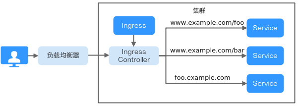
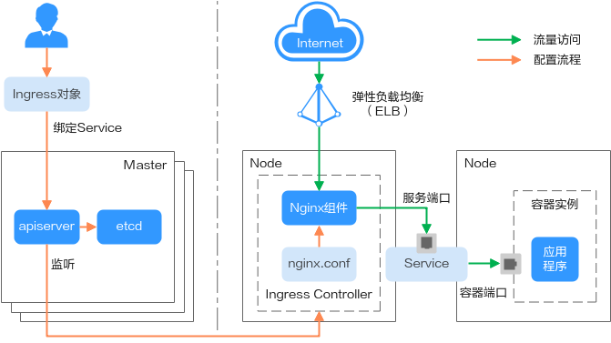

# Ingress概述

## 为什么需要Ingress

Service是基于四层TCP和UDP协议转发的，而在实际使用场景中，四层Service无法满足应用层存在的大量HTTP/HTTPS访问需求，因此需要使用七层负载均衡（Ingress）来暴露服务。Ingress基于七层的HTTP和HTTPS协议进行转发，它并不是一种Service类型，而是集群流量的入口，可以通过域名和路径对访问做到更细粒度的划分。Ingress作为kubernetes集群中一种独立的资源，需要通过创建它来制定外部访问流量的转发规则，并通过Ingress Controller将其分配到一个或多个Service中。

**图 1**  Ingress示意图  

Ingress需要区分两个定义：

-   Ingress资源：一组基于域名或URL把请求转发到指定Service实例的访问规则，是Kubernetes的一种资源对象，Ingress实例被存储在对象存储服务etcd中，通过接口服务实现增、删、改、查的操作。
-   Ingress Controller：请求转发的执行器，用以实时监控资源对象Ingress、Service、End-point、Secret（主要是TLS证书和Key）、Node、ConfigMap的变化，解析Ingress定义的规则并负责将请求转发到相应的后端Service。

因此定义了Ingress后必须要有Ingress Controller来负责执行，而Ingress Controller在不同厂商之间有着不同的实现方式，根据负载均衡器的形式不同，主要可分为ELB型和Nginx型。Kubernetes官方维护的[NGINX Ingress Controller](https://github.com/kubernetes/ingress-nginx)属于Nginx型，而CCE所采用的自研Ingress Controller方案属于ELB型。

## ELB Ingress Controller工作原理

CCE自研的ELB Ingress Controller基于弹性负载均衡服务ELB实现公网和内网（同一VPC内）的七层网络访问，通过不同的URL将访问流量分发到对应的服务。ELB根据转发规则将访问流量通过NodePort转发至Pod（ENI负载均衡器直通容器时通过ClusterIP直接转发至Pod），集群可通过配置多个Ingress规则绑定多个ELB实例。

ELB Ingress Controller部署于Master节点上，与集群所在VPC下的弹性负载均衡器绑定，支持在同一个ELB实例（同一IP）下进行不同域名、端口和转发策略的设置，不支持路由的重定向。ELB Ingress Controller的工作原理如[图2](#fig195830353)，主要步骤如下：

1.  用户创建Ingress资源，在Ingress中配置流量访问规则，包括负载均衡器、URL、SSL以及访问的后端Service端口等。
2.  Ingress Controller实现Ingress，当监听到Ingress资源发生变化时，就会根据其中定义的流量访问规则，在ELB侧重新配置监听器以及后端服务器路由。
3.  当用户进行访问时，ELB根据配置的转发策略把流量转发到对应的后端服务器Service端口，最终访问到关联的各个工作负载。

**图 2**  ELB Ingress Controller工作原理  

## Nginx Ingress Controller工作原理

Nginx Ingress Controller是基于弹性负载均衡ELB和[nginx-ingress](nginx-ingress.md)插件实现的，在ELB后增加了Nginx反向代理，从而实现流量的负载均衡及访问控制。

> **说明：** 
>nginx-ingress插件直接使用社区模板与镜像，CCE不提供额外维护，不建议用于商用场景。
>开源社区地址：[https://github.com/kubernetes/ingress-nginx](https://github.com/kubernetes/ingress-nginx)

Nginx型的Ingress Controller通过pod部署在工作节点上，因此引入了相应的运维成本和Nginx组件运行成本，其主要工作原理如[图3](#fig10473974419)，主要步骤如下：

1.  当用户更新Ingress资源后，其中定义的转发规则会通过Ingress Controller生成一段新的Nginx配置文件（nginx.conf）。
2.  Ingress Controller将Nginx配置文件（nginx.conf）写入到内置的Nginx组件中，然后reload完成Nginx反向代理配置的修改和更新。
3.  外部流量通过已创建的负载均衡实例转发到Nginx组件，然后Nginx组件再根据配置文件进行反向代理访问到对应的目标Service，最终访问到各个工作负载。

**图 3**  Nginx Ingress Controller工作原理  

## ELB型和Nginx型Ingress Controller对比

**表 1**  ELB型和Nginx型Ingress Controller对比

<table><thead align="left"><tr id="row9228053165215"><th class="cellrowborder" valign="top" width="33.24332433243324%" id="mcps1.2.4.1.1">
特性

</th>
<th class="cellrowborder" valign="top" width="33.423342334233425%" id="mcps1.2.4.1.2">
ELB Ingress Controller

</th>
<th class="cellrowborder" valign="top" width="33.33333333333333%" id="mcps1.2.4.1.3">
Nginx Ingress Controller

</th>
</tr>
</thead>
<tbody><tr id="row57816428239"><td class="cellrowborder" valign="top" width="33.24332433243324%" headers="mcps1.2.4.1.1 ">
运维

</td>
<td class="cellrowborder" valign="top" width="33.423342334233425%" headers="mcps1.2.4.1.2 ">
免运维，更新升级由华为云负责

</td>
<td class="cellrowborder" valign="top" width="33.33333333333333%" headers="mcps1.2.4.1.3 ">
自行安装、升级、维护

</td>
</tr>
<tr id="row181084872314"><td class="cellrowborder" rowspan="3" valign="top" width="33.24332433243324%" headers="mcps1.2.4.1.1 ">
性能

</td>
<td class="cellrowborder" valign="top" width="33.423342334233425%" headers="mcps1.2.4.1.2 ">
一个集群支持多个ELB实例

</td>
<td class="cellrowborder" valign="top" width="33.33333333333333%" headers="mcps1.2.4.1.3 ">
一个集群只支持一个ELB实例

</td>
</tr>
<tr id="row16585103017248"><td class="cellrowborder" valign="top" headers="mcps1.2.4.1.1 ">
使用企业级LB，高性能高可用，升级、故障等场景不影响业务转发

</td>
<td class="cellrowborder" valign="top" headers="mcps1.2.4.1.2 ">
性能依赖pod的资源配置

</td>
</tr>
<tr id="row76851723191713"><td class="cellrowborder" valign="top" headers="mcps1.2.4.1.1 ">
支持配置动态加载

</td>
<td class="cellrowborder" valign="top" headers="mcps1.2.4.1.2 ">
更新配置需reload，可能会造成业务中断

</td>
</tr>
<tr id="row722875385215"><td class="cellrowborder" valign="top" width="33.24332433243324%" headers="mcps1.2.4.1.1 ">
组件部署

</td>
<td class="cellrowborder" valign="top" width="33.423342334233425%" headers="mcps1.2.4.1.2 ">
Master节点，不占用工作节点

</td>
<td class="cellrowborder" valign="top" width="33.33333333333333%" headers="mcps1.2.4.1.3 ">
Worker节点，需要Nginx组件运行成本

</td>
</tr>
<tr id="row7228175315211"><td class="cellrowborder" valign="top" width="33.24332433243324%" headers="mcps1.2.4.1.1 ">
路由重定向

</td>
<td class="cellrowborder" valign="top" width="33.423342334233425%" headers="mcps1.2.4.1.2 ">
不支持

</td>
<td class="cellrowborder" valign="top" width="33.33333333333333%" headers="mcps1.2.4.1.3 ">
支持

</td>
</tr>
<tr id="row1987813625219"><td class="cellrowborder" valign="top" width="33.24332433243324%" headers="mcps1.2.4.1.1 ">
SSL配置

</td>
<td class="cellrowborder" valign="top" width="33.423342334233425%" headers="mcps1.2.4.1.2 ">
支持

</td>
<td class="cellrowborder" valign="top" width="33.33333333333333%" headers="mcps1.2.4.1.3 ">
支持

</td>
</tr>
</tbody>
</table>

