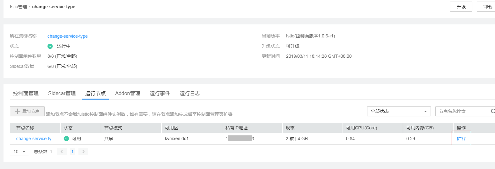

# Istio控制面管理

Istio管理提供了Istio控制面组件、数据面sidecar的健康及性能监控能力，支持运行资源的扩缩容管理，以及不同Istio版本间的升级管理。

Istio控制面组件负责向数据面组件注入sidecar，管理数据面sidecar行为，下发策略配置，搜集监控数据等。其中，sidecar（边车）是指运行在业务pod中，与业务容器协同工作，负责业务pod的路由转发，监控数据采集，流量规则配置等功能。

## 监控使能了服务网格的集群

1.  在CCE左侧导航栏中选择“应用管理 \> Istio管理”。
2.  查看所有使能了Istio服务网格的集群情况。

    在该页面，您可以查看每个集群的Istio版本，运行状态，控制面组件数量和数据面Sidecar数量，以及控制面组件pilot，mixer，gateway的CPU与内存占用量。

3.  单击集群名称，查看控制面所有组件和Sidecar的业务pod信息。
    -   “控制面组件”页签：展示Istio控制面的所有组件，以及每个组件的运行状态，CUP、内存占用率，实例数量，命名空间等信息。
    -   “Sidecar管理”页签：展示所有注入了sidecar的业务pod信息，以及每个pod的名称，CPU、内存占用率，sidecar版本，创建时间，sidecar升级操作入口等信息。

## 升级Istio控制面

执行升级操作需具备以下两个条件：

-   Istio控制面运行版本需小于最新版本
-   旧版本Istio控制面运行正常

1.  在CCE左侧导航栏中选择“应用管理 \> Istio管理”。
2.  在Istio管理集群列表页面，单击待升级集群后的“操作 \> 升级”。
3.  查看升级版本，确定是否自动升级sidecar。
    -   是：会在Istio控制面升级完成后，通过重启业务pod的方式进行sidecar重新注入，过程中业务pod将会重启，可能导致业务中断。
    -   否：仅会升级Istio控制面组件，sidecar升级需跳转到Sidecar管理页签自行升级sidecar，该方式会导致控制面组件与数据面sidecar版本不一致，可能产生兼容性问题，建议尽快同步升级sdiecar版本。

4.  确认无误后，单击“升级”。

## 运行节点

“运行节点“可以帮助您查看已创建的节点。您在当前集群中创建了节点，就可以在“运行节点“页中查看节点的相关信息，包括节点名称、状态、节点模式（独享/共享）、可用区、私有IP地址、规格、可用CPU、可用内存。

您还可以在“运行节点“中对节点进行“扩容“，详细步骤如下：

1.  在CCE左侧导航栏中选择“应用管理 \> Istio管理“。
2.  单击相应集群名称进入Istio管理详情。
3.  单击“运行节点“页签。
4.  单击“操作“下的“扩容“链接跳转到弹性云服务器页面。

    **图 1**  Istio节点扩容  
    

5.  根据节点“名称/ID“找到对应的云服务器，然后单击“变更规格“就可以对节点进行扩容操作。

    **图 2**  变更规格  
    

6.  

## Addon管理

Addon管理可以对grafana、prometheus、kiali、tracing四个插件进行安装和卸载，这些插件可以帮助用户进行流量治理与监测。

**插件安装**：

1.  单击“Addon管理“页签。
2.  单击要安装插件下方的“安装“，跳转到安装页面。
3.  在安装页面，选择插件要绑定的“弹性负载“，输入要分配给插件安装的“CPU配额“和“内存配额“。

    > **说明：**   
    >-   当前服务网格支持“经典型负载均衡“和“增强型弹性负载均衡“，为了更好地与服务网格配合，推荐创建并使用“增强型弹型负载均衡“。创建详细步骤请参考[创建经典型负载均衡器](https://support.huaweicloud.com/qs-elb/zh-cn_topic_0015479967.html)或[创建增强型负载均衡器](https://support.huaweicloud.com/qs-elb/zh-cn_topic_0052569751.html)。  
    >-   如果您的弹性负载均衡监听器配额不足将不会显示在负载均衡器列表中。  
    >-   CPU配额和内存配额中的“申请“和“限制“值为必填，且不能超过节点剩余额度。  

4.  单击“安装“，跳转到插件管理页面，在插件卡片的左上角显示插件的安装和运行状态。如果插件长时间处于安装中状态或者安装失败状态，请删除以后重新安装。

**插件卸载**

1.  单击插件卡片右上角的“删除“，弹出“确认“对话框。
2.  单击“确定“按钮完成卸载。

