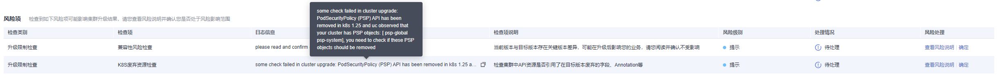

# K8s废弃资源检查

## 检查项内容

检查集群是否存在对应版本已经废弃的资源。

## 解决方案

**问题场景： 1.25及以上集群废弃了PodSecurityPolicy资源对象**

在集群中通过**kubectl get psp -A**命令获取当前集群中已存在的PSP对象。

如果您并未使用这两个对象，可以直接点击确定按钮跳过该检查，若您存在使用该对象的情况，请参见[Pod安全配置](Pod安全配置.md)相关文档，将PSP相应功能升级至PodSecurity安全准入能力中。

