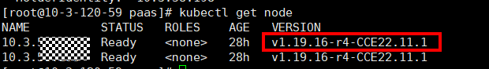

# K8s节点污点检查

## 检查项内容

检查节点上是否存在集群升级需要使用到的污点，如[表1](#table1126154011128)。

**表 1**  检查污点列表

<table><thead align="left"><tr id="row22744011127"><th class="cellrowborder" valign="top" width="50%" id="mcps1.2.3.1.1">
污点名称

</th>
<th class="cellrowborder" valign="top" width="50%" id="mcps1.2.3.1.2">
污点影响

</th>
</tr>
</thead>
<tbody><tr id="row12271140101216"><td class="cellrowborder" valign="top" width="50%" headers="mcps1.2.3.1.1 ">
node.kubernetes.io/upgrade

</td>
<td class="cellrowborder" valign="top" width="50%" headers="mcps1.2.3.1.2 ">
NoSchedule

</td>
</tr>
</tbody>
</table>

## 解决方案

问题场景一：该节点为集群升级过程中跳过的节点。

1.  配置Kubectl命令，具体请参见[通过kubectl连接集群](通过kubectl连接集群.md)。
2.  查看对应节点kubelet版本，以下为正常回显：

    

    若该节点的VERSION与其他节点不同，则该节点为升级过程中跳过的节点，请在合适的时间[重置节点](重置节点.md)后，重试检查。

    > **说明：** 
    >重置节点会重置所有节点标签，可能影响工作负载调度，请在重置节点前检查并保留您手动为该节点打上的标签。

