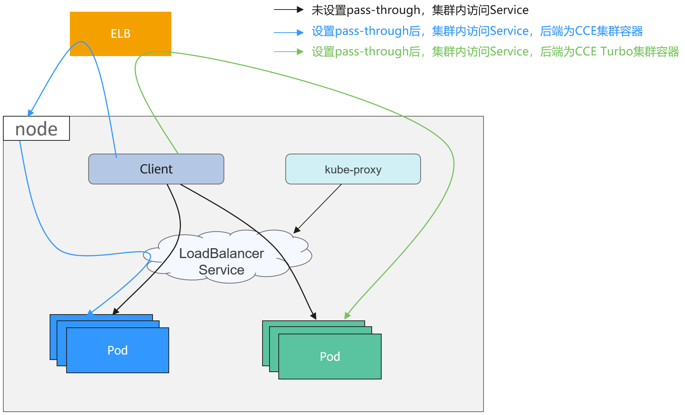
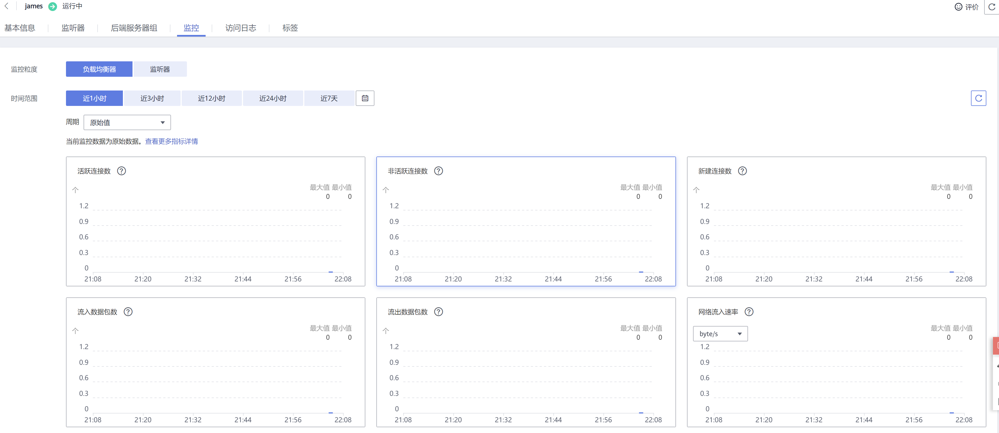
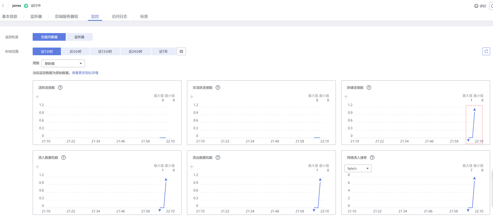

# LoadBalancer类型Service使用pass-through能力<a name="cce_10_0355"></a>

## 应用现状<a name="zh-cn_topic_0000001168691039_section7206104617334"></a>

Kubernetes集群可以将运行在一组Pod上的应用程序发布为服务，提供统一的四层访问入口。对于Loadbalancer类型的service，kube-proxy默认会将Service的status中LoadbalanceIP地址配置到节点本地的转发规则中，集群内部访问ELB的地址，流量就会在集群内部转发，而不会经过ELB转发。

集群内部转发功能是kube-proxy组件负责，kube-proxy有iptables和IPVS两种转发模式，iptables是一种简单的轮询转发，IPVS虽有多种转发模式，但也需要修改kube-proxy的启动参数，不能像ELB那样灵活配置转发策略，且无法利用ELB的健康检查能力。

## 解决方案<a name="zh-cn_topic_0000001168691039_section3408153163318"></a>

CCE服务支持pass-through能力，通过Loadbalance类型Service配置kubernetes.io/elb.pass-through的annotation实现集群内部访问Service的ELB地址时绕出集群，并通过ELB的转发最终转发到后端的Pod。

**图 1**  pass-through访问示例<a name="zh-cn_topic_0000001168691039_fig1610719509396"></a>  


-   针对CCE集群：
    -   集群内部访问LB类型service，默认行为是通过iptables/ipvs转发到后端的容器实例。
    -   LB类型service配置elb.pass-through，集群内访问Service地址流量能支持先转发到ELB，利用了ELB的负载均衡能力回到节点。

-   针对CCE Turbo集群：
    -   集群内部访问LB类型service，默认行为是通过iptables/ipvs转发到后端的容器实例。
    -   LB类型service配置elb.pass-through，集群内访问Service地址流量能支持先转发到ELB，利用了ELB的负载均衡能力流量直通到容器中。


## 约束限制<a name="zh-cn_topic_0000001168691039_section377316644214"></a>

-   独享型负载均衡配置pass-through后，在工作负载同节点和同节点容器内无法通过Service访问。
-   1.15及以下老版本集群暂不支持该能力。
-   IPVS网络模式下，对接同一个ELB的Service需保持pass-through设置情况一致。

## 操作步骤<a name="zh-cn_topic_0000001168691039_section127841658113314"></a>

下文以nginx镜像创建无状态工作负载，并创建一个具有pass-through的Service。

1.  使用nginx镜像创建无状态负载。

    ```
    apiVersion: apps/v1     
    kind: Deployment         
    metadata:
      name: nginx            
    spec:
      replicas: 2                     
      selector:              
        matchLabels:
          app: nginx
      template:              
        metadata:
          labels:
            app: nginx
        spec:
          containers:
          - image: nginx:latest
            name: container-0
            resources:
              limits:
                cpu: 100m
                memory: 200Mi
              requests:
                cpu: 100m
                memory: 200Mi
          imagePullSecrets:
          - name: default-secret
    ```

2.  Loadbalance类型的Service，并设置kubernetes.io/elb.pass-through为true。

    Loadbalance类型的Service具体创建方法请参见[自动创建负载均衡类型Service](https://support.huaweicloud.com/usermanual-cce/cce_10_0014.html#section6)。

    ```
    apiVersion: v1 
    kind: Service 
    metadata: 
      annotations:   
        kubernetes.io/elb.pass-through: "true"
        kubernetes.io/elb.class: union
        kubernetes.io/elb.autocreate: '{"type":"public","bandwidth_name":"cce-bandwidth","bandwidth_chargemode":"bandwidth","bandwidth_size":5,"bandwidth_sharetype":"PER","eip_type":"5_bgp","name":"james"}'
      labels: 
        app: nginx 
      name: nginx 
    spec: 
      externalTrafficPolicy: Local
      ports: 
      - name: service0 
        port: 80
        protocol: TCP 
        targetPort: 80
      selector: 
        app: nginx 
      type: LoadBalancer
    ```

    此处是自动创建一个名为james的共享型ELB实例，需要通过kubernetes.io/elb.subnet-id指定ELB所在VPC子网，必须和集群在同一个VPC。


## 配置验证<a name="zh-cn_topic_0000001168691039_section776335910129"></a>

查看上面创建的Service对应的ELB，名称为james，可以看到ELB的连接数为0，如下图所示。



使用kubectl连接集群，进入到某一个nginx容器中，然后访问ELB的地址。可以看到能够正常访问。

```
# kubectl get pod
NAME                     READY   STATUS    RESTARTS   AGE
nginx-7c4c5cc6b5-vpncx   1/1     Running   0          9m47s
nginx-7c4c5cc6b5-xj5wl   1/1     Running   0          9m47s
# kubectl exec -it nginx-7c4c5cc6b5-vpncx -- /bin/sh
# curl 120.46.141.192
<!DOCTYPE html>
<html>
<head>
<title>Welcome to nginx!</title>
<style>
    body {
        width: 35em;
        margin: 0 auto;
        font-family: Tahoma, Verdana, Arial, sans-serif;
    }
</style>
</head>
<body>
<h1>Welcome to nginx!</h1>
<p>If you see this page, the nginx web server is successfully installed and
working. Further configuration is required.</p>

<p>For online documentation and support please refer to
<a href="http://nginx.org/">nginx.org</a>.<br/>
Commercial support is available at
<a href="http://nginx.com/">nginx.com</a>.</p>

<p><em>Thank you for using nginx.</em></p>
</body>
</html>
```

稍微等待一段时间看ELB的监控数据，可以看到ELB有一个新建访问连接，这就证明了这次访问经过ELB，与预期一致。



