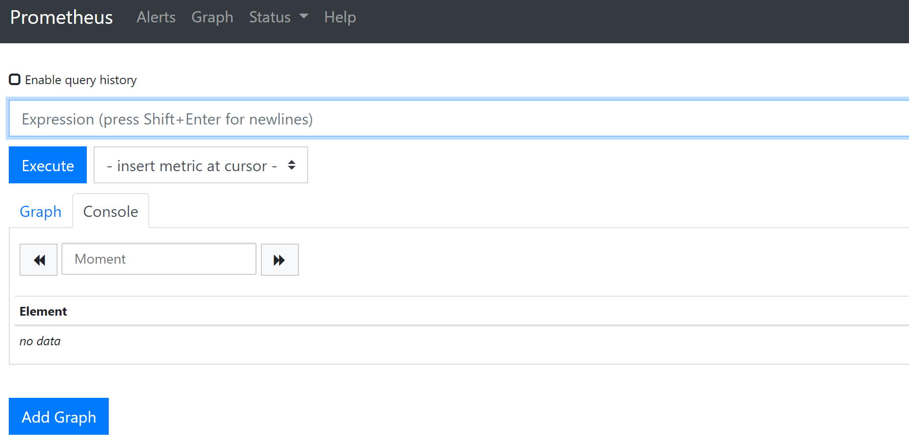
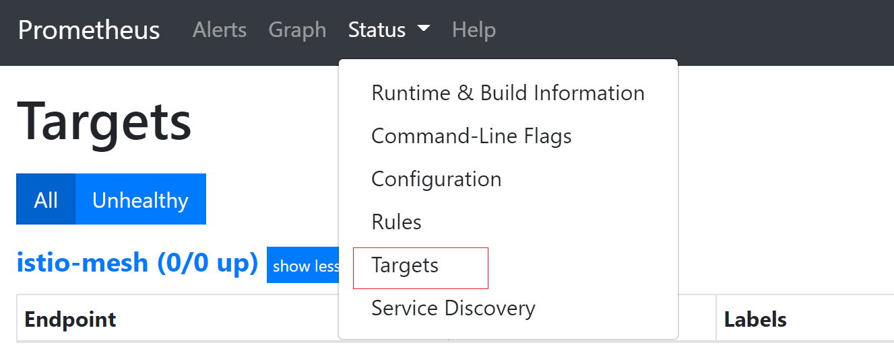

# Master节点组件指标监控<a name="cce_10_0559"></a>

3.5.0及以上版本的[kube-prometheus-stack](kube-prometheus-stack.md)插件已支持对Master节点的kube-apiserver、kube-controller、kube-scheduler、etcd-server组件进行监控，您在集群中安装该插件后，无需进行手动配置即可采集上述Master节点组件指标。

如果您需要通过自建的Prometheus采集Master节点组件指标，可通过本文指导进行配置。

## 前提条件<a name="section5844112513504"></a>

-   集群版本需要v1.19及以上。
-   集群中需安装自建Prometheus，具体操作步骤请参见[Prometheus community Helm charts](https://github.com/prometheus-community/helm-charts/)。由于[prometheus](prometheus.md)插件版本已停止演进，不再支持该功能特性，请避免使用。
-   集群中需安装prometheus-operator，具体操作步骤请参见[Prometheus Operator](https://prometheus-operator.dev/docs/user-guides/getting-started/)。
-   如需从外部访问Prometheus，请提前为Prometheus创建一个公网[LoadBalancer类型Service](使用Prometheus插件监控.md#section4340162312020)。

## 操作步骤<a name="section35141817144911"></a>

1.  使用[kubectl](通过kubectl连接集群.md)连接集群。
2.  修改Prometheus的ClusterRole。

    ```
    kubectl edit ClusterRole prometheus -n {namespace}
    ```

    在rules字段添加以下内容：

    ```
    rules:
    ...
    - apiGroups:
      - proxy.exporter.k8s.io
      resources:
      - "*"
      verbs: ["get", "list", "watch"]
    ```

3.  创建并编辑kube-apiserver.yaml文件。

    ```
    vi kube-apiserver.yaml
    ```

    文件内容如下：

    ```
    apiVersion: monitoring.coreos.com/v1
    kind: ServiceMonitor
    metadata:
      labels:
        app.kubernetes.io/name: apiserver
      name: kube-apiserver
      namespace: monitoring    #修改为Prometheus安装的命名空间
    spec:
      endpoints:
      - bearerTokenFile: /var/run/secrets/kubernetes.io/serviceaccount/token
        interval: 30s
        metricRelabelings:
        - action: keep
          regex: (aggregator_unavailable_apiservice|apiserver_admission_controller_admission_duration_seconds_bucket|apiserver_admission_webhook_admission_duration_seconds_bucket|apiserver_admission_webhook_admission_duration_seconds_count|apiserver_client_certificate_expiration_seconds_bucket|apiserver_client_certificate_expiration_seconds_count|apiserver_current_inflight_requests|apiserver_request_duration_seconds_bucket|apiserver_request_total|go_goroutines|kubernetes_build_info|process_cpu_seconds_total|process_resident_memory_bytes|rest_client_requests_total|workqueue_adds_total|workqueue_depth|workqueue_queue_duration_seconds_bucket|aggregator_unavailable_apiservice_total|rest_client_request_duration_seconds_bucket)
          sourceLabels:
          - __name__
        - action: drop
          regex: apiserver_request_duration_seconds_bucket;(0.15|0.25|0.3|0.35|0.4|0.45|0.6|0.7|0.8|0.9|1.25|1.5|1.75|2.5|3|3.5|4.5|6|7|8|9|15|25|30|50)
          sourceLabels:
          - __name__
          - le
        port: https
        scheme: https
        tlsConfig:
          caFile: /var/run/secrets/kubernetes.io/serviceaccount/ca.crt
          serverName: kubernetes
      jobLabel: component
      namespaceSelector:
        matchNames:
        - default
      selector:
        matchLabels:
          component: apiserver
          provider: kubernetes
    ```

    创建ServiceMonitor：

    ```
    kubectl apply -f kube-apiserver.yaml
    ```

4.  创建并编辑kube-controller.yaml文件。

    ```
    vi kube-controller.yaml
    ```

    文件内容如下：

    ```
    apiVersion: monitoring.coreos.com/v1
    kind: ServiceMonitor
    metadata:
      labels:
        app.kubernetes.io/name: kube-controller
      name: kube-controller-manager
      namespace: monitoring    #修改为Prometheus安装的命名空间
    spec:
      endpoints:
        - bearerTokenFile: /var/run/secrets/kubernetes.io/serviceaccount/token
          interval: 15s
          honorLabels: true
          port: https
          relabelings:
            - regex: (.+)
              replacement: /apis/proxy.exporter.k8s.io/v1beta1/kube-controller-proxy/${1}/metrics
              sourceLabels:
                - __address__
              targetLabel: __metrics_path__
            - regex: (.+)
              replacement: ${1}
              sourceLabels:
                - __address__
              targetLabel: instance
            - replacement: kubernetes.default.svc.cluster.local:443
              targetLabel: __address__
          scheme: https
          tlsConfig:
            caFile: /var/run/secrets/kubernetes.io/serviceaccount/ca.crt
      jobLabel: app
      namespaceSelector:
        matchNames:
          - kube-system
      selector:
        matchLabels:
          app: kube-controller-proxy
          version: v1
    ```

    创建ServiceMonitor：

    ```
    kubectl apply -f kube-controller.yaml
    ```

5.  创建并编辑kube-scheduler.yaml文件。

    ```
    vi kube-scheduler.yaml
    ```

    文件内容如下：

    ```
    apiVersion: monitoring.coreos.com/v1
    kind: ServiceMonitor
    metadata:
      labels:
        app.kubernetes.io/name: kube-scheduler
      name: kube-scheduler
      namespace: monitoring    #修改为Prometheus安装的命名空间
    spec:
      endpoints:
        - bearerTokenFile: /var/run/secrets/kubernetes.io/serviceaccount/token
          interval: 15s
          honorLabels: true
          port: https
          relabelings:
            - regex: (.+)
              replacement: /apis/proxy.exporter.k8s.io/v1beta1/kube-scheduler-proxy/${1}/metrics
              sourceLabels:
                - __address__
              targetLabel: __metrics_path__
            - regex: (.+)
              replacement: ${1}
              sourceLabels:
                - __address__
              targetLabel: instance
            - replacement: kubernetes.default.svc.cluster.local:443
              targetLabel: __address__
          scheme: https
          tlsConfig:
            caFile: /var/run/secrets/kubernetes.io/serviceaccount/ca.crt
      jobLabel: app
      namespaceSelector:
        matchNames:
          - kube-system
      selector:
        matchLabels:
          app: kube-scheduler-proxy
          version: v1
    ```

    创建ServiceMonitor：

    ```
    kubectl apply -f kube-scheduler.yaml
    ```

6.  创建并编辑etcd-server.yaml文件。

    ```
    vi etcd-server.yaml
    ```

    文件内容如下：

    ```
    apiVersion: monitoring.coreos.com/v1
    kind: ServiceMonitor
    metadata:
      labels:
        app.kubernetes.io/name: kube-scheduler
      name: kube-scheduler
      namespace: monitoring    #修改为Prometheus安装的命名空间
    spec:
      endpoints:
        - bearerTokenFile: /var/run/secrets/kubernetes.io/serviceaccount/token
          interval: 15s
          honorLabels: true
          port: https
          relabelings:
            - regex: (.+)
              replacement: /apis/proxy.exporter.k8s.io/v1beta1/kube-scheduler-proxy/${1}/metrics
              sourceLabels:
                - __address__
              targetLabel: __metrics_path__
            - regex: (.+)
              replacement: ${1}
              sourceLabels:
                - __address__
              targetLabel: instance
            - replacement: kubernetes.default.svc.cluster.local:443
              targetLabel: __address__
          scheme: https
          tlsConfig:
            caFile: /var/run/secrets/kubernetes.io/serviceaccount/ca.crt
      jobLabel: app
      namespaceSelector:
        matchNames:
          - kube-system
      selector:
        matchLabels:
          app: kube-scheduler-proxy
          version: v1
    ```

    创建ServiceMonitor：

    ```
    etcd-server.yaml
    ```

7.  创建完成后，如果您提前为Prometheus创建了一个公网[LoadBalancer类型Service](使用Prometheus插件监控.md#section4340162312020)，即可在浏览器访问“负载均衡公网IP地址:服务端口“，访问Prometheus。

    

8.  单击“Status \> Targets“，可以查看到Prometheus监控目标中已包含上述三个Master节点组件。

    


