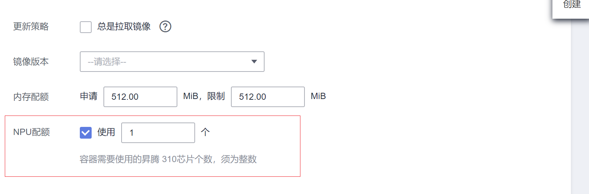
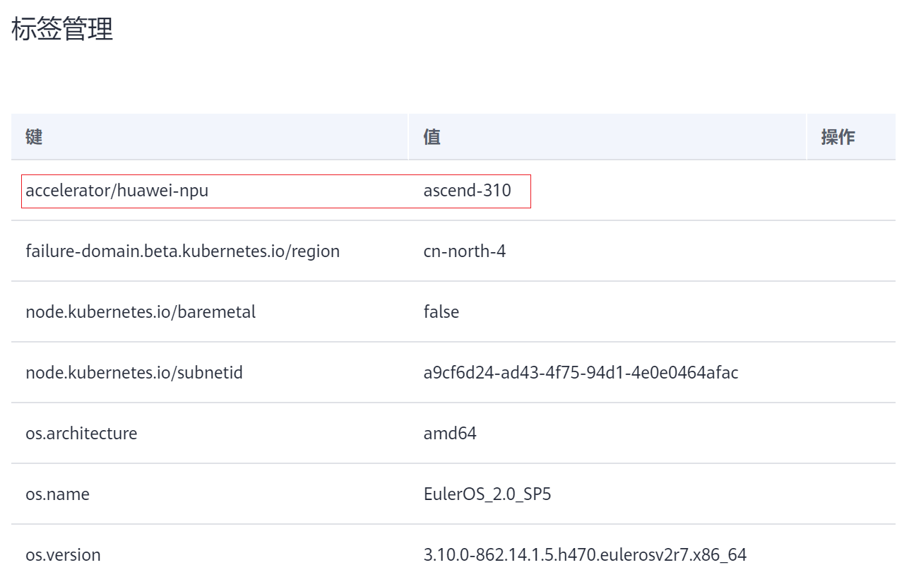

# NPU调度<a name="cce_01_0346"></a>

CCE支持在容器中使用NPU资源。

## 前提条件<a name="section18703125715210"></a>

-   购买NPU类型节点，具体请参见[购买节点](购买节点.md)。
-   安装huawei-npu插件，具体请参见[huawei-npu](huawei-npu.md)。

## 使用NPU<a name="section17426191045420"></a>

创建工作负载申请NPU资源，可按如下方法配置，指定显卡的数量。

```
kind: Deployment
apiVersion: apps/v1
metadata:
  name: npu-test
  namespace: default
spec:
  replicas: 1
  selector:
    matchLabels:
      app: npu-test
  template:
    metadata:
      labels:
        app: npu-test
    spec:
      containers:
        - name: container-0
          image: nginx:perl
          resources:
            limits:
              cpu: 250m
              huawei.com/ascend-310: '1'
              memory: 512Mi
            requests:
              cpu: 250m
              huawei.com/ascend-310: '1'
              memory: 512Mi
      imagePullSecrets:
      - name: default-secret
```

通过  **huawei.com/ascend-310**  指定申请NPU的数量。

指定** huawei.com/ascend-310 **后，在调度时不会将负载调度到没有NPU的节点。如果缺乏NPU资源，会报类似“0/2 nodes are available: 2 Insufficient huawei.com/ascend-310.”的Kubernetes事件。

在CCE控制台使用NPU资源，只需在创建负载时，勾选昇腾310配额，并指定使用310芯片的数量，如下图所示。

**图 1**  使用NPU<a name="fig4221951152116"></a>  


## NPU节点标签<a name="section1867213443102"></a>

购买NPU节点后，CCE会给节点打上对应标签，如下所示。

**图 2**  NPU标签<a name="fig126122041171318"></a>  


在使用NPU时，可以根据标签让Pod与节点亲和，从而让Pod选择正确的节点，如下所示。

```
kind: Deployment
apiVersion: apps/v1
metadata:
  name: npu-test
  namespace: default
spec:
  replicas: 1
  selector:
    matchLabels:
      app: npu-test
  template:
    metadata:
      labels:
        app: npu-test
    spec:
      nodeSelector:
        accelerator/huawei-npu: ascend-310
      containers:
        - name: container-0
          image: nginx:perl
          resources:
            limits:
              cpu: 250m
              huawei.com/ascend-310: '1'
              memory: 512Mi
            requests:
              cpu: 250m
              huawei.com/ascend-310: '1'
              memory: 512Mi
      imagePullSecrets:
      - name: default-secret
```

