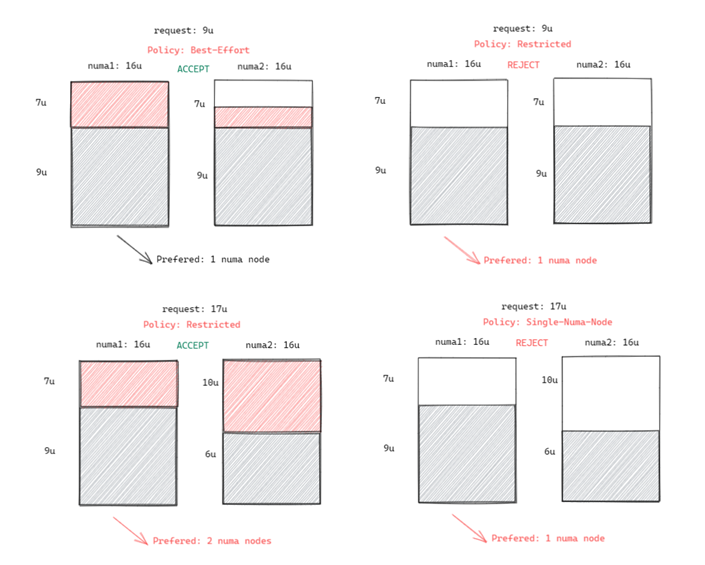

# NUMA亲和性调度<a name="cce_10_0425"></a>

## 背景信息<a name="section4672122511718"></a>

当节点运行许多CPU绑定的Pod时，工作负载可以移动到不同的CPU核心，这取决于Pod是否被限制以及调度时哪些CPU核心可用。许多工作负载对此迁移不敏感，因此在没有任何干预的情况下工作正常。但是，在CPU缓存亲和性和调度延迟显著影响工作负载性能的工作负载中，kubelet允许替代CPU管理策略来确定节点上的一些放置首选项。

CPU Manager和拓扑管理器都是kubelet组件，但有以下限制：

-   K8s默认调度器不感知NUMA拓扑。因此，可能会调度到不满足NUMA拓扑要求的节点上，然后工作负载实例启动失败。这对于Tensorflow作业来说是不可接受的。如果节点上有任何工作进程或ps失败，则作业将失败。
-   管理器是节点级的，导致无法匹配整个集群中NUMA拓扑的最佳节点。

更多资料请查看社区NUMA亲和性插件指导链接：[https://github.com/volcano-sh/volcano/blob/master/docs/design/numa-aware.md](https://github.com/volcano-sh/volcano/blob/master/docs/design/numa-aware.md)

volcano的目标是解决使调度程序NUMA拓扑感知的限制，以便实现以下目标：

-   不要将Pod调度到NUMA拓扑不匹配的节点。
-   将Pod调度到NUMA拓扑的最佳节点。

## 支持范围<a name="section11206191164212"></a>

-   支持CPU资源拓扑调度
-   支持Pod级拓扑策略

## 调度预测<a name="section2430103110429"></a>

对于具有拓扑策略的Pod，需要预测匹配的节点列表。

<a name="table1230718582454"></a>
<table><thead align="left"><tr id="row1030714588458"><th class="cellrowborder" valign="top" width="27.12%" id="mcps1.1.3.1.1"><p id="p1611986114616"><a name="p1611986114616"></a><a name="p1611986114616"></a>policy</p>
</th>
<th class="cellrowborder" valign="top" width="72.88%" id="mcps1.1.3.1.2"><p id="p20307811134613"><a name="p20307811134613"></a><a name="p20307811134613"></a>action</p>
</th>
</tr>
</thead>
<tbody><tr id="row193071458134515"><td class="cellrowborder" valign="top" width="27.12%" headers="mcps1.1.3.1.1 "><p id="p11195619465"><a name="p11195619465"></a><a name="p11195619465"></a>none</p>
</td>
<td class="cellrowborder" valign="top" width="72.88%" headers="mcps1.1.3.1.2 "><p id="p11307201110461"><a name="p11307201110461"></a><a name="p11307201110461"></a>1. 无过滤行为</p>
</td>
</tr>
<tr id="row93084582457"><td class="cellrowborder" valign="top" width="27.12%" headers="mcps1.1.3.1.1 "><p id="p31199615469"><a name="p31199615469"></a><a name="p31199615469"></a>best-effort</p>
</td>
<td class="cellrowborder" valign="top" width="72.88%" headers="mcps1.1.3.1.2 "><p id="p43071311154620"><a name="p43071311154620"></a><a name="p43071311154620"></a>1. 过滤拓扑策略为“best-effort”的节点</p>
</td>
</tr>
<tr id="row10308158124518"><td class="cellrowborder" valign="top" width="27.12%" headers="mcps1.1.3.1.1 "><p id="p0120065462"><a name="p0120065462"></a><a name="p0120065462"></a>restricted</p>
</td>
<td class="cellrowborder" valign="top" width="72.88%" headers="mcps1.1.3.1.2 "><p id="p9307211114617"><a name="p9307211114617"></a><a name="p9307211114617"></a>1. 过滤拓扑策略为“restricted”的节点</p>
<p id="p173076111463"><a name="p173076111463"></a><a name="p173076111463"></a>2. 过滤cpu拓扑满足“restricted”策略要求的节点</p>
</td>
</tr>
<tr id="row1430855894517"><td class="cellrowborder" valign="top" width="27.12%" headers="mcps1.1.3.1.1 "><p id="p4120186174616"><a name="p4120186174616"></a><a name="p4120186174616"></a>single-numa-node</p>
</td>
<td class="cellrowborder" valign="top" width="72.88%" headers="mcps1.1.3.1.2 "><p id="p113085111466"><a name="p113085111466"></a><a name="p113085111466"></a>1. 过滤拓扑策略为“single-numa-node”的节点</p>
<p id="p1130881114619"><a name="p1130881114619"></a><a name="p1130881114619"></a>2. 过滤cpu拓扑满足“single-numa-node”策略要求的节点</p>
</td>
</tr>
</tbody>
</table>

**图 1**  NUMA调度策略对比<a name="fig1216082014438"></a>  


## 调度优先级<a name="section1338110172412"></a>

不管是什么拓扑策略，都是希望把Pod调度到当时最优的节点上，这里通过给每一个节点进行打分的机制来排序筛选最优节点。

原则：尽可能把pod调度到需要跨numa节点最少的工作节点上。

打分公式如下：

score = weight \* \(100 - 100 \* numaNodeNum / maxNumaNodeNum\)

参数说明：

-   **weight**：NUMA Aware Plugin的权重。
-   **numaNodeNum**：表示工作节点上运行该pod需要numa节点的个数。
-   **maxNumaNodeNum**：表示所有工作节点中该pod的最大numa节点个数。

## 开启Volcano支持NUMA亲和性调度<a name="section36347395215"></a>

1.  开启CPU管理策略，具体请参考  [开启CPU管理策略](CPU绑核配置.md#section173918176434)。
2.  配置CPU拓扑策略。
    1.  登录CCE控制台，单击集群名称进入集群，在左侧选择“节点管理“，在右侧选择“节点池“页签，单击节点池名称后的“更多 \> 配置管理“。
    2.  在“全量配置”中将kubelet的**topology-manager-policy**的值修改为需要的CPU拓扑策略即可。例如下图将CPU拓扑策略配置为best-effort。

        有效拓扑策略为“none”、“best-effort”、“restricted”、“single-numa-node”，具体策略对应的调度行为请参见[调度预测](#section2430103110429)。

        

3.  volcano插件开启resource\_exporter\_enable参数，用于收集节点numa拓扑信息。

    ```
    {
       "plugins": {
          "eas_service": {
             "availability_zone_id": "",
             "driver_id": "",
             "enable": "false",
             "endpoint": "",
             "flavor_id": "",
             "network_type": "",
             "network_virtual_subnet_id": "",
             "pool_id": "",
             "project_id": "",
             "secret_name": "eas-service-secret"
          }
       },
       "resource_exporter_enable": "true"
    }
    ```

    开启后可以查看当前节点的numa拓扑信息。

    ```
    kubectl get numatopo 
    NAME              AGE
    node-1            4h8m
    node-2            4h8m
    node-3            4h8m
    ```

4.  启用volcano numa-aware算法插件。

    **kubectl edit cm -n kube-system volcano-scheduler-configmap**

    ```
    kind: ConfigMap
    apiVersion: v1
    metadata:
      name: volcano-scheduler-configmap
      namespace: kube-system
    data:
      default-scheduler.conf: |-
        actions: "allocate, backfill"
        tiers:
        - plugins:
          - name: priority
          - name: gang
          - name: conformance
        - plugins:
          - name: overcommit
          - name: drf
          - name: predicates
          - name: nodeorder
        - plugins:
          - name: cce-gpu-topology-predicate
          - name: cce-gpu-topology-priority
          - name: cce-gpu
        - plugins:
          - name: nodelocalvolume
          - name: nodeemptydirvolume
          - name: nodeCSIscheduling
          - name: networkresource
            arguments:
              NetworkType: vpc-router
          - name: numa-aware # add it to enable numa-aware plugin
            arguments:
              weight: 10 # the weight of the NUMA Aware Plugin
    ```


## 使用Volcano支持NUMA亲和性调度<a name="section20735201818553"></a>

1.  在无状态工作负载中配置NUMA亲和性，示例如下：

    ```
    kind: Deployment
    apiVersion: apps/v1
    metadata:
      name: numa-tset
    spec:
      replicas: 1
      selector:
        matchLabels:
          app: numa-tset
      template:
        metadata:
          labels:
            app: numa-tset
          annotations:
            volcano.sh/numa-topology-policy: single-numa-node    # set the topology policy
        spec:
          containers:
            - name: container-1
              image: nginx:alpine
              resources:
                requests:
                  cpu: 2           # 必须为整数，且需要与limits中一致
                  memory: 2048Mi
                limits:
                  cpu: 2           # 必须为整数，且需要与requests中一致
                  memory: 2048Mi
          imagePullSecrets:
          - name: default-secret
    ```

2.  创建一个volcano job，并使用NUMA亲和性。

    ```
    apiVersion: batch.volcano.sh/v1alpha1
    kind: Job
    metadata:
      name: vj-test
    spec:
      schedulerName: volcano
      minAvailable: 1
      tasks:
        - replicas: 1
          name: "test"
          topologyPolicy: best-effort   # set the topology policy for task 
          template:
            spec:
              containers:
                - image: alpine
                  command: ["/bin/sh", "-c", "sleep 1000"]
                  imagePullPolicy: IfNotPresent
                  name: running
                  resources:
                    limits:
                      cpu: 20
                      memory: "100Mi"
              restartPolicy: OnFailure
    ```

3.  确认NUMA使用情况。

    ```
    # 查看当前节点的CPU概况
    lscpu
    ...
    CPU(s):              32
    NUMA node(s):        2
    NUMA node0 CPU(s):   0-15
    NUMA node1 CPU(s):   16-31
    
    # 查看当前节点的CPU分配
    cat /var/lib/kubelet/cpu_manager_state
    {"policyName":"static","defaultCpuSet":"0,10-15,25-31","entries":{"777870b5-c64f-42f5-9296-688b9dc212ba":{"container-1":"16-24"},"fb15e10a-b6a5-4aaa-8fcd-76c1aa64e6fd":{"container-1":"1-9"}},"checksum":318470969}
    ```


