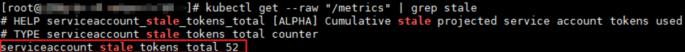

# ServiceAccount Token安全性提升说明

1.21以前版本的集群中，Pod中获取Token的形式是通过挂载ServiceAccount的Secret来获取Token，这种方式获得的Token是永久的。该方式在1.21及以上的版本中不再推荐使用，并且根据社区版本迭代策略，在1.25及以上版本的集群中，ServiceAccount将不会自动创建对应的Secret。

1.21及以上版本的集群中，直接使用[TokenRequest](https://kubernetes.io/zh-cn/docs/reference/kubernetes-api/authentication-resources/token-request-v1/)  API获得Token，并使用投射卷（Projected Volume）挂载到Pod中。使用这种方法获得的Token具有固定的生命周期（默认有效期为1小时），在到达有效期之前，Kubelet会刷新该Token，保证Pod始终拥有有效的Token，并且当挂载的Pod被删除时这些Token将自动失效。该方式通过[BoundServiceAccountTokenVolume](https://kubernetes.io/zh-cn/docs/reference/access-authn-authz/service-accounts-admin/#bound-service-account-token-volume)特性实现，能够提升服务账号（ServiceAccount）Token的安全性，CCE 1.21及以上版本的集群中会默认开启。

为了帮助用户平滑过渡，社区默认将Token有效时间延长为1年，1年后Token失效，不具备证书reload能力的client将无法访问APIServer，建议使用低版本Client的用户尽快升级至高版本，否则业务将存在故障风险。

如果用户使用版本过低的K8s客户端（Client），由于低版本Client并不具备证书轮转能力，可能会存在证书轮转失效的风险。K8s社区默认具有证书轮转能力的Client版本如下：

-   Go: \>= v0.15.7
-   Python: \>= v12.0.0
-   Java: \>= v9.0.0
-   Javascript: \>= v0.10.3
-   Ruby: master branch
-   Haskell: v0.3.0.0
-   C\#: \>= 7.0.5

官方说明请参见：[https://github.com/kubernetes/enhancements/tree/master/keps/sig-auth/1205-bound-service-account-tokens](https://github.com/kubernetes/enhancements/tree/master/keps/sig-auth/1205-bound-service-account-tokens)

> **说明：** 
>如果您在业务中需要一个永不过期的Token，您也可以选择[手动管理ServiceAccount的Secret](https://kubernetes.io/zh-cn/docs/reference/access-authn-authz/service-accounts-admin/#manual-secret-management-for-serviceaccounts)。尽管存在手动创建永久ServiceAccount Token的机制，但还是推荐使用[TokenRequest](https://kubernetes.io/zh-cn/docs/reference/kubernetes-api/authentication-resources/token-request-v1/)的方式使用短期的Token，以提高安全性。

## 排查方案

CCE提供以下排查方式供用户参考（CCE 1.21及以上版本的集群均涉及）：

1.  排查集群中使用的插件版本。
    -   若用户集群中有使用2.23.34及以下版本Prometheus 插件，则需升级至2.23.34以上版本。
    -   若用户集群中有使用1.15.0及以下版本npd插件，则需升级至最新版本。

2.  通过kubectl连接集群，并通过**kubectl get --raw "/metrics" | grep stale**查询，可以看到一个名为serviceaccount\_stale\_tokens\_total的指标。

    如果该值大于0，则表示当前集群可能存在某些负载正在使用过低的client-go版本情况，此时请您排查自己部署的应用中是否有该情况出现。如果存在，则尽快将client-go版本升级至社区指定的版本之上（至少不低于CCE集群的两个大版本，如部署在1.23集群上的应用需要使用1.19版本以上的Kubernetes依赖库）。

    

