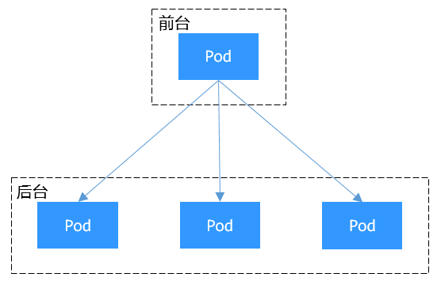

# Service概述

## 直接访问Pod的问题

Pod创建完成后，如何访问Pod呢？直接访问Pod会有如下几个问题：

-   Pod会随时被Deployment这样的控制器删除重建，那访问Pod的结果就会变得不可预知。
-   Pod的IP地址是在Pod启动后才被分配，在启动前并不知道Pod的IP地址。
-   应用往往都是由多个运行相同镜像的一组Pod组成，逐个访问Pod也变得不现实。

举个例子，假设有这样一个应用程序，使用Deployment创建了前台和后台，前台会调用后台做一些计算处理，如[图1](#zh-cn_topic_0249851121_fig2173165051811)所示。后台运行了3个Pod，这些Pod是相互独立且可被替换的，当Pod出现状况被重建时，新建的Pod的IP地址是新IP，前台的Pod无法直接感知。

**图 1**  Pod间访问  

## 使用Service解决Pod的访问问题

Kubernetes中的Service对象就是用来解决上述Pod访问问题的。Service有一个固定IP地址（在创建CCE集群时有一个服务网段的设置，这个网段专门用于给Service分配IP地址），Service将访问它的流量转发给Pod，具体转发给哪些Pod通过Label来选择，而且Service可以给这些Pod做负载均衡。

那么对于上面的例子，为后台添加一个Service，通过Service来访问Pod，这样前台Pod就无需感知后台Pod的变化，如[图2](#zh-cn_topic_0249851121_fig163156154816)所示。

**图 2**  通过Service访问Pod  

## Service的类型

Kubernetes允许指定一个需要的类型的Service，类型的取值以及行为如下：

-   [集群内访问\(ClusterIP\)](集群内访问(ClusterIP)-70.md)

    集群内访问表示工作负载暴露给同一集群内其他工作负载访问的方式，可以通过“集群内部域名”访问。

-   [节点访问\(NodePort\)](节点访问(NodePort)-71.md)

    节点访问 \( NodePort \)是指在每个节点的IP上开放一个静态端口，通过静态端口对外暴露服务。节点访问 \( NodePort \)会路由到ClusterIP服务，这个ClusterIP服务会自动创建。通过请求<NodeIP\>:<NodePort\>，可以从集群的外部访问一个NodePort服务。

-   [负载均衡\(LoadBalancer\)](负载均衡(LoadBalancer)-72.md)

    负载均衡\( LoadBalancer \)可以通过弹性负载均衡从公网访问到工作负载，与弹性IP方式相比提供了高可靠的保障，一般用于系统中需要暴露到公网的服务。

-   [ENI负载均衡\(ENI LoadBalancer\)](ENI负载均衡-(-ENI-LoadBalancer-).md)

    ENI负载均衡 \( ENI LoadBalancer \)使用弹性负载均衡器直通容器，使部署在容器中的业务时延降低、性能无损耗。

-   [DNAT网关\(DNAT\)](DNAT网关(DNAT)-73.md)

    可以为集群节点提供网络地址转换服务，使多个节点可以共享使用弹性IP。与弹性IP方式相比增强了可靠性，弹性IP无需与单个节点绑定，任何节点状态的异常不影响其访问。

