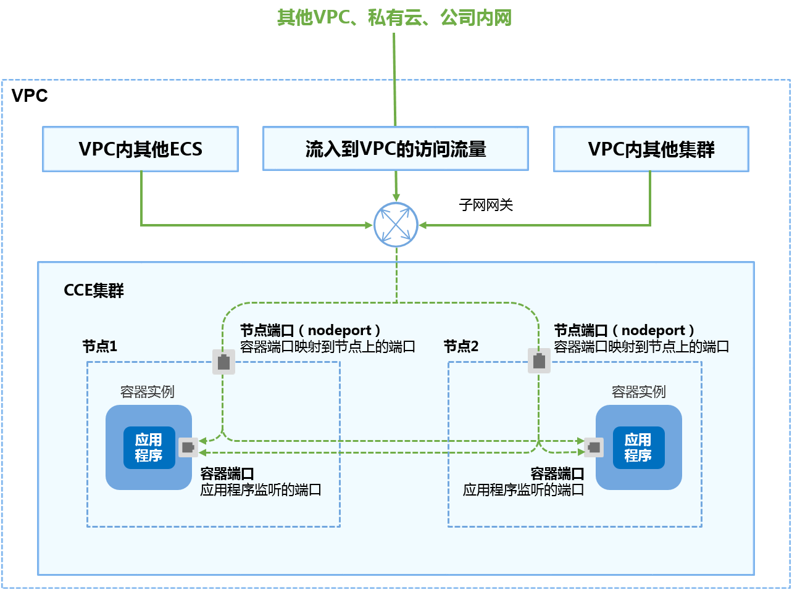
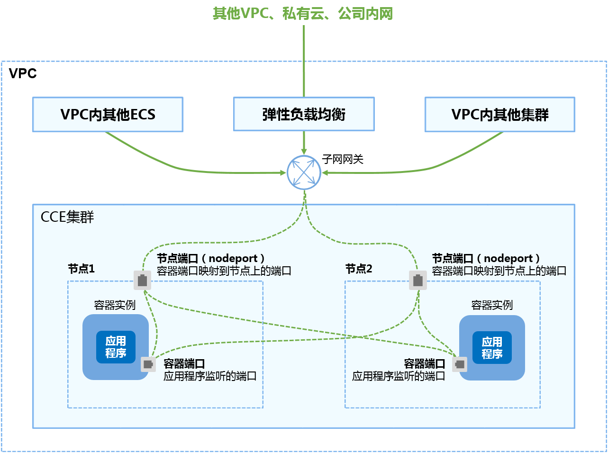
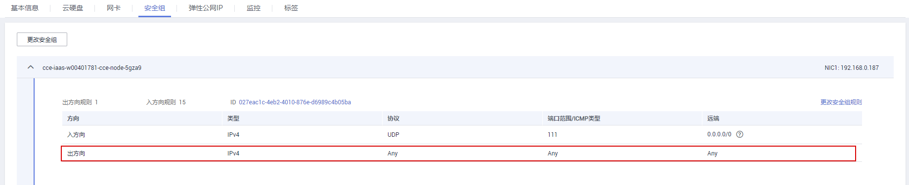

# VPC内网访问<a name="cce_01_0012"></a>

VPC内网访问是指工作负载可以让同一VPC内其他工作负载访问，通过“集群节点的IP“或者“私网弹性负载均衡ELB“的服务地址访问。

主要场景：同一VPC内其他工作负载需要访问kubernetes集群内部的工作负载。

VPC内网访问有两种形式：

-   通过集群节点IP访问：如[图1](#fig32443742164859)。
-   通过私网弹性负载均衡ELB访问：如[图2](#fig6657163163334)。弹性负载均衡模式相比集群节点IP方式的访问，提供了高可靠的保障。

**图 1**  VPC内网访问（通过集群节点IP访问）<a name="fig32443742164859"></a>  


**图 2**  VPC内网访问（通过私网负载均衡ELB访问）<a name="fig6657163163334"></a>  


## 添加方式<a name="section10392205822818"></a>

您可以在创建工作负载时设置访问方式，也可以工作负载创建完成后添加访问方式。

-   方式一：创建工作负载时配置，请参见[通过界面创建](#section2986528542)和[kubectl命令行创建-集群节点IP](#section1234016392534)。
-   方式二：工作负载创建完成后设置，请参见[工作负载创建完成后设置](#section51925078171335)。

## 更新方式<a name="section8805341122"></a>

您可以在添加完Service后，更新此Service的端口配置，请参见[更新Service端口配置](#section185891230419)。

## 通过界面创建<a name="section2986528542"></a>

本节以nginx为例进行说明。

1.  参考[创建无状态工作负载](创建无状态工作负载.md)或[创建有状态工作负载](创建有状态工作负载.md)，在“工作负载访问设置“步骤，单击“添加服务“。
    -   服务名称：自定义服务名称，可与工作负载名称保持一致。
    -   访问方式：VPC内网访问。
        -   节点IP：表示通过“集群节点IP“来访问集群内的节点。
        -   VPC内网负载均衡：表示选择通过“弹性负载均衡“来访问集群内的节点。

            负载均衡选择经典类型时，若没有可用的负载均衡实例，请单击“新建经典型弹性负载均衡”去创建实例。同时确保负载均衡实例与当前集群处于相同VPC，且为私网类型。

            负载均衡选择增强型时，支持使用已有的负载均衡实例和自动创建两种方式。


    -   协议：请根据业务的协议类型选择。
    -   容器端口：容器镜像中工作负载实际监听的端口，需用户确定。nginx程序实际监听的端口为80。
    -   访问端口：
        -   集群节点IP访问：容器端口映射到节点私有IP上的端口，用私有IP访问工作负载时使用，端口范围为30000-32767，建议选择“自动生成“。
            -   自动生成：系统会自动分配端口号。
            -   指定端口：指定固定的节点端口，默认取值范围为30000-32767。若指定端口时，请确保同个集群内的端口唯一性。

        -   通过私网弹性负载均衡ELB访问：容器端口映射到负载均衡实例上的端口，用私网负载均衡IP访问工作负载时使用，端口范围为1-65535。


2.  单击“下一步“进入“高级设置（可选）“页面，直接单击“创建“。
3.  <a name="li13702330143312"></a>单击查看工作负载详情，在访问方式页签中获取访问地址，例如“192.168.0.160:30358“。
4.  <a name="li53271224173920"></a>在华为云控制台首页，单击“计算 \>  弹性云服务器“。
5.  在弹性云服务器页面，找到同一VPC内任意一台云服务器，并确认连接到访问地址中IP与端口的安全组是开放的。

    **图 3**  确认安全组开放<a name="fig4156913155815"></a>  
    

6.  单击“远程登录“，弹出登录页面，输入用户密码登录。
7.  <a name="li17236153816521"></a>使用curl命令访问工作负载验证工作负载是否可以正常访问。

    > **说明：**   
    >VPC内网访问方式在集群内也会分配一个集群虚拟IP，即可以在集群内部通过集群虚拟IP的验证方式验证。其中，集群虚拟IP访问端口默认与容器端口一致，例如此示例的访问端口为80端口。  

    **curl **_192.168.0.160:_30358

    其中“192.168.0.160:30358“为[3](#li13702330143312)中获取到的访问地址。

    回显如下表示访问成功。

    ```
    <html>
    <head>
    <title>Welcome to nginx!</title>
    <style>
        body {
            width: 35em;
            margin: 0 auto;
            font-family: Tahoma, Verdana, Arial, sans-serif;
        }
    </style>
    </head>
    <body>
    <h1>Welcome to nginx!</h1>
    <p>If you see this page, the nginx web server is successfully installed and
    working. Further configuration is required.</p>
    
    <p>For online documentation and support please refer to
    <a href="http://nginx.org/">nginx.org</a>.<br/>
    Commercial support is available at
    <a href="http://nginx.com/">nginx.com</a>.</p>
    
    <p><em>Thank you for using nginx.</em></p>
    </body>
    </html>
    ```


## 工作负载创建完成后设置<a name="section51925078171335"></a>

如需要配置私网负载均衡形式，此方式当前不支持。

1.  登录CCE控制台，选择左侧导航栏的“资源管理 \> 网络管理”，在**Service**页签下，单击“添加Service”。选择类型为“VPC内网访问”。
2.  设置集群内访问参数。
    -   服务名称：自定义服务名称，可与工作负载名称保持一致。
    -   集群名称：服务所在集群。
    -   命名空间：服务所在命名空间。
    -   关联工作负载：选择需要添加Service的工作负载。
    -   访问类型：
        -   节点IP：表示通过“集群节点IP“来访问集群内的节点。
        -   VPC内网负载均衡：表示选择通过“弹性负载均衡“来访问集群内的节点。

            负载均衡选择经典类型时，若没有可用的负载均衡实例，请单击“新建经典型弹性负载均衡”去创建实例。同时确保负载均衡实例与当前集群处于相同VPC，且为私网类型。

            负载均衡选择增强型时，支持使用已有的负载均衡实例和自动创建两种方式。


    -   端口配置：
        -   协议：请根据业务的协议类型选择。
        -   容器端口：容器镜像中工作负载程序实际监听的端口，需用户确定。nginx程序实际监听的端口为80。
        -   访问端口：容器端口映射到节点私有IP上的端口，用私有IP访问工作负载时使用，端口范围为30000-32767，建议选择“自动生成“。
            -   集群节点IP访问：容器端口映射到节点私有IP上的端口，用私有IP访问工作负载时使用，端口范围为30000-32767，建议选择“自动生成“。
                -   自动生成：系统会自动分配端口号。
                -   指定端口：指定固定的节点端口，默认取值范围为30000-32767。若指定端口时，请确保同个集群内的端口唯一性。

            -   通过私网弹性负载均衡ELB访问：容器端口映射到负载均衡实例上的端口，用私网负载均衡IP访问工作负载时使用，端口范围为1-65535。


3.  单击“创建”。工作负载已添加“VPC内网访问”的服务。验证操作与[4](#li53271224173920)-[7](#li17236153816521)相同。

## kubectl命令行创建-集群节点IP<a name="section1234016392534"></a>

本节以nginx为例，说明kubectl命令实现VPC内访问的方法。

**前提条件**

请参见[通过Kubectl连接集群](通过Kubectl连接集群.md)配置kubectl命令，使弹性云服务器连接集群。

1.  登录已配置好kubectl命令的弹性云服务器。登录方法请参见[登录Linux弹性云服务器](https://support.huaweicloud.com/usermanual-ecs/zh-cn_topic_0013771089.html)。
2.  创建并编辑nginx-deployment.yaml以及nginx-nodeport-svc.yaml文件。

    其中，nginx-deployment.yaml和nginx-nodeport-svc.yaml为自定义名称，您可以随意命名。

    **vi nginx-deployment.yaml**

    ```
    apiVersion: extensions/v1beta1
    kind: Deployment
    metadata:
      name: nginx
    spec:
      replicas: 1
      selector:
        matchLabels:
          app: nginx
      strategy:
        type: RollingUpdate
      template:
        metadata:
          labels:
            app: nginx
        spec:
          containers:
          - image: nginx 
            imagePullPolicy: Always
            name: nginx
          imagePullSecrets:
          - name: default-secret
    ```

    **vi nginx-nodeport-svc.yaml**

    ```
    apiVersion: v1
    kind: Service
    metadata:
      labels:
        app: nginx
      name: nginx-nodeport
    spec:
      ports:
      - name: service
    #   nodePort: 30000      #对应界面上的访问端口，不填写表示自动生成
        port: 80             #集群虚拟IP的访问端口
        protocol: TCP
        targetPort: 80       #对应界面上的容器端口
      selector:
        app: nginx
      type: NodePort        #对应界面上的访问类型，NodePort表示“节点私有IP”
    ```

3.  创建工作负载。

    **kubectl create -f nginx-deployment.yaml**

    回显如下，表示工作负载已开始创建。

    ```
    deployment "nginx" created
    ```

    **kubectl get po**

    回显如下，工作负载状态为Running，表示工作负载已处于运行状态。

    ```
    NAME                     READY     STATUS             RESTARTS   AGE
    etcd-0                   0/1       ImagePullBackOff   0          48m
    icagent-m9dkt            0/0       Running            0          3d
    nginx-2601814895-qhxqv   1/1       Running            0          9s
    ```

4.  创建服务。

    **kubectl create -f nginx-nodeport-svc.yaml**

    回显如下，表示服务开始创建。

    ```
    service "nginx-nodeport" created
    ```

    **kubectl get svc**

    回显如下，表示服务已创建完成。

    ```
    NAME             TYPE        CLUSTER-IP     EXTERNAL-IP   PORT(S)        AGE
    etcd-svc         ClusterIP   None           <none>        3120/TCP       49m
    kubernetes       ClusterIP   10.247.0.1     <none>        443/TCP        3d
    nginx-nodeport   NodePort    10.247.4.225   <none>        80:30000/TCP   7s
    ```

5.  采用curl命令访问工作负载验证工作负载是否可以正常访问。

    **curl **_192.168.2.240:30000_

    其中192.168.2.240为集群中任意一个节点的IP地址，30000为节点开放的端口号。

    回显如下，表示可正常访问。

    ```
    <html>
    <head>
    <title>Welcome to nginx!</title>
    <style>
        body {
            width: 35em;
            margin: 0 auto;
            font-family: Tahoma, Verdana, Arial, sans-serif;
        }
    </style>
    </head>
    <body>
    <h1>Welcome to nginx!</h1>
    <p>If you see this page, the nginx web server is successfully installed and
    working. Further configuration is required.</p>
    
    <p>For online documentation and support please refer to
    <a href="http://nginx.org/">nginx.org</a>.<br/>
    Commercial support is available at
    <a href="http://nginx.com/">nginx.com</a>.</p>
    
    <p><em>Thank you for using nginx.</em></p>
    </body>
    </html>
    ```


## kubectl命令行创建-私网负载均衡<a name="section1918844218916"></a>

本节以nginx为例，说明kubectl命令实现VPC内访问的方法。

**前提条件**

请参见[通过Kubectl连接集群](通过Kubectl连接集群.md)配置kubectl命令，使弹性云服务器连接集群。

1.  登录已配置好kubectl命令的弹性云服务器。登录方法请参见[登录Linux弹性云服务器](https://support.huaweicloud.com/usermanual-ecs/zh-cn_topic_0013771089.html)。
2.  创建并编辑nginx-deployment.yaml以及nginx-loadbalance-svc.yaml文件。

    其中，nginx-deployment.yaml和nginx-loadbalance-svc.yaml为自定义名称，您可以随意命名。

    **vi nginx-deployment.yaml**

    ```
    apiVersion: extensions/v1beta1
    kind: Deployment
    metadata:
      name: nginx
    spec:
      replicas: 1
      selector:
        matchLabels:
          app: nginx
      strategy:
        type: RollingUpdate
      template:
        metadata:
          labels:
            app: nginx
        spec:
          containers:
          - image: nginx 
            imagePullPolicy: Always
            name: nginx
          imagePullSecrets:
          - name: default-secret
    ```

    **vi nginx-loadbalance-svc.yam**l

    ```
    apiVersion: v1 
    kind: Service 
    metadata: 
      annotations:
        kubernetes.io/elb.class: elasticity    #表示选择的是经典负载均衡实例
        kubernetes.io/elb.vpc.id: 0e86e303-7a82-4e03-a435-9be0c4771c93    #负载均衡所在vpc的ID
      labels: 
        app: nginx 
        name: nginx
    spec: 
      loadBalancerIP: 10.154.187.52   #弹性负载均衡的IP地址
      ports: 
      - name: service 
        port: 80             #映射到私网负载均衡IP的访问端口 
        protocol: TCP 
        targetPort: 80       #对应界面上的容器端口 
      selector: 
        app: nginx 
      type: LoadBalancer    #对应界面上的访问类型，LoadBalancer表示“弹性负载均衡”
    ```

3.  创建工作负载。

    **kubectl create -f nginx-deployment.yaml**

    回显如下，表示工作负载已开始创建。

    ```
    deployment "nginx" created
    ```

    **kubectl get po**

    回显如下，工作负载状态为Running，表示工作负载已处于运行状态。

    ```
    NAME                     READY     STATUS             RESTARTS   AGE
    etcd-0                   0/1       ImagePullBackOff   0          48m
    icagent-m9dkt            0/0       Running            0          3d
    nginx-2601814895-qhxqv   1/1       Running            0          9s
    ```

4.  创建服务。

    **kubectl create -f nginx-loadbalance-svc.yaml**

    回显如下，表示服务开始创建。

    ```
    service "nginx" created
    ```

    **kubectl get svc**

    回显如下，表示服务已创建完成。

    ```
    NAME             TYPE            CLUSTER-IP       EXTERNAL-IP   PORT(S)        AGE
    kubernetes      ClusterIP      10.247.0.1      <none>          443/TCP        3d 
    nginx           LoadBalancer   10.247.4.225   192.168.0.177 80:30713/TCP      7s
    ```

5.  采用curl命令访问工作负载验证工作负载是否可以正常访问。

    **curl **_192.168.0.17__7:80_

    其中192.168.0.177为负载均衡实例的ip，80为映射到映射到私网负载均衡IP的访问端口。

    回显如下，表示可正常访问。

    ```
    <html>
    <head>
    <title>Welcome to nginx!</title>
    <style>
        body {
            width: 35em;
            margin: 0 auto;
            font-family: Tahoma, Verdana, Arial, sans-serif;
        }
    </style>
    </head>
    <body>
    <h1>Welcome to nginx!</h1>
    <p>If you see this page, the nginx web server is successfully installed and
    working. Further configuration is required.</p>
    
    <p>For online documentation and support please refer to
    <a href="http://nginx.org/">nginx.org</a>.<br/>
    Commercial support is available at
    <a href="http://nginx.com/">nginx.com</a>.</p>
    
    <p><em>Thank you for using nginx.</em></p>
    </body>
    </html>
    ```


## 更新Service端口配置<a name="section185891230419"></a>

1.  登录CCE控制台，选择左侧导航栏的“资源管理 \> 网络管理”，在Service页签下，单击需要更新端口配置的Service的“更新”。
2.  更新端口配置参数。
    -   协议：请根据业务的协议类型选择。
    -   容器端口：容器镜像中工作负载程序实际监听的端口，需用户确定。nginx程序实际监听的端口为80。
    -   访问端口：容器端口映射到节点私有IP上的端口，用私有IP访问工作负载时使用，端口范围为30000-32767，建议选择“自动生成“。
        -   集群节点IP访问：容器端口映射到节点私有IP上的端口，用私有IP访问工作负载时使用，端口范围为30000-32767，建议选择“自动生成“。
            -   自动生成：系统会自动分配端口号。
            -   指定端口：指定固定的节点端口，默认取值范围为30000-32767。若指定端口时，请确保同个集群内的端口唯一性。

        -   通过私网弹性负载均衡ELB访问：容器端口映射到负载均衡实例上的端口，用私网负载均衡IP访问工作负载时使用，端口范围为1-65535。


3.  单击“更新”。工作负载已更新Service。验证操作与[4](#li53271224173920)-[7](#li17236153816521)相同。

