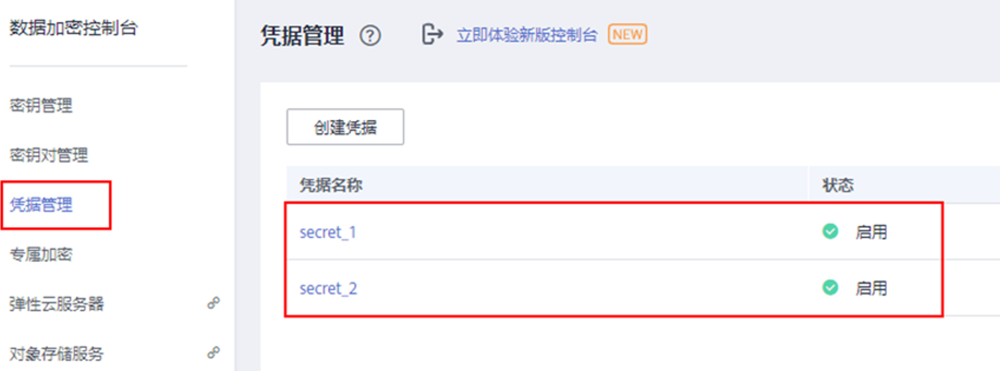

# dew-provider<a name="cce_10_0370"></a>

## 插件简介<a name="section173631312185614"></a>

dew-provider插件用于对接[数据加密服务](https://support.huaweicloud.com/productdesc-dew/dew_01_0093.html)\(Data Encryption Workshop, DEW\)。该插件允许用户将存储在集群外部（即专门存储敏感信息的数据加密服务）的凭据挂载至业务Pod内，从而将敏感信息与集群环境解耦，有效避免程序硬编码或明文配置等问题导致的敏感信息泄密。

## 约束与限制<a name="section11172124718374"></a>

-   数据加密服务包含密钥管理\(Key Management Service, KMS\)、云凭据管理\(Cloud Secret Management Service，CSMS\)和密钥对管理\(Key Pair Service, KPS\)等服务。当前，该插件仅支持对接其中的云凭据管理服务。
-   支持的集群版本：v1.19+。
-   支持的集群类型：CCE集群和CCE Turbo集群。
-   允许创建的SecretProviderClass对象个数上限：500个。
-   插件卸载时，会同时删除相关的CRD资源。即使重装插件，原有的SecretProviderClass对象也不可用，请谨慎操作。插件卸载再重装后，若需使用原有的SecretProviderClass资源，需重新手动创建。

## 插件说明<a name="section1672101771516"></a>

**基本原理**

dew-provider插件由两个组件组成，分别为secrets-store-csi-driver和dew-provider，两者均以DaemonSet的方式部署。

-   secrets-store-csi-driver负责维护两个CRD资源，即SecretProviderClass（以下简称为SPC）和SecretProviderClassPodStatus（以下简称为spcPodStatus），其中**SPC用于描述用户感兴趣的凭据信息（比如指定凭据的版本、凭据的名称等），由用户创建，并在业务Pod中进行引用**；**spcPodStatus用于跟踪Pod与凭据的绑定关系，由csi-driver自动创建，用户无需关心**。一个Pod对应一个spcPodStatus，当Pod正常启动后，会生成一个与之对应的spcPodStatus；当Pod生命周期结束时，相应的spcPodStatus也会被删除。
-   dew-provider负责与云凭据管理服务交互，从云凭据管理服务中获取指定的凭据，并挂载到业务Pod内。

**功能说明**

-   基础挂载能力：安装完该插件后，通过创建SecretProviderClass对象，在业务Pod中声明Volume并进行引用，当启动Pod时，就会将在SecretProviderClass对象中声明的凭据信息挂载至Pod内。
-   定时轮转能力：当Pod正常运行后，若其在SPC中声明的、存储在云凭据管理服务中的凭据发生了更新，通过定时轮转，可以将最新的凭据值刷新至Pod内。使用该能力时，需要将凭据的版本指定为”latest”。
-   实时感知SPC变化能力：当Pod正常运行后，若用户修改了在SPC中声明的凭据信息（如新增凭据、改变原有凭据的版本号等），插件可实时感知该变化，并将更新后的凭据刷新至Pod内。

## 安装插件<a name="section215134717391"></a>

1.  登录CCE控制台，单击集群名称进入集群，单击左侧导航栏的“插件管理“，在右侧找到**dew-provider**，单击“安装“。
2.  在安装插件页面，选择安装的集群，在参数配置栏进行参数配置。参数配置说明如下。

    <a name="table128205210207"></a>
    <table><thead align="left"><tr id="row175395252013"><th class="cellrowborder" valign="top" width="44.35%" id="mcps1.1.3.1.1"><p id="p12531652182014"><a name="p12531652182014"></a><a name="p12531652182014"></a>参数</p>
    </th>
    <th class="cellrowborder" valign="top" width="55.65%" id="mcps1.1.3.1.2"><p id="p1853252162010"><a name="p1853252162010"></a><a name="p1853252162010"></a>参数说明</p>
    </th>
    </tr>
    </thead>
    <tbody><tr id="row6532052122011"><td class="cellrowborder" valign="top" width="44.35%" headers="mcps1.1.3.1.1 "><p id="p1353652122019"><a name="p1353652122019"></a><a name="p1353652122019"></a>rotation_poll_interval</p>
    </td>
    <td class="cellrowborder" valign="top" width="55.65%" headers="mcps1.1.3.1.2 "><p id="p205305211202"><a name="p205305211202"></a><a name="p205305211202"></a>轮转时间间隔。单位：分钟，即m（注意不是min）。</p>
    <p id="p125317528203"><a name="p125317528203"></a><a name="p125317528203"></a>轮转时间间隔表示向云凭据管理服务发起请求并获取最新的凭据的周期，合理的时间间隔范围为[1m, 1440m]，默认值为2m。</p>
    </td>
    </tr>
    </tbody>
    </table>

3.  单击“安装”。

    待插件安装完成后，选择对应的集群，然后单击左侧导航栏的“插件管理”，可在“已安装插件”页签中查看相应的插件。


## 插件使用说明<a name="section0596254104114"></a>

1.  创建ServiceAccount。
    1.  创建ServiceAccount对象，**其中声明了允许业务使用的凭据名称，若用户引用了未在此处声明的凭据，则挂载失败，最终导致Pod无法运行**。

        根据如下模板创建serviceaccount.yaml，在**cce.io/dew-resource**字段中声明允许业务使用的凭据名称。这里声明了secret\_1和secret\_2，表示允许业务引用这两个凭据对象。在后续的操作中，若用户在业务中引用了secret\_3，则无法通过校验，从而导致无法正常挂载该凭据，最终业务Pod将无法运行。

        ```
        apiVersion: v1
        kind: ServiceAccount
        metadata:
          name: nginx-spc-sa
          annotations:
            cce.io/dew-resource: "[\"secret_1\",\"secret_2\"]"  #secrets that allow pod to use
        ```

        这里需要明确，此处声明的凭据应确保在凭据管理服务中是存在的，如下图所示。否则，即使通过了校验，最终向凭据管理服务中获取相应凭据的时候也会出错，从而导致Pod无法正常运行。

        

    2.  执行如下命令创建ServiceAccount对象。

        **kubectl apply -f serviceaccount.yaml**

    3.  查看ServiceAccount对象是否已经正常创建，如下所示：

        ```
        $ kubectl get sa
        NAME       SECRETS   AGE
        default         1         18d   # 此为系统默认的ServiceAccount对象
        nginx-spc-sa    1         19s   # 此为刚刚创建的ServiceAccount对象
        ```

        至此，一个名为“nginx-spc-sa”的ServiceAccount对象已正常创建。该对象将在后续的业务Pod中被引用。

2.  创建SecretProviderClass。
    1.  SecretProviderClass对象**用于描述用户感兴趣的凭据信息（比如指定凭据的版本、凭据的名称等），由用户创建，并在业务Pod中进行引用。**

        根据如下模板创建secretproviderclass.yaml。**用户主要关注parameters.objects字段，它是一个数组，用于声明用户想要挂载的凭据信息**。

        ```
        apiVersion: secrets-store.csi.x-k8s.io/v1
        kind: SecretProviderClass
        metadata:
          name: spc-test
        spec:
          provider: cce     # 固定为cce
          parameters:
            objects: |
                  - objectName: "secret_1"
                    objectVersion: "v1"
                    objectType: "csms"
        ```

        <a name="table16614525192618"></a>
        <table><thead align="left"><tr id="row13770102512610"><th class="cellrowborder" valign="top" width="18.43%" id="mcps1.1.5.1.1"><p id="p6770102518265"><a name="p6770102518265"></a><a name="p6770102518265"></a>参数</p>
        </th>
        <th class="cellrowborder" valign="top" width="13.86%" id="mcps1.1.5.1.2"><p id="p1777072518263"><a name="p1777072518263"></a><a name="p1777072518263"></a>参数类型</p>
        </th>
        <th class="cellrowborder" valign="top" width="11.66%" id="mcps1.1.5.1.3"><p id="p842033862618"><a name="p842033862618"></a><a name="p842033862618"></a>是否必选</p>
        </th>
        <th class="cellrowborder" valign="top" width="56.05%" id="mcps1.1.5.1.4"><p id="p17770122522617"><a name="p17770122522617"></a><a name="p17770122522617"></a>参数说明</p>
        </th>
        </tr>
        </thead>
        <tbody><tr id="row1477012253267"><td class="cellrowborder" valign="top" width="18.43%" headers="mcps1.1.5.1.1 "><p id="p9770152592618"><a name="p9770152592618"></a><a name="p9770152592618"></a>objectName</p>
        </td>
        <td class="cellrowborder" valign="top" width="13.86%" headers="mcps1.1.5.1.2 "><p id="p0770182552619"><a name="p0770182552619"></a><a name="p0770182552619"></a>String</p>
        </td>
        <td class="cellrowborder" valign="top" width="11.66%" headers="mcps1.1.5.1.3 "><p id="p15420103816268"><a name="p15420103816268"></a><a name="p15420103816268"></a>是</p>
        </td>
        <td class="cellrowborder" valign="top" width="56.05%" headers="mcps1.1.5.1.4 "><p id="p2770525202616"><a name="p2770525202616"></a><a name="p2770525202616"></a>凭据名称。<span>若同一个</span><span>SecretProviderClass</span><span>中定义了多个</span><span>objectName</span><span>，不允许重名</span>，否则会挂载失败。</p>
        </td>
        </tr>
        <tr id="row6770825172616"><td class="cellrowborder" valign="top" width="18.43%" headers="mcps1.1.5.1.1 "><p id="p127701925132616"><a name="p127701925132616"></a><a name="p127701925132616"></a>objectAlias</p>
        </td>
        <td class="cellrowborder" valign="top" width="13.86%" headers="mcps1.1.5.1.2 "><p id="p14770132592610"><a name="p14770132592610"></a><a name="p14770132592610"></a>String</p>
        </td>
        <td class="cellrowborder" valign="top" width="11.66%" headers="mcps1.1.5.1.3 "><p id="p174201338152613"><a name="p174201338152613"></a><a name="p174201338152613"></a>否</p>
        </td>
        <td class="cellrowborder" valign="top" width="56.05%" headers="mcps1.1.5.1.4 "><p id="p20770182511268"><a name="p20770182511268"></a><a name="p20770182511268"></a>凭据写入到容器内的文件名称。若不指定，则凭据写入到容器内的文件名默认为objectName；若指定，则<span>objectAlias</span><span>与其他凭据的</span><span>objectName</span><span>和</span><span>objectAlias</span><span>均不允许重名，与自身的</span><span>objectName</span><span>也不允许重名</span>，否则会挂载失败。</p>
        </td>
        </tr>
        <tr id="row4770182510265"><td class="cellrowborder" valign="top" width="18.43%" headers="mcps1.1.5.1.1 "><p id="p18770122552616"><a name="p18770122552616"></a><a name="p18770122552616"></a>objectType</p>
        </td>
        <td class="cellrowborder" valign="top" width="13.86%" headers="mcps1.1.5.1.2 "><p id="p17706251265"><a name="p17706251265"></a><a name="p17706251265"></a>String</p>
        </td>
        <td class="cellrowborder" valign="top" width="11.66%" headers="mcps1.1.5.1.3 "><p id="p1642073811263"><a name="p1642073811263"></a><a name="p1642073811263"></a>是</p>
        </td>
        <td class="cellrowborder" valign="top" width="56.05%" headers="mcps1.1.5.1.4 "><p id="p87701225162619"><a name="p87701225162619"></a><a name="p87701225162619"></a>凭据类型。<span>当前仅支持</span><span>”csms”</span><span>类型</span>，其他均为非法输入。</p>
        </td>
        </tr>
        <tr id="row167701925112610"><td class="cellrowborder" valign="top" width="18.43%" headers="mcps1.1.5.1.1 "><p id="p277092542615"><a name="p277092542615"></a><a name="p277092542615"></a>objectVersion</p>
        </td>
        <td class="cellrowborder" valign="top" width="13.86%" headers="mcps1.1.5.1.2 "><p id="p8770192532611"><a name="p8770192532611"></a><a name="p8770192532611"></a>String</p>
        </td>
        <td class="cellrowborder" valign="top" width="11.66%" headers="mcps1.1.5.1.3 "><p id="p12420238162618"><a name="p12420238162618"></a><a name="p12420238162618"></a>是</p>
        </td>
        <td class="cellrowborder" valign="top" width="56.05%" headers="mcps1.1.5.1.4 "><p id="p137706255268"><a name="p137706255268"></a><a name="p137706255268"></a>凭据的版本。</p>
        <a name="ul5770825192610"></a><a name="ul5770825192610"></a><ul id="ul5770825192610"><li>指定某个具体的版本：v1,v2,…</li><li>指定最新版本：latest。当指定objectVersion为” latest”时，若在云凭据管理服务侧对应的凭据发生了更新，更新后的凭据值将在经过一定时间间隔后（即rotation_poll_interval）刷新至Pod内。</li></ul>
        </td>
        </tr>
        </tbody>
        </table>

    2.  执行如下命令创建SecretProviderClass对象。

        **kubectl apply -f secretproviderclass.yaml**

    3.  查看SecretProviderClass对象是否已经正常创建，如下所示：

        ```
        $ kubectl get spc
        NAME   AGE
        spc-test   20h
        ```

        至此，一个名为“spc-test”的SecretProviderClass对象已正常创建。该对象将在后续的业务Pod中被引用。

3.  创建业务Pod。

    这里以创建一个nginx应用为例。

    1.  定义业务负载，在serviceAccountName中引用此前创建好的ServiceAccount对象，secretProviderClass中引用此前创建好的SPC对象，并在mountPath中指定容器内的挂载路径（这里需注意，用户不应该指定”/”，” /var/run”等特殊目录，否则可能影响容器的正常启动）。

        ```
        apiVersion: apps/v1
        kind: Deployment
        metadata:
          name: nginx-spc
          labels:
            app: nginx
        spec:
          replicas: 1
          selector:
            matchLabels:
              app: nginx
          template:
            metadata:
              labels:
                app: nginx
            spec:
              serviceAccountName: nginx-spc-sa   # 引用上面创建的ServiceAccount
              volumes:
                - name: secrets-store-inline
                  csi:
                    driver: secrets-store.csi.k8s.io
                    readOnly: true
                    volumeAttributes:
                      secretProviderClass: "spc-test"  # 引用上面创建的SPC
              containers:
                - name: nginx-spc
                  image: nginx:alipine
                  imagePullPolicy: IfNotPresent
                  volumeMounts:
                    - name: secrets-store-inline
                      mountPath: "/mnt/secrets-store"  # 定义容器内凭据的挂载路径
                      readOnly: true
              imagePullSecrets:
                - name: default-secret
        ```

    2.  执行 kubectl apply -f deployment.yaml 创建业务Pod。
    3.  查看Pod是否已经正常创建，如下所示：

        ```
        $ kubectl get pod
        NAME                     READY   STATUS   RESTARTS   AGE
        nginx-spc-67c9d5b594-642np     1/1     Running    0            20s
        ```

    4.  进入容器，查看指定的凭据是否正常写入。如下所示：

        ```
        $ kubectl exec -ti nginx-spc-67c9d5b594-642np -- /bin/bash
        root@nginx-spc-67c9d5b594-642np:/#  
        root@nginx-spc-67c9d5b594-642np:/# cd /mnt/secrets-store/
        root@nginx-spc-67c9d5b594-642np:/mnt/secrets-store# 
        root@nginx-spc-67c9d5b594-642np:/mnt/secrets-store# ls
        secret_1
        ```

        可以看到，用户在SPC对象中声明的secret\_1已正常写入Pod。

        此外，还可以通过获取spcPodStatus查看Pod与凭据的绑定情况。如下所示：

        ```
        $ kubectl get spcps
        NAME                                                                    AGE
        nginx-spc-67c9d5b594-642np-default-spc-test   103s
        $ kubectl get spcps nginx-spc-67c9d5b594-642np-default-spc-test -o yaml
        ......
        status:
        mounted: true
        objects:    # 挂载的凭据信息
        - id: secret_1
        version: v1
        podName: nginx-spc-67c9d5b594-642np   # 引用了SPC对象的Pod
        secretProviderClassName: spc-test               # SPC对象
        targetPath: /mnt/paas/kubernetes/kubelet/pods/6dd29596-5b78-44fb-9d4c-a5027c420617/volumes/kubernetes.io~csi/secrets-store-inline/mount
        ```


## 定时轮转<a name="section471215145410"></a>

在[插件使用说明](#section0596254104114)，通过使用该插件，用户可完成基本的凭据挂载功能，即能够将存储在凭据管理服务中的凭据写入到Pod内。

若将在SPC对象中声明的凭据版本改为”latest”，如下所示：

```
apiVersion: secrets-store.csi.x-k8s.io/v1
kind: SecretProviderClass
metadata:
  name: spc-test
spec:
  provider: cce
  parameters:
    objects: |
          - objectName: "secret_1"
            objectVersion: "latest"  # change "v1"to "latest"
            objectType: "csms"
```

更新该SPC对象后，插件将周期性地向凭据管理服务发起请求，获取凭据secret\_1最新版本的值，并将其刷新至引用了该SPC对象的Pod内。此处插件周期性发起请求的时间间隔由[安装插件](#section215134717391)时设置的rotation\_poll\_interval参数确定。

## 实时感知SPC变化<a name="section74012042624"></a>

在[插件使用说明](#section0596254104114)、[定时轮转](#section471215145410)的演示中，其实已经使用到了实时感知SPC变化的能力。为了演示说明，在SPC对象中新增一个凭据secret\_2，如下所示：

```
apiVersion: secrets-store.csi.x-k8s.io/v1
kind: SecretProviderClass
metadata:
  name: spc-test
spec:
  provider: cce
  parameters:
    objects: |
          - objectName: "secret_1"
            objectVersion: "latest"
            objectType: "csms"
          - objectName: "secret_2"
            objectVersion: "v1"
            objectType: "csms"
```

更新该SPC对象后，新增的secret\_2将很快挂载至引用了该SPC对象的Pod内。

## 查看组件日志<a name="section14485218417"></a>

查看插件的Pod

```
$ kubectl get pod -n kube-system
NAME                          READY   STATUS      RESTARTS   AGE
csi-secrets-store-76tj2       3/3     Running     0           11h
dew-provider-hm5fq            1/1     Running     0           11h
```

查看dew-provider组件Pod日志

```
$ kubectl logs dew-provider-hm5fq -n kube-system
…日志信息略…
…
```

查看csi-secrets-store组件Pod日志，由于csi-secrets-store组件的Pod包含多个容器，在查看日志信息时，**需通过”-c”命令指定某个容器**。其中，secrets-store容器作为该插件的主业务容器，其包含了主要的日志信息。

```
$ kubectl logs csi-secrets-store-76tj2 -c secrets-store -n kube-system
…日志信息略…
…
```

## 版本记录<a name="section183121449435"></a>

**表 1**  CCE插件版本记录

<a name="table88489551792"></a>
<table><thead align="left"><tr id="row139251455994"><th class="cellrowborder" valign="top" width="37.50531236719082%" id="mcps1.2.3.1.1"><p id="p13601510205420"><a name="p13601510205420"></a><a name="p13601510205420"></a>插件版本</p>
</th>
<th class="cellrowborder" valign="top" width="62.494687632809175%" id="mcps1.2.3.1.2"><p id="p156011107542"><a name="p156011107542"></a><a name="p156011107542"></a>支持的集群版本</p>
</th>
</tr>
</thead>
<tbody><tr id="row77591313112718"><td class="cellrowborder" valign="top" width="37.50531236719082%" headers="mcps1.2.3.1.1 "><p id="p1375961372720"><a name="p1375961372720"></a><a name="p1375961372720"></a>1.0.3</p>
</td>
<td class="cellrowborder" valign="top" width="62.494687632809175%" headers="mcps1.2.3.1.2 "><p id="p14426103525717"><a name="p14426103525717"></a><a name="p14426103525717"></a>/v1.(19|21|23|25).*/</p>
</td>
</tr>
<tr id="row8757710175517"><td class="cellrowborder" valign="top" width="37.50531236719082%" headers="mcps1.2.3.1.1 "><p id="p8601103544"><a name="p8601103544"></a><a name="p8601103544"></a>1.0.2</p>
</td>
<td class="cellrowborder" valign="top" width="62.494687632809175%" headers="mcps1.2.3.1.2 "><p id="p1465244835710"><a name="p1465244835710"></a><a name="p1465244835710"></a>/v1.(19|21|23).*/</p>
</td>
</tr>
<tr id="row3926175518912"><td class="cellrowborder" valign="top" width="37.50531236719082%" headers="mcps1.2.3.1.1 "><p id="p1760161011549"><a name="p1760161011549"></a><a name="p1760161011549"></a>1.0.1</p>
</td>
<td class="cellrowborder" valign="top" width="62.494687632809175%" headers="mcps1.2.3.1.2 "><p id="p266774810577"><a name="p266774810577"></a><a name="p266774810577"></a>/v1.(19|21).*/</p>
</td>
</tr>
</tbody>
</table>

