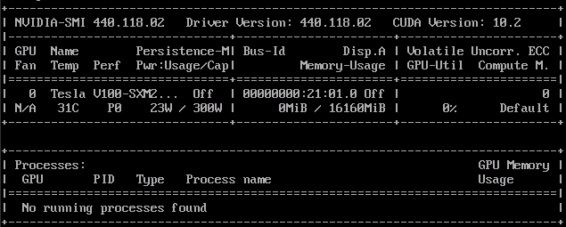
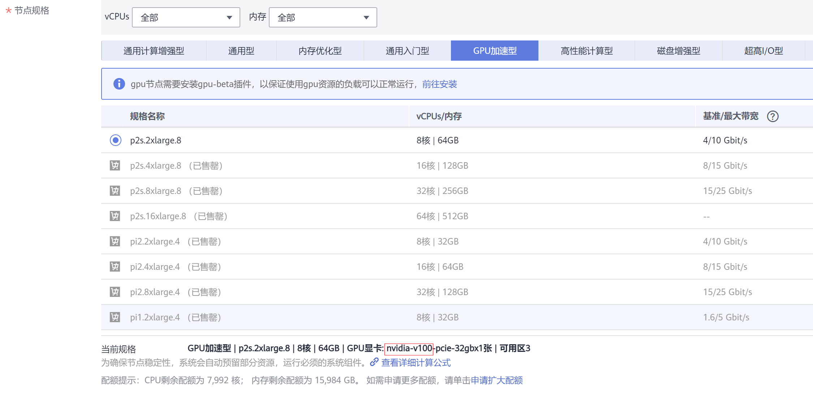
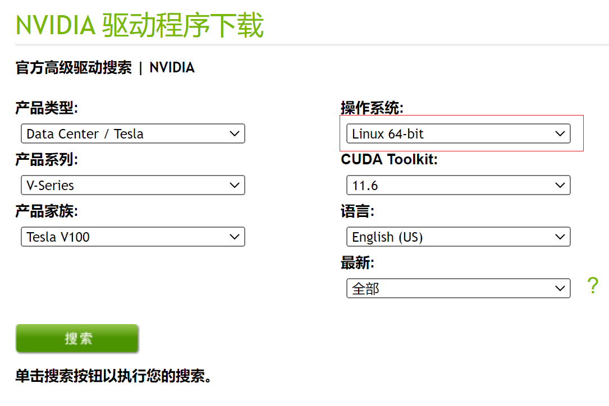
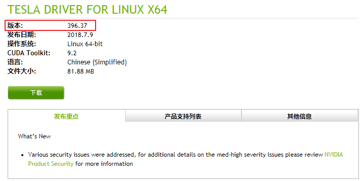
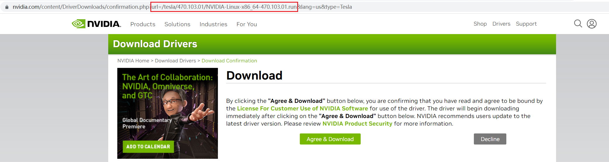

# gpu-beta<a name="cce_10_0141"></a>

## 插件简介<a name="section26181722164712"></a>

gpu-beta插件是支持在容器中使用GPU显卡的设备管理插件，集群中使用GPU节点时必须安装gpu-beta插件。

## 约束与限制<a name="section3200193614201"></a>

-   下载的驱动必须是后缀为“.run“的文件。
-   仅支持Nvidia Tesla驱动，不支持GRID驱动。
-   安装或重装插件时，需要保证驱动下载链接正确且可正常访问，插件对链接有效性不做额外校验。
-   gpu-beta插件仅提供驱动的下载及安装脚本执行功能，插件的状态仅代表插件本身功能正常，与驱动是否安装成功无关。

## 安装插件<a name="section14115341020"></a>

1.  登录CCE控制台，进入集群，在左侧导航栏中选择“插件管理“，在右侧找到**gpu-beta**，单击“安装“。
2.  配置驱动链接地址。

    > **须知：** 
    >-   如果下载链接为公网地址，如nvidia官网地址https://us.download.nvidia.com/tesla/396.37/NVIDIA-Linux-x86\_64-396.37.run，各GPU节点均需要绑定EIP。获取驱动链接方法请参考[获取驱动链接-公网地址](#section95451728192112)。
    >-   若下载链接为OBS上的链接，无需绑定EIP 。获取驱动链接方法请参考[获取驱动链接-OBS地址](#section14922133914508)。
    >-   请确保Nvidia驱动版本与GPU节点适配。
    >-   更改驱动版本后，需要重启节点才能生效。

3.  单击“安装“，安装gpu-beta插件的任务即可提交成功。

## 验证插件<a name="section2651166191915"></a>

插件安装完成后，在GPU节点及调度了GPU资源的容器中执行nvidia-smi命令，验证GPU设备及驱动的可用性。

GPU节点

```
cd /opt/cloud/cce/nvidia/bin && ./nvidia-smi
```

容器

```
cd /usr/local/nvidia/bin && ./nvidia-smi
```

能正常返回GPU信息，说明设备可用，插件安装成功。



## 获取驱动链接-公网地址<a name="section95451728192112"></a>

1.  登录CCE控制台。
2.  创建节点，在节点规格处选择要创建的GPU节点，选中后下方显示的信息中可以看到节点的GPU显卡型号。

    **图 1**  查看显卡型号<a name="fig21391259134916"></a>  
    


1.  登录到_[https://www.nvidia.com/Download/Find.aspx?lang=cn](https://www.nvidia.com/Download/Find.aspx?lang=cn)_网站。
2.  如[图2](#fig11696366517)所示，在“NVIDIA驱动程序下载“框内选择对应的驱动信息。其中“操作系统“必须选**Linux 64-bit**。

    **图 2**  参数选择<a name="fig11696366517"></a>  
    

3.  驱动信息确认完毕，单击“搜索“按钮，会跳转到驱动信息展示页面，该页面会显示驱动的版本信息如[图3](#fig7873421145213)，单击“下载“到下载页面。

    **图 3**  驱动信息<a name="fig7873421145213"></a>  
    

4.  获取驱动软件链接方式分两种：
    -   方式一：如[图4](#fig5901194614534)，在浏览器的链接中找到路径为_url=/tesla/396.37/NVIDIA-Linux-x86\_64-396.37.run_的路径，补齐全路径[https://us.download.nvidia.com/tesla/396.37/NVIDIA-Linux-x86\_64-396.37.run](https://us.download.nvidia.com/tesla/396.37/NVIDIA-Linux-x86_64-396.37.run)该方式节点需要绑定EIP 。
    -   方式二：如[图4](#fig5901194614534)，单击“下载“按钮下载驱动，然后上传到OBS，获取软件的链接，该方式节点不需要绑定EIP。

        **图 4**  获取链接<a name="fig5901194614534"></a>  
        


## 获取驱动链接-OBS地址<a name="section14922133914508"></a>

1.  将驱动上传到对象存储服务OBS中，并将驱动文件设置为公共读，方法请参见[上传文件](https://support.huaweicloud.com/usermanual-obs/zh-cn_topic_0045829661.html)。
2.  在OBS管理控制台左侧导航栏选择“对象存储”。
3.  在桶列表单击待操作的桶，进入“概览”页面。
4.  在左侧导航栏，单击“对象”。
5.  选中目标对象，在对象详情页复制驱动链接。

    


## 相关链接<a name="section16392113515592"></a>

-   [gpu-beta插件及GPU驱动相关问题的排查思路](https://support.huaweicloud.com/cce_faq/cce_faq_00020.html)
-   [工作负载异常：GPU相关](https://support.huaweicloud.com/cce_faq/cce_faq_00109.html)
-   [GPU调度](GPU调度.md)

