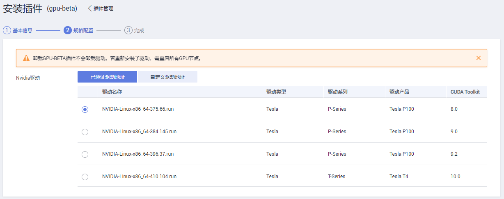

# gpu-beta

## 插件简介

gpu-beta插件是支持在容器中使用GPU显卡的设备管理插件，仅支持Nvidia驱动。

## 使用约束

-   安装gpu-beta插件的集群中必须包含GPU节点。
-   下载的驱动必须是后缀为“.run“的文件。

> **须知：**   
>-   若下载链接为公网地址，如Nvidia官网，各GPU节点均需要绑定EIP。  
>-   若下载链接为OBS上的链接，无需绑定EIP 。  
>-   已验证支持的Nvidia驱动最新版本为396.37，不建议安装更高版本的驱动。  
>-   更改驱动版本后，需要重启节点才能生效。  

## 安装插件

1.  登录CCE控制台，在左侧导航栏中选择“插件管理”。在“插件市场”页签下，单击gpu-beta插件下的“安装插件”。
2.  在安装插件页面，选择安装的集群和插件版本，单击“下一步：规格配置”。
3.  在规格配置页面，有两种配置驱动地址的方式可供选择：

    **图 1**  安装Nvidia驱动  
    

    > **注意：**   
    >卸载GPU-BETA插件不会卸载驱动。若重新安装了驱动，需重启所有GPU节点。  

    1.  在“已验证驱动地址“页签下，选择华为云已经验证过的Nvidia驱动。
    2.  在“自定义驱动地址“页签下，输入您获取的Nvidia驱动链接。**如何获取驱动链接，请参考**[获取驱动链接方式](#section95451728192112)。

        例如，nvidia396.37版本驱动链接：_https://us.download.nvidia.com/tesla/396.37/NVIDIA-Linux-x86\_64-396.37.run_。

4.  单击“安装”，安装gpu-beta插件的任务即可提交成功。

    待插件安装完成后，单击“返回插件管理“，在“插件实例“页签下，选择对应的集群，可查看到运行中的实例，这表明该插件已在当前集群中各GPU节点上安装。

## 获取驱动链接方式

1.  登录到  _[https://www.nvidia.cn/Download/Find.aspx?lang=cn](https://www.nvidia.cn/Download/Find.aspx?lang=cn) _网站。
2.  如[图2](#fig11696366517)所示，在“NVIDIA 驱动程序下载“框内选择对应的驱动信息。其中“操作系统“必须选**Linux 64-bit**。

    **图 2**  参数选择  
    

3.  驱动信息确认完毕，单击“搜索“按钮，会跳转到驱动信息展示页面，该页面会显示驱动的版本信息如[图3](#fig7873421145213)，单击“下载“到下载页面。

    **图 3**  驱动信息  
    

4.  获取驱动软件链接方式分两种：
    -   方式一：如[图4](#fig5901194614534)，在浏览器的链接中找到路径为_url=/tesla/396.37/NVIDIA-Linux-x86\_64-396.37.run_的路径，补齐全路径[https://us.download.nvidia.com/tesla/396.37/NVIDIA-Linux-x86\_64-396.37.run](https://us.download.nvidia.com/tesla/396.37/NVIDIA-Linux-x86_64-396.37.run)该方式节点需要绑定EIP 。
    -   方式二：如[图4](#fig5901194614534)，点击“下载“按钮下载驱动，然后上传到OBS，获取软件的链接，该方式节点不需要绑定EIP。

        **图 4**  获取链接  
        

## 卸载插件

1.  登录CCE控制台，在左侧导航栏中选择“插件管理”。在“插件实例”页签下，选择对应的集群，单击“gpu-beta“下的“卸载“。
2.  在弹出的窗口中，单击“确认”，可卸载该插件。

    > **说明：**   
    >卸载gpu-beta插件不会卸载驱动。若重新安装了驱动，需重启所有GPU节点。  

## 相关链接

-   [gpu-beta插件及GPU驱动相关问题的排查思路](https://support.huaweicloud.com/cce_faq/cce_faq_00020.html)
-   [工作负载异常：GPU相关](https://support.huaweicloud.com/cce_faq/cce_faq_00109.html)

