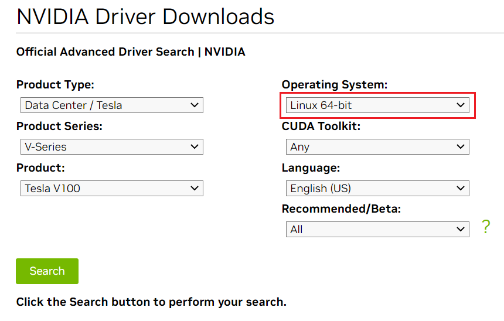
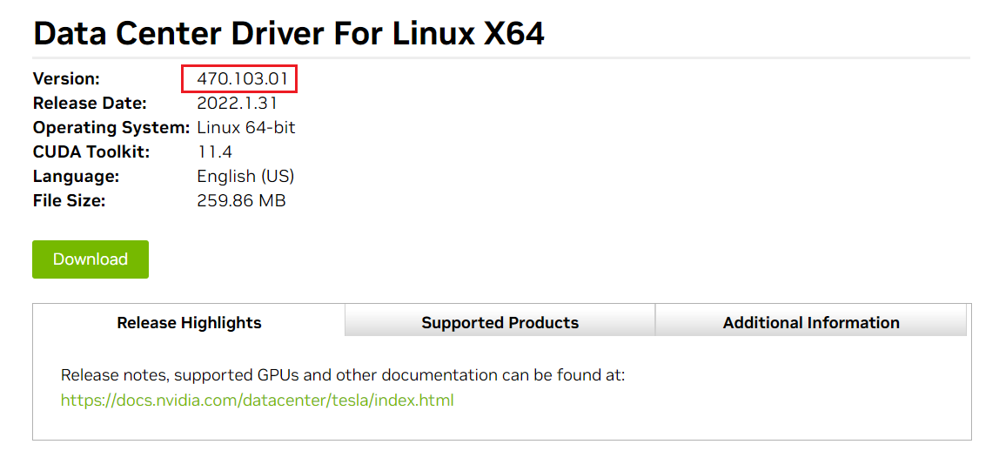

# gpu-beta

-   [插件简介](#section26181722164712)
-   [约束与限制](#section3200193614201)
-   [安装插件](#section14115341020)
-   [获取驱动链接-公网地址](#section95451728192112)
-   [获取驱动链接-OBS地址](#section14922133914508)
-   [升级插件](#section23441939916)
-   [卸载插件](#section5548228142111)
-   [版本记录](#section144262219109)
-   [相关链接](#section16392113515592)

## 插件简介

gpu-beta插件是支持在容器中使用GPU显卡的设备管理插件，仅支持Nvidia驱动。

## 约束与限制

-   安装gpu-beta插件的集群中必须包含GPU节点。
-   下载的驱动必须是后缀为“.run“的文件。

> **须知：** 
>-   若下载链接为公网地址，如Nvidia官网，各GPU节点均需要绑定EIP。
>-   若下载链接为OBS上的链接，无需绑定EIP 。
>-   请确保Nvidia驱动版本与GPU节点适配。
>-   更改驱动版本后，需要重启节点才能生效。

## 安装插件

1.  登录CCE控制台，在左侧导航栏中选择“插件管理”。在“插件市场”页签下，单击gpu-beta插件下的“安装插件”。
2.  在安装插件页面，选择安装的集群和插件版本，单击“下一步：规格配置”。
3.  在规格配置页面，配置驱动链接地址。

    > **注意：** 
    >-   如果下载链接为公网地址，如nvidia官网地址https://us.download.nvidia.com/tesla/396.37/NVIDIA-Linux-x86\_64-396.37.run，各GPU节点均需要绑定EIP。获取驱动链接方法请参考[获取驱动链接-公网地址](#section95451728192112)。
    >-   如果下载链接为OBS上的链接，无需绑定EIP。获取驱动链接方法请参考[获取驱动链接-OBS地址](#section14922133914508)。

4.  单击“安装”，安装gpu-beta插件的任务即可提交成功。

    待插件安装完成后，单击“返回“，在“插件实例“页签下，选择对应的集群，可查看到运行中的实例，这表明该插件已在当前集群中各GPU节点上安装。

## 获取驱动链接-公网地址

1.  登录到_[https://www.nvidia.cn/Download/Find.aspx?lang=cn](https://www.nvidia.cn/Download/Find.aspx?lang=cn)_网站。
2.  如[图1](#fig11696366517)所示，在“NVIDIA驱动程序下载“框内选择对应的驱动信息。其中“操作系统“必须选**Linux 64-bit**。

    **图 1**  参数选择  
    

3.  驱动信息确认完毕，单击“搜索“按钮，会跳转到驱动信息展示页面，该页面会显示驱动的版本信息如[图2](#fig7873421145213)，单击“下载“到下载页面。

    **图 2**  驱动信息  
    

4.  获取驱动软件链接方式分两种：
    -   方式一：如[图3](#fig5901194614534)，在浏览器的链接中找到路径为_url=/tesla/396.37/NVIDIA-Linux-x86\_64-396.37.run_的路径，补齐全路径[https://us.download.nvidia.com/tesla/396.37/NVIDIA-Linux-x86\_64-396.37.run](https://us.download.nvidia.com/tesla/396.37/NVIDIA-Linux-x86_64-396.37.run)该方式节点需要绑定EIP 。
    -   方式二：如[图3](#fig5901194614534)，单击“下载“按钮下载驱动，然后上传到OBS，获取软件的链接，该方式节点不需要绑定EIP。

        **图 3**  获取链接  
        

## 获取驱动链接-OBS地址

1.  将驱动上传到对象存储服务OBS中，方法请参见[上传文件](https://support.huaweicloud.com/usermanual-obs/zh-cn_topic_0045829661.html)。
2.  在OBS管理控制台左侧导航栏选择“对象存储”。
3.  在桶列表单击待操作的桶，进入“概览”页面。
4.  在左侧导航栏，单击“对象”。
5.  选中目标对象，在对象详情页复制驱动链接。

    

## 升级插件

1.  登录[CCE控制台](https://console.huaweicloud.com/cce2.0/?utm_source=helpcenter)，在左侧导航栏中选择“插件管理“，在“插件实例“页签下，选择对应的集群，单击“gpu-beta“下的“升级“。

    > **说明：** 
    >-   如果升级按钮处于冻结状态，则说明当前插件版本是最新的版本，不需要进行升级操作。
    >-   升级“gpu-beta“插件时，会替换原先节点上的旧版本的“gpu-beta“插件，安装最新版本的“gpu-beta“插件以实现功能的快速升级。

2.  在基本信息页面选择插件版本，单击“下一步“。
3.  参考[安装插件](#section14115341020)中参数说明配置参数后，单击“升级“即可升级“gpu-beta“插件。

## 卸载插件

1.  登录CCE控制台，在左侧导航栏中选择“插件管理”。在“插件实例”页签下，选择对应的集群，单击“gpu-beta“下的“卸载“。
2.  在弹出的窗口中，单击“是”，可卸载该插件。

    > **说明：** 
    >卸载gpu-beta插件不会卸载驱动。若重新安装了驱动，需重启所有GPU节点。

## 版本记录

**表 1**  gpu-beta版本记录

<table><thead align="left"><tr id="row278175916234"><th class="cellrowborder" valign="top" width="12.148785121487851%" id="mcps1.2.5.1.1">
插件版本

</th>
<th class="cellrowborder" valign="top" width="24.457554244575544%" id="mcps1.2.5.1.2">
支持的集群类型

</th>
<th class="cellrowborder" valign="top" width="16.60833916608339%" id="mcps1.2.5.1.3">
更新时间

</th>
<th class="cellrowborder" valign="top" width="46.785321467853215%" id="mcps1.2.5.1.4">
更新特性

</th>
</tr>
</thead>
<tbody><tr id="row119493597524"><td class="cellrowborder" valign="top" width="12.148785121487851%" headers="mcps1.2.5.1.1 ">
1.1.13

</td>
<td class="cellrowborder" valign="top" width="24.457554244575544%" headers="mcps1.2.5.1.2 ">
混合集群 v1.(13|15|17).*

</td>
<td class="cellrowborder" valign="top" width="16.60833916608339%" headers="mcps1.2.5.1.3 ">
2020/12/16

</td>
<td class="cellrowborder" valign="top" width="46.785321467853215%" headers="mcps1.2.5.1.4 ">
支持Centos76 3.10.0-1127.19.1.el7.x86_64内核系统

</td>
</tr>
<tr id="row152684214528"><td class="cellrowborder" valign="top" width="12.148785121487851%" headers="mcps1.2.5.1.1 ">
1.1.11

</td>
<td class="cellrowborder" valign="top" width="24.457554244575544%" headers="mcps1.2.5.1.2 ">
混合集群 v1.(15|17).*

</td>
<td class="cellrowborder" valign="top" width="16.60833916608339%" headers="mcps1.2.5.1.3 ">
2020/09/19

</td>
<td class="cellrowborder" valign="top" width="46.785321467853215%" headers="mcps1.2.5.1.4 ">
支持用户自定义驱动地址下载驱动，支持1.15，1.17集群

</td>
</tr>
<tr id="row7335155311559"><td class="cellrowborder" valign="top" width="12.148785121487851%" headers="mcps1.2.5.1.1 ">
1.1.10

</td>
<td class="cellrowborder" valign="top" width="24.457554244575544%" headers="mcps1.2.5.1.2 ">
混合集群 v1.(11|13|15|17).*

</td>
<td class="cellrowborder" valign="top" width="16.60833916608339%" headers="mcps1.2.5.1.3 ">
2020/08/19

</td>
<td class="cellrowborder" valign="top" width="46.785321467853215%" headers="mcps1.2.5.1.4 ">
支持用户自定义驱动地址下载驱动，支持1.13，1.15，1.17集群

</td>
</tr>
<tr id="row17524111141813"><td class="cellrowborder" valign="top" width="12.148785121487851%" headers="mcps1.2.5.1.1 ">
1.1.6

</td>
<td class="cellrowborder" valign="top" width="24.457554244575544%" headers="mcps1.2.5.1.2 ">
混合集群 v1.(11|13|15).*

</td>
<td class="cellrowborder" valign="top" width="16.60833916608339%" headers="mcps1.2.5.1.3 ">
2020/02/06

</td>
<td class="cellrowborder" valign="top" width="46.785321467853215%" headers="mcps1.2.5.1.4 ">
同时支持默认的驱动链接地址和用户可自定义驱动地址下载驱动，支持1.13, 1.15集群

</td>
</tr>
<tr id="row20524711182"><td class="cellrowborder" valign="top" width="12.148785121487851%" headers="mcps1.2.5.1.1 ">
1.1.5

</td>
<td class="cellrowborder" valign="top" width="24.457554244575544%" headers="mcps1.2.5.1.2 ">
混合集群 v1.(11|13|15).*

</td>
<td class="cellrowborder" valign="top" width="16.60833916608339%" headers="mcps1.2.5.1.3 ">
2019/12/16

</td>
<td class="cellrowborder" valign="top" width="46.785321467853215%" headers="mcps1.2.5.1.4 ">
同时支持默认的驱动链接地址和用户可自定义驱动地址下载驱动，支持1.13，1.15集群

</td>
</tr>
<tr id="row9487166161815"><td class="cellrowborder" valign="top" width="12.148785121487851%" headers="mcps1.2.5.1.1 ">
1.1.3

</td>
<td class="cellrowborder" valign="top" width="24.457554244575544%" headers="mcps1.2.5.1.2 ">
混合集群 v1.(11|13).*

</td>
<td class="cellrowborder" valign="top" width="16.60833916608339%" headers="mcps1.2.5.1.3 ">
2019/10/17

</td>
<td class="cellrowborder" valign="top" width="46.785321467853215%" headers="mcps1.2.5.1.4 ">
同时支持默认的驱动链接地址和用户可自定义驱动地址下载驱动，支持1.13集群

</td>
</tr>
<tr id="row748718651814"><td class="cellrowborder" valign="top" width="12.148785121487851%" headers="mcps1.2.5.1.1 ">
1.1.2

</td>
<td class="cellrowborder" valign="top" width="24.457554244575544%" headers="mcps1.2.5.1.2 ">
混合集群 v1.(11|13).*

</td>
<td class="cellrowborder" valign="top" width="16.60833916608339%" headers="mcps1.2.5.1.3 ">
2019/09/10

</td>
<td class="cellrowborder" valign="top" width="46.785321467853215%" headers="mcps1.2.5.1.4 ">
同时支持默认的驱动链接地址和用户可自定义驱动地址下载驱动，支持1.13集群

</td>
</tr>
<tr id="row148866181814"><td class="cellrowborder" valign="top" width="12.148785121487851%" headers="mcps1.2.5.1.1 ">
1.1.0

</td>
<td class="cellrowborder" valign="top" width="24.457554244575544%" headers="mcps1.2.5.1.2 ">
混合集群 v1.11.*

</td>
<td class="cellrowborder" valign="top" width="16.60833916608339%" headers="mcps1.2.5.1.3 ">
2019/10/31

</td>
<td class="cellrowborder" valign="top" width="46.785321467853215%" headers="mcps1.2.5.1.4 ">
支持容器里使用GPU显卡的设备管理插件，仅支持nvidia驱动

</td>
</tr>
</tbody>
</table>

## 相关链接

-   [gpu-beta插件及GPU驱动相关问题的排查思路](https://support.huaweicloud.com/cce_faq/cce_faq_00020.html)
-   [工作负载异常：GPU相关](https://support.huaweicloud.com/cce_faq/cce_faq_00109.html)

