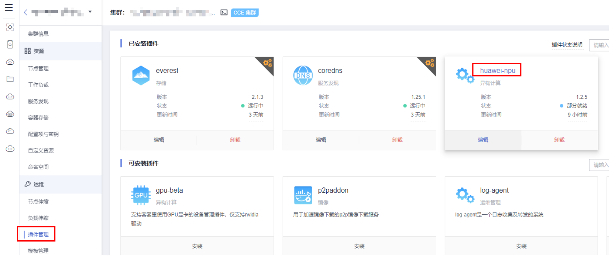
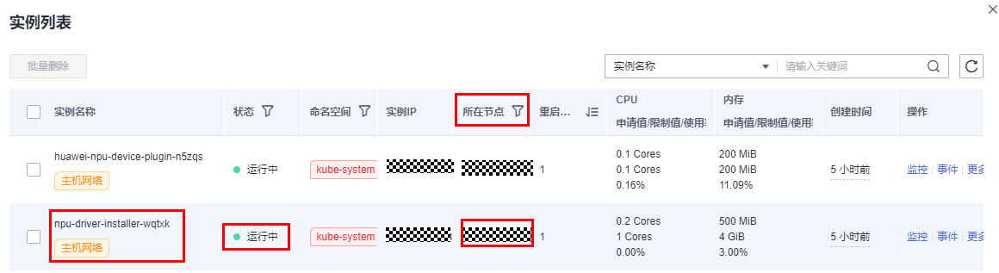
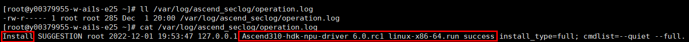
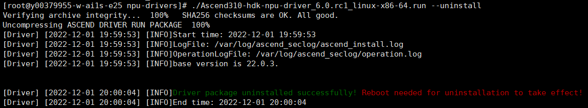

# huawei-npu<a name="cce_10_0239"></a>

## 插件简介<a name="section173631312185614"></a>

huawei-npu是支持容器里使用huawei NPU设备的管理插件。

安装本插件后，可创建“AI加速型“节点，实现快速高效地处理推理和图像识别等工作。

## 约束与限制<a name="section11172124718374"></a>

-   集群中使用“AI加速型“节点时必须安装huawei-npu插件。
-   “AI加速型“节点迁移后会重置节点，如果目标集群huawei-npu插件开启了“驱动选择”功能（仅插件版本为1.2.5及以上时支持），且选择了npu节点机型对应的驱动，节点迁移后将自动安装npu驱动，驱动安装完成后需要重启节点才能生效。否则不会自动安装npu驱动，需要手动重新安装。
-   若已在节点池的“安装后执行脚本”设置了npu驱动安装命令，且开启了“驱动选择”功能并选择了对应机型的npu驱动，节点池扩容会导致前端设置的安装命令和npu-driver-installer pod 同时在新增节点上安装驱动，可能导致安装的驱动和预期不符或安装失败。因此，不建议在huawei-npu驱动选择功能已开启的情况下，对已设置“安装后执行脚本”npu驱动安装命令的节点池进行扩容，或在创建新节点池时设置“安装后执行脚本”用于安装npu驱动。

## 安装插件<a name="section189463341114"></a>

1.  登录CCE控制台，单击集群名称进入集群，单击左侧导航栏的“插件管理“，在右侧好到**huawei-npu**，单击“安装“。
2.  选择是否开启驱动选择（仅插件版本为1.2.5及以上时支持）。
    -   开启：可根据NPU机型不同指定相应的驱动版本，驱动维护更灵活。

        根据不同的适用机型选择是否启用驱动，启用后插件将根据用户指定的驱动版本自动进行驱动安装。默认使用“推荐驱动“，您也可以选择“自定义驱动“并填写完整的驱动地址。

        > **说明：** 
        >-   插件将根据用户针对指定机型选择的驱动版本进行驱动安装。仅对未安装NPU驱动的节点生效，已安装 NPU 驱动的节点会保持现状。升级或编辑插件参数时修改驱动版本也只对未安装 NPU 驱动的节点生效。
        >-   驱动安装成功后需要重启节点才能生效，驱动安装成功确认方式请参见[如何确认节点npu驱动已安装完成](#section1077133913579)。
        >-   插件卸载不会自动删除已安装的NPU驱动，如需卸载，卸载方式请参见[npu驱动卸载](#section7104125213575)。

    -   关闭：无法根据用户诉求指定驱动版本，无法依靠插件进行驱动维护。当不开启驱动选择时，如从控制台创建NPU节点，控制台会自动补充NPU驱动（用户无法指定版本和类型）安装命令，并在安装完成后自动重启节点；如通过API或其他方式创建节点则需要用户在“安装后执行脚本“中添加驱动安装命令。
    -   支持的npu卡类型和对应的操作系统规格如下：

        <a name="table127775710918"></a>
        <table><thead align="left"><tr id="row10299125713915"><th class="cellrowborder" valign="top" width="21.72%" id="mcps1.1.3.1.1"><p id="p62991573912"><a name="p62991573912"></a><a name="p62991573912"></a>NPU卡类型</p>
        </th>
        <th class="cellrowborder" valign="top" width="78.28%" id="mcps1.1.3.1.2"><p id="p02997572099"><a name="p02997572099"></a><a name="p02997572099"></a>支持的操作系统</p>
        </th>
        </tr>
        </thead>
        <tbody><tr id="row7299155719913"><td class="cellrowborder" valign="top" width="21.72%" headers="mcps1.1.3.1.1 "><p id="p129915710917"><a name="p129915710917"></a><a name="p129915710917"></a>D310</p>
        </td>
        <td class="cellrowborder" valign="top" width="78.28%" headers="mcps1.1.3.1.2 "><p id="p18299175716913"><a name="p18299175716913"></a><a name="p18299175716913"></a>EulerOS 2.5 x86、CentOS 7.6 x86、EulerOS 2.9 x86、EulerOS 2.8 arm</p>
        </td>
        </tr>
        <tr id="row829995716919"><td class="cellrowborder" valign="top" width="21.72%" headers="mcps1.1.3.1.1 "><p id="p429913571995"><a name="p429913571995"></a><a name="p429913571995"></a>D310P</p>
        </td>
        <td class="cellrowborder" valign="top" width="78.28%" headers="mcps1.1.3.1.2 "><p id="p12991857493"><a name="p12991857493"></a><a name="p12991857493"></a>EulerOS 2.9 x86</p>
        </td>
        </tr>
        </tbody>
        </table>

3.  设置NPU参数，该插件默认使用如下参数。插件提供的默认NPU参数可满足大多数的使用场景，您无需修改。

    ```
    {
    	"check_frequency_failed_threshold": 100,
    	"check_frequency_fall_times": 3,
    	"check_frequency_gate": false,
    	"check_frequency_recover_threshold": 100,
    	"check_frequency_rise_times": 2,
    	"container_path": "/usr/local/HiAI_unused",
    	"host_path": "/usr/local/HiAI_unused"
    }
    ```

4.  单击“安装“。

## 如何确认节点npu驱动已安装完成<a name="section1077133913579"></a>

npu驱动安装成功后需要重启节点才能生效，且重启节点前需要确认驱动已经安装完成，否则驱动将无法生效，npu资源不可用。驱动安装完成确认方式如下：

1.  在集群 "插件管理" 页面，单击插件名称 "huawei-npu" 进入插件 "实例列表"

    

2.  查看该节点上部署的 npu-driver-installer 实例状态为 "运行中"

    

    > **说明：** 
    >若在npu驱动安装完成前就重启了节点，可能导致驱动安装失败，节点重启后集群“节点管理”页面对应的节点会显示“昇腾驱动未就绪”。此时需要先卸载该节点上的npu驱动，再重启 npu-driver-installer pod，才能重新安装npu驱动，按上述步骤确认驱动安装完成后再重启节点。驱动卸载方式请参见[npu驱动卸载](#section7104125213575)。


## npu驱动卸载<a name="section7104125213575"></a>

请登录节点，通过 /var/log/ascend\_seclog/operation.log 获取驱动操作记录，确认最后一次安装的驱动 run 包；若该日志不存在，则一般是用 npu\_x86\_latest.run或 npu\_arm\_latest.run 驱动合一包安装的；找到驱动安装包后，执行 bash \{run 包名称\} --uninstall 命令即可卸载，卸载成功后根据提示决定是否重启节点。

1.  登录需要卸载npu驱动的节点，查看 /var/log/ascend\_seclog/operation.log 是否存在。
2.  若 /var/log/ascend\_seclog/operation.log 日志存在，查看驱动安装日志，可查找到驱动安装记录。

    

    若 /var/log/ascend\_seclog/operation.log 日志不存在，则可能是通过 npu\_x86\_latest.run或 npu\_arm\_latest.run 驱动合一包安装的，可通过 /usr/local/HiAI/driver/ 路径是否存在进行确认。

    > **说明：** 
    >npu驱动合一包一般放在 /root/d310\_driver 目录下，其他驱动安装包一般放在 /root/npu-drivers 目录下。

3.  找到驱动安装包后，执行  **bash \{run 包路径\} --uninstall **命令即可卸载，以 Ascend310-hdk-npu-driver\_6.0.rc1\_linux-x86-64.run 为例：

    ```
    bash /root/npu-drivers/Ascend310-hdk-npu-driver_6.0.rc1_linux-x86-64.run --uninstall
    ```

    

4.  根据提示信息确认是否需要重启节点（当前使用的npu驱动安装和卸载都需要重启节点才能生效）。

## 版本记录<a name="section183121449435"></a>

**表 1**  CCE插件版本记录

<a name="table88489551792"></a>
<table><thead align="left"><tr id="row139251455994"><th class="cellrowborder" valign="top" width="37.50531236719082%" id="mcps1.2.3.1.1"><p id="p13601510205420"><a name="p13601510205420"></a><a name="p13601510205420"></a>插件版本</p>
</th>
<th class="cellrowborder" valign="top" width="62.494687632809175%" id="mcps1.2.3.1.2"><p id="p156011107542"><a name="p156011107542"></a><a name="p156011107542"></a>支持的集群版本</p>
</th>
</tr>
</thead>
<tbody><tr id="row974211817013"><td class="cellrowborder" valign="top" width="37.50531236719082%" headers="mcps1.2.3.1.1 "><p id="p1169132716016"><a name="p1169132716016"></a><a name="p1169132716016"></a>1.2.5</p>
</td>
<td class="cellrowborder" valign="top" width="62.494687632809175%" headers="mcps1.2.3.1.2 "><p id="p26917271007"><a name="p26917271007"></a><a name="p26917271007"></a>/v1.(19|21|23|25).*/</p>
</td>
</tr>
<tr id="row663292711557"><td class="cellrowborder" valign="top" width="37.50531236719082%" headers="mcps1.2.3.1.1 "><p id="p763272719556"><a name="p763272719556"></a><a name="p763272719556"></a>1.2.4</p>
</td>
<td class="cellrowborder" valign="top" width="62.494687632809175%" headers="mcps1.2.3.1.2 "><p id="p194761442135519"><a name="p194761442135519"></a><a name="p194761442135519"></a>/v1.(19|21|23|25).*/</p>
</td>
</tr>
<tr id="row8757710175517"><td class="cellrowborder" valign="top" width="37.50531236719082%" headers="mcps1.2.3.1.1 "><p id="p1867015556216"><a name="p1867015556216"></a><a name="p1867015556216"></a>1.2.2</p>
</td>
<td class="cellrowborder" valign="top" width="62.494687632809175%" headers="mcps1.2.3.1.2 "><p id="p1596191345312"><a name="p1596191345312"></a><a name="p1596191345312"></a>/v1.(19|21|23).*/</p>
</td>
</tr>
<tr id="row17276317105810"><td class="cellrowborder" valign="top" width="37.50531236719082%" headers="mcps1.2.3.1.1 "><p id="p126701155428"><a name="p126701155428"></a><a name="p126701155428"></a>1.2.1</p>
</td>
<td class="cellrowborder" valign="top" width="62.494687632809175%" headers="mcps1.2.3.1.2 "><p id="p107851028195312"><a name="p107851028195312"></a><a name="p107851028195312"></a>/v1.(19|21|23).*/</p>
</td>
</tr>
<tr id="row723201855819"><td class="cellrowborder" valign="top" width="37.50531236719082%" headers="mcps1.2.3.1.1 "><p id="p186701655921"><a name="p186701655921"></a><a name="p186701655921"></a>1.1.8</p>
</td>
<td class="cellrowborder" valign="top" width="62.494687632809175%" headers="mcps1.2.3.1.2 "><p id="p10225434145311"><a name="p10225434145311"></a><a name="p10225434145311"></a>/v1.(15|17|19|21).*/</p>
</td>
</tr>
<tr id="row19850201865813"><td class="cellrowborder" valign="top" width="37.50531236719082%" headers="mcps1.2.3.1.1 "><p id="p19670155622"><a name="p19670155622"></a><a name="p19670155622"></a>1.1.2</p>
</td>
<td class="cellrowborder" valign="top" width="62.494687632809175%" headers="mcps1.2.3.1.2 "><p id="p21865255311"><a name="p21865255311"></a><a name="p21865255311"></a>/v1.(15|17|19).*/</p>
</td>
</tr>
<tr id="row1331711107"><td class="cellrowborder" valign="top" width="37.50531236719082%" headers="mcps1.2.3.1.1 "><p id="p116711155224"><a name="p116711155224"></a><a name="p116711155224"></a>1.1.1</p>
</td>
<td class="cellrowborder" valign="top" width="62.494687632809175%" headers="mcps1.2.3.1.2 "><p id="p101643615546"><a name="p101643615546"></a><a name="p101643615546"></a>/v1.(15|17|19).*/</p>
</td>
</tr>
<tr id="row56109111006"><td class="cellrowborder" valign="top" width="37.50531236719082%" headers="mcps1.2.3.1.1 "><p id="p267114551522"><a name="p267114551522"></a><a name="p267114551522"></a>1.1.0</p>
</td>
<td class="cellrowborder" valign="top" width="62.494687632809175%" headers="mcps1.2.3.1.2 "><p id="p10829910105415"><a name="p10829910105415"></a><a name="p10829910105415"></a>/v1.(17|19).*/</p>
</td>
</tr>
<tr id="row97371611105"><td class="cellrowborder" valign="top" width="37.50531236719082%" headers="mcps1.2.3.1.1 "><p id="p176711955925"><a name="p176711955925"></a><a name="p176711955925"></a>1.0.8</p>
</td>
<td class="cellrowborder" valign="top" width="62.494687632809175%" headers="mcps1.2.3.1.2 "><p id="p124771025185418"><a name="p124771025185418"></a><a name="p124771025185418"></a>/v1.(13|15|17).*/</p>
</td>
</tr>
<tr id="row1387891111011"><td class="cellrowborder" valign="top" width="37.50531236719082%" headers="mcps1.2.3.1.1 "><p id="p2671175513219"><a name="p2671175513219"></a><a name="p2671175513219"></a>1.0.6</p>
</td>
<td class="cellrowborder" valign="top" width="62.494687632809175%" headers="mcps1.2.3.1.2 "><p id="p1811116469542"><a name="p1811116469542"></a><a name="p1811116469542"></a>/v1.(13|15|17).*/</p>
</td>
</tr>
<tr id="row108141216015"><td class="cellrowborder" valign="top" width="37.50531236719082%" headers="mcps1.2.3.1.1 "><p id="p1667118551122"><a name="p1667118551122"></a><a name="p1667118551122"></a>1.0.5</p>
</td>
<td class="cellrowborder" valign="top" width="62.494687632809175%" headers="mcps1.2.3.1.2 "><p id="p911644610541"><a name="p911644610541"></a><a name="p911644610541"></a>/v1.(13|15|17).*/</p>
</td>
</tr>
<tr id="row11604175314219"><td class="cellrowborder" valign="top" width="37.50531236719082%" headers="mcps1.2.3.1.1 "><p id="p2671125516210"><a name="p2671125516210"></a><a name="p2671125516210"></a>1.0.3</p>
</td>
<td class="cellrowborder" valign="top" width="62.494687632809175%" headers="mcps1.2.3.1.2 "><p id="p811734645417"><a name="p811734645417"></a><a name="p811734645417"></a>/v1.(13|15|17).*/</p>
</td>
</tr>
</tbody>
</table>

