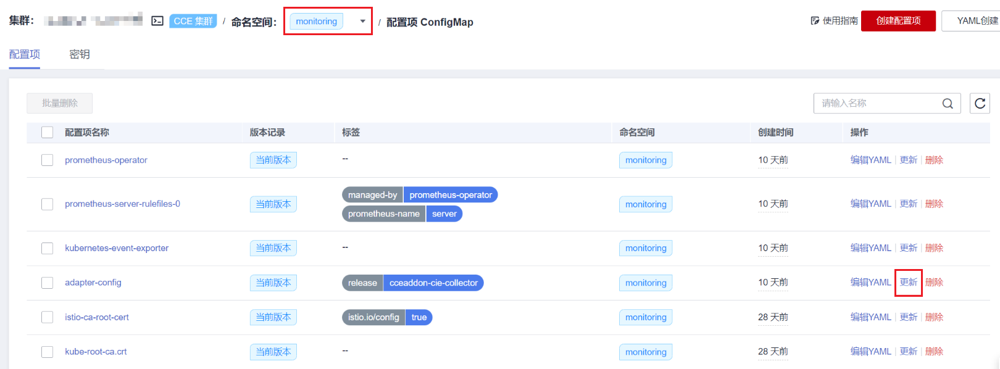
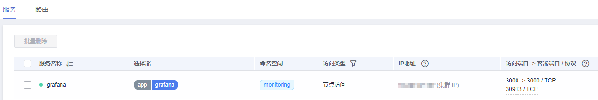
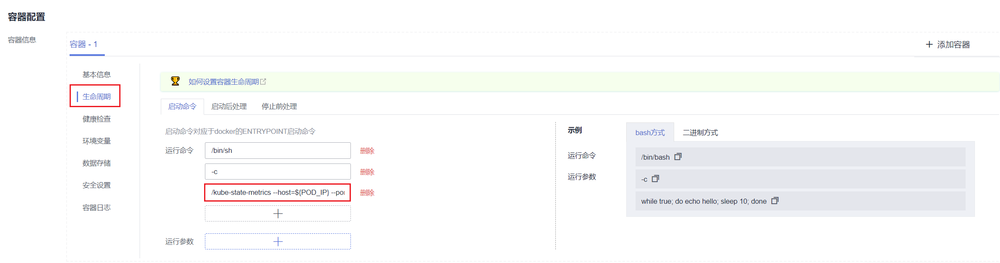

# kube-prometheus-stack<a name="cce_10_0406"></a>

## 插件简介<a name="section25311744154917"></a>

kube-prometheus-stack通过使用Prometheus-operator和Prometheus，提供简单易用的端到端Kubernetes集群监控能力。

使用kube-prometheus-stack可将监控数据与容器智能分析对接，在容器智能分析控制台查看监控数据，配置告警等。

开源社区地址：[https://github.com/prometheus/prometheus](https://github.com/prometheus/prometheus)

## 约束与限制<a name="section199451341919"></a>

在默认配置下，插件中的kube-state-metrics组件不采集Kubernetes资源的所有的labels和annotation。如需采集，您需要手动在启动参数中开启采集开关，并同时检查名称为kube-state-metrics的ServiceMonitor中采集白名单是否添加相应指标，详情请参见[采集Pod所有labels和annotations](#section163751639151115)。

## 安装插件<a name="section186134814119"></a>

1.  登录CCE控制台，单击集群名称进入集群，在左侧导航栏中选择“插件管理“，在右侧找到**kube-prometheus-stack**，单击“安装“。
2.  在安装插件页面，选择插件规格，并配置相关参数。
    -   **开启智能分析**：默认不开启。开启后需选择智能分析工作区，在容器智能分析控制台查看监控数据，配置告警等。
    -   **对接第三方**：将普罗数据上报至第三方监控系统，需填写第三方监控系统的地址和Token，并选择是否跳过证书认证。
    -   **普罗高可用**：高可用会在集群中将Prometheus-server、Prometheus-operator、thanos-query、custom-metrics-apiserver、alertmanager组件按多实例方式部署。
    -   **安装grafana**：通过 grafana 可视化浏览普罗监控数据。grafana 会默认创建大小为 5 GiB 的存储卷，卸载插件时 grafana 的**存储卷不随插件被删除**。首次登录默认用户名与密码均为 admin，登录后会立即让您修改密码。
    -   **采集周期**：采集监控数据的周期。
    -   **数据保留期**：监控数据保留的时长。
    -   **存储**：选择用于存储监控数据的磁盘类型和大小。
    -   **调度策略**：可单独配置插件各个组件的节点亲和性和污点容忍能力。可以配置多个调度策略，不配置亲和节点键和容忍节点污点键则默认不开启对应的调度策略。
        -   作用范围：可选择调度策略生效的插件实例，默认对全部实例生效。当指定组件实例名称时，将覆盖全部实例所配置的调度策略。
        -   亲和节点标签键：填写节点标签键，为插件实例设置节点亲和性。
        -   亲和节点标签值：填写节点标签值，为插件实例设置节点亲和性。
        -   容忍节点污点键：目前仅支持污点键级别的污点容忍策略，组件可以调度到拥有该污点键的节点。

3.  完成以上配置后，单击“安装“。

## 配置自定义指标<a name="section11927514174016"></a>

新版本的kube-prometheus-stack插件不再提供自定义配置的指标，即user-adapter-config配置项（历史版本插件中该配置项的名称为adapter-config）中不再配置指标采集规则，请您自行添加。关于采集规则配置详情请参见[Metrics Discovery and Presentation Configuration](https://github.com/kubernetes-sigs/prometheus-adapter/blob/master/docs/config.md)。如您从老版本插件升级至新版，则原有的该配置会被继承，不会丢失。

1.  登录CCE控制台，单击集群名称进入集群，在左侧导航栏中选择“配置项与密钥“。
2.  切换至“monitoring”命名空间，在“配置项”页签找到user-adapter-config配置项（历史版本插件中该配置项的名称为adapter-config），并单击“更新“。

    

3.  在“配置数据“中单击config.yaml对应的“编辑“按钮，在rules字段下添加自定义指标采集规则。修改完成后单击“确定”保存配置。

    如果您需要增加多个采集规则，可在rules字段下添加多个配置，关于采集规则配置详情请参见[Metrics Discovery and Presentation Configuration](https://github.com/kubernetes-sigs/prometheus-adapter/blob/master/docs/config.md)。

    自定义采集规则示例如下：

    ```
    rules:
    - seriesQuery: '{__name__=~"^container_.*",container!="POD",namespace!="",pod!=""}'
      resources:
        overrides:
          namespace:
            resource: namespace
          pod:
            resource: pod
      name:
        matches: "^container_(.*)_seconds_total$"
      metricsQuery: 'sum(rate(<<.Series>>{<<.LabelMatchers>>,container!="POD"}[2m])) by (<<.GroupBy>>)'
    ```

    

4.  重新部署monitoring命名空间下的custom-metrics-apiserver工作负载。

    


## 组件说明<a name="section0377457163618"></a>

安装kube-prometheus-stack插件创建的Kubernetes资源，全部都创建在monitoring命名空间下。

有状态负载：

-   prometheus-server
-   alertmanager-alertmanager

无状态负载：

-   thanos-query
-   event-exporter
-   custom-metrics-apiserver
-   grafana
-   kube-state-metric
-   prometheus-operator

## 访问grafana<a name="section342243017471"></a>

如果在安装插件时安装了grafana，可以通过名为grafana的Service访问，grafana Service类型为节点访问，如果是从外网访问，可以给节点绑定EIP，通过节点端口访问。

如下图，访问地址为  **http://\{\{节点IP\}\}:30913**



## 采集Pod所有labels和annotations<a name="section163751639151115"></a>

1.  登录CCE控制台，单击集群名称进入集群，在左侧导航栏中选择“工作负载“。
2.  切换至“monitoring”命名空间，在“无状态负载”页签找到kube-state-metrics负载，并单击“升级“。
3.  在容器配置的“生命周期”中，编辑启动命令。

    

    在原有的kube-state-metrics的启动参数最后添加：

    ```
    --metric-labels-allowlist=pods=[*],nodes=[node,failure-domain.beta.kubernetes.io/zone,topology.kubernetes.io/zone]
    ```

    如需采集annotations时，则在启动参数中以相同方法添加参数：

    ```
    --metric-annotations-allowlist=pods=[*],nodes=[node,failure-domain.beta.kubernetes.io/zone,topology.kubernetes.io/zone]
    ```

    > **须知：** 
    >编辑启动命令时，请勿修改其他原有的启动参数，否则可能导致组件异常。

4.  kube-state-metrics将开始采集Pod和node的labels/annotations指标，查询kube\_pod\_labels/kube\_pod\_annotations是否在普罗的采集任务中。

    ```
    kubectl get servicemonitor kube-state-metrics -nmonitoring -oyaml | kube_pod_labels
    ```


更多kube-state-metrics的启动参数请参见[kube-state-metrics/cli-arguments](https://github.com/kubernetes/kube-state-metrics/blob/v2.2.3/docs/cli-arguments.md)。

## 提供资源指标<a name="section17830202915211"></a>

容器和节点的资源指标，如CPU、内存使用量，可通过Kubernetes的Metrics API获得。这些指标可以直接被用户访问，比如用kubectl top命令，也可以被HPA或者CustomedHPA使用，根据资源使用率使负载弹性伸缩。

插件可为Kubernetes提供Metrics API，但默认未开启，若要将其开启，需要创建以下APIService对象：

```
apiVersion: apiregistration.k8s.io/v1
kind: APIService
metadata:
  labels:
    app: custom-metrics-apiserver
    release: cceaddon-prometheus
  name: v1beta1.metrics.k8s.io
spec:
  group: metrics.k8s.io
  groupPriorityMinimum: 100
  insecureSkipTLSVerify: true
  service:
    name: custom-metrics-apiserver
    namespace: monitoring
    port: 443
  version: v1beta1
  versionPriority: 100
```

可以将该对象保存为文件，命名为metrics-apiservice.yaml，然后执行以下命令：

```
kubectl create -f metrics-apiservice.yaml
```

执行kubectl top命令，若显示如下，则表示Metrics API能正常访问：

```
# kubectl top pod -n monitoring
NAME                                                      CPU(cores)   MEMORY(bytes)
......
custom-metrics-apiserver-d4f556ff9-l2j2m                  38m          44Mi
......
```

> **须知：** 
>卸载插件时，需要执行以下kubectl命令，同时删除APIService对象，否则残留的APIService资源将导致metrics-server插件安装失败。
>```
>kubectl delete APIService v1beta1.metrics.k8s.io
>```

## 版本记录<a name="section183121449435"></a>

**表 1**  CCE插件版本记录

<a name="table545952314179"></a>
<table><thead align="left"><tr id="row13459112313176"><th class="cellrowborder" valign="top" width="26.697353279631752%" id="mcps1.2.4.1.1"><p id="p206369328181"><a name="p206369328181"></a><a name="p206369328181"></a>插件版本</p>
</th>
<th class="cellrowborder" valign="top" width="34.94438051400076%" id="mcps1.2.4.1.2"><p id="p1663653221810"><a name="p1663653221810"></a><a name="p1663653221810"></a>支持的集群版本</p>
</th>
<th class="cellrowborder" valign="top" width="38.35826620636747%" id="mcps1.2.4.1.3"><p id="p445992311174"><a name="p445992311174"></a><a name="p445992311174"></a>社区版本（仅1.17及以上版本集群支持）</p>
</th>
</tr>
</thead>
<tbody><tr id="row174592023121714"><td class="cellrowborder" valign="top" width="26.697353279631752%" headers="mcps1.2.4.1.1 "><p id="p7545102620314"><a name="p7545102620314"></a><a name="p7545102620314"></a>3.5.1</p>
</td>
<td class="cellrowborder" valign="top" width="34.94438051400076%" headers="mcps1.2.4.1.2 "><p id="p58261742132811"><a name="p58261742132811"></a><a name="p58261742132811"></a>/v1.(19|21|23).*/</p>
</td>
<td class="cellrowborder" valign="top" width="38.35826620636747%" headers="mcps1.2.4.1.3 "><p id="p4616610133015"><a name="p4616610133015"></a><a name="p4616610133015"></a><a href="https://github.com/prometheus/prometheus/releases/tag/v2.35.0" target="_blank" rel="noopener noreferrer">2.35.0</a></p>
</td>
</tr>
<tr id="row10459723151716"><td class="cellrowborder" valign="top" width="26.697353279631752%" headers="mcps1.2.4.1.1 "><p id="p754582613117"><a name="p754582613117"></a><a name="p754582613117"></a>3.5.0</p>
</td>
<td class="cellrowborder" valign="top" width="34.94438051400076%" headers="mcps1.2.4.1.2 "><p id="p382754216287"><a name="p382754216287"></a><a name="p382754216287"></a>/v1.(19|21|23).*/</p>
</td>
<td class="cellrowborder" valign="top" width="38.35826620636747%" headers="mcps1.2.4.1.3 "><p id="p116161210143011"><a name="p116161210143011"></a><a name="p116161210143011"></a><a href="https://github.com/prometheus/prometheus/releases/tag/v2.35.0" target="_blank" rel="noopener noreferrer">2.35.0</a></p>
</td>
</tr>
</tbody>
</table>

