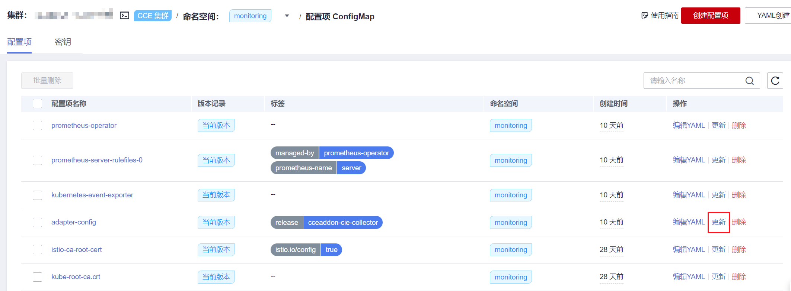
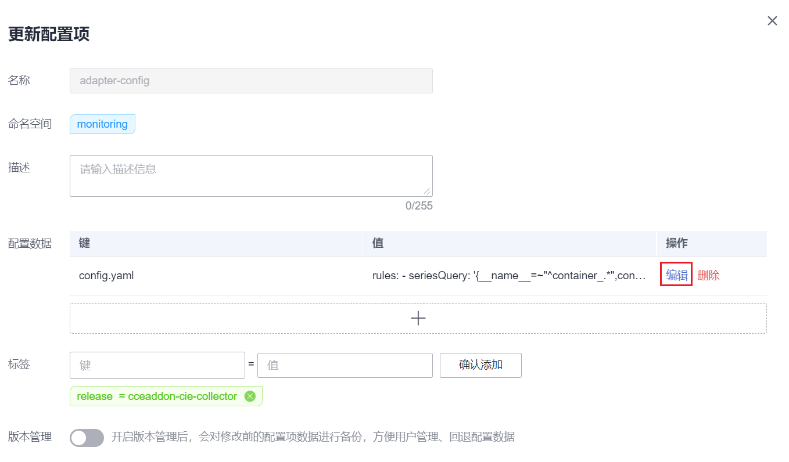
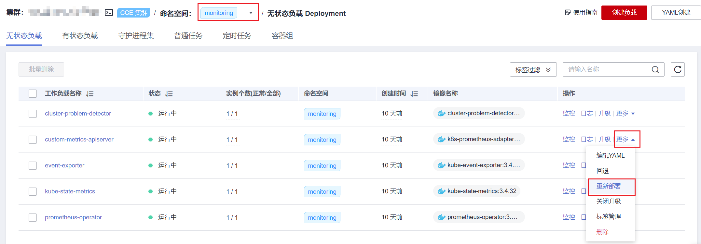
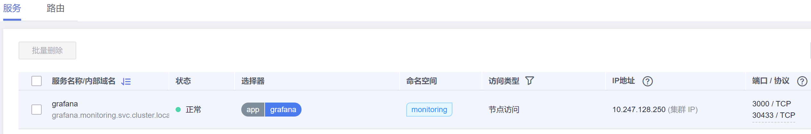

# kube-prometheus-stack<a name="cce_10_0406"></a>

## 插件简介<a name="section25311744154917"></a>

kube-prometheus-stack通过使用Prometheus-operator和Prometheus，提供简单易用的端到端Kubernetes集群监控能力。

使用kube-prometheus-stack可将监控数据与容器智能分析对接，在容器智能分析控制台查看监控数据，配置告警等。

开源社区地址：[https://github.com/prometheus/prometheus](https://github.com/prometheus/prometheus)

## 安装插件<a name="section186134814119"></a>

1.  登录CCE控制台，进入集群，在左侧导航栏中选择“插件管理“，在右侧找到**kube-prometheus-stack**，单击“安装“。
2.  在安装插件页面，选择插件规格，并配置相关参数。
    -   **开启智能分析**：默认不开启。开启后需选择智能分析工作区，在容器智能分析控制台查看监控数据，配置告警等。
    -   **对接第三方**：将普罗数据上报至第三方监控系统，需填写第三方监控系统的地址和Token，并选择是否跳过证书认证。
    -   **普罗高可用**：高可用会在集群中将Prometheus-server、Prometheus-operator、thanos-query、custom-metrics-apiserver、alertmanager组件按多实例方式部署。
    -   **安装grafana**：通过 grafana 可视化浏览普罗监控数据。grafana 会默认创建大小为 5 GiB 的存储卷，卸载插件时 grafana 的**存储卷不随插件被删除**。首次登录默认用户名与密码均为 admin，登录后会立即让您修改密码。
    -   **采集周期**：采集监控数据的周期。
    -   **数据保留期**：监控数据保留的时长。
    -   **存储**：选择用于存储监控数据的磁盘类型和大小。
    -   **节点亲和**：可填写标签让插件的工作负载亲和节点。

3.  完成以上配置后，单击“安装“。

## 配置自定义指标<a name="section11927514174016"></a>

新版本的kube-prometheus-stack插件不再提供自定义配置的指标，即user-adapter-config配置项（历史版本插件中该配置项的名称为adapter-config）中不再配置指标采集规则，请您自行添加。关于采集规则配置详情请参见[Metrics Discovery and Presentation Configuration](https://github.com/kubernetes-sigs/prometheus-adapter/blob/master/docs/config.md)。如您从老版本插件升级至新版，则原有的该配置会被继承，不会丢失。

1.  登录CCE控制台，进入集群，在左侧导航栏中选择“配置项与密钥“。
2.  切换至“monitoring”命名空间，在“配置项”页签找到user-adapter-config配置项（历史版本插件中该配置项的名称为adapter-config），并单击“更新“。

    

3.  在“配置数据“中单击config.yaml对应的“编辑“按钮，添加自定义指标采集规则。修改完成后单击“确定”保存配置。

    自定义采集规则示例如下：

    ```
    rules:
    - seriesQuery: '{__name__=~"^container_.*",container!="POD",namespace!="",pod!=""}'
      resources:
        overrides:
          namespace:
            resource: namespace
          pod:
            resource: pod
      name:
        matches: "^container_(.*)_seconds_total$"
      metricsQuery: "sum(rate(<<.Series>>{<<.LabelMatchers>>,container!="POD"}[2m])) by (<<.GroupBy>>)"
    ```

    关于采集规则配置详情请参见[Metrics Discovery and Presentation Configuration](https://github.com/kubernetes-sigs/prometheus-adapter/blob/master/docs/config.md)。

    

4.  重新部署monitoring命名空间下的custom-metrics-apiserver工作负载。

    


## 组件说明<a name="section0377457163618"></a>

安装kube-prometheus-stack插件创建的Kubernetes资源，全部都创建在monitoring命名空间下。

有状态负载：

-   prometheus-server
-   alertmanager-alertmanager

无状态负载：

-   thanos-query
-   event-exporter
-   custom-metrics-apiserver
-   grafana
-   kube-state-metric
-   prometheus-operator

## 访问grafana<a name="section342243017471"></a>

如果在安装插件时安装了grafana，可以通过名为grafana的Service访问，grafana Service类型为节点访问，如果是从外网访问，可以给节点绑定EIP，通过节点端口访问。

如下图，访问地址为  **http://\{\{节点IP\}\}:30433**



