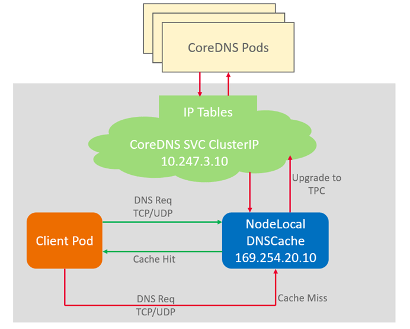

# node-local-dns

## 插件简介

NodeLocal DNSCache通过在集群节点上作为守护程序集运行DNS缓存代理，提高集群DNS性能。

开源社区地址：[https://github.com/kubernetes/dns](https://github.com/kubernetes/dns)

**图 1**  NodeLocal DNSCache查询路径  

## 约束与限制

-   仅支持1.19及以上版本集群。

## 安装插件

1.  登录CCE控制台，进入集群，在左侧导航栏中选择“插件管理“，在右侧找到**node-local-dns**，单击“安装“。
2.  在安装插件页面，选择插件规格，并配置相关参数。

    **enable\_dnsconfig\_admission**：是否自动注入。默认为**false**，设置为**true**表示自动注入。

3.  完成以上配置后，单击“安装“。

## 相关链接

[使用NodeLocal DNSCache提升DNS性能](使用NodeLocal-DNSCache提升DNS性能-84.md)

