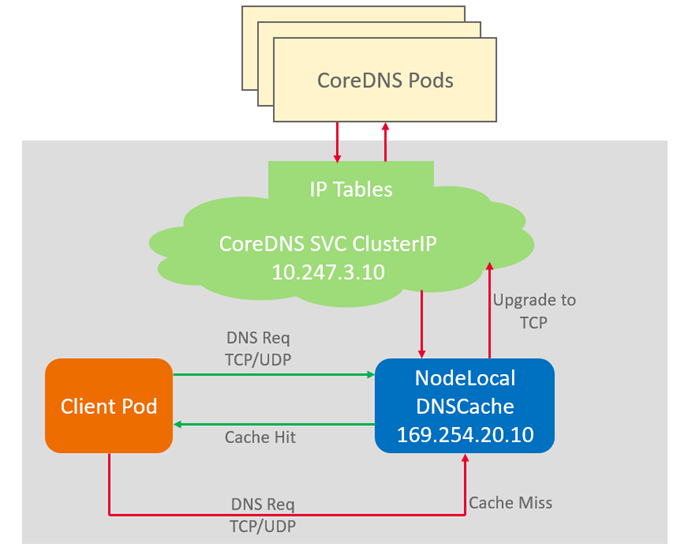

# node-local-dns

## 插件简介

NodeLocal DNSCache通过在集群节点上作为守护程序集运行DNS缓存代理，提高集群DNS性能。

开源社区地址：[https://github.com/kubernetes/dns](https://github.com/kubernetes/dns)

**图 1**  NodeLocal DNSCache查询路径  

## 约束与限制

-   仅支持1.19及以上版本集群。

## 安装插件

1.  登录CCE控制台，单击集群名称进入集群，在左侧导航栏中选择“插件管理“，在右侧找到**node-local-dns**，单击“安装“。
2.  在安装插件页面，选择插件规格，并配置相关参数。

    **规格配置**

    -   实例数：选择自定义规格时，请根据业务需求选择合适的实例数。
    -   容器：选择自定义规格时，请根据业务需求选择合适的容器配额。

    **参数配置**

    -   启用DNS config注入：启用DNS Config注入功能可以自动将node-local-dns地址注入到新建的 pod 中，无需手动注入。开启该功能后，将会创建node-local-dns-admission-controller容器以提供自动注入功能，不开启则不会创建该容器。

3.  完成以上配置后，单击“安装“。

## 相关链接

[使用NodeLocal DNSCache提升DNS性能](使用NodeLocal-DNSCache提升DNS性能.md)

## 版本记录

**表 1**  CCE插件版本记录

<table><thead align="left"><tr id="row139251455994"><th class="cellrowborder" valign="top" width="33.525061626951526%" id="mcps1.2.4.1.1">
插件版本

</th>
<th class="cellrowborder" valign="top" width="34.470008216926864%" id="mcps1.2.4.1.2">
支持的集群版本

</th>
<th class="cellrowborder" valign="top" width="32.00493015612161%" id="mcps1.2.4.1.3">
社区版本（仅1.17及以上版本集群支持）

</th>
</tr>
</thead>
<tbody><tr id="row202451645914"><td class="cellrowborder" valign="top" width="33.525061626951526%" headers="mcps1.2.4.1.1 ">
1.2.4

</td>
<td class="cellrowborder" valign="top" width="34.470008216926864%" headers="mcps1.2.4.1.2 ">
/v1.(19|21|23|25).*/

</td>
<td class="cellrowborder" valign="top" width="32.00493015612161%" headers="mcps1.2.4.1.3 ">
1.21.1

</td>
</tr>
<tr id="row8757710175517"><td class="cellrowborder" valign="top" width="33.525061626951526%" headers="mcps1.2.4.1.1 ">
1.2.2

</td>
<td class="cellrowborder" valign="top" width="34.470008216926864%" headers="mcps1.2.4.1.2 ">
/v1.(19|21|23).*/

</td>
<td class="cellrowborder" valign="top" width="32.00493015612161%" headers="mcps1.2.4.1.3 ">
1.21.1

</td>
</tr>
</tbody>
</table>

