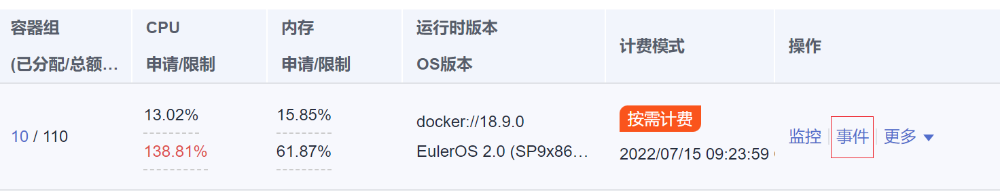
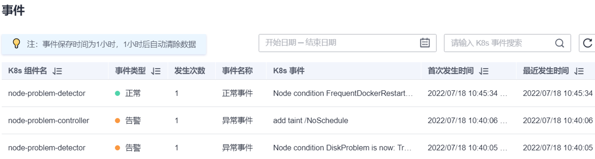
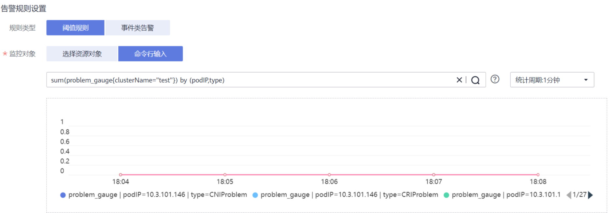

# npd<a name="cce_10_0132"></a>

## 插件简介<a name="section173631312185614"></a>

node-problem-detector（简称：npd）是一款监控集群节点异常事件的插件，以及对接第三方监控平台功能的组件。它是一个在每个节点上运行的守护程序，可从不同的守护进程中搜集节点问题并将其报告给apiserver。node-problem-detector可以作为DaemonSet运行， 也可以独立运行。

有关社区开源项目node-problem-detector的详细信息，请参见[node-problem-detector](https://github.com/kubernetes/node-problem-detector)。

## 约束与限制<a name="section119671349192611"></a>

使用NPD插件时，不可对节点磁盘进行格式化或分区。

## 权限说明<a name="section158021093142"></a>

NPD插件为监控内核日志，需要读取宿主机/dev/kmsg设备，为此需要开启容器特权，详见[privileged](https://kubernetes.io/docs/concepts/policy/pod-security-policy/#privileged)。

同时CCE根据最小化权限原则进行了风险消减，NPD运行限制只拥有以下特权：

-   cap\_dac\_read\_search，为访问/run/log/journal
-   cap\_sys\_admin，为访问/dev/kmsg

## 安装插件<a name="section189463341114"></a>

1.  登录CCE控制台，进入集群，单击左侧导航栏的“插件管理“，在右侧找到**npd**，单击“安装“。
2.  根据下表配置参数，然后单击“安装“。

    仅v1.16.0及以上版本支持配置。

    npc.enable：是否启用npc，默认值为**false**，**true**表示启用。


## NPD检查项<a name="section69115153399"></a>

> **说明：** 
>当前检查项仅1.16.0及以上版本支持。

NPD的检查项主要分为事件类检查项和状态类检查项。

-   事件类检查项

    对于事件类检查项，当问题发生时，NPD会向APIServer上报一条事件，事件类型分为Normal（正常事件）和Warning（异常事件）

    **表 1**  事件类检查项

    <a name="table14820155834010"></a>
    <table><thead align="left"><tr id="row1287205884012"><th class="cellrowborder" valign="top" width="22.55%" id="mcps1.2.4.1.1"><p id="p7872185819403"><a name="p7872185819403"></a><a name="p7872185819403"></a>故障检查项</p>
    </th>
    <th class="cellrowborder" valign="top" width="40.88%" id="mcps1.2.4.1.2"><p id="p1887295816407"><a name="p1887295816407"></a><a name="p1887295816407"></a>功能</p>
    </th>
    <th class="cellrowborder" valign="top" width="36.57%" id="mcps1.2.4.1.3"><p id="p1287215814401"><a name="p1287215814401"></a><a name="p1287215814401"></a>说明</p>
    </th>
    </tr>
    </thead>
    <tbody><tr id="row178721458114011"><td class="cellrowborder" valign="top" width="22.55%" headers="mcps1.2.4.1.1 "><p id="p387285834013"><a name="p387285834013"></a><a name="p387285834013"></a>KubeletStart</p>
    </td>
    <td class="cellrowborder" valign="top" width="40.88%" headers="mcps1.2.4.1.2 "><p id="p10872155815409"><a name="p10872155815409"></a><a name="p10872155815409"></a>检查kubelet启动并上报</p>
    </td>
    <td class="cellrowborder" valign="top" width="36.57%" headers="mcps1.2.4.1.3 "><p id="p187215584409"><a name="p187215584409"></a><a name="p187215584409"></a>Normal类事件</p>
    </td>
    </tr>
    <tr id="row118721358164011"><td class="cellrowborder" valign="top" width="22.55%" headers="mcps1.2.4.1.1 "><p id="p1587295817403"><a name="p1587295817403"></a><a name="p1587295817403"></a>DockerStart</p>
    </td>
    <td class="cellrowborder" valign="top" width="40.88%" headers="mcps1.2.4.1.2 "><p id="p187245812404"><a name="p187245812404"></a><a name="p187245812404"></a>检查Docker启动并上报</p>
    </td>
    <td class="cellrowborder" valign="top" width="36.57%" headers="mcps1.2.4.1.3 "><p id="p118721958114018"><a name="p118721958114018"></a><a name="p118721958114018"></a>Normal类事件</p>
    </td>
    </tr>
    <tr id="row687214583403"><td class="cellrowborder" valign="top" width="22.55%" headers="mcps1.2.4.1.1 "><p id="p5872115811403"><a name="p5872115811403"></a><a name="p5872115811403"></a>ContainerdStart</p>
    </td>
    <td class="cellrowborder" valign="top" width="40.88%" headers="mcps1.2.4.1.2 "><p id="p887215810403"><a name="p887215810403"></a><a name="p887215810403"></a>检查Containerd启动并上报</p>
    </td>
    <td class="cellrowborder" valign="top" width="36.57%" headers="mcps1.2.4.1.3 "><p id="p1787215834015"><a name="p1787215834015"></a><a name="p1787215834015"></a>Normal类事件</p>
    </td>
    </tr>
    <tr id="row19872758194019"><td class="cellrowborder" valign="top" width="22.55%" headers="mcps1.2.4.1.1 "><p id="p17872858134019"><a name="p17872858134019"></a><a name="p17872858134019"></a>OOMKilling</p>
    </td>
    <td class="cellrowborder" valign="top" width="40.88%" headers="mcps1.2.4.1.2 "><p id="p1987215816404"><a name="p1987215816404"></a><a name="p1987215816404"></a>检查oom事件发生并上报</p>
    </td>
    <td class="cellrowborder" valign="top" width="36.57%" headers="mcps1.2.4.1.3 "><p id="p487265818405"><a name="p487265818405"></a><a name="p487265818405"></a>Warning类事件</p>
    </td>
    </tr>
    <tr id="row2087225814405"><td class="cellrowborder" valign="top" width="22.55%" headers="mcps1.2.4.1.1 "><p id="p1387245820403"><a name="p1387245820403"></a><a name="p1387245820403"></a>TaskHung</p>
    </td>
    <td class="cellrowborder" valign="top" width="40.88%" headers="mcps1.2.4.1.2 "><p id="p18872155844013"><a name="p18872155844013"></a><a name="p18872155844013"></a>检查taskHung事件发生并上报</p>
    </td>
    <td class="cellrowborder" valign="top" width="36.57%" headers="mcps1.2.4.1.3 "><p id="p16872758114011"><a name="p16872758114011"></a><a name="p16872758114011"></a>Warning类事件</p>
    </td>
    </tr>
    <tr id="row3872758184011"><td class="cellrowborder" valign="top" width="22.55%" headers="mcps1.2.4.1.1 "><p id="p19872195818404"><a name="p19872195818404"></a><a name="p19872195818404"></a>KernelOops</p>
    </td>
    <td class="cellrowborder" valign="top" width="40.88%" headers="mcps1.2.4.1.2 "><p id="p19872165813403"><a name="p19872165813403"></a><a name="p19872165813403"></a>检查内核0指针panic错误</p>
    </td>
    <td class="cellrowborder" valign="top" width="36.57%" headers="mcps1.2.4.1.3 "><p id="p087295824013"><a name="p087295824013"></a><a name="p087295824013"></a>Warning类事件</p>
    </td>
    </tr>
    <tr id="row18729588401"><td class="cellrowborder" valign="top" width="22.55%" headers="mcps1.2.4.1.1 "><p id="p58721558194015"><a name="p58721558194015"></a><a name="p58721558194015"></a>ConntrackFull</p>
    </td>
    <td class="cellrowborder" valign="top" width="40.88%" headers="mcps1.2.4.1.2 "><p id="p1687225864011"><a name="p1687225864011"></a><a name="p1687225864011"></a>检查连接跟踪表是否满</p>
    </td>
    <td class="cellrowborder" valign="top" width="36.57%" headers="mcps1.2.4.1.3 "><p id="p168721758104010"><a name="p168721758104010"></a><a name="p168721758104010"></a>Warning类事件</p>
    <p id="p12872105854016"><a name="p12872105854016"></a><a name="p12872105854016"></a>周期：30秒</p>
    <p id="p487213584402"><a name="p487213584402"></a><a name="p487213584402"></a>阈值:80%</p>
    </td>
    </tr>
    </tbody>
    </table>

-   状态类检查项

    对于状态类检查项，当问题发生时，NPD会向APIServer上报一条事件，并同步修改节点状态，可配合[Node-problem-controller故障隔离](#section1471610580474)对节点进行隔离。

    下列检查项中若未指出，默认周期为30秒。

    **表 2**  应用和OS类检查项

    <a name="table5966193210414"></a>
    <table><thead align="left"><tr id="row1439833124119"><th class="cellrowborder" valign="top" width="28.92%" id="mcps1.2.4.1.1"><p id="p039183318412"><a name="p039183318412"></a><a name="p039183318412"></a>故障检查项</p>
    </th>
    <th class="cellrowborder" valign="top" width="34.83%" id="mcps1.2.4.1.2"><p id="p8397332416"><a name="p8397332416"></a><a name="p8397332416"></a>功能</p>
    </th>
    <th class="cellrowborder" valign="top" width="36.25%" id="mcps1.2.4.1.3"><p id="p153920338415"><a name="p153920338415"></a><a name="p153920338415"></a>说明</p>
    </th>
    </tr>
    </thead>
    <tbody><tr id="row133983316414"><td class="cellrowborder" valign="top" width="28.92%" headers="mcps1.2.4.1.1 "><p id="p20391433124114"><a name="p20391433124114"></a><a name="p20391433124114"></a>FrequentKubeletRestart</p>
    </td>
    <td class="cellrowborder" valign="top" width="34.83%" headers="mcps1.2.4.1.2 "><p id="p1939133114115"><a name="p1939133114115"></a><a name="p1939133114115"></a>检测kubelet频繁重启</p>
    </td>
    <td class="cellrowborder" valign="top" width="36.25%" headers="mcps1.2.4.1.3 "><p id="p739143310416"><a name="p739143310416"></a><a name="p739143310416"></a>周期：5分钟</p>
    <p id="p63913324110"><a name="p63913324110"></a><a name="p63913324110"></a>回溯时间：10分钟</p>
    <p id="p143943319412"><a name="p143943319412"></a><a name="p143943319412"></a>阈值：10次</p>
    <p id="p7645248154112"><a name="p7645248154112"></a><a name="p7645248154112"></a>即过去10分钟内重启10次表示频繁重启。</p>
    </td>
    </tr>
    <tr id="row639103354117"><td class="cellrowborder" valign="top" width="28.92%" headers="mcps1.2.4.1.1 "><p id="p239433204111"><a name="p239433204111"></a><a name="p239433204111"></a>FrequentDockerRestart</p>
    </td>
    <td class="cellrowborder" valign="top" width="34.83%" headers="mcps1.2.4.1.2 "><p id="p939933174112"><a name="p939933174112"></a><a name="p939933174112"></a>检测docker频繁重启</p>
    </td>
    <td class="cellrowborder" valign="top" width="36.25%" headers="mcps1.2.4.1.3 "><p id="p1039133144117"><a name="p1039133144117"></a><a name="p1039133144117"></a>周期：5分钟</p>
    <p id="p939433174119"><a name="p939433174119"></a><a name="p939433174119"></a>回溯时间：10分钟</p>
    <p id="p1154152314220"><a name="p1154152314220"></a><a name="p1154152314220"></a>阈值：10次</p>
    <p id="p252251715426"><a name="p252251715426"></a><a name="p252251715426"></a>即过去10分钟内重启10次表示频繁重启。</p>
    </td>
    </tr>
    <tr id="row839733124114"><td class="cellrowborder" valign="top" width="28.92%" headers="mcps1.2.4.1.1 "><p id="p43993394113"><a name="p43993394113"></a><a name="p43993394113"></a>FrequentContainerdRestart</p>
    </td>
    <td class="cellrowborder" valign="top" width="34.83%" headers="mcps1.2.4.1.2 "><p id="p139433114116"><a name="p139433114116"></a><a name="p139433114116"></a>检测containerd频繁重启</p>
    </td>
    <td class="cellrowborder" valign="top" width="36.25%" headers="mcps1.2.4.1.3 "><p id="p141453024215"><a name="p141453024215"></a><a name="p141453024215"></a>周期：5分钟</p>
    <p id="p20395338419"><a name="p20395338419"></a><a name="p20395338419"></a>回溯时间：10分钟</p>
    <p id="p63943334111"><a name="p63943334111"></a><a name="p63943334111"></a>阈值：10次</p>
    <p id="p195173412422"><a name="p195173412422"></a><a name="p195173412422"></a>即过去10分钟内重启10次表示频繁重启。</p>
    </td>
    </tr>
    <tr id="row83953384115"><td class="cellrowborder" valign="top" width="28.92%" headers="mcps1.2.4.1.1 "><p id="p18392033174112"><a name="p18392033174112"></a><a name="p18392033174112"></a>CRIProblem</p>
    </td>
    <td class="cellrowborder" valign="top" width="34.83%" headers="mcps1.2.4.1.2 "><p id="p1839633124112"><a name="p1839633124112"></a><a name="p1839633124112"></a>检查容器CRI组件状态</p>
    </td>
    <td class="cellrowborder" valign="top" width="36.25%" headers="mcps1.2.4.1.3 "><p id="p139113344118"><a name="p139113344118"></a><a name="p139113344118"></a>无</p>
    </td>
    </tr>
    <tr id="row639123312418"><td class="cellrowborder" valign="top" width="28.92%" headers="mcps1.2.4.1.1 "><p id="p14391332415"><a name="p14391332415"></a><a name="p14391332415"></a>KUBELETProblem</p>
    </td>
    <td class="cellrowborder" valign="top" width="34.83%" headers="mcps1.2.4.1.2 "><p id="p1639233134114"><a name="p1639233134114"></a><a name="p1639233134114"></a>检查Kubelet状态</p>
    </td>
    <td class="cellrowborder" valign="top" width="36.25%" headers="mcps1.2.4.1.3 "><p id="p1239133334118"><a name="p1239133334118"></a><a name="p1239133334118"></a>无</p>
    </td>
    </tr>
    <tr id="row183933318415"><td class="cellrowborder" valign="top" width="28.92%" headers="mcps1.2.4.1.1 "><p id="p839933124112"><a name="p839933124112"></a><a name="p839933124112"></a>NTPProblem</p>
    </td>
    <td class="cellrowborder" valign="top" width="34.83%" headers="mcps1.2.4.1.2 "><p id="p183915331414"><a name="p183915331414"></a><a name="p183915331414"></a>检查ntp服务状态</p>
    </td>
    <td class="cellrowborder" valign="top" width="36.25%" headers="mcps1.2.4.1.3 "><p id="p133913384112"><a name="p133913384112"></a><a name="p133913384112"></a>无</p>
    </td>
    </tr>
    <tr id="row164010332413"><td class="cellrowborder" valign="top" width="28.92%" headers="mcps1.2.4.1.1 "><p id="p14043334110"><a name="p14043334110"></a><a name="p14043334110"></a>PIDProblem</p>
    </td>
    <td class="cellrowborder" valign="top" width="34.83%" headers="mcps1.2.4.1.2 "><p id="p144033304112"><a name="p144033304112"></a><a name="p144033304112"></a>检查Pid是否充足</p>
    </td>
    <td class="cellrowborder" valign="top" width="36.25%" headers="mcps1.2.4.1.3 "><p id="p140153354110"><a name="p140153354110"></a><a name="p140153354110"></a>阈值：90%</p>
    </td>
    </tr>
    <tr id="row6405332419"><td class="cellrowborder" valign="top" width="28.92%" headers="mcps1.2.4.1.1 "><p id="p94073320410"><a name="p94073320410"></a><a name="p94073320410"></a>FDProblem</p>
    </td>
    <td class="cellrowborder" valign="top" width="34.83%" headers="mcps1.2.4.1.2 "><p id="p154063319411"><a name="p154063319411"></a><a name="p154063319411"></a>检查文件句柄数是否充足</p>
    </td>
    <td class="cellrowborder" valign="top" width="36.25%" headers="mcps1.2.4.1.3 "><p id="p24093334119"><a name="p24093334119"></a><a name="p24093334119"></a>阈值：90%</p>
    </td>
    </tr>
    <tr id="row64014332413"><td class="cellrowborder" valign="top" width="28.92%" headers="mcps1.2.4.1.1 "><p id="p17401333114117"><a name="p17401333114117"></a><a name="p17401333114117"></a>MemoryProblem</p>
    </td>
    <td class="cellrowborder" valign="top" width="34.83%" headers="mcps1.2.4.1.2 "><p id="p1640203324119"><a name="p1640203324119"></a><a name="p1640203324119"></a>检查节点整体内存是否充足</p>
    </td>
    <td class="cellrowborder" valign="top" width="36.25%" headers="mcps1.2.4.1.3 "><p id="p184013312416"><a name="p184013312416"></a><a name="p184013312416"></a>阈值：90%</p>
    </td>
    </tr>
    <tr id="row842872572120"><td class="cellrowborder" valign="top" width="28.92%" headers="mcps1.2.4.1.1 "><p id="p5429192512117"><a name="p5429192512117"></a><a name="p5429192512117"></a>ResolvConfFileProblem</p>
    </td>
    <td class="cellrowborder" valign="top" width="34.83%" headers="mcps1.2.4.1.2 "><p id="p89770167317"><a name="p89770167317"></a><a name="p89770167317"></a>检查ResolvConf配置文件异常</p>
    </td>
    <td class="cellrowborder" valign="top" width="36.25%" headers="mcps1.2.4.1.3 "><p id="p12429132511214"><a name="p12429132511214"></a><a name="p12429132511214"></a>无</p>
    </td>
    </tr>
    </tbody>
    </table>

    **表 3**  网络连通类检查项

    <a name="table493185102713"></a>
    <table><thead align="left"><tr id="row6932155122711"><th class="cellrowborder" valign="top" width="22.93%" id="mcps1.2.4.1.1"><p id="p159321857271"><a name="p159321857271"></a><a name="p159321857271"></a>故障检查项</p>
    </th>
    <th class="cellrowborder" valign="top" width="40.82%" id="mcps1.2.4.1.2"><p id="p593216512271"><a name="p593216512271"></a><a name="p593216512271"></a>功能</p>
    </th>
    <th class="cellrowborder" valign="top" width="36.25%" id="mcps1.2.4.1.3"><p id="p1293212516270"><a name="p1293212516270"></a><a name="p1293212516270"></a>说明</p>
    </th>
    </tr>
    </thead>
    <tbody><tr id="row993310517276"><td class="cellrowborder" valign="top" width="22.93%" headers="mcps1.2.4.1.1 "><p id="p2933145142717"><a name="p2933145142717"></a><a name="p2933145142717"></a>CNIProblem</p>
    </td>
    <td class="cellrowborder" valign="top" width="40.82%" headers="mcps1.2.4.1.2 "><p id="p39331562712"><a name="p39331562712"></a><a name="p39331562712"></a>检查容器CNI组件状态</p>
    </td>
    <td class="cellrowborder" valign="top" width="36.25%" headers="mcps1.2.4.1.3 "><p id="p129331582720"><a name="p129331582720"></a><a name="p129331582720"></a>无</p>
    </td>
    </tr>
    <tr id="row2093412502714"><td class="cellrowborder" valign="top" width="22.93%" headers="mcps1.2.4.1.1 "><p id="p593413502718"><a name="p593413502718"></a><a name="p593413502718"></a>KUBEPROXYProblem</p>
    </td>
    <td class="cellrowborder" valign="top" width="40.82%" headers="mcps1.2.4.1.2 "><p id="p2093412517278"><a name="p2093412517278"></a><a name="p2093412517278"></a>检查Kube-proxy状态</p>
    </td>
    <td class="cellrowborder" valign="top" width="36.25%" headers="mcps1.2.4.1.3 "><p id="p39346514277"><a name="p39346514277"></a><a name="p39346514277"></a>无</p>
    </td>
    </tr>
    </tbody>
    </table>

    **表 4**  存储类检查项

    <a name="table24948715278"></a>
    <table><thead align="left"><tr id="row94951770273"><th class="cellrowborder" valign="top" width="24.2%" id="mcps1.2.4.1.1"><p id="p34951715272"><a name="p34951715272"></a><a name="p34951715272"></a>故障检查项</p>
    </th>
    <th class="cellrowborder" valign="top" width="39.550000000000004%" id="mcps1.2.4.1.2"><p id="p164953713276"><a name="p164953713276"></a><a name="p164953713276"></a>功能</p>
    </th>
    <th class="cellrowborder" valign="top" width="36.25%" id="mcps1.2.4.1.3"><p id="p174955714276"><a name="p174955714276"></a><a name="p174955714276"></a>说明</p>
    </th>
    </tr>
    </thead>
    <tbody><tr id="row114962070274"><td class="cellrowborder" valign="top" width="24.2%" headers="mcps1.2.4.1.1 "><p id="p2496476277"><a name="p2496476277"></a><a name="p2496476277"></a>ReadonlyFilesystem</p>
    </td>
    <td class="cellrowborder" valign="top" width="39.550000000000004%" headers="mcps1.2.4.1.2 "><p id="p31281447165616"><a name="p31281447165616"></a><a name="p31281447165616"></a>检查系统内核是否有Remount root filesystem read-only错误。</p>
    <p id="p7141134415613"><a name="p7141134415613"></a><a name="p7141134415613"></a>典型场景：用户从ECS侧误操作卸载数据盘。</p>
    </td>
    <td class="cellrowborder" valign="top" width="36.25%" headers="mcps1.2.4.1.3 "><p id="p34961676273"><a name="p34961676273"></a><a name="p34961676273"></a>无</p>
    </td>
    </tr>
    <tr id="row34978752711"><td class="cellrowborder" valign="top" width="24.2%" headers="mcps1.2.4.1.1 "><p id="p1749707152710"><a name="p1749707152710"></a><a name="p1749707152710"></a>DiskReadonly</p>
    </td>
    <td class="cellrowborder" valign="top" width="39.550000000000004%" headers="mcps1.2.4.1.2 "><p id="p249713713271"><a name="p249713713271"></a><a name="p249713713271"></a>检查磁盘只读</p>
    <p id="p1349719762713"><a name="p1349719762713"></a><a name="p1349719762713"></a>检查系统盘、docker盘、kubelet盘是否只读</p>
    </td>
    <td class="cellrowborder" valign="top" width="36.25%" headers="mcps1.2.4.1.3 "><p id="p164974742711"><a name="p164974742711"></a><a name="p164974742711"></a>无</p>
    </td>
    </tr>
    <tr id="row1749757112713"><td class="cellrowborder" valign="top" width="24.2%" headers="mcps1.2.4.1.1 "><p id="p114973716277"><a name="p114973716277"></a><a name="p114973716277"></a>DiskProblem</p>
    </td>
    <td class="cellrowborder" valign="top" width="39.550000000000004%" headers="mcps1.2.4.1.2 "><p id="p4497771279"><a name="p4497771279"></a><a name="p4497771279"></a>检查磁盘使用量与关键逻辑磁盘挂载</p>
    <p id="p049717719277"><a name="p049717719277"></a><a name="p049717719277"></a>检查系统盘、docker盘、kubelet盘磁盘使用率，检查docker盘、kubelet盘是否正常挂载在虚拟机上。</p>
    </td>
    <td class="cellrowborder" valign="top" width="36.25%" headers="mcps1.2.4.1.3 "><p id="p18497177112710"><a name="p18497177112710"></a><a name="p18497177112710"></a>阈值：80%</p>
    </td>
    </tr>
    <tr id="row652213985816"><td class="cellrowborder" valign="top" width="24.2%" headers="mcps1.2.4.1.1 "><p id="p19824134712129"><a name="p19824134712129"></a><a name="p19824134712129"></a>EmptyDirVolumeGroupStatusError</p>
    </td>
    <td class="cellrowborder" valign="top" width="39.550000000000004%" headers="mcps1.2.4.1.2 "><p id="p45224397584"><a name="p45224397584"></a><a name="p45224397584"></a>检查节点上临时卷存储池状态</p>
    </td>
    <td class="cellrowborder" valign="top" width="36.25%" headers="mcps1.2.4.1.3 "><p id="p652293925820"><a name="p652293925820"></a><a name="p652293925820"></a>当临时卷VG由多个PV组成，丢失部分PV时，npd可以检测到此种异常。</p>
    <p id="p5863165161011"><a name="p5863165161011"></a><a name="p5863165161011"></a>检测周期：60秒</p>
    </td>
    </tr>
    <tr id="row102785374911"><td class="cellrowborder" valign="top" width="24.2%" headers="mcps1.2.4.1.1 "><p id="p207911347151214"><a name="p207911347151214"></a><a name="p207911347151214"></a>LocalPvVolumeGroupStatusError</p>
    </td>
    <td class="cellrowborder" valign="top" width="39.550000000000004%" headers="mcps1.2.4.1.2 "><p id="p027916334910"><a name="p027916334910"></a><a name="p027916334910"></a>检查节点上持久卷存储池状态</p>
    </td>
    <td class="cellrowborder" valign="top" width="36.25%" headers="mcps1.2.4.1.3 "><p id="p1027963154916"><a name="p1027963154916"></a><a name="p1027963154916"></a>当持久卷VG由多个PV组成，丢失部分PV时，npd可以检测到此种异常。</p>
    <p id="p12403101410105"><a name="p12403101410105"></a><a name="p12403101410105"></a>检测周期：60秒</p>
    </td>
    </tr>
    </tbody>
    </table>

    另外kubelet组件还内置如下检查项，但是存在bug或不足，CCE利用NPD进行了针对性补足。若未配置，下列检查项的默认周期为10秒。

    **表 5**  Kubelet内置检查项

    <a name="table195521452174319"></a>
    <table><thead align="left"><tr id="row25985528436"><th class="cellrowborder" valign="top" width="23.112311231123112%" id="mcps1.2.4.1.1"><p id="p1059895213434"><a name="p1059895213434"></a><a name="p1059895213434"></a>故障检查项</p>
    </th>
    <th class="cellrowborder" valign="top" width="40.49404940494049%" id="mcps1.2.4.1.2"><p id="p659835218435"><a name="p659835218435"></a><a name="p659835218435"></a>功能</p>
    </th>
    <th class="cellrowborder" valign="top" width="36.393639363936394%" id="mcps1.2.4.1.3"><p id="p6598135254318"><a name="p6598135254318"></a><a name="p6598135254318"></a>说明</p>
    </th>
    </tr>
    </thead>
    <tbody><tr id="row859855216439"><td class="cellrowborder" valign="top" width="23.112311231123112%" headers="mcps1.2.4.1.1 "><p id="p115986525437"><a name="p115986525437"></a><a name="p115986525437"></a>PIDPressure</p>
    </td>
    <td class="cellrowborder" valign="top" width="40.49404940494049%" headers="mcps1.2.4.1.2 "><p id="p19598185213439"><a name="p19598185213439"></a><a name="p19598185213439"></a>检查Pid是否充足</p>
    </td>
    <td class="cellrowborder" valign="top" width="36.393639363936394%" headers="mcps1.2.4.1.3 "><p id="p759855217439"><a name="p759855217439"></a><a name="p759855217439"></a>周期：10秒</p>
    <p id="p4598205218435"><a name="p4598205218435"></a><a name="p4598205218435"></a>阈值：90%</p>
    <p id="p1959825220432"><a name="p1959825220432"></a><a name="p1959825220432"></a>缺点：社区1.23.1及以前版本，该检测项在pid使用量大于65535时失效，详见<a href="https://github.com/kubernetes/kubernetes/issues/107107" target="_blank" rel="noopener noreferrer">issue 107107</a>。</p>
    </td>
    </tr>
    <tr id="row1759895214432"><td class="cellrowborder" valign="top" width="23.112311231123112%" headers="mcps1.2.4.1.1 "><p id="p159855217436"><a name="p159855217436"></a><a name="p159855217436"></a>MemoryPressure</p>
    </td>
    <td class="cellrowborder" valign="top" width="40.49404940494049%" headers="mcps1.2.4.1.2 "><p id="p18598115210439"><a name="p18598115210439"></a><a name="p18598115210439"></a>检查容器可分配空间（allocable）内存是否充足</p>
    </td>
    <td class="cellrowborder" valign="top" width="36.393639363936394%" headers="mcps1.2.4.1.3 "><p id="p759818525436"><a name="p759818525436"></a><a name="p759818525436"></a>Allocable=节点总内存-节点预留内存</p>
    <p id="p10598125212437"><a name="p10598125212437"></a><a name="p10598125212437"></a>周期：10秒</p>
    <p id="p175981552124316"><a name="p175981552124316"></a><a name="p175981552124316"></a>阈值：allocable-100M</p>
    <p id="p159895217432"><a name="p159895217432"></a><a name="p159895217432"></a>缺点：该检测项没有从节点整体内存维度检查内存耗尽情况，只关注了容器部分。</p>
    </td>
    </tr>
    <tr id="row11598185264317"><td class="cellrowborder" valign="top" width="23.112311231123112%" headers="mcps1.2.4.1.1 "><p id="p359855212431"><a name="p359855212431"></a><a name="p359855212431"></a>DiskPressure</p>
    </td>
    <td class="cellrowborder" valign="top" width="40.49404940494049%" headers="mcps1.2.4.1.2 "><p id="p25986526438"><a name="p25986526438"></a><a name="p25986526438"></a>检查kubelet盘和docker盘的磁盘使用量及inodes使用量</p>
    </td>
    <td class="cellrowborder" valign="top" width="36.393639363936394%" headers="mcps1.2.4.1.3 "><p id="p2598152174319"><a name="p2598152174319"></a><a name="p2598152174319"></a>周期：10秒</p>
    <p id="p1059835264318"><a name="p1059835264318"></a><a name="p1059835264318"></a>阈值：90%</p>
    </td>
    </tr>
    </tbody>
    </table>


## Node-problem-controller故障隔离<a name="section1471610580474"></a>

> **说明：** 
>故障隔离仅1.16.0及以上版本支持。
>NPC并不会随NPD插件默认安装。在安装NPD插件时，将参数\`npc.enable\`配置为true以部署双实例NPC（注：也可配置单实例但不保证高可用）。
>默认情况下，若多个节点发生故障，NPC只会为1个节点添加污点，可通过参数npc. maxTaintedNode提高数量限制。故障恢复时，NPC不在运行状态，污点会残留，需要手动清理或启动NPC。

开源NPD插件提供了故障探测能力，但未提供基础故障隔离能力。对此，CCE在开源NPD的基础上，增强了Node-problem-controller（节点故障控制器组件），该组件参照kubernetes[节点控制器](https://kubernetes.io/zh/docs/concepts/scheduling-eviction/taint-and-toleration/#taint-based-evictions)实现，针对NPD探测上报的故障，自动为节点添加污点以进行基本的节点故障隔离。

可以按下表修改插件**npc.customConditionToTaint**参数，配置故障隔离规则。

**表 6**  参数说明

<a name="table205378534248"></a>
<table><thead align="left"><tr id="row6537185313242"><th class="cellrowborder" valign="top" width="32.690000000000005%" id="mcps1.2.4.1.1"><p id="p105372053142420"><a name="p105372053142420"></a><a name="p105372053142420"></a>参数</p>
</th>
<th class="cellrowborder" valign="top" width="34.300000000000004%" id="mcps1.2.4.1.2"><p id="p135371653202410"><a name="p135371653202410"></a><a name="p135371653202410"></a>说明</p>
</th>
<th class="cellrowborder" valign="top" width="33.01%" id="mcps1.2.4.1.3"><p id="p0537353162412"><a name="p0537353162412"></a><a name="p0537353162412"></a>默认值</p>
</th>
</tr>
</thead>
<tbody><tr id="row25375532245"><td class="cellrowborder" valign="top" width="32.690000000000005%" headers="mcps1.2.4.1.1 "><p id="p05371853192416"><a name="p05371853192416"></a><a name="p05371853192416"></a>npc.enable</p>
</td>
<td class="cellrowborder" valign="top" width="34.300000000000004%" headers="mcps1.2.4.1.2 "><p id="p6537155372414"><a name="p6537155372414"></a><a name="p6537155372414"></a>是否启用npc</p>
</td>
<td class="cellrowborder" valign="top" width="33.01%" headers="mcps1.2.4.1.3 "><p id="p1353716531240"><a name="p1353716531240"></a><a name="p1353716531240"></a>false</p>
</td>
</tr>
<tr id="row1453705322418"><td class="cellrowborder" valign="top" width="32.690000000000005%" headers="mcps1.2.4.1.1 "><p id="p853718533245"><a name="p853718533245"></a><a name="p853718533245"></a>npc.customCondtionToTaint</p>
</td>
<td class="cellrowborder" valign="top" width="34.300000000000004%" headers="mcps1.2.4.1.2 "><p id="p1453718538242"><a name="p1453718538242"></a><a name="p1453718538242"></a>故障隔离规则列表</p>
</td>
<td class="cellrowborder" valign="top" width="33.01%" headers="mcps1.2.4.1.3 "><p id="p1053885342417"><a name="p1053885342417"></a><a name="p1053885342417"></a>见<a href="#table147438134911">表7</a></p>
</td>
</tr>
<tr id="row2538115312420"><td class="cellrowborder" valign="top" width="32.690000000000005%" headers="mcps1.2.4.1.1 "><p id="p8538753112412"><a name="p8538753112412"></a><a name="p8538753112412"></a>npc.customConditionToTaint[i]</p>
</td>
<td class="cellrowborder" valign="top" width="34.300000000000004%" headers="mcps1.2.4.1.2 "><p id="p6538653122419"><a name="p6538653122419"></a><a name="p6538653122419"></a>故障隔离规则项</p>
</td>
<td class="cellrowborder" valign="top" width="33.01%" headers="mcps1.2.4.1.3 "><p id="p3538185322412"><a name="p3538185322412"></a><a name="p3538185322412"></a>NA</p>
</td>
</tr>
<tr id="row15538165316247"><td class="cellrowborder" valign="top" width="32.690000000000005%" headers="mcps1.2.4.1.1 "><p id="p5538653202411"><a name="p5538653202411"></a><a name="p5538653202411"></a>npc.customConditionToTaint[i].</p>
<p id="p1853820539245"><a name="p1853820539245"></a><a name="p1853820539245"></a>condition.status</p>
</td>
<td class="cellrowborder" valign="top" width="34.300000000000004%" headers="mcps1.2.4.1.2 "><p id="p1053825315249"><a name="p1053825315249"></a><a name="p1053825315249"></a>故障状态</p>
</td>
<td class="cellrowborder" valign="top" width="33.01%" headers="mcps1.2.4.1.3 "><p id="p175381953132412"><a name="p175381953132412"></a><a name="p175381953132412"></a>true</p>
</td>
</tr>
<tr id="row1653815536240"><td class="cellrowborder" valign="top" width="32.690000000000005%" headers="mcps1.2.4.1.1 "><p id="p12538153152412"><a name="p12538153152412"></a><a name="p12538153152412"></a>npc.customConditionToTaint[i].</p>
<p id="p25381153112414"><a name="p25381153112414"></a><a name="p25381153112414"></a>condition.type</p>
</td>
<td class="cellrowborder" valign="top" width="34.300000000000004%" headers="mcps1.2.4.1.2 "><p id="p4538195310249"><a name="p4538195310249"></a><a name="p4538195310249"></a>故障类型</p>
</td>
<td class="cellrowborder" valign="top" width="33.01%" headers="mcps1.2.4.1.3 "><p id="p17538175316246"><a name="p17538175316246"></a><a name="p17538175316246"></a>NA</p>
</td>
</tr>
<tr id="row185381753102412"><td class="cellrowborder" valign="top" width="32.690000000000005%" headers="mcps1.2.4.1.1 "><p id="p953865316248"><a name="p953865316248"></a><a name="p953865316248"></a>npc.customConditionToTaint[i].</p>
<p id="p125389534245"><a name="p125389534245"></a><a name="p125389534245"></a>enable</p>
</td>
<td class="cellrowborder" valign="top" width="34.300000000000004%" headers="mcps1.2.4.1.2 "><p id="p35381853172414"><a name="p35381853172414"></a><a name="p35381853172414"></a>是否启用该故障隔离规则项</p>
</td>
<td class="cellrowborder" valign="top" width="33.01%" headers="mcps1.2.4.1.3 "><p id="p15538135310245"><a name="p15538135310245"></a><a name="p15538135310245"></a>false</p>
</td>
</tr>
<tr id="row145382531245"><td class="cellrowborder" valign="top" width="32.690000000000005%" headers="mcps1.2.4.1.1 "><p id="p1553819539249"><a name="p1553819539249"></a><a name="p1553819539249"></a>npc.customConditionToTaint[i].</p>
<p id="p18538195316242"><a name="p18538195316242"></a><a name="p18538195316242"></a>.taint.effect</p>
</td>
<td class="cellrowborder" valign="top" width="34.300000000000004%" headers="mcps1.2.4.1.2 "><p id="p1653814531242"><a name="p1653814531242"></a><a name="p1653814531242"></a>故障隔离效果</p>
<p id="p953919533245"><a name="p953919533245"></a><a name="p953919533245"></a>NoSchedule、PreferNoSchedule、NoExecute</p>
</td>
<td class="cellrowborder" valign="top" width="33.01%" headers="mcps1.2.4.1.3 "><p id="p6539115342418"><a name="p6539115342418"></a><a name="p6539115342418"></a>NoSchedule</p>
<p id="p1653955311248"><a name="p1653955311248"></a><a name="p1653955311248"></a>值域：NoSchedule、PreferNoSchedule、NoExecute</p>
</td>
</tr>
<tr id="row12539185322410"><td class="cellrowborder" valign="top" width="32.690000000000005%" headers="mcps1.2.4.1.1 "><p id="p053910538244"><a name="p053910538244"></a><a name="p053910538244"></a>npc. maxTaintedNode</p>
</td>
<td class="cellrowborder" valign="top" width="34.300000000000004%" headers="mcps1.2.4.1.2 "><p id="p15539105352410"><a name="p15539105352410"></a><a name="p15539105352410"></a>集群内多少节点允许被npc添加污点</p>
</td>
<td class="cellrowborder" valign="top" width="33.01%" headers="mcps1.2.4.1.3 "><p id="p653945332418"><a name="p653945332418"></a><a name="p653945332418"></a>1</p>
</td>
</tr>
<tr id="row8539553142410"><td class="cellrowborder" valign="top" width="32.690000000000005%" headers="mcps1.2.4.1.1 "><p id="p12539145352419"><a name="p12539145352419"></a><a name="p12539145352419"></a>Npc.affinity</p>
</td>
<td class="cellrowborder" valign="top" width="34.300000000000004%" headers="mcps1.2.4.1.2 "><p id="p85394532241"><a name="p85394532241"></a><a name="p85394532241"></a>Controller的节点亲和性配置</p>
</td>
<td class="cellrowborder" valign="top" width="33.01%" headers="mcps1.2.4.1.3 "><p id="p155391653132410"><a name="p155391653132410"></a><a name="p155391653132410"></a>NA</p>
</td>
</tr>
</tbody>
</table>

**表 7**  默认故障隔离规则

<a name="table147438134911"></a>
<table><thead align="left"><tr id="row1213216804910"><th class="cellrowborder" valign="top" width="24.84751524847515%" id="mcps1.2.4.1.1"><p id="p1513238104914"><a name="p1513238104914"></a><a name="p1513238104914"></a>故障</p>
</th>
<th class="cellrowborder" valign="top" width="30.4969503049695%" id="mcps1.2.4.1.2"><p id="p213210819494"><a name="p213210819494"></a><a name="p213210819494"></a>故障详情</p>
</th>
<th class="cellrowborder" valign="top" width="44.65553444655534%" id="mcps1.2.4.1.3"><p id="p1613317854912"><a name="p1613317854912"></a><a name="p1613317854912"></a>污点</p>
</th>
</tr>
</thead>
<tbody><tr id="row1413388114912"><td class="cellrowborder" valign="top" width="24.84751524847515%" headers="mcps1.2.4.1.1 "><p id="p1713315810491"><a name="p1713315810491"></a><a name="p1713315810491"></a>DiskReadonly</p>
</td>
<td class="cellrowborder" valign="top" width="30.4969503049695%" headers="mcps1.2.4.1.2 "><p id="p1913348174911"><a name="p1913348174911"></a><a name="p1913348174911"></a>磁盘只读</p>
</td>
<td class="cellrowborder" valign="top" width="44.65553444655534%" headers="mcps1.2.4.1.3 "><p id="p191338820498"><a name="p191338820498"></a><a name="p191338820498"></a>NoSchedule，禁止新建Pod</p>
</td>
</tr>
<tr id="row81335844916"><td class="cellrowborder" valign="top" width="24.84751524847515%" headers="mcps1.2.4.1.1 "><p id="p1813317814496"><a name="p1813317814496"></a><a name="p1813317814496"></a>DiskProblem</p>
</td>
<td class="cellrowborder" valign="top" width="30.4969503049695%" headers="mcps1.2.4.1.2 "><p id="p413311874918"><a name="p413311874918"></a><a name="p413311874918"></a>磁盘空间不足，关键逻辑磁盘被卸载</p>
</td>
<td class="cellrowborder" valign="top" width="44.65553444655534%" headers="mcps1.2.4.1.3 "><p id="p4133581497"><a name="p4133581497"></a><a name="p4133581497"></a>NoSchedule，禁止新建Pod</p>
</td>
</tr>
<tr id="row713313824914"><td class="cellrowborder" valign="top" width="24.84751524847515%" headers="mcps1.2.4.1.1 "><p id="p11133128124913"><a name="p11133128124913"></a><a name="p11133128124913"></a>FrequentKubeletRestart</p>
</td>
<td class="cellrowborder" valign="top" width="30.4969503049695%" headers="mcps1.2.4.1.2 "><p id="p19133086491"><a name="p19133086491"></a><a name="p19133086491"></a>kubelet频繁重启</p>
</td>
<td class="cellrowborder" valign="top" width="44.65553444655534%" headers="mcps1.2.4.1.3 "><p id="p413318874919"><a name="p413318874919"></a><a name="p413318874919"></a>NoSchedule，禁止新建Pod</p>
</td>
</tr>
<tr id="row1213311824920"><td class="cellrowborder" valign="top" width="24.84751524847515%" headers="mcps1.2.4.1.1 "><p id="p16133118184914"><a name="p16133118184914"></a><a name="p16133118184914"></a>FrequentDockerRestart</p>
</td>
<td class="cellrowborder" valign="top" width="30.4969503049695%" headers="mcps1.2.4.1.2 "><p id="p1413388164914"><a name="p1413388164914"></a><a name="p1413388164914"></a>Docker频繁重启</p>
</td>
<td class="cellrowborder" valign="top" width="44.65553444655534%" headers="mcps1.2.4.1.3 "><p id="p1313315804919"><a name="p1313315804919"></a><a name="p1313315804919"></a>NoSchedule，禁止新建Pod</p>
</td>
</tr>
<tr id="row71336824918"><td class="cellrowborder" valign="top" width="24.84751524847515%" headers="mcps1.2.4.1.1 "><p id="p4133148114916"><a name="p4133148114916"></a><a name="p4133148114916"></a>FrequentContainerdRestart</p>
</td>
<td class="cellrowborder" valign="top" width="30.4969503049695%" headers="mcps1.2.4.1.2 "><p id="p16133687494"><a name="p16133687494"></a><a name="p16133687494"></a>Containerd频繁重启</p>
</td>
<td class="cellrowborder" valign="top" width="44.65553444655534%" headers="mcps1.2.4.1.3 "><p id="p14133168134917"><a name="p14133168134917"></a><a name="p14133168134917"></a>NoSchedule，禁止新建Pod</p>
</td>
</tr>
<tr id="row19133198164912"><td class="cellrowborder" valign="top" width="24.84751524847515%" headers="mcps1.2.4.1.1 "><p id="p1013318820496"><a name="p1013318820496"></a><a name="p1013318820496"></a>KUBEPROXYProblem</p>
</td>
<td class="cellrowborder" valign="top" width="30.4969503049695%" headers="mcps1.2.4.1.2 "><p id="p15133198144914"><a name="p15133198144914"></a><a name="p15133198144914"></a>Kubeproxy异常</p>
</td>
<td class="cellrowborder" valign="top" width="44.65553444655534%" headers="mcps1.2.4.1.3 "><p id="p61331989495"><a name="p61331989495"></a><a name="p61331989495"></a>NoSchedule，禁止新建Pod</p>
</td>
</tr>
<tr id="row131333804918"><td class="cellrowborder" valign="top" width="24.84751524847515%" headers="mcps1.2.4.1.1 "><p id="p513308144915"><a name="p513308144915"></a><a name="p513308144915"></a>PIDProblem</p>
</td>
<td class="cellrowborder" valign="top" width="30.4969503049695%" headers="mcps1.2.4.1.2 "><p id="p113318824915"><a name="p113318824915"></a><a name="p113318824915"></a>Pid不足</p>
</td>
<td class="cellrowborder" valign="top" width="44.65553444655534%" headers="mcps1.2.4.1.3 "><p id="p713314816496"><a name="p713314816496"></a><a name="p713314816496"></a>NoSchedule，禁止新建Pod</p>
</td>
</tr>
<tr id="row1913318819495"><td class="cellrowborder" valign="top" width="24.84751524847515%" headers="mcps1.2.4.1.1 "><p id="p113319834920"><a name="p113319834920"></a><a name="p113319834920"></a>FDProblem</p>
</td>
<td class="cellrowborder" valign="top" width="30.4969503049695%" headers="mcps1.2.4.1.2 "><p id="p91331882491"><a name="p91331882491"></a><a name="p91331882491"></a>FD文件句柄数不足</p>
</td>
<td class="cellrowborder" valign="top" width="44.65553444655534%" headers="mcps1.2.4.1.3 "><p id="p151331984493"><a name="p151331984493"></a><a name="p151331984493"></a>NoSchedule，禁止新建Pod</p>
</td>
</tr>
<tr id="row3133584499"><td class="cellrowborder" valign="top" width="24.84751524847515%" headers="mcps1.2.4.1.1 "><p id="p13133148194911"><a name="p13133148194911"></a><a name="p13133148194911"></a>MemoryProblem</p>
</td>
<td class="cellrowborder" valign="top" width="30.4969503049695%" headers="mcps1.2.4.1.2 "><p id="p41341588495"><a name="p41341588495"></a><a name="p41341588495"></a>节点内存不足</p>
</td>
<td class="cellrowborder" valign="top" width="44.65553444655534%" headers="mcps1.2.4.1.3 "><p id="p6134686499"><a name="p6134686499"></a><a name="p6134686499"></a>NoSchedule，禁止新建Pod</p>
</td>
</tr>
</tbody>
</table>

## 查看NPD事件<a name="section148097511543"></a>

NPD上报的事件可以在节点管理页面查询。

1.  登录CCE控制台。
2.  进入集群，在左侧选择“节点管理“。
3.  在节点所在行，单击“事件“，可查看节点相关事件。

    **图 1**  查看节点事件<a name="fig197335981016"></a>  
    

    如下所示，当有事件上报可以查询。

    


## AOM告警配置<a name="section266910316312"></a>

针对NPD状态类检查项，您可以通过配置AOM（应用运维管理服务），以将异常状态转换为AOM告警，并通过短信、邮箱等方式通知到您。

1.  登录AOM控制台。
2.  在左侧导航栏选择“告警 \> 告警规则”，在右上角单击“添加告警”。
3.  设置告警规则。
    -   规则类型：选择阈值类告警。
    -   监控对象：选择命令行输入
    -   命令行输入框：\` sum\(problem\_gauge\{clusterName="test"\}\) by \(podIP,type\)\`

        

    -   告警条件：选择触发条件在1个监控周期内，如果平均值\>=1达到连续1次时，产生重要告警。

        

    -   告警通知（可选）：若需要将告警通过邮件、手机方式通知您，可在告警通知处，为此告警规则配置行动规则。若此处无行动规则，请新建告警行动规则。


## Prometheus指标采集<a name="section1424163811319"></a>

NPD 守护进程POD通过特定的容器端口暴露Prometheus metrics指标，NPD Pod默认被注释metrics.alpha.kubernetes.io/custom-endpoints: '\[\{"api":"prometheus","path":"/metrics","port":"\*\*\*","names":""\}\]'。您可以自建Prometheus采集器识别并通过http://\{\{NpdPodIP\}\}:\{\{NpdPodPort\}\}/metrics路径获取NPD指标。

> **说明：** 
>NPD插件为1.16.5版本以下时，Prometheus指标的暴露端口为20257。

目前指标信息包含异常状态计数problem\_counter与异常状态problem\_gauge，如下所示

```
# HELP problem_counter Number of times a specific type of problem have occurred.
# TYPE problem_counter counter
problem_counter{reason="DockerHung"} 0
problem_counter{reason="DockerStart"} 0
problem_counter{reason="EmptyDirVolumeGroupStatusError"} 0
...
# HELP problem_gauge Whether a specific type of problem is affecting the node or not.
# TYPE problem_gauge gauge
problem_gauge{reason="CNIIsDown",type="CNIProblem"} 0
problem_gauge{reason="CNIIsUp",type="CNIProblem"} 0
problem_gauge{reason="CRIIsDown",type="CRIProblem"} 0
problem_gauge{reason="CRIIsUp",type="CRIProblem"} 0
..
```

## 版本记录<a name="section183121449435"></a>

**表 8**  CCE插件版本记录

<a name="table9215104817587"></a>
<table><thead align="left"><tr id="row10215348165819"><th class="cellrowborder" valign="top" width="17.647058823529413%" id="mcps1.2.5.1.1"><p id="p3874164435917"><a name="p3874164435917"></a><a name="p3874164435917"></a>插件版本</p>
</th>
<th class="cellrowborder" valign="top" width="29.411764705882355%" id="mcps1.2.5.1.2"><p id="p118748446592"><a name="p118748446592"></a><a name="p118748446592"></a>支持的集群版本</p>
</th>
<th class="cellrowborder" valign="top" width="35.294117647058826%" id="mcps1.2.5.1.3"><p id="p887474416596"><a name="p887474416596"></a><a name="p887474416596"></a>更新特性</p>
</th>
<th class="cellrowborder" valign="top" width="17.647058823529413%" id="mcps1.2.5.1.4"><p id="p5254449161013"><a name="p5254449161013"></a><a name="p5254449161013"></a>社区版本（仅1.17及以上版本集群支持）</p>
</th>
</tr>
</thead>
<tbody><tr id="row82167484584"><td class="cellrowborder" valign="top" width="17.647058823529413%" headers="mcps1.2.5.1.1 "><p id="p12874164416594"><a name="p12874164416594"></a><a name="p12874164416594"></a>1.16.3</p>
</td>
<td class="cellrowborder" valign="top" width="29.411764705882355%" headers="mcps1.2.5.1.2 "><p id="p1064715134311"><a name="p1064715134311"></a><a name="p1064715134311"></a>CCE集群/v1.(17|19|21|23).*/</p>
<p id="p1064755104311"><a name="p1064755104311"></a><a name="p1064755104311"></a>鲲鹏集群/v1.(17|19|21|23).*/</p>
</td>
<td class="cellrowborder" valign="top" width="35.294117647058826%" headers="mcps1.2.5.1.3 "><a name="ul2721205814113"></a><a name="ul2721205814113"></a><ul id="ul2721205814113"><li>新增ResolvConf配置文件检查。</li></ul>
</td>
<td class="cellrowborder" valign="top" width="17.647058823529413%" headers="mcps1.2.5.1.4 "><p id="p7428928624"><a name="p7428928624"></a><a name="p7428928624"></a><a href="https://github.com/kubernetes/node-problem-detector/releases/tag/v0.8.10" target="_blank" rel="noopener noreferrer">0.8.10</a></p>
</td>
</tr>
<tr id="row8216104835818"><td class="cellrowborder" valign="top" width="17.647058823529413%" headers="mcps1.2.5.1.1 "><p id="p921921911594"><a name="p921921911594"></a><a name="p921921911594"></a>1.16.1</p>
</td>
<td class="cellrowborder" valign="top" width="29.411764705882355%" headers="mcps1.2.5.1.2 "><p id="p314519104410"><a name="p314519104410"></a><a name="p314519104410"></a>CCE集群/v1.(17|19|21|23).*/</p>
<p id="p91457124415"><a name="p91457124415"></a><a name="p91457124415"></a>鲲鹏集群/v1.(17|19|21|23).*/</p>
</td>
<td class="cellrowborder" valign="top" width="35.294117647058826%" headers="mcps1.2.5.1.3 "><a name="ul1370111018216"></a><a name="ul1370111018216"></a><ul id="ul1370111018216"><li>新增node-problem-controller。支持基本故障隔离能力。</li><li>新增PID、FD、磁盘、内存、临时卷存储池、持久卷存储池检查项。</li></ul>
</td>
<td class="cellrowborder" valign="top" width="17.647058823529413%" headers="mcps1.2.5.1.4 "><p id="p194398284212"><a name="p194398284212"></a><a name="p194398284212"></a><a href="https://github.com/kubernetes/node-problem-detector/releases/tag/v0.8.10" target="_blank" rel="noopener noreferrer">0.8.10</a></p>
</td>
</tr>
<tr id="row1921694813585"><td class="cellrowborder" valign="top" width="17.647058823529413%" headers="mcps1.2.5.1.1 "><p id="p12191719105917"><a name="p12191719105917"></a><a name="p12191719105917"></a>1.15.0</p>
</td>
<td class="cellrowborder" valign="top" width="29.411764705882355%" headers="mcps1.2.5.1.2 "><p id="p529312134448"><a name="p529312134448"></a><a name="p529312134448"></a>CCE集群/v1.(17|19|21|23).*/</p>
<p id="p329319134446"><a name="p329319134446"></a><a name="p329319134446"></a>鲲鹏集群/v1.(17|19|21|23).*/</p>
</td>
<td class="cellrowborder" valign="top" width="35.294117647058826%" headers="mcps1.2.5.1.3 "><a name="ul9219019105917"></a><a name="ul9219019105917"></a><ul id="ul9219019105917"><li>检测项全面加固，避免误报。</li><li>支持内核巡检。支持OOMKilling事件，TaskHung事件上报。</li></ul>
</td>
<td class="cellrowborder" valign="top" width="17.647058823529413%" headers="mcps1.2.5.1.4 "><p id="p17449728626"><a name="p17449728626"></a><a name="p17449728626"></a><a href="https://github.com/kubernetes/node-problem-detector/releases/tag/v0.8.10" target="_blank" rel="noopener noreferrer">0.8.10</a></p>
</td>
</tr>
<tr id="row1421624855810"><td class="cellrowborder" valign="top" width="17.647058823529413%" headers="mcps1.2.5.1.1 "><p id="p92191119205918"><a name="p92191119205918"></a><a name="p92191119205918"></a>1.14.11</p>
</td>
<td class="cellrowborder" valign="top" width="29.411764705882355%" headers="mcps1.2.5.1.2 "><p id="p1645313225442"><a name="p1645313225442"></a><a name="p1645313225442"></a>CCE集群/v1.(17|19|21).*/</p>
<p id="p19453122124414"><a name="p19453122124414"></a><a name="p19453122124414"></a>鲲鹏集群/v1.(17|19|21).*/</p>
</td>
<td class="cellrowborder" valign="top" width="35.294117647058826%" headers="mcps1.2.5.1.3 "><a name="ul20219141985910"></a><a name="ul20219141985910"></a><ul id="ul20219141985910"><li>适配CCE 1.21集群</li></ul>
</td>
<td class="cellrowborder" valign="top" width="17.647058823529413%" headers="mcps1.2.5.1.4 "><p id="p1877016371526"><a name="p1877016371526"></a><a name="p1877016371526"></a><a href="https://github.com/kubernetes/node-problem-detector/releases/tag/v0.7.1" target="_blank" rel="noopener noreferrer">0.7.1</a></p>
</td>
</tr>
<tr id="row1221617484582"><td class="cellrowborder" valign="top" width="17.647058823529413%" headers="mcps1.2.5.1.1 "><p id="p421971985918"><a name="p421971985918"></a><a name="p421971985918"></a>1.14.5</p>
</td>
<td class="cellrowborder" valign="top" width="29.411764705882355%" headers="mcps1.2.5.1.2 "><p id="p107331031154415"><a name="p107331031154415"></a><a name="p107331031154415"></a>CCE集群/v1.(17|19).*/</p>
<p id="p137336317447"><a name="p137336317447"></a><a name="p137336317447"></a>鲲鹏集群/v1.(17|19).*/</p>
</td>
<td class="cellrowborder" valign="top" width="35.294117647058826%" headers="mcps1.2.5.1.3 "><a name="ul18219161995913"></a><a name="ul18219161995913"></a><ul id="ul18219161995913"><li>修复监控指标无法被获取的问题</li></ul>
</td>
<td class="cellrowborder" valign="top" width="17.647058823529413%" headers="mcps1.2.5.1.4 "><p id="p6782537425"><a name="p6782537425"></a><a name="p6782537425"></a><a href="https://github.com/kubernetes/node-problem-detector/releases/tag/v0.7.1" target="_blank" rel="noopener noreferrer">0.7.1</a></p>
</td>
</tr>
<tr id="row1821734845813"><td class="cellrowborder" valign="top" width="17.647058823529413%" headers="mcps1.2.5.1.1 "><p id="p10219419205918"><a name="p10219419205918"></a><a name="p10219419205918"></a>1.14.4</p>
</td>
<td class="cellrowborder" valign="top" width="29.411764705882355%" headers="mcps1.2.5.1.2 "><p id="p13450154384411"><a name="p13450154384411"></a><a name="p13450154384411"></a>CCE集群/v1.(17|19).*/</p>
<p id="p184508437444"><a name="p184508437444"></a><a name="p184508437444"></a>鲲鹏集群/v1.(17|19).*/</p>
</td>
<td class="cellrowborder" valign="top" width="35.294117647058826%" headers="mcps1.2.5.1.3 "><a name="ul1321961945919"></a><a name="ul1321961945919"></a><ul id="ul1321961945919"><li>适配ARM64节点部署</li><li>适配containerd运行时节点</li></ul>
</td>
<td class="cellrowborder" valign="top" width="17.647058823529413%" headers="mcps1.2.5.1.4 "><p id="p879217371625"><a name="p879217371625"></a><a name="p879217371625"></a><a href="https://github.com/kubernetes/node-problem-detector/releases/tag/v0.7.1" target="_blank" rel="noopener noreferrer">0.7.1</a></p>
</td>
</tr>
<tr id="row72171848155811"><td class="cellrowborder" valign="top" width="17.647058823529413%" headers="mcps1.2.5.1.1 "><p id="p721951916593"><a name="p721951916593"></a><a name="p721951916593"></a>1.14.2</p>
</td>
<td class="cellrowborder" valign="top" width="29.411764705882355%" headers="mcps1.2.5.1.2 "><p id="p5219131955919"><a name="p5219131955919"></a><a name="p5219131955919"></a><span>CCE集群</span>/v1.(17|19).*/</p>
</td>
<td class="cellrowborder" valign="top" width="35.294117647058826%" headers="mcps1.2.5.1.3 "><a name="ul021916192598"></a><a name="ul021916192598"></a><ul id="ul021916192598"><li>适配Kubernetes 1.19集群，新增支持Ubuntu操作系统和安全容器场景</li></ul>
</td>
<td class="cellrowborder" valign="top" width="17.647058823529413%" headers="mcps1.2.5.1.4 "><p id="p1580214372025"><a name="p1580214372025"></a><a name="p1580214372025"></a><a href="https://github.com/kubernetes/node-problem-detector/releases/tag/v0.7.1" target="_blank" rel="noopener noreferrer">0.7.1</a></p>
</td>
</tr>
<tr id="row421764813587"><td class="cellrowborder" valign="top" width="17.647058823529413%" headers="mcps1.2.5.1.1 "><p id="p1219151916591"><a name="p1219151916591"></a><a name="p1219151916591"></a>1.13.8</p>
</td>
<td class="cellrowborder" valign="top" width="29.411764705882355%" headers="mcps1.2.5.1.2 "><p id="p102191419125910"><a name="p102191419125910"></a><a name="p102191419125910"></a><span>CCE集群</span>/v1.15.11|v1.17.*/</p>
</td>
<td class="cellrowborder" valign="top" width="35.294117647058826%" headers="mcps1.2.5.1.3 "><a name="ul202194196598"></a><a name="ul202194196598"></a><ul id="ul202194196598"><li>修复容器隧道网络下CNI健康检查问题</li><li>调整资源配额</li></ul>
</td>
<td class="cellrowborder" valign="top" width="17.647058823529413%" headers="mcps1.2.5.1.4 "><p id="p78130373216"><a name="p78130373216"></a><a name="p78130373216"></a><a href="https://github.com/kubernetes/node-problem-detector/releases/tag/v0.7.1" target="_blank" rel="noopener noreferrer">0.7.1</a></p>
</td>
</tr>
<tr id="row18217174845818"><td class="cellrowborder" valign="top" width="17.647058823529413%" headers="mcps1.2.5.1.1 "><p id="p121981915918"><a name="p121981915918"></a><a name="p121981915918"></a>1.13.6</p>
</td>
<td class="cellrowborder" valign="top" width="29.411764705882355%" headers="mcps1.2.5.1.2 "><p id="p132201319115911"><a name="p132201319115911"></a><a name="p132201319115911"></a><span>CCE集群</span>/v1.15.11|v1.17.*/</p>
</td>
<td class="cellrowborder" valign="top" width="35.294117647058826%" headers="mcps1.2.5.1.3 "><a name="ul5220181912596"></a><a name="ul5220181912596"></a><ul id="ul5220181912596"><li>修复僵尸进程未被回收的问题</li></ul>
</td>
<td class="cellrowborder" valign="top" width="17.647058823529413%" headers="mcps1.2.5.1.4 "><p id="p48232377217"><a name="p48232377217"></a><a name="p48232377217"></a><a href="https://github.com/kubernetes/node-problem-detector/releases/tag/v0.7.1" target="_blank" rel="noopener noreferrer">0.7.1</a></p>
</td>
</tr>
<tr id="row821894875817"><td class="cellrowborder" valign="top" width="17.647058823529413%" headers="mcps1.2.5.1.1 "><p id="p10220131975919"><a name="p10220131975919"></a><a name="p10220131975919"></a>1.13.5</p>
</td>
<td class="cellrowborder" valign="top" width="29.411764705882355%" headers="mcps1.2.5.1.2 "><p id="p152201319195910"><a name="p152201319195910"></a><a name="p152201319195910"></a><span>CCE集群</span>/v1.15.11|v1.17.*/</p>
</td>
<td class="cellrowborder" valign="top" width="35.294117647058826%" headers="mcps1.2.5.1.3 "><a name="ul162201019195917"></a><a name="ul162201019195917"></a><ul id="ul162201019195917"><li>增加污点容忍配置</li></ul>
</td>
<td class="cellrowborder" valign="top" width="17.647058823529413%" headers="mcps1.2.5.1.4 "><p id="p1883512375214"><a name="p1883512375214"></a><a name="p1883512375214"></a><a href="https://github.com/kubernetes/node-problem-detector/releases/tag/v0.7.1" target="_blank" rel="noopener noreferrer">0.7.1</a></p>
</td>
</tr>
<tr id="row1421813484589"><td class="cellrowborder" valign="top" width="17.647058823529413%" headers="mcps1.2.5.1.1 "><p id="p182208197591"><a name="p182208197591"></a><a name="p182208197591"></a>1.13.2</p>
</td>
<td class="cellrowborder" valign="top" width="29.411764705882355%" headers="mcps1.2.5.1.2 "><p id="p52201197597"><a name="p52201197597"></a><a name="p52201197597"></a><span>CCE集群</span>/v1.15.11|v1.17.*/</p>
</td>
<td class="cellrowborder" valign="top" width="35.294117647058826%" headers="mcps1.2.5.1.3 "><a name="ul1622011985920"></a><a name="ul1622011985920"></a><ul id="ul1622011985920"><li>增加资源限制，增强cni插件的检测能力</li></ul>
</td>
<td class="cellrowborder" valign="top" width="17.647058823529413%" headers="mcps1.2.5.1.4 "><p id="p484616379213"><a name="p484616379213"></a><a name="p484616379213"></a><a href="https://github.com/kubernetes/node-problem-detector/releases/tag/v0.7.1" target="_blank" rel="noopener noreferrer">0.7.1</a></p>
</td>
</tr>
</tbody>
</table>

